# Text

## Overview

Text variables are used to store single characters or strings. When the stored data is a number, it is also stored in text form. These variables can perform various operations on the text they store, including but not limited to adding characters, deleting characters, extracting characters, generating random strings, and searching for characters. Text variables greatly enrich the ability to manipulate and manage strings in applications, flexibly meeting the needs of different scenarios.

## Usage Scenarios

Text variables are often used in situations that require frequent string processing, such as text editors, input boxes, and string operations in data processing workflows. For example, when designing a form that requires user input, text variables can dynamically store the user's input information and perform validation and processing.

## Core Functions

The core functions of text variables include:

- **Store Characters**: Capable of storing single characters or complete strings.
- **Operational Functions**: Can perform string operations on text content in various ways.
- **Dynamic Assignment**: Can dynamically change stored content through assignment operations.
- **Search Function**: Provides the ability to search for specific characters and output their positions.
- **Random Generation**: Can generate random strings.

## Basic Usage

### 1. Variable Assignment

In edit mode, the initial value can be entered directly in the variable attribute "Value" field. By default, the value of the text variable is empty. If you need to assign value in non-edit mode, you can dynamically assign it through the "Assignment" action or data binding.

### 2. Text Variable Operations

Text variables support various operations on their content, including adding characters, deleting characters, extracting characters, generating random strings, and searching for characters. Basic operations are similar to common string operations.

## Advanced Usage

Text variables support various advanced string operations, which can enhance their processing capabilities when combined with basic usage:

- **Add Characters**: Characters can be inserted at specific positions to flexibly adjust string content.
- **Delete Characters**: Selected characters from specific positions or characters can be deleted to manage string content.
- **Extract Characters**: Extract partial content from text to effectively utilize text information.
- **Generate Random Strings**: Generate random strings of specified types and lengths to increase string diversity.
- **Split Strings**: Split strings based on separators into multiple parts for segmented processing.

## Attributes

| Attribute Name | Description                                                  |
| -------------- | ------------------------------------------------------------ |
| Value          | The value of the text variable. Can set initial value or be dynamically assigned through data binding. |
| Input Type     | The input type of the text variable, affecting the input method in the attribute panel and targeting common data. |
| Option List    | Required when input type is "Option", similar to an options list property for dropdown menus. |

## Actions

| Action Name                  | Description                                                  |
| ---------------------------- | ------------------------------------------------------------ |
| Print Current Value          | Call the console to dynamically output the current value of the variable, often used for testing. |
| Assign Value                 | Assign value to a variable that matches the variable type.   |
| Add Character                | Add character to the string currently stored in the text variable, specifying direction, position, and character. |
| Delete Character at Position | Delete the character at a specific position in the string stored in the text variable, specifying direction, position, and number of characters. |
| Delete Specified Character   | Delete all specified characters from the string stored in the text variable, specifying characters. |
| Extract Characters           | Extract specific characters from the string stored in the text variable, specifying start and end positions. |
| Generate Random String       | Generate a random string and store it in the variable, specifying string length and type (numbers, letters, etc.). |
| Split String                 | Split the string stored in the text variable by a specific separator, specifying separator and output variable. |
| Search Character             | Search for a specific character in the string stored in the text variable; if found, output the position; otherwise, output "-1". |

## Events

| Event Name  | Description                                                  |
| ----------- | ------------------------------------------------------------ |
| Data Change | Triggered when the variable data changes, only triggered once |

## Extraction Considerations

When manipulating text variables, be mindful of the changes in character and string positions, especially when performing operations like addition and deletion, to avoid incorrect processing that could affect operational outcomes.

## Further Reading

For different operations on text variables, you can learn through the built-in demos in the VisualLogic tool. Try various operational paths to deepen your understanding of the component's capabilities. Through practice, you can better apply text variables in complex data processing, improving development efficiency and code quality."
# Number

## Overview

Number Variables can be used to store numerical values, with basic types including floating-point numbers (decimals), integers, etc. The source of the value can either be a determined number or derived from a formula that results in a number. Number Variables can perform operations on the values they store, including incrementing by 1, decrementing by 1, generating random numbers, and generating random integers.

## Basic Usage

### Assignment of Number Variables

1. **Direct Assignment**:
   - In edit mode, an initial value can be directly typed into its "Value" attribute, defaulting to 0.

2. **Dynamic Assignment**:
   - In non-edit mode, variables can be dynamically assigned values via the "Assign" action or through data binding.
   - Dynamic assignment and operations can be performed by calling the following actions:
     - Assign
     - Increment by 1, decrement by 1
     - Generate random number, generate random integer

### Operations on Number Variables

Number Variables can perform operations on the values they store, including incrementing by 1, decrementing by 1, generating random numbers, and generating random integers. Their basic operations are similar to "Counters."

- **Generate Random Number**: In certain number-drawing scenarios, the method of generating random numbers with Number Variables is used. By setting the range for random numbers, each event trigger will execute the action and assign the current value of the Number Variable to the generated random number.

## Properties

| Property Name | Description                                                  |
| ------------- | ------------------------------------------------------------ |
| Value         | The value of the Number Variable. Can set an initial value or dynamically assign through data binding. |

## Actions

| Action Name                       | Description                                                  |
| --------------------------------- | ------------------------------------------------------------ |
| Print Current Value (console log) | Calls the browser's console to dynamically output the current value of the variable, often used for testing. |
| Assign                            | Assigns a value to the variable, which must be a number or a formula that results in a number. |
| Increment by 1                    | Increments the current stored value of the Number Variable by one. |
| Decrement by 1                    | Decrements the current stored value of the Number Variable by one. |
| Add N                             | Adds N to the current stored value of the Number Variable.   |
| Subtract N                        | Subtracts N from the current stored value of the Number Variable. |
| Generate Random Number            | Generates a random number and stores it in the current Number Variable. Can specify maximum and minimum values to define the random range. |
| Generate Random Integer           | Generates a random integer and stores it in the current Number Variable. Can specify maximum and minimum values to define the random range. |

## Events

| Event Name   | Description                                                  |
| ------------ | ------------------------------------------------------------ |
| Data Changed | Triggered when the variable data changes. If the variable's value is set multiple times within an event, it will only trigger once. |

## Notes

- When setting a variable's value multiple times within an event, the "Data Changed" event will only be triggered once.

## Further Reading

- The workings of Number Variables are similar to counters, understanding their operational process can help in manipulating values in complex applications.
- The method of generating random numbers with Number Variables can be used in various lottery applications, ensuring its randomness and range constraints meet expectations."
# Boolean

### Overview

Boolean variables in JavaScript are of the Boolean type, and they can only have two states: true or false. They are primarily used to determine the truthiness of a value. The use of Boolean variables in a project helps to improve maintainability, especially in situations requiring truth-value evaluation. Although text or numeric variables set to 0 or 1 can also achieve Boolean judgment, it is not intuitive. Therefore, it is recommended to prioritize the use of Boolean variables in design.

### Usage Scenarios

Boolean variables are suitable for the following scenarios:

1. **Data Binding**: When a property itself is of Boolean type, such as a "visibility" option (visible or invisible), Boolean variables can be used for data binding.

2. **Event-Driven Style Changes**: For example, events like mouseover/mouseout or click can lead to style changes. In this case, Boolean variables combined with ternary expressions can be used to adjust styles.

### Core Functionality

The core functionality of Boolean variables is to determine and represent the truthiness of a state. Basic operations include assignment, toggling values, and setting specific Boolean states.

### Basic Usage

#### Property Data Binding

When the type of a property is Boolean, it is recommended to use Boolean variables for data binding. Examples include:

- "Visibility" option: It only has two states, visible or invisible, so Boolean variables can be used for binding.

#### Style Setting

Boolean variables combined with ternary expressions can be used to set styles. For example, the background color of a button can be changed based on the state of a Boolean variable when the mouse hovers over it.

### Actions

| Action Name         | Description                                                  |
| ------------------- | ------------------------------------------------------------ |
| Print Current Value | Call the browser console to output the current value of the Boolean variable for monitoring changes. |
| Assign Value        | Assign a value to the Boolean variable. Non-null, non-zero, empty object, empty array are true; otherwise, false. |
| Set to true         | Set the value of the Boolean variable to true.               |
| Set to false        | Set the value of the Boolean variable to false.              |
| Toggle true/false   | Change the value of the Boolean variable to the opposite state. |

### Events

| Event Name  | Description                                                  |
| ----------- | ------------------------------------------------------------ |
| Data Change | Triggered when the value of the Boolean variable changes, only fires once when the actual value changes. |

### Attributes

| Attribute Name | Description                                                  |
| -------------- | ------------------------------------------------------------ |
| Value          | The state of the switch corresponds to the value of the Boolean variable, on is true, off is false. |

### Extraction Notes

- When performing assignment operations on Boolean variables, be mindful of the assignment rules: non-null, non-zero values will be considered true, while null, undefined, 0, etc., will be considered false.

### Further Reading

To deeply understand the usage scenarios of Boolean variables, explore some specific application examples, such as using Boolean variables for form visibility control or animation trigger conditions. Refer to relevant technical documents and community discussions to gain more practical experience."
# Json

## Overview

Json Variable is a structured data variable with an initial value of an empty object “{ }”, used to store data with a multi-level structure. During operations, its data structure can be built by importing JSON data or manually adding nodes, and supports invocation through loop-created components, similar to handling a two-dimensional array.

## Use Cases

Json Variable is especially suitable for applications needing dynamic management of complex data structures, such as multi-level menus, data tables, configuration management, etc. With the structured nature of Json Variable, developers can easily manage and display nested data.

## Core Functions

1. JSON Data Import: Supports importing existing JSON data into the Json Variable, automatically parsing and generating the corresponding data structure.
2. Structured Management: Manages data by adding nodes, supporting multi-level structures.
3. Data Invocation: Supports invoking and displaying data through loop-created components, similar to handling a two-dimensional array.

## Basic Usage

### 1. Manually Adding Nodes

- Click the “+Root Node” button to add a root node.
- After adding a root node, you can select the node type. The "object" type allows for adding child nodes.

### 2. JSON Data Import

- Example of importing JSON data:
  ```json
  {
     "employees": [
        { "firstName": "Zhang", "lastName": "San" },
        { "firstName": "Li", "lastName": "Si" },
        { "firstName": "Wang", "lastName": "Wu" }
     ]
  }
  ```
- Click the “Import JSON” button in the Json Variable properties window to import, and the system will automatically parse the variable structure upon confirmation.

### 3. Loop Creation of Components to Invoke Json Variable

- Set up loop-created components bound to the array part of the Json Variable, such as “employees”.
- Select the data item to bind, achieving the display of each employee’s “firstName”.

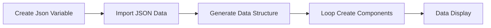

## Advanced Usage (if any)

Basic usage covers most operation scenarios; advanced usage can be designed according to specific project needs.

## Property List


| Property Name      | Content                                                      |
| ------------------ | ------------------------------------------------------------ |
| Initial Value Type | Description of the type configuration and convenience of the initial state value |
| Value              | Specific data value saved by Json Variable                   |

## Actions


| Action Name                                | Description                                                  |
| ------------------------------------------ | ------------------------------------------------------------ |
| Assign Value                               | Assign values to the Json Variable, modifying its data type and structure |
| Set Value (Select Path)                    | Assign a value to an element based on the selected path      |
| Set Value (Custom Path)                    | Manually input a path to assign a value to an element, limited to non-mini program environments |
| Set Multiple Values                        | Assign values to multiple paths respectively                 |
| Clone Template Structure                   | Clone the structure of the target Json Variable as a new variable |
| Set a Value (Array)                        | Assign a value to a specific element in an array             |
| Search Value (Array)                       | Search for a specific value in a one-dimensional array and output the result |
| Add Value (Array)                          | Add a new value to the array                                 |
| Add Multiple Values (Array)                | Add multiple values to the array                             |
| Insert a Value (Array)                     | Insert a value at a specific position in the array           |
| Insert Multiple Values (Array)             | Insert multiple values at a specific position in the array   |
| Delete Specified Value (All) (Array)       | Delete all matching specified values in the array            |
| Sort (One-dimensional Array)               | Sort elements in a one-dimensional array                     |
| Sort (Two-dimensional Array/Object Array)  | Sort elements in a two-dimensional array or object array     |
| Reverse Array (Array)                      | Reverse the order of elements in the array                   |
| Random Sort (Array)                        | Randomly sort the elements in the array                      |
| Randomly Pick a Value (Array)              | Randomly pick an element from the array                      |
| Remove Duplicates (Array)                  | Remove duplicate values in the array                         |
| Get Maximum Value (Array)                  | Get the maximum value in the array                           |
| Get Minimum Value (Array)                  | Get the minimum value in the array                           |
| Delete Value at Specified Position (Array) | Delete an element at the specified index position in the array |
| Clear Array (Array)                        | Clear all elements in the array                              |

## Events


| Event Name  | Description                                                  |
| ----------- | ------------------------------------------------------------ |
| Data Change | Triggers this event when variable data changes, only triggers once for consecutive assignments |

## Extended Reading

### Q&A

- **How to Create a Multi-level Linked Dropdown Menu?**

Steps:

1. Create a Json Variable and import JSON data.
2. Add dropdown menus, building linked selections based on city and district names.
3. Use nested loop-created components and conditional containers to achieve menu linkage.

This method can be expanded to similar complex data linkage scenarios, facilitating the extension of Json Variable usage."
# Array

## Overview

Array is a data type with a logical structure as a linear table in a single row and multiple columns. Each "cell" is an element, capable of storing different types of data such as text, numeric values, images (in resource address form), colors (in color code form), etc. When accessing the elements of an Array, they are accessed in the form of "arrayName[index]", with the index starting from zero and incrementing sequentially.

## Common Functions

Array has a variety of functions, which can be better utilized by pre-declaring the data type. When not declared, the system will automatically match the data type based on the input content.

### Usage Scenarios

Array is widely used in various occasions that require linear data structures due to its simplicity and storage flexibility.

## Basic Usage

### Assigning Values to Array

1. **Assigning in Edit Mode**: Assign values to an Array by editing data through the properties panel. This can create new data positions and specify data types, such as text, numbers, pictures, colors, etc. Click "+" to create a new data position; double-click the header to rename it; click "×" in the upper right corner to delete a data position; click the data position to input data.
2. **Assigning Values in Non-Edit Mode**:

   - **Set a Value**: Assign a value to an element by index.
   - **Add Value/Multiple Values**: Add one or multiple values to the existing data, the specified position can be the beginning or the end of the array.

### Referencing Array Values

1. **Reference by Index**: Select the array in the formula editor, and reference it by "[N]" (N is the index number).
2. **Random Value**: Retrieve a random value from the array for output.
3. **Get Maximum/Minimum Value**: Get the maximum/minimum value from the numeric elements in the array.

### Sorting

1. **Sort by Specified Method**: Sorting methods can be selected as ascending/descending alphabetical order, ascending/descending numeric order.
2. **Reverse Order**: Reverse the order of the array.
3. **Random Order**: Randomly sort the elements of the array.

### Search and Delete

1. **Search Value**: Search for the target value in the array, return the index number if it exists, otherwise return "-1".
2. **Delete Specified Value**: Delete all elements that match the target value.
3. **Delete Value at Specified Position**: Delete the value at a specific index.
4. **Remove Duplicates**: Remove duplicate elements, keeping only the one with the smallest index number among each group of duplicates.

## Actions

| Action Name                  | Description                                                  |
| ---------------------------- | ------------------------------------------------------------ |
| Print Current Value          | Dynamically output the current value of the array to monitor changes. |
| Assign Value                 | Assign a value to the array; the source must be another array or a row in an object array. |
| Set Value                    | Set a value for the element at a specified position.         |
| Set Multiple Values          | Set values for multiple elements at specified positions.     |
| Search Value                 | Search for a specified value and return the index number or "-1". |
| Add Value                    | Add a value to the beginning or end of the array.            |
| Add Multiple Values          | Add multiple values to the end of the array.                 |
| Insert a Value               | Insert a value at a specified position.                      |
| Insert Multiple Values       | Insert multiple values at a specified position.              |
| Delete Specified Value       | Delete all instances of the specified value in the array.    |
| Sort                         | Sort the elements, supporting ascending and descending order of letters and numbers. |
| Reverse Array                | Reverse the order of the elements in the array.              |
| Random Order                 | Randomly sort the elements in the array.                     |
| Randomly Extract a Value     | Randomly extract and output a value.                         |
| Remove Duplicates            | Remove all duplicate elements in the array.                  |
| Get Maximum Value            | Output the maximum value in the array.                       |
| Get Minimum Value            | Output the minimum value in the array.                       |
| Delete at Specified Position | Delete the element at a specific index.                      |
| Merge Array to String        | Merge the array into a string for output.                    |
| Clear Array                  | Clear all elements in the array.                             |
| Transfer Value               | Set the array to a specified value.                          |
| Search All Values            | Search all existing positions of a value and return a position array. |

## Events

| Event Name  | Description                          |
| ----------- | ------------------------------------ |
| Data Change | Triggered when variable data changes |
| # Matrix    |                                      |

### Overview

Matrix is a commonly used data structure, resembling a data table composed of multiple rows and columns. The elements in each column are of the same type, and each element can store an independent value. Matrix can be seen as a nested structure of one-dimensional arrays and is often used in various data processing and calculations. Its elements can be accessed and manipulated through row and column numbers, formatted as "variableName[X][Y]".

### Use Cases

Matrix is frequently used for storing tabular data, pixel data in image processing, and numerical calculations. In scenarios of managing and processing large datasets, Matrix is also one of the fundamental data structures.

### Core Functions

1. **Element Access:** Matrix allows quick access and modification of data at specific row and column positions.
2. **Sorting and Filtering:** Data can be sorted and filtered to find elements that meet specific criteria.
3. **Data Modification:** Rows and columns can be added or deleted.
4. **Multi-value Setting:** Supports setting multiple values across rows and columns simultaneously.
5. **Data Statistics:** Allows statistical operations on one or more columns, such as sum and average.
6. **Parsing and Conversion:** Supports parsing column data into other data types.

### Basic Usage

#### Matrix Assignment

- **In Edit Mode:**
  - Values can be assigned through the data editing pane in the property panel, enabling the creation of new data columns with specified data types such as text, numbers, images, etc.
  - Data fields can be renamed with a double-click, single-click to enter data. When adding or deleting rows and columns, note that this will affect the existing data.
  - The clear data button will remove all data rows, columns, and content.

- **In Non-Edit Mode:**
  - Values, rows, and columns of Matrix can be dynamically assigned or added through events or actions.

#### Matrix Operations

1. **Addition and Deletion**
   - Rows and columns can be added or deleted, using indexes to determine the specific location to operate.
   - Adding values requires specifying the row, column position, and value.
   
2. **Sorting**
   - Can sort by a specific column, including alphabetical order, numerical order, and random row sorting.

3. **Search and Deletion**
   - Can search for specific values in the array and output their positions.
   - Delete specific rows and columns and clear the entire array to reset the state.

### Actions

| Action Name                | Description                                                  |
| -------------------------- | ------------------------------------------------------------ |
| Print Current Value        | Outputs the current value of the Matrix to the console.      |
| Assignment                 | Assigns values to the Matrix, to be used with other Matrix.  |
| Filter Output              | Outputs content that meets certain criteria and can sort the results. |
| Insert a Row Data          | Inserts a new row of one-dimensional array type data into the Matrix. |
| Add a Row Data             | Adds a data row to the Matrix.                               |
| Reverse Rows               | Arranges the entire Matrix in reverse order by current row numbers. |
| Set a Value                | Sets value by locating the element through row and column numbers. |
| Fill a Row                 | Fills all cells in a specific row with the same value.       |
| Delete Row (by row number) | Deletes data of a specific row number.                       |
| Clear Array                | Clears the structure and values of the entire Matrix.        |

### Events

| Event Name   | Description                               |
| ------------ | ----------------------------------------- |
| Data Changed | Triggered when the variable data changes. |

### Extended Reading

For more information on the use of Matrix, please refer to relevant data structure and algorithm books. "Data Structures and Algorithm Analysis" is a book that provides detailed introductions to Matrix application scenarios and implementation techniques. For complex data operations, consider using databases or numerical analysis software for more efficient management and analysis."
# Object

## Overview

The object variable is a single-row, multi-column variable that can be referenced by key name. It can be seen as a one-dimensional object array, but actually, it is a variable. Object variables are very important in the VisualLogic tool, and their icon is located in the components bar on the left side of the editor.

## Usage Scenarios

Object variables are widely used in different scenarios, such as applications that require dynamic management and handling of multi-column data.

## Core Functions

Object variables provide a rich set of features to ensure flexible data manipulation, mainly including: assignment, deleting fields, adding fields, modifying field names, setting a field value, setting multiple field values, cloning structure, etc.

## Basic Usage

### Assignment

There are three main ways to assign values to an object variable:

1. **Edit Data**: Select the object variable, click Edit Data, and you can create the required fields one by one by clicking the “+” button.

2. **Import Structure**: Select the object variable and choose the structure of the required database.

3. **Direct Assignment**: Directly assign the value of the object variable to the current object variable.

### Action Instances

1. **Delete Fields**: You can delete unnecessary data columns by selecting fields.

2. **Add Fields**: Allows adding new data columns by specifying key names and default values.

3. **Modify Field Name**: Change the key name of the field.

4. **Clone Structure**: You can clone the structure (column names and types) of other object variables to the current object variable.

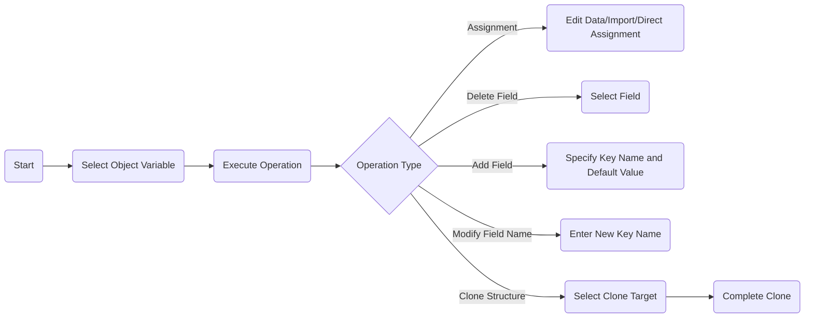

## Attributes

| Attribute Name | Description                                                  |
| -------------- | ------------------------------------------------------------ |
| Value          | The value of the object variable. You can manually create fields to input data, or import columns and data types with the same names from the backend database. |

## Actions

| Action Name                       | Description                                                  |
| --------------------------------- | ------------------------------------------------------------ |
| Print Current Value (console log) | Call the browser’s console to dynamically output the current value of the object array. It can monitor the dynamic changes of a certain value and is often used for testing. |
| Assignment                        | Assign a value to the object variable.                       |
| Clear Value                       | Clear the current value of the variable.                     |
| Delete Field                      | Delete the specified field.                                  |
| Add Field                         | Add fields to the object variable.                           |
| Set Field Value                   | Set the value of the specified field.                        |
| Set Multiple Field Values         | Set the values of multiple fields.                           |
| Modify Field Name                 | Modify the field name.                                       |
| Clone Structure                   | Use the clone structure action to select the corresponding clone target and get the variable structure identical to the clone target. It can only clone object variables. |

## Events

| Event Name  | Description                                                  |
| ----------- | ------------------------------------------------------------ |
| Data Change | Triggered when the variable data changes, but if the variable value is set multiple times in an event, it will only be triggered once. |

## Further Reading

The operation of object variables is very intuitive and is usually used in various business scenarios that need to handle dynamic data and adjust data structures. During development, ensure a full understanding of relevant actions and events to effectively manage complex data in applications."
# Object Matrix

## Overview

Object Matrix and two-dimensional arrays are essentially arrays, but their elements and referencing methods differ within the tool. The elements of an Object Matrix are objects, while a two-dimensional array is referenced by index. For an Object Matrix, elements can be referenced by key names, and its element entry and functional attributes are fundamentally the same as a two-dimensional array, but it has no default rows and columns.

## Basic Usage

### Data Import and Structure

In an Object Matrix, import structures are often used to bring data from a backend database to the frontend. By importing the database structure, all fields in the database will become fields in the Object Matrix.

### Data Operation

1. **Assignment and Modification**
   - Data can be manually entered or assigned to an Object Matrix from a generic variable.
   - The assignment of columns and setting column names are critical for subsequent operations.

2. **Column Operations**
   - **Add and Remove Columns**: Columns can be operated on by deleting unnecessary ones or adding new columns, but if no default value is set, the column will not appear in print.
   - **Fill Columns**: Data is filled into columns by column number or column name.

3. **Row Operations**
   - **Add Row Data**: The position where data is added can be specified.
   - **Delete Rows**: Data is deleted by row number, noting that the row number starts from 0.

4. **Data Query and Statistics**
   - **Sum and Average Statistics**: Statistical operations can be performed on one or more columns.
   - **Search Function**: You can find the location of specific values in the array.

### Advanced Functions

1. **Clone Structure**: The structure (column names and types) of another Object Matrix can be cloned into the current one.

2. **Sorting**: Rows can be sorted by a specific column, either numerically or alphabetically in ascending or descending order.

## Actions

| Action Name                           | Description                                                  |
| ------------------------------------- | ------------------------------------------------------------ |
| Print Current Value                   | Output the current value of the Object Matrix to the browser console, used for monitoring and testing. |
| Assign                                | Assign values to the array as a whole, with values being in the form of an Object Matrix or an array structure of a generic variable. |
| Clear                                 | Clear the array's data, note that only data is cleared, the structure is not affected. |
| Filter Output                         | Output data from the Object Matrix, supporting "filter conditions", "sort order", "number of rows output". |
| Delete Rows (by condition)            | Delete rows that meet specified conditions based on column values. |
| Remove Duplicates                     | Delete duplicate data rows, judged based on URL (if it is an image resource). |
| Delete Columns                        | Delete a column by name, unlike a two-dimensional array.     |
| Add Column                            | Add a new column, column name must not be the same as preset ones, and columns without default values will not be printed. |
| Fill Column                           | Fill and replace data in columns by column number or name, the data type must correspond. |
| Add Column from Another Object Matrix | Add a column from another Object Matrix, specifying the column name. |
| Set a Value                           | Set a specific element by locating it using row number, column number, or column name. |
| Set Multiple Values (same row)        | After determining the row number, set data for multiple columns. |
| Set Multiple Values (across rows)     | Determine both row and column numbers, then set multiple values. |
| Modify Column Name                    | Modify the column name of the Object Matrix.                 |
| Sort Rows                             | Sort operation based on a specific column.                   |
| Parse Column Array                    | Convert elements of a specific column into any JS value type. |
| Add a Row                             | Add a row of data to the Object Matrix, the data type should be an object. |
| Add Multiple Rows                     | Add multiple rows of data to the Object Matrix, the source must be an Object Matrix. |
| Insert a Row                          | Insert a row into the Object Matrix, specifying the position index. |
| Insert Multiple Rows                  | Insert multiple rows, specifying the position index.         |
| Clone Template Structure              | Clone the structure from another Object Matrix to the current one. |
| Sum Statistics                        | Perform sum operations on one or more columns.               |
| Average Statistics                    | Perform average operations on one or more columns.           |
| Merge Tables                          | Merge two Object Matrices, supporting the selection of join methods. |
| Randomly Sort Rows                    | Randomly arrange stored data rows.                           |
| Search a Value                        | Search and output positions where specific elements meet the conditions. |
| Set Row Data                          | Replace a row of data with another object variable.          |
| Set Multiple Row Data                 | Replace multiple rows of data with data from another Object Matrix. |
| Delete Rows (by number)               | Delete a row specified by the row number.                    |
| Deduplicate by Column                 | Deduplicate based on a specified column, removing the whole row if there are duplicate values. |
| Transpose Rows and Columns            | Transform rows and columns based on specified attribute names, making the values of that column the key or value of a new object. |
| Reverse Rows                          | Reverse the order of rows in the array.                      |
| Count Statistics                      | Count the number of rows for a specific column.              |

## Events

| Event Name  | Description                                                  |
| ----------- | ------------------------------------------------------------ |
| Data Change | Triggered when variable data changes; if a variable's value is set multiple times in one event, it will trigger only once. |

## Properties

| Property Name | Description                                                  |
| ------------- | ------------------------------------------------------------ |
| Value         | The value of the Object Matrix, which can be manually input, cleared, imported/exported, or imported from the backend database with corresponding column names and data types. |

## Additional Reading

When using an Object Matrix, attention should be given to its application scenarios and differences from a two-dimensional array. Reasonably choosing an Object Matrix can improve development efficiency and code maintainability. By mastering basic operations such as assignment, deletion, querying, and sorting, as well as advanced operations like cloning structures and data import, it can provide an advantage in complex data operations."
# Time

## Overview

Time variables are tools used to handle time and convert it into the required time structure. They play a key role in the recording, display, and adjustment of time data, facilitating flexible and dynamic settings and adjustments according to user requirements.

## Basic Usage

### Adding and Assigning Time Variables

1. **Add Time Variables**  
   In edit mode, time variables can be added through the interface options.

2. **Assigning Time Variables**
   - **Manual Assignment**: In edit mode, you can directly input the initial value in the "Date" attribute, which defaults to the current time.
   - **Dynamic Assignment**: In non-edit mode, dynamic assignment can be performed through the "Assign" action or data binding. Assignment methods include:
     - **Assign-Timestamp (milliseconds)**: Only supports timestamp format; other formats will use the default time.
     - **Assign-(Year/Month/Day/Hour/Minute/Second)**: Accepts individual time units as input parameters to set the variable value.
     - **Assign-(YYYY/MM/DD HH:MM:SS)**: Uses a formatted string for assignment.

### Invoking and Clearing Time Variables

3. **Binding (Invoking) Time Variables**
   - After assignment, the time variable can be invoked at any time.
   - In addition to the currently assigned time, adjacent times can also be invoked to achieve more functionalities.

4. **Clearing Time Variables**
   - After performing the clearing action, the value of the time variable resets to the default value when missing, usually the current time.

## Properties

| Property Name | Description                                                  |
| ------------- | ------------------------------------------------------------ |
| Value         | The value of the time variable. The initial value can be manually edited or dynamically assigned through data binding. |

## Actions

| Action Name                                | Description                                                  |
| ------------------------------------------ | ------------------------------------------------------------ |
| Print Current Value (console log)          | Uses the browser's console to dynamically output the current value of the time variable, including timestamp and formatted time. |
| Assign-Timestamp (milliseconds)            | Sets the value of the time variable, accepting a timestamp as a parameter. |
| Assign-(Year/Month/Day/Hour/Minute/Second) | Sets the value of the time variable using individual time unit values as parameters. |
| Assign-(YYYY/MM/DD HH:MM:SS)               | Sets the value of the time variable using a formatted string for year, month, day, and time. |
| Clear                                      | Clears the current value of the time variable.               |

## Events

| Event Name  | Description                                                  |
| ----------- | ------------------------------------------------------------ |
| Data Change | Triggered when the variable data changes. If the variable value is set multiple times in an event, this event will only be triggered once. |

## Further Reading

Time variables play a fundamental but crucial role in applications. Their flexible assignment methods are suitable for various scenarios, and understanding their usage can greatly improve the efficiency of time handling. In practice, it is recommended to understand the different assignment methods and their potential impacts in detail, so they can be flexibly used to achieve best practices."
# Excel data processing

## Overview

The Excel Component is a data component in VisualLogic, primarily used to convert Excel files to object arrays or two-dimensional arrays within VisualLogic. Although the Excel Component itself does not store data, it can upload Excel files and parse them into object arrays or two-dimensional arrays, or export these arrays as .xlsx Excel files by invoking various methods.

The Excel Component is typically used to export data acquired from the frontend or upload existing local data to the frontend via Excel, followed by service calls to submit the data into a database.

## Core Features

1. **Export Data to Excel File:** Methods in the Excel Component can export specified arrays to Excel files, automatically triggering the browser's download window.
2. **Import Data from Excel File:** Supports reading data from Excel files and parsing it into object arrays or two-dimensional arrays.
3. **Custom Export Configuration:** Using JSON configuration files, you can customize the style and content of the exported Excel file.

## Basic Usage

### Exporting Excel Files

1. **Property Settings:**
   Before exporting files via the Excel Component, you can set various properties through the properties panel, such as the exported file name, header row height, column width, content row height, and whether to download images.
2. **Invoking Export Method:**
   Invoking the "Export Array to Excel" method will start the browser’s download window. Even without setting any properties, the export can proceed with default parameters.

### Importing Excel Files

1. **File Selection and Upload:**
   Invoking the "Import Excel File to Array" method allows you to choose an Excel file for upload and retrieve the file content in the callback. The file content will be split into the header and the main data body, typically assigning the main data body to a VisualLogic variable.

### Custom Export

In addition to basic export settings through the Excel Component, you can perform more detailed customizations via a JSON configuration file, such as merging cells, setting colors, fonts, etc.

Example JSON:

```json
{
  "fileName": "demo",
  "sheets": {
    "mySheet": {
      "rowsHeight": [100, 100, 100],
      "columnsWidth": [200, 80, 100],
      "cells": [
        [{"text": "A1 Cell"}, {"text": "B1 Cell"}, {"text": "e32a634d6718fc653223aaf0eb64d240_13593_400_400.jpg?fileType=image"}, {"text": "c3f3a9d958e9094477ccdddb238ba96f_19534_500_500.jpg?fileType=image"}],
        [{"text": ""}, {"text": ""}, {"text": "-12345.6789"}, {"text": "2235.7798"}],
        [{"text": "c3f3a9d958e9094477ccdddb238ba96f_19534_500_500.jpg?fileType=image"}, {"text": "455c1092058552a50073bc1183ef45cf_45288_658_658.jpg?fileType=image"}, {"text": "edf316ea1773034e08cfe4fa89cc1dfe_20139_400_400.jpg?fileType=image"}, {"text": "ba26252dfeec7a63c2b9a47172e158a9_17997_400_400.jpg?fileType=image"}]
      ],
      "colStyle": [null, 1, null, 1, null, 1, null, 1],
      "rowStyle": [0, 1, 0, 1],
      "cellStyles": [
        {"c": 1, "r": 1, "styleIndex": 2},
        {"c": 2, "r": 3, "styleIndex": 2},
        {"c": 4, "r": 4, "styleIndex": 2}
      ],
      "colType": [null, "", "image", "image", "image", null],
      "rowType": [null, null, "image", null, null],
      "cellType": [{"c": 1, "r": 2, "type": null}, {"c": 2, "r": 3, "type": "image"}],
      "mergeCells": [
        {
          "start": { "c": 1, "r": 1 },
          "end": { "c": 2, "r": 2 },
          "text": "Merged Cell Value",
          "styleIndex": 3
        },
        {
          "start": { "c": 4, "r": 2 },
          "end": { "c": 5, "r": 3 },
          "text": "Merged Cell Value with style setting, defaults use start cell style if not set",
          "styleIndex": 0
        }
      ],
      "styles": [
        {
          "alignment": { "vertical": "middle", "horizontal": "center" },
          "fill": { "type": "pattern", "pattern": "solid", "fgColor": { "argb": "990000ee" } }
        },
        {
          "alignment": { "vertical": "top", "horizontal": "left" },
          "fill": { "type": "pattern", "pattern": "solid", "fgColor": { "argb": "99e4393c" } },
          "font": { "name": "Arial Black", "color": { "argb": "FF00FF00" }, "family": 2, "size": 14, "italic": true },
          "border": { "top": { "style": "thin" }, "bottom": { "style": "thin" }, "left": { "style": "thin" }, "right": { "style": "thin" } }
        },
        {
          "alignment": { "vertical": "top", "horizontal": "left" },
          "fill": { "type": "pattern", "pattern": "solid", "fgColor": { "argb": "99880099" } }
        }
      ]
    }
  }
}
```

## Properties

| Property Name        | Description                                                  |
| -------------------- | ------------------------------------------------------------ |
| Export File Name     | Default name for the exported Excel file                     |
| Header Row Height    | Row height of the header in the exported file                |
| Content Row Height   | Row height of the content in the exported file               |
| Each Column Width    | Width of each column in the exported file                    |
| Download Images      | Whether to download images in the array during export        |
| Custom Export Format | Custom style and content information via JSON configuration file |

## Actions

| Action Name                          | Description                                                  |
| ------------------------------------ | ------------------------------------------------------------ |
| Export Array to Excel File           | Export the specified array to an Excel file                  |
| Import Excel File to Array           | Select an Excel file and import it as an array format        |
| Set Properties                       | Modify properties of the Excel Component excluding custom export formats |
| Custom Export Configuration          | Set custom export configuration for Excel files              |
| Import Excel as Raw Data             | Select an Excel file and parse it into JSON format raw data  |
| Import Excel as Table Data           | Select an Excel file and parse it into table data            |
| Import Excel to Table                | Select an Excel file and import it into a specified table container |
| Import Excel as Object Format        | Select an Excel file and import it into the current component |
| Get Data                             | Retrieve the Excel data in the current component             |
| Update Data                          | Update the Excel data in the current component               |
| Export to Excel File                 | Export obj format data in the current component to an Excel file |
| Export Table to Excel File           | Export the data source of the specified table container to an Excel file |
| Export Multiple Sheets to Excel File | Export multiple sheets to a single Excel file                |

Summary:

With VisualLogic's Excel Component, we can efficiently transfer data between Excel files and VisualLogic's object arrays/two-dimensional arrays. It not only supports basic import and export functions but also allows for detailed style customization via JSON configuration files to meet various complex business needs."
# Data Wrap

## Function Overview

The Data Wrap is a virtual container whose sole purpose is to help organize the structure of the object tree. The Data Wrap can be added to the front-end or back-end. We can consider the Data Wrap as completely "transparent" during application runtime; it does not add extra elements during application rendering, and its role is limited to organizing the object tree during editing. Generally, there are two common ways to organize: placing objects of the same category in the same Data Wrap, or grouping objects into a Data Wrap according to page regions/functions. The purpose of this is to better organize the object tree structure for easier subsequent updates and maintenance.

## Use Cases

The Data Wrap is mainly used to meet the needs of structure organization in the development process of complex applications. Especially in projects with many components, using Data Wrap can effectively classify and manage similar nature objects, preventing a chaotic object tree and enhancing the maintainability of the project.

## Core Features

- **Transparency**: During application runtime, the Data Wrap does not add any extra elements, ensuring no additional load during rendering.
- **Structured Organization**: Helps developers manage the object tree structure more clearly, supporting grouping objects by category or function.
- **Flexible Application**: The Data Wrap can be added to the front-end or back-end as needed, focusing its role on management during the edit phase, whether for visual presentation or logical processing.

## Basic Usage

1. **Category Management**: All button components can be placed in one Data Wrap, and all text box components in another, making it easy to focus on the relevant Data Wrap when modifying a specific type of component.
2. **Area Grouping**: According to page layout, navigation bar related components can be placed in one Data Wrap, and components for the functional display area in another, and so on, facilitating independent adjustments in different regions."
# API

## Overview

API components are the unified entry point for initiating HTTP network requests in VisualLogic, categorized into front-end and back-end APIs. Front-end APIs are used to initiate network requests in the browser. When the application is released as a mini program, native application, or desktop application, the VisualLogic system will automatically access the native layer interface to implement network request functionality. Back-end APIs are used on the server side to initiate network requests, generally needing to be invoked in back-end services and handle the returned results. When back-end APIs are needed in the front-end UI, a back-end service must first be created to implement the back-end API invocation logic, and then the service is called within the front-end UI.

The advantage of front-end APIs is that the request logic is entirely handled by the client, making operations simple, saving server resources, and enabling quick returns. However, in scenarios with high-security requirements, direct front-end requests may be at risk of being hijacked or forged. In such cases, back-end APIs provide greater security assurances. Additionally, many APIs have cross-origin restrictions that must be bypassed through back-end requests to avoid cross-origin errors. When choosing between front-end or back-end APIs, the security of the request and cross-origin support should be considered comprehensively. If there are no issues, front-end APIs should be preferred; otherwise, use back-end APIs.

## Use Cases

Front-end APIs are suitable for simple operations that require quick returns, while back-end APIs are appropriate for scenarios that require additional security or handling of cross-origin restrictions. In some cases, open services without a UI can be created to directly invoke back-end APIs within the service.

## Core Features

### API Usage Process

The basic usage process for both front-end and back-end APIs is roughly the same:

1. The initiator makes an API call, triggered by UI components on the front end, such as a button click event; on the back-end, it is triggered by services or timers.
2. The API component sends a request to a third-party server.
3. The third-party server receives the request and returns the result.
4. After the result is returned, subsequent logic is processed by the client or server.

### API Configuration and Debugging

- **Request URL**: Specify the URI address of the third-party API, supporting absolute or relative addresses. For HTTPS front-end API debugging, an HTTPS address must be used.
- **Request Method**: Includes calling methods (such as GET, POST) and timeout settings.
- **Request Parameters**: Includes header and body parameters configured according to the API documentation requirements.

After the API configuration is completed, it can be debugged in the properties panel to view and parse the returned results.

### API Invocation

After configuring and debugging the API, it can be called in the event panel, specifying request parameters and obtaining the API return results in the callback block.

- **Specification of Request Parameters**: Default values can be overridden and URL parameters can be dynamically added.
- **Obtaining Return Results**: Refer to original return results, obtain reasons for request failures, request duration, etc.

## Basic Usage

Using front-end APIs, API calls can be initiated through button events in the event panel, and results can be handled. Back-end APIs are suitable for complex requests, with invocation logic defined in the service.

### Example: File Upload

To upload files via FORM-DATA format, select FORM-DATA type configuration and use it according to the upload return value type.

## Properties

| Property Name                      | Description                                                  |
| ---------------------------------- | ------------------------------------------------------------ |
| API URL                            | The API endpoint.                                            |
| Call Method                        | The method for API calls.                                    |
| Body Type                          | Data type of request parameters, default JSON.               |
| Timeout                            | Server connection timeout limit for API requests, in seconds. |
| Header                             | Add header parameters for the API.                           |
| Body Parameters                    | Set body parameters for the API.                             |
| Debug                              | Show API debug results in the debug results content panel.   |
| Disable Certificate Authentication | Skip certificate authentication for HTTPS requests used for development debugging. |
| Direct Request Original URL        | Skip server forwarding and directly request API sources from the front end. |
| Return Result Format Conversion    | Convert return result format, such as to base64.             |
| API Mode                           | Service mode or URL mode of the API.                         |
| Enable Mock                        | Support web preview. Mini-programs are not supported.        |

## Actions

| Action Name                 | Description                                                  |
| --------------------------- | ------------------------------------------------------------ |
| Make Request                | Request the API.                                             |
| Make Asynchronous Request   | Request without waiting for API returns, results are obtained through the API event "Message Received". |
| Cancel Asynchronous Request | Clients cancel the request, no longer waiting for the return or triggering the return event. |

## Events

| Event Name       | Description                      |
| ---------------- | -------------------------------- |
| Message Received | API return information received. |
| Interrupted      | Request interrupted.             |
| Completed        | Request complete.                |
| Error            | API request error.               |

## Further Reading

For more information on the API component, such as usage references and examples, please refer to the official VisualLogic documentation and related practical cases. Visit the example download link: https://www.ivx.cn/ih5/app/template/download?id=7036 to get detailed configuration examples."
# Connection (socket)

## Overview

The Socket component can enable information transmission between multiple devices. Common application scenarios include real-time data sharing between applications and interaction in multiplayer games. In the message transmission process, Sockets ensure that users can send and receive information in real time, thereby guaranteeing the real-time capabilities of the platform or application.

## Use Cases

- Data Sharing and Synchronization: Suitable for applications that need to share and keep data synchronized between different devices or users.
- Real-Time Interaction: Sockets play an important role in scenarios requiring real-time interaction, such as multiplayer games or online meetings.

## Basic Usage

### Preparation
Before using Sockets, it is usually necessary to register the current user by setting user ID, nickname, and avatar information. This helps the recipient easily identify the sender when processing information. However, the user CID is the unique identifier used internally by the Socket.

### Sending Global Messages
1. **Event Trigger**: Send multiple global messages including message names and content by triggering specific events.
2. **Message Reception and Processing**: Upon reception, the messages are stored in the message data; you can manually input the message name to retrieve the content.

### Sending Room Messages
1. Create a room and set the room ID and maximum number of participants.
2. After joining the room, send messages within the specified room. Only users in the room receive the messages, and follow-up processing is performed through the "Room Message Received" event.

### Sending Private Messages
1. **Obtain User CID**: The current user CID can be obtained through registration or connection success event.
2. **Sending and Receiving Private Messages**: Specify the CID and send the message; the recipient retrieves and processes the message content through the "Private Message Received" event.

## Advanced Usage

### Custom Connections
Using an external WebSocket connection address, you can customarily establish, disconnect and send/receive messages. During these operations, proper handling of parameters and response results is required when sending and receiving messages.

## Properties

| Property Name        | Description                           |
| -------------------- | ------------------------------------- |
| sid                  | Unique identifier for the connection. |
| Use External Address | -                                     |
| External Address     | -                                     |

## Actions

| Action Name                    | Description                                                  |
| ------------------------------ | ------------------------------------------------------------ |
| Register Current User          | Add ID, nickname, and avatar for the user as connection identity. |
| Create Room                    | Accepts room number and creates a separate room in the connection. |
| Create or Join Room            | Joins if the room exists; otherwise, creates and joins a new room. |
| Exit Room                      | Exit the current room.                                       |
| Close Room                     | Close the room with the specified room number.               |
| Get Room User List             | Get the list of users in the room, obtaining user information or count. |
| Get Online User List           | Get the list of users in the connection, obtaining user information or count. |
| Get Room List                  | Get all room information within the current connection.      |
| Send Message to User           | Send a message to a specified CID user, with the content in object format. |
| Send Room Message              | Send a message to a specified room, with the content in object format. |
| Send Global Message            | Send a message across the connection, received by all users, with the content in object format. |
| Initiate Custom Connection     | Establish a connection using an external WebSocket address.  |
| Send Custom Connection Message | Send a message under an external WebSocket.                  |
| Disconnect Custom Connection   | Disconnect under an external WebSocket.                      |

## Events

| Event Name                         | Description                                                  |
| ---------------------------------- | ------------------------------------------------------------ |
| Any Message Received               | Triggered when a global, room, or private message is received. |
| Global Message Received            | Triggered when a global message is received.                 |
| Room Message Received              | Triggered when a room message is received.                   |
| Private Message Received           | Triggered when a private message is received.                |
| Online User Count Changed          | Triggered when the count of online users changes.            |
| Room User Count Changed            | Triggered when the room's user count changes.                |
| New User Joined                    | Triggered when a new user joins.                             |
| User Left                          | Triggered when a user leaves.                                |
| Room User Joined                   | Triggered when a new user joins the room.                    |
| Room User Left                     | Triggered when a user leaves the room.                       |
| Room Closed                        | Triggered when the room is closed.                           |
| Connection Successful              | Triggered when the connection is successful.                 |
| Connection Disconnected            | Triggered when the connection is disconnected.               |
| Custom Connection Message Received | Effective when using an external WebSocket.                  |
| Custom Connection Disconnected     | Effective when using an external WebSocket.                  |
| Custom Connection Established      | Effective when using an external WebSocket.                  |

## Further Reading

When applying Socket connection technology, complex information transmission scenarios can be realized by skillfully arranging events and actions. For users who want to delve deeper into how to use Socket technology, it is recommended to further study its application schemes in game development and real-time communication software."
# vFor

## Overview

vFor components allow dynamically generating UI unit modules with the same structure and event logic at runtime. These modules can include layout class components, UI class components, and variable class components. By binding a data source, you can dynamically control the number and attribute values of these UI units. vFor is often used in conjunction with conditional containers to create dynamic lists in a modular form, optimizing project management, reducing project complexity, and better meeting dynamic needs.

## Basic Usage

By utilizing vFor, developers can set UI units as sub-objects of the vFor components. vFor components generate the same number of UI units based on the specified data source, such as a two-dimensional array or an object array. The layout will be determined by the positioning environment of the vFor components. For precise layout, you can bind X and Y coordinates.

### Example Explanation: Creating a Vocabulary List

1. **UI Unit Extraction and Object Addition**
   Each entry is a UI unit, containing an English word and its corresponding Chinese explanation.
2. **Data Source Editing**
   Use an object array to store entry information, where each row corresponds to a UI unit and each column to an attribute of the UI unit, such as Chinese and English.
3. **Binding Data Sources and Attributes**

   - Bind the "data source" of the vFor components to the object array.
   - Bind the "content" of the Chinese and English text components to "current data1.Chinese" and "current data1.English".
4. **Operations Between Objects Within the UI Unit**

   - Use checkboxes and text components to create a list of answer options within the UI unit.
   - By setting event logic, both clicking the text and checkboxes can change the state of the checkboxes.

## Attributes

| Attribute Name      | Description                                                  |
| ------------------- | ------------------------------------------------------------ |
| Data Source         | Sets the data source for vFor, which can be one-dimensional arrays, two-dimensional arrays, generic variables, object arrays, etc. |
| Render Optimization | When enabled, only the UI elements corresponding to modified data will refresh, not the entire list. |
| Content Reset       | Default is off; it retains modified content when switching pages. When enabled, it resets vFor to its original state. |

## Actions

| Action Name   | Description                                           |
| ------------- | ----------------------------------------------------- |
| Get Data      | Retrieve specified data.                              |
| Set Data      | Set the data source for the for loop.                 |
| Validate Data | Check if the data meets format and type requirements. |

## Extract Attention Points

Objects outside of UI units created by vFor cannot directly manipulate the attributes of objects within the UI units. To change the attributes of internal objects, you can interact through internal objects, bind external variables, or modify the data source.

## Further Reading

Developers can optimize modular lists of vFor with conditional containers. For complex data binding, you can use the built-in method list of component variables to process the data before binding. When using nested vFor, ensure proper binding of fields related to "current data" or "current index", and accurately select rows and columns when using multidimensional arrays."
# vIf

## Functional Overview

The vIf is a tool for dynamically creating objects at runtime based on specific conditions. Its main function is to determine whether an object needs to be loaded based on the set conditions, equivalent to conditional binding of the object's "visible" property. In UI design, the vIf allows for intuitive use of multiple filters without complex ternary expressions.

## Usage Scenarios

The vIf is often used in conjunction with loop creation components to implement dynamic UI unit filtering and classification. For example, you can filter certain application instances based on two conditions: "Backend technology" and "components."

## Basic Usage

The vIf can be used independently to achieve dynamic creation or skipping of objects, and it can also be used in groups to achieve a one-of-many effect (such as if / else-if / else-if / ... / else).

**Example**: When the content of an input box is ≥60, display "Pass", otherwise display "Fail."

### Step 1: Adding Objects

Add two vIfs, two text components, and one input box. Set the content of the two text components to "Pass" and "Fail" respectively.

### Step 2: Editing Conditions

Set the conditions for the two vIfs. If the condition is met, the corresponding text component will display the respective text content.

## Advanced Usage

In scenarios where dynamic lists are created in loops, using the vIf can filter out UI units that do not meet the conditions. For example, filter student information from a gradebook where the score is >80 and the position is "class representative":

### Step 1: Adding Objects

In the Frontend directory, add a loop creation component, a vIf, a row component, three text components, and an object array. Place the vIf on the outer layer of the UI unit.

### Step 2: Editing Data Source

Edit the object array to set the data source.

### Step 3: Bind Data Source and Properties

Bind the "data source" of the loop creation component and the "content" of the three text components.

### Step 4: Editing Filter Conditions

Set the filter conditions in the attribute panel of the vIf.

**Alternative**: Without using the vIf, use the "filtered output" of the object array for filtering, and then use the filtered object array as the data source for loop creation.

## Attributes

| Attribute Name | Description                                                 |
| -------------- | ----------------------------------------------------------- |
| Condition      | Judgment formula, loads elements when the condition is met. |

## Extended Reading

The flexible use of the vIf can significantly enhance the dynamism of UI development, suitable for application scenarios that require multi-condition filtering. Developers can create complex condition judgment logic based on project needs, using the vIf as a foundation."
# Action Group

### Feature Overview

The action group component is located on the right side of the editor, alongside events and action groups. An action group consists of multiple actions, encompassing a series of target objects and actions. By packaging repetitive logic within the project into an action group, complex logic can be invoked more easily, reducing project complexity and enhancing maintainability. Proper planning of the packaging level of action groups can clarify the main logic of events and improve the readability of project logic.

### Use Case

For example, the logic for WeChat login and retrieving and assigning user information can be placed in an action group named "WeChat Login." This action group can be invoked during Frontend initialization or triggered by other events.

### Basic Usage

1. **Action group without parameters**  
   This is the most basic use of an action group, encapsulating a group of reusable actions within an action group that neither receives nor returns parameters. For example, all actions for initializing a page, including retrieving the time, clearing each input box, and resetting data, can be encapsulated in an action group.

2. **Action group with parameters**  
   If data processing is involved within the action group, raw data can be passed into the action group as "receiving parameters," and the results can be returned as "returning parameters" when the action group ends. For example, converting Unix timestamps to common formats, where the timestamp is the receiving parameter and the processed date-time is the returning parameter. The returning parameter assigned in "Current Action Group - Set Return Result" can be referenced in the action group callback.

### Advanced Usage

#### Synchronous and Asynchronous Action Groups

Action groups can be invoked synchronously or asynchronously. In synchronous calls, the action block after the action group waits for the current action group to complete before execution; in asynchronous calls, the subsequent action block executes immediately after the action group starts. Asynchronous calls can prevent subsequent action blocks from being blocked by the action group.

**Instance Comparison:**

- **Synchronous Action Group**: Turn on the "Synchronous" switch in the action group panel to make the action group directly return the string "Synchronous Action Group."
- **Asynchronous Action Group**: Keep the "Synchronous" switch off, making the action group wait for two seconds before returning "Asynchronous Action Group."

Through event logic editing, the asynchronous action group does not block the execution of the subsequent "Synchronous Action Group" and "Application System" action blocks. The string returned by the asynchronous action group will be printed to the console last.

#### Multiple Returns and Interruptions

Typically, only one "Set Return Result" statement is needed within an action group. If there are multiple return statements, in synchronous calls, the action group interrupts as soon as it executes a return statement for the first time; in asynchronous calls, the action group executes all return statements that meet the conditions.

- **Synchronous Call Example**: Turn on the "Synchronous" switch in the action group logic, and the result of the first loop will be returned immediately, interrupting the action group.
- **Asynchronous Call Example**: Turn off the "Synchronous" switch, and the action group will sequentially return "0," "1," "2," and "10."

## Attributes

| Attribute Name       | Description                                                 |
| -------------------- | ----------------------------------------------------------- |
| Receiving Parameters | Variables received and used internally by the action group. |
| Returning Parameters | Variables returned after internal operations are completed. |

## Actions

| Action Name         | Description                                                  |
| ------------------- | ------------------------------------------------------------ |
| Invoke Action Group | Select and invoke other action groups in the event panel.    |
| Set Return Result   | Set the return parameters for the current action group and end the current action group. |

## Events

| Event Name    | Description                                      |
| ------------- | ------------------------------------------------ |
| callFuncGroup | Start executing actions within the action group. |

## Extraction Considerations

When designing action groups, consider the differences between synchronous and asynchronous calls and be mindful of handling multiple returns and interruptions.

## Further Reading

By using action groups wisely, the project's logical structure can be significantly simplified, and code reusability and maintainability can be enhanced. Developers should fully exploit the synchronous and asynchronous characteristics of action groups to suit different application scenarios."
# Custom Function

#### Overview

In VisualLogic, custom functions are an important way to define and encapsulate application logic. By using custom functions, we can perform more complex operations on variables within the application, thereby enhancing code readability and enabling logic reuse. Custom functions can be executed synchronously or asynchronously, depending on the requirements of the function's tasks.

#### Basic Usage

Custom functions in VisualLogic are similar to action groups and can be used with or without parameters. If a function needs to manipulate variables or objects within the project, it typically requires setting input parameters and return parameters. Input parameters are used to pass variables into the function, while return parameters are used to output results from the function.

When defining custom functions, one should follow JavaScript naming conventions: parameter names can only consist of letters, underscores, dollar signs, or numbers, and cannot start with a number, and are case-sensitive.

#### Synchronous Functions and Asynchronous Functions

Custom functions can be set to be called synchronously or asynchronously when executed:

- **Synchronous Functions**: Subsequent action blocks are blocked until the function completes and returns a result. This means that the current function must finish executing before the subsequent logic can continue.
- **Asynchronous Functions**: Subsequent action blocks are executed immediately after the function starts, without being blocked by the current function. This is usually used in network requests or other time-consuming tasks to avoid blocking subsequent operations.

In VisualLogic, when calling synchronous functions, the internal syntax is `return {res1: xxx, res2: xxx, ...}`, whereas for asynchronous functions, the return format is `_funcCb (true, {res1: xxx, res2: xxx, ...})`. Developers need to use the correct syntax according to the calling method.

#### Multiple Returns and Interruption

Custom functions may contain multiple return statements. For synchronous functions, the execution will immediately halt upon encountering the first return statement, and no further content will be executed. In asynchronous functions, execution does not stop at the first return statement, and all return statements that meet the conditions will be executed. This feature can be utilized to handle complex logical judgments.

#### Handling Different Return Types

In asynchronous functions, additional return parameters can be set to determine different return types. For example, introducing a `type` return parameter to decide the subsequent logical processing based on its value. This method is particularly useful in asynchronous functions with multiple return results.

#### Importing External Libraries

VisualLogic allows for the inclusion of external libraries within custom functions. For example, by using DOM's `<link>` or `<script>` tags, CSS styles or JavaScript libraries can be introduced into the application. To achieve specific styles or functionalities, such as using the weUI style library, you just need to insert the corresponding tags and set the attributes in the appropriate location within the VisualLogic project. In some cases, these tags can be dynamically added within the function to load style libraries or script libraries.

By leveraging custom functions and making reasonable use of the aforementioned features, developers can create complex and smoothly interactive applications in VisualLogic."
# Sub-event

## Sub-Event

### Overview
A sub-event is a special component that can only be added under an action group. This mechanism allows triggering sub-events during the execution of the action group and transmitting data through parameters, providing greater flexibility and scalability for the action group. The logic of the sub-event is written within the sub-event panel.

### Use Cases
Sub-events are mainly used when complex logic needs to be implemented within an action group, such as triggering different sub-processes based on different conditions. Using sub-events can achieve complex branching and sub-processes while maintaining the main logic concise.

### Core Features
1. **Flexibility**: Sub-events allow triggering and passing parameters as needed during the execution of an action group, enhancing the interactivity and dynamism of the application.
2. **Scalability**: Allows defining multiple sub-events, enabling developers to easily manage complex logic.

### Basic Usage
- **Definition and Setup**:
  1. Enter the sub-event interface of the action group, select the action group in the object tree, and add an action group callback component.
  2. Set the callback parameters for the sub-event, ensuring that the parameter names and types match the expectations in the sub-event.

- **Execution Flow**:
  1. When the action group callback is executed, the system will automatically enter the corresponding sub-event and execute the predefined logic.
  2. Within the sub-event, you can retrieve the associated parameters passed in, edit the event logic, and control the behavior of the sub-event through parameter passing.

### Advanced Usage
Implement more complex logic using action group callbacks. For example, in a rating system, besides listening to user click events, you can also obtain the user's rating through callback parameters, thus handling the rating data within the sub-event.

### Notes
- Action group callbacks can only be added under an action group and cannot be used elsewhere.
- When setting callback parameters, ensure that the parameter names and types match the expectations in the sub-event.
- Defining a sub-event requires separately entering the sub-event interface of the action group.

### Further Reading
In the process of application development, the combined use of action group callbacks and sub-events can significantly enhance the complexity and flexibility of the application. This mechanism is particularly suitable for scenarios that require dynamic adjustment and data flow transmission.

Sub-events provide powerful scalability for action groups and are one of the key tools for implementing advanced interactive logic."
# System

## Overview

### System Overview

The System component is used to call system functions within an application to perform certain global operations. Currently common functions include:

- **Debug Records**: By calling the debug record function, you can output the running variable state of the system to the browser console, helping developers debug the application.
  
- **Set URL Parameters**: Add key-value pair information to a URL address to record forwarding, resource access information, etc.
  
- **Set Hash Parameters**: Add anchor information in the URL to enable page navigation to a specified location without refreshing.

Additionally, it can also achieve functions such as copying content to the clipboard, making phone calls, etc. The System component is typically added as a Frontend subobject, and only one System component can be added in each application.

## Usage Scenarios

The System component is particularly suitable for application scenarios that require integrated system functions. For example, in scenarios where URL parameters are needed to transmit data, or in development scenarios requiring real-time debugging of complex data interactions, the System component can perform its function well.

## Core Functions

### Debug Records

By using the debug record function, you can immediately output variable states, attribute values, text content, and other information during the application's runtime to the console. This is particularly helpful for troubleshooting and performance monitoring in complex application development. Usage is as follows:

1. In the development environment, such as Chrome browser, press `F12` or use `Command + Option + J` (Mac) or `Control + Shift + J` (Windows/Linux) to open the console.
2. Set the specific content of the debug record output, such as the dynamic changes of an array, to provide better support for debugging and monitoring.

### Set URL Parameters and Hash Parameters

#### Set URL Parameters

URL parameters are used to carry query information in a URL address. By adding URL parameters, data transmission without refreshing can be realized:

- URL parameter format: Starts with “?”, key-value pairs are connected with “=”, and each pair of parameters is connected with “&”.
- Implementation process: Set events on the System component and button in the Frontend, paying attention to the following data interaction logic.

#### Set Hash Parameters

Hash parameters (anchors) are used to record page location tags. Unlike URL parameters, Hash parameters do not refresh the page, allowing them to be used in functions that need to display pages located on the client.

## Basic Usage

### Steps for Using URL Parameters

1. Add a System component in the Frontend of the application.
2. Create and configure buttons, set up click events to add or get URL parameters.
3. Process related parameter changes in the script to enhance data presentation.

### Steps for Using Hash Parameters

1. Create text variables and a banner with buttons, configure Hash parameters during application initialization.
2. Set events to get Hash parameters, save them, and use them for scrolling page display.
3. Configure click events for buttons to trigger Hash value changes and page navigation.

## Events

| Event Name      | Description                                                  |
| --------------- | ------------------------------------------------------------ |
| Receive Message | Receive messages sent through the System component, and obtain "information" and "domain name". |
| Keyboard Popup  | Triggered when the keyboard pops up.                         |
| Keyboard Down   | Triggered when the keyboard is down.                         |
| Key Press       | Triggered when any key or combination keys on the keyboard are pressed. |
| URL Change      | Triggered when the URL parameters of the current domain name change. |

## Notes

- When embedded in environments such as WebView, specific permission settings and legal domain configurations may be required.
- Hash parameters are not sent to the server via requests, they only perform location on the client-side and cannot be used in scenarios requiring Backend processing.

## Further Reading

For more ways to use the System, you can refer to related official documents or tutorials, especially on how to leverage the System functions and integrate them with other platform features during application creation to bring users a richer interactive experience."
# File Utility

## Function Overview

The File Utility is primarily used for executing actions related to resource uploads or downloads. Through the File Utility, resource management can be achieved — uploading or batch uploading of images, files, videos, audio, etc., from local sources and downloading resources.

## Basic Usage

Resource uploads are often used in various user data collection or data customization scenarios. For example, custom user avatars require users to upload images themselves.

Resource uploads are divided into single resource uploads and batch resource uploads. This explanation will use image resource uploads as an example.

### 1. Resource Upload

#### Step 1: Setting Up the Resource Upload Action

The File Interface component does not need to be added to the object tree; it can be directly selected for use in the action panel. For instance, to upload an image when a button is clicked, add a click event to the button, select the target object "File Interface," and choose the action "Upload a Picture."

#### Step 2: Setting Up the Action to Obtain Upload Results

- In version 4.1, after the File Interface upload action is executed, you need to obtain the upload result in the callback. The callback can be used to check the status of the upload operation, including "Start Upload," "Uploading," "Upload Complete," "Upload Failed," etc.
- In version 5.0, the event panel no longer has callback blocks; you only need to add a new action block after the upload action block to obtain the upload result. For instance, in the action block, select the execution object as the image, the action as setting image resource, and then choose [Uploaded Image 1.url address] in the resource address selection box of the action parameter.

### 2. Resource Retrieval

After the upload operation is completed, the resource address is temporarily stored in the cache. When displaying the uploaded image using a preset blank image, you need to set the blank image's address to the uploaded image's resource address.

#### Implementation Example

After the upload action, select the preset blank icon for the target object, choose "Set Image Address," and select the [URL Address] of [Uploaded Image] from the dropdown menu. The preset image address can be replaced with the uploaded image address during preview, achieving image replacement.

### 3. Single Resource Download

The File Interface provides a method to download files by specifying the file name and resource address.

### 4. Batch Download as Zip

Choose the File Interface's batch download file method, which allows you to specify the zip package name and resource address array, supporting the following two formats:

- One-dimensional array: Directly use the resource address, where the resource address can be a relative address (such as the url address returned by resources uploaded in VisualLogic) or an external absolute address.
- Object array: Specify the resource address and the name of each resource in the object array, where the name needs to include a suffix.

### 5. Batch Download as Zip (including subfolders)

When downloading a Zip file with subfolders, the resource array needs to include id, parentId, name, and url columns. If the url is empty, it is a folder type; if not empty, it downloads according to the resource address, and only folder types can be used as parents.

## Actions

| Action Name                | Description                                                  |
| -------------------------- | ------------------------------------------------------------ |
| Read Local Image           | Read information of a local image.                           |
| Read Multiple Local Images | Read information of multiple local images.                   |
| Read Local File            | Read the information of a local file. Not supported in some mini programs. |
| Read Multiple Local Files  | Read the information of multiple local files. Not supported in some mini programs. |
| Upload a Picture           | Upload a picture to VisualLogic server, get related information. |
| Batch Upload Pictures      | Batch upload pictures to VisualLogic server, get related information. |
| Preview Image              | Preview the image placed in the window.                      |
| Upload Video               | Upload a video to VisualLogic server, get related information. |
| Batch Upload Videos        | Batch upload videos to VisualLogic server, get related information. |
| Upload Audio               | Upload an audio clip to VisualLogic server, get related information. Not supported in Alipay mini programs. |
| Batch Upload Audio         | Batch upload audio clips to VisualLogic server, get related information. Not supported in Alipay mini programs. |
| Upload File                | Upload a file to VisualLogic server, get related information. Not supported in some mini programs. |
| Batch Upload Files         | Batch upload files to VisualLogic server, get related information. Not supported in some mini programs. |
| Interrupt File Upload      | Interrupt the file upload process. Not supported in some mini programs. |
| Preview File               | Preview the file at a given address.                         |
| Download File              | Download the file at a given address.                        |
| Batch Download Files       | Batch download files, input the file url array to download as a zip packaged file. |
| File Prefix                | Current file's prefix, combined with relative paths to form absolute paths. |
| Save Image to Album        | Save the image to an album, effective on mobile platforms.   |
| Upload Folder              | Batch upload files from a folder, returning the structure as json. |
| Upload Text as File        | Upload local text as a text file, store the url to optimize performance and storage cost. |
| Upload Document            | Upload an Office document to VisualLogic server, get information. Not supported in some mini programs. |
| Batch Upload Documents     | Batch upload Office documents to VisualLogic server, get information. Not supported in some mini programs. |

## Notes

- Pay attention to file size limits when uploading files; if not set, no limit is applied.
- The batch upload limit is a maximum of 20 files of the same type.
- The save image to album function is not effective on web/h5, only takes effect on mini programs and iOS/Android platforms."
# View Utility

## Functional Overview

View Utility components can be used directly without adding them. After the user completes various operations, they can directly call various functions, such as pop-ups, prompt texts, etc.

## Basic Usage

### Pop-ups

#### Alert

An alert pop-up informs the user of certain information through a browser dialog box. This dialog box by default contains an "OK" button. The user must click this button to close the dialog box after reading the displayed information; otherwise, they cannot proceed with other interactions. Note that the style of this pop-up is preset by the browser.

#### Display Pop-up (Mini Program Style)

In addition to using the browser's native pop-ups, we also offer highly customizable pop-ups. In its callback, different responses can be made depending on whether the user clicks "OK" or "Cancel". The pop-up is always centered on the screen.

### Loading Icons and Prompt Texts

After displaying the loading icon, remember to call the hide icon function; otherwise, it cannot be hidden, and no further operations can be performed. The duration of the prompt text display can be adjusted, and operations can continue after it automatically hides.

### Setting Web Page Title and Icon

To display different titles on different pages, you can set them in the event panel. The specific operation is: enter the event panel of the page, select the initialization event, and add an action block. In the action's left selection box, select View Utility, and in the right selection box, select [Set Web Page Title]. Then, fill in the title content you want to set in the [Title] parameter of the action. Modifying the web page icon follows the same method.

## Application Feedback

### Message Box

The interactive system provides a message box that can be called when the user operations succeed or fail, serving as interaction feedback. You can set the duration of the message box, or call the close method to immediately close the message box.

### Loading Message Box

The loading message box is used for feedback during interactions, usually for operations that require waiting, informing the user that the program is still running. This message box needs to be manually closed; otherwise, it will always be displayed.

## More Usage

### Setting Scrollbar Style

Through the [Set Scrollbar Style] action in the View Utility of the event panel, you can globally customize the scrollbar style, including: scrollbar width, height, color, thumb color, slider arc, slider color, track color.

### Setting Mouse Pointer Effects

Use the actions in View Utility to control the display and hiding of the mouse pointer, and to modify the style of the mouse pointer.

## Actions

| Action Name                 | Description                                                  |
| --------------------------- | ------------------------------------------------------------ |
| Set Web Page Title          | Sets the title displayed in the browser, that is, document.title |
| Pop-up (System Style)       | Pops up a warning box in the current window. The user must close the pop-up before continuing. |
| Pop-up (Mini Program Style) | A mini program style pop-up where users can choose to confirm or cancel. |
| Display Loading Icon        | Displays a loading icon at the center of the current page. No other operations can be performed while this is displayed. |
| Hide Loading Icon           | Hides the loading icon on the current page.                  |
| Display Prompt Text         | Displays prompt information at the center of the page for a certain period. |
| Hide Prompt Text            | Immediately hides the prompt information at the center of the page. |
| Modify Web Page Icon        | Modifies the icon on the browser tab, specifying the resource location of the icon. |
| Display Mouse Pointer       | Displays an invisible mouse pointer.                         |
| Hide Mouse Pointer          | Hides a visible mouse pointer.                               |
| Modify Mouse Pointer        | Modifies the mouse pointer type or image, including system default or custom styles. |

## Notes

- It is advised to use system style pop-ups sparingly, as their priority execution feature may affect the execution of other statements.
- Loading icons should be hidden promptly to avoid affecting further user operations.
- The display duration of prompt texts can be set by the user and will automatically hide after completion.

## Further Reading

Using various prompt and style customization functions provided by View Utility can significantly enhance the user interaction experience. Proper use of different forms of feedback and prompts can guide users smoothly through various operations."
# Local cache

## Overview

In modern web applications, caching is one of the key technologies for optimizing performance and enhancing user experience. Local caching systems are used to cache important data within the browser and are primarily divided into three categories: cookie management, local storage (localStorage), and session storage (sessionStorage). Each of these technologies has distinct characteristics and usage scenarios. Effectively leveraging them can significantly improve the application's response speed and stability.

### Cookie Management

Cookies are small pieces of text information stored in the browser and are typically used for session management, personal information storage, personalization settings, and user behavior tracking. Due to security reasons, it is recommended to encrypt sensitive information when storing it.

### Local Storage (localStorage)

Local storage allows persisting a large amount of data in the browser in a key-value pair format until it is explicitly deleted. The stored data persists even after the browser or page is reloaded, making it suitable for long-term storage of user preferences or website data.

### Session Storage (sessionStorage)

Similar to local storage, session storage also saves data in a key-value pair format but is limited to the current session, with data being cleared when the window is closed. It is suitable for short-term storage needs, such as temporary session data.

## Use Cases

- **Cookie**: Suitable for storing user's login information, shopping carts, user preferences, and other small amounts of data that need to be accessed on the server side.
- **localStorage**: Used to store front-end data that needs to be retained long-term and is not lost when the session or window is closed.
- **sessionStorage**: Used for storing information that is only valid during the session, such as temporary form data.

## Basic Usage

### Setting Cache

- **Cookie**: Set cookies by passing in key-value pairs, allowing multiple to be set simultaneously.
- **localStorage and sessionStorage**: Set data in the same manner by specifying key-value pairs.

### Retrieving Cache

- Data is retrieved using the Key value set during storage, assigning the obtained data to the corresponding output object.

### Deleting Cache

- Locate and clear the corresponding cache data based on the Key value.

### Other Operations

The methods for operating localStorage and sessionStorage are similar to those for cookies, implementing cache data management through setting, retrieving, and deleting.

## Actions

| Action Name            | Description                                                  |
| ---------------------- | ------------------------------------------------------------ |
| Set Cookie             | Sets a cookie for the current domain in the browser.         |
| Set Multiple Cookies   | Sets multiple key-value pairs as cookies in the browser.     |
| Get Cookie             | Retrieves a cookie for the current domain, requiring the key. |
| Delete Cookie          | Deletes a key-value pair cookie for the current domain, requiring the key. |
| Set Session Storage    | Sets sessionStorage for the current tab.                     |
| Get Session Storage    | Retrieves sessionStorage for the current tab, requiring the key. |
| Delete Session Storage | Deletes a key-value pair in sessionStorage for the current tab. |
| Set Local Storage      | Sets localStorage for the current domain.                    |
| Get Local Storage      | Retrieves key-value pairs in localStorage for the current domain. |
| Delete Local Storage   | Deletes a key-value pair in localStorage for the current domain. |

## Further Reading

A deeper understanding of cookie and local storage use cases and security considerations can help developers better utilize browser caching technology to provide a smooth online experience for users. By understanding the unique advantages and limitations of each caching mechanism, developers can make more informed storage decisions, thereby improving application efficiency and user satisfaction."
# Device Interface

## Overview

The main functions of the device interface include the use of mobile device gyroscope, geolocation, and vibration functionalities. The device interface is an inherent component of every case and its actions can be used without the need for creation.

## Use Cases

The device interface provides multiple functionalities. Through these interfaces, one can achieve device location retrieval, network type querying, short/long vibration alerts, QR code scanning, and certain permission-required operations such as requesting iOS gyroscope permissions. These features are particularly useful in the development of mobile apps, WeChat mini-programs, etc.

## Core Functions

### Geolocation

- **Get Current Position**: Supported on mobile browsers and PC Firefox, but not on PC Chrome and Windows applications. Web mini-programs support both "Gaode Map" and "Browser Default Interface," but do not support "Tencent Map."

### Network Type

- **Get Network Type**: Retrieves the current network type of the device. This feature is not supported on Web, Windows applications, and Mac applications.

### Device Vibration

- **Short Vibration**: Causes a short vibration on the device. This feature is effective only in iOS/Android apps and Alipay/DingTalk mini-programs.
- **Long Vibration**: Causes a long vibration on the device. This feature is effective only in iOS/Android apps and Alipay/DingTalk mini-programs.

### QR Code Scanning

- **Scan Code**: Initiates the phone camera for scanning QR codes. This feature is not supported on Web, Windows applications, and Mac applications.

### Permission Requests

- **Request iOS Gyroscope Permission**: When an application is published as H5, for iOS 13 and above, this action is needed to request the device's gyroscope data; otherwise, the device's rotation data will not be retrievable. If permission is already granted, this action will have no effect. Note that this action must be triggered by user interactions such as clicks or touch events and cannot be triggered automatically.

## Basic Usage

### Get Current Position

Supported on mobile browsers and PC Firefox, but not supported on PC Chrome and Windows applications. For Web mini-programs, you can choose "Gaode Map" or "Browser Default Interface," but not "Tencent Map."

### Get Network Type

Retrieves the current network type of the device. This feature is not supported on Web, Windows applications, and Mac applications.

### Device Vibration

- **Short Vibration**: Use the short vibration function in iOS/Android apps and Alipay/DingTalk mini-programs.
- **Long Vibration**: Use the long vibration function in iOS/Android apps and Alipay/DingTalk mini-programs.

### QR Code Scanning

Call the device's camera to scan QR codes, suitable for most mobile scenarios but not supported on Web, Windows applications, and Mac applications.

### Request iOS Gyroscope Permission

For iOS 13 and above, permission must be requested to obtain the device's rotation data. This operation should be triggered by user interactions.

## Attributes

| Attribute Name | Description |
| -------------- | ----------- |

## Actions

| Action Name                      | Description                                                  |
| -------------------------------- | ------------------------------------------------------------ |
| Get Current Position             | Gets the current geolocation. Supported on mobile browsers and PC Firefox; not supported on PC Chrome and Windows applications. Web mini-programs do not support Tencent Map but support Gaode Map and the Browser Default Interface. |
| Get Network Type                 | Retrieves the network type of the current device. This feature is not supported on Web, Windows applications, and Mac applications. |
| Short Vibration                  | Causes a short vibration on the device. Note, this feature is effective only in iOS/Android apps and Alipay/DingTalk mini-programs. |
| Long Vibration                   | Causes a long vibration on the device. Note, this feature is effective only in iOS/Android apps and Alipay/DingTalk mini-programs. |
| Scan Code                        | Initiates the phone camera for scanning QR codes. Not supported on Web, Windows applications, and Mac applications. |
| Request iOS Gyroscope Permission | When an application is published as H5, for iOS 13 and above, this action is needed to request the device's gyroscope data; otherwise, the device's rotation data will not be retrievable. If permission is already granted, this action will have no effect. Note, this action must be triggered by user interactions such as clicks or touch events and cannot be triggered automatically. |

## Events

| Event Name                   | Description                                                  |
| ---------------------------- | ------------------------------------------------------------ |
| Device Rotation Angle Change | Real-time reading of device x, y, z angle rotation data returned by the gyroscope. Note, for iOS 13 and above, manual authorization is required; please call the "Request iOS Gyroscope Permission" action in advance. |
| Device Shake                 | Detected by the device's rotation angle parameters. Note, for iOS 13 and above, manual authorization is required; please call the "Request iOS Gyroscope Permission" action in advance. |
| Device Landscape Orientation | Triggered when the device is detected to be in a landscape orientation. |
| Device Portrait Orientation  | Triggered when the device is detected to be in a portrait orientation. |

## Extraction Notes

- When using QR code scanning and network type retrieval functionalities, please note these operations are not supported on Web, Windows applications, and Mac applications.
- For devices running iOS 13 and above, gyroscope-related functionalities require prior permission requests.
- When calling the "Get Current Position" function in Web mini-programs, it is recommended to use "Gaode Map" or "Browser Default Interface."

## Further Reading

### Q&A

1. **How to get the current position of the device?**

   - You can call the "Get Current Position" action to retrieve the device's geolocation information. Supported on mobile browsers and PC Firefox.
2. **What is the difference between short vibration and long vibration?**

   - The main difference between short and long vibration lies in the duration of the vibration. Both are effective only in iOS/Android apps and Alipay/DingTalk mini-programs.

### Reference Practices

- In mobile applications, the device interface can implement various interaction functions such as QR code scanning, device vibration, and retrieval of location and network type.
- When developing WeChat mini-programs and other mobile applications, you can refer to this device interface documentation for functionality implementation and scenario setup."
# Trigger

## Overview

A trigger is a timer-triggered component used to repeatedly trigger an event or animation effect at equal time intervals. When the intervals are short enough, the triggering can be considered continuous. The trigger can be set with the number of trigger times and the interval to accommodate different triggering approaches.

## Use Cases

Triggers are commonly used in the following scenarios:

1. **Scheduled and Delayed Triggering**: Triggers can be used for single delayed actions. For example, if we want an animation effect to replay 2 seconds after its completion, we can use a trigger to achieve this.
2. **Equal Interval Triggering**: For scheduled triggers at equal intervals, triggers are more convenient than timelines. For instance, if we want a scenario to turn the page every 3 seconds automatically, a trigger can be set to play every 3 seconds and trigger the page-turning operation.
3. **Continuous Triggering**: Triggers offer continuous triggering at intervals of "every frame". A frame corresponds to the smallest unit of device display refresh, varying by device, typically one-fortieth or one-sixtieth of a second. If set to trigger every frame, it appears continuous to the naked eye, enabling certain continuous animation effects.

## Core Features

### Basic Usage

1. **Equal Interval Triggering with Triggers**
   A trigger can be set to trigger at fixed intervals. For example, a countdown component needs a counter to trigger every second, decrementing by 1 each time. We also set the trigger's play count to the current counter value so that it stops decrementing when the counter reaches 0.
2. **Using Triggers for Animation Effects**
   By setting a trigger to continuous triggering, certain animation effects can be achieved. For example, setting a trigger to increment an object's rotation angle on each trigger. Due to the short interval of the trigger, it appears as a continuous animation effect to the naked eye. Besides triggering animations, triggers can also be used for high refresh rate continuous actions.

## Properties

| Property Name          | Description                                                  |
| ---------------------- | ------------------------------------------------------------ |
| Play Count             | Maximum number of times the trigger will play each time. Defaults to unlimited and can be manually adjusted. |
| Interval               | Interval between two successive trigger plays in seconds. Defaults to every frame, corresponding to the device's refresh rate, usually one-fortieth or one-sixtieth of a second, thus approximating continuous triggering. |
| Auto Play              | Whether the trigger plays automatically, controlled by a switch, defaulting to no auto-play. |
| Animation Optimization | If using the trigger for animations, optimization is enabled by default. The trigger will automatically acquire the current device's frame rate (request animation frame) to maximize the animation effect. When optimization is off, triggers strictly use the set interval (set timeout), mainly for automatically running functions in the browser's non-active tabs. Typically, animation optimization should be enabled. |
| Parameters             | Parameter-related settings.                                  |

## Actions

| Action Name | Description                                                  |
| ----------- | ------------------------------------------------------------ |
| Play        | Starts the trigger from the current state. If it's in a non-playing (or reset) state, it starts from the beginning; if paused, it resumes from the last paused position. |
| Pause       | Pauses the trigger. When played again, it resumes from the last paused position. |
| Reset       | Resets the trigger to the initial state without recording the last paused state. |

## Events

| Event Name | Description                                                  |
| ---------- | ------------------------------------------------------------ |
| Trigger    | Triggered when the trigger activates; any action can be added to be executed when the trigger fires. |

## Further Reading

### Q&A

- **What is a trigger?**
  A trigger is a timer component used to trigger an event or animation effect at fixed intervals. It can be set with trigger times and intervals.
- **In what scenarios can triggers be applied?**
  Triggers are commonly used in scheduled and delayed triggering, equal interval triggering, and continuous triggering scenarios, such as scheduled page turning, timed special effects triggering, etc.

We hope this documentation helps you understand and use triggers effectively. If you have any questions, please consult the related documentation or contact our technical support team."
# Frontend

## Function Overview

VisualLogic's application adopts a frontend-backend separation architecture strategy. Regardless of the application type, when creating an application, a Frontend and Backend will be added by default. The Frontend is primarily used for creating various visual parts directly accessible to users, adding UI, and implementing various UI interaction logic; the Backend is responsible for service logic and database setup and maintenance.

The Frontend, as the topmost parent object of other objects, cannot be deleted or added and is an important area for object visual editing. The Frontend will differ for different applications. For example, the Frontend of a mini-game is a canvas, whereas the Frontend functions of mini-programs and websites/H5 are basically similar and are introduced here uniformly.

## Basic Usage

### 1. Attribute Settings

#### 1. Width, Height, Background

As the topmost parent object, the Frontend's width and height are generally set to 100% by default, occupying the entire visible window. Likewise, the background image and background color are the backgrounds of the whole application. Any component added later will be within the range of the Frontend's width and height and above the Frontend's background.

#### 2. Clip Attribute

The clip attribute is possessed by many container class components to control the display mode when elements exceed the container's range. If the element to be displayed is large and requires horizontal/vertical scrollbars, the Frontend's clip attribute can be enabled.

#### 3. Page Control

Although an application is essentially a single-page application, the existence of the "page" component allows for the division of "virtual pages" within the application. Different pages can be switched back and forth through the page variable of a URL. On the Frontend, the property "page can go back" can control whether pages can be navigated back to using the browser's back function after being switched.

On the Frontend, you can also control the "page position" attribute. The default position of the page component is fixed, and if you want to adjust it to be spliced and arranged, the page position attribute can be set to floatable.

### 2. Trigger Events

As the topmost parent object, the Frontend can listen for regular click and mouse events, as well as width and height changes, URL changes, and image paste events. Among them:

- **Width Change & Height Change**: Monitors window size changes.
- **URL Change**: The Frontend can listen for changes to the current application's access URL, but only for changes in Hash parameters.
- **Paste Image**: Can monitor user image paste events and obtain image resources.

### 3. Logical Actions

The Frontend supports executing logical actions related to page transitions and window scrolling:

- **Page Transition**: Supports transitions to internal and external links in the application. Internal application transitions can be performed according to page code or order.
- **Window Scrolling**: Specify a scroll distance and speed to scroll to a specific position, enabling page positioning or full-screen switching.
- **Close All Slidable Rows**: Used in conjunction with slidable containers.

For mini-game Frontends, similar webpage transition actions are supported, and "print canvas" actions can be executed, generating an image of the current canvas interface.

## Attributes

| Attribute Name          | Description                                                  |
| ----------------------- | ------------------------------------------------------------ |
| Background Color        | The background color of the current component.               |
| Background Image        | Set a background image for the current component, supporting multiple image formats; it automatically fills the entire page. Default is empty. |
| Overflow Effect (Clip)  | Set the display mode when inner elements of a component exceed the component's range. Can choose to hide outer child elements, show outer child elements, or use scroll bars. |
| Hide Scrollbars         | Hide scrollbars when the overflow effect chooses to use scrollbars, without affecting the scroll operation. |
| Vertical Alignment      | Alignment of child elements in the vertical direction within the component. Options are top, middle, bottom. |
| Horizontal Alignment    | Alignment of child elements in the horizontal direction within the component. Options are left, middle, right. |
| Page Can Go Back        | Page can go back mode, options are block back, default back, custom back. |
| Page Position Can Float | Control the display position of the page component on the Frontend. The default is fixed position starting from the top left corner. Can be adjusted to floatable. |

## Actions

| Action Name             | Description                                                  |
| ----------------------- | ------------------------------------------------------------ |
| Open External Link      | Open an external link address.                               |
| Jump to Page            | Jump to a specific page within the application.              |
| Jump to Next Page       | Jump to the next page in the application.                    |
| Jump to Previous Page   | Jump to the previous page in the application.                |
| Return to Previous Page | Return to the page before the current page was accessed.     |
| Reload                  | Refresh and reload the page.                                 |
| Scroll To               | Scroll the Frontend window to the specified position and speed. |
| Return to Top           | Return the Frontend window to the top.                       |
| Swipe to Bottom         | Swipe the Frontend window to the bottom.                     |
| Get Current Width       | Get the current width value of the component.                |
| Get Current Height      | Get the current height value of the component.               |
| Current Scroll Distance | The distance that the current component's interior has scrolled up. |
| Close All Slidable Rows | Close all slidable rows.                                     |

## Events

| Event Name                        | Description                                                  |
| --------------------------------- | ------------------------------------------------------------ |
| Initialization Complete           | When the application is initially opened, all non-page components and the first page under the Frontend complete initialization. |
| Mouse Wheel Up                    | Triggered when the mouse pointer is within the current component and the scroll wheel moves up. |
| Scroll                            | Triggered when the Frontend window scrolls.                  |
| Scroll to Top                     | Triggered when the Frontend window scrolls to the top.       |
| Scroll to Bottom                  | Triggered when the Frontend window scrolls to the bottom.    |
| Click                             | Triggered when the mouse or finger clicks the component or its child components. |
| Double Click                      | Triggered when the mouse or finger double-clicks the component or its child components. |
| Long Press (0.35 seconds)         | Triggered when the mouse or finger long presses the component to 0.35 seconds. |
| Right Click                       | Triggered when the right mouse button clicks the component or its child components. |
| Finger Down                       | Triggered the instant a finger presses down within the range of the current component on a mobile device. |
| Finger Slide                      | Triggered when a finger slides within the range of the current component. |
| Finger Up                         | Triggered the instant a finger lifts up within the range of the current component on a mobile device. |
| Swipe Left                        | Triggered when a finger swipes left within the component range. |
| Swipe Right                       | Triggered when a finger swipes right within the component range. |
| Swipe Up                          | Triggered when a finger swipes up within the component range. |
| Swipe Down                        | Triggered when a finger swipes down within the component range. |
| Mouse Enter                       | Triggered when the mouse enters the region of the current component. |
| Mouse Exit                        | Triggered when the mouse exits the region of the current component. |
| Key Press                         | Triggered when a key is pressed on the keyboard, specific key values can be specified. |
| Width Change                      | Triggered when the window width changes.                     |
| Height Change                     | Triggered when the window height changes.                    |
| Paste Image                       | Triggered when an image is pasted.                           |
| # Frontend (absolute positioning) |                                                              |

## Functional Overview

The application of VisualLogic adopts a front-end and back-end separation architecture strategy, where all application types by default add both front-end and back-end upon creation. The front-end is primarily responsible for the visual part of user interaction, including adding UI and implementing interaction logic; the back-end is used for service logic and database maintenance. As a crucial area for visual editing of objects, the front-end is the top-level parent object that cannot be deleted or added.

### Basic Usage

#### I. Attribute Settings

- **Width, Height, Background**  
  As the top-level parent object, the front-end's width and height are set to 100% by default. The background image and background color represent the background of the entire application.
- **Clipping Attributes**  
  Used to control the display method of child elements when they exceed the parent object's boundaries. When enabled, child elements are allowed to scroll within the front-end's range.
- **Page Control**  
  Although the overall architecture is a single-page application, it can be divided into multiple virtual pages using the "page" component and managed via URL variables. The front-end can also set the "page rollback" attribute to control the page rollback permissions.

#### II. Trigger Events

The front-end can listen for click, mouse events, width and height changes, URL changes, and image pasting events.

- **Width Change & Height Change**  
  By default, changes in the front-end's width and height correspond to window changes, which can be used for responsive layout adjustments.
- **URL Change**  
  This can only monitor changes in the access URL of the current application, usually in situations where Hash parameters are added.
- **Image Pasting**  
  The front-end can detect copy-paste image events and obtain image resources.

#### III. Logical Actions

The logical actions involved in the front-end are mostly related to page navigation and window scrolling.

- **Page Navigation**  
  Supports internal page navigation and external link access, providing various navigation methods.
- **Window Scrolling**  
  Specify the scrolling distance and speed to achieve page positioning or full-screen switching effects.
- **Close Swipeable Rows**  
  Closes all expanded swipeable rows without needing to specify a particular container.
- **Canvas Function for Mini-Games on Front-end**  
  Provides "Print Canvas" action to generate the current canvas as an image.

## Attributes

| Attribute Name            | Description                                                  |
| ------------------------- | ------------------------------------------------------------ |
| Background Color          | The background color of the current component.               |
| Background Image          | Sets the background image for the current component, supporting various formats. Default is no background image. |
| Overflow (Clipping)       | Handles the display method for child elements exceeding the parent object's range. |
| Page Rollback             | Controls the rollback mode of the page.                      |
| Swipe Page                | Swipe to switch to the next page.                            |
| Loop Page                 | Controls whether to return to the first page after reaching the last page. |
| Close Page Prompt         | Whether to display a close prompt message, default is no.    |
| Adaptation Mode           | The screen adaptation method when the front-end width and height do not match the device screen. |
| Asynchronous JS Libraries | Third-party JS libraries asynchronously loaded during initialization. |
| Disable System Scrolling  | Determines whether scrolling can be done by pressing the middle mouse button. |
| Initialization Function   | Custom functions loaded before the main JS of the case runs. |
| Width                     | The width of the current component.                          |
| Height                    | The height of the current component.                         |
| Synchronous JS Libraries  | JS libraries synchronously loaded before initialization.     |
| Zoom Ratio                | Controls the page zoom ratio.                                |
| Front-end Permissions     | Sets access permissions for the front-end.                   |
| Remove Debug Content      | Removes global debug information when enabled.               |

## Actions

| Action Name               | Description                                                  |
| ------------------------- | ------------------------------------------------------------ |
| Open External Link        | Opens an external link address.                              |
| Navigate to Page          | Navigates to a specific page within the application.         |
| Navigate to Next Page     | Navigates to the next page within the application.           |
| Navigate to Previous Page | Navigates to the previous page within the application.       |
| Return to Previous Page   | Returns to the page visited before the current page.         |
| Reload                    | Refreshes and reloads the page.                              |
| Scroll To                 | Scrolls the front-end window to a specified position and speed. |
| Return to Top             | Scrolls the front-end window to the top.                     |
| Scroll to Bottom          | Scrolls the front-end window to the bottom.                  |
| Get Current Width         | Retrieves the current width of the component.                |
| Get Current Height        | Retrieves the current height of the component.               |
| Current Scroll Distance   | The distance scrolled upwards inside the component.          |
| Close All Swipeable Rows  | Closes all swipeable rows.                                   |
| Navigate to Page Number   | Navigates to a specific page number.                         |

## Events

| Event Name                | Description                                                  |
| ------------------------- | ------------------------------------------------------------ |
| Initialization            | Triggered when the application is initially opened, during the preparation phase. |
| Scroll                    | Triggered when the front-end window is scrolled.             |
| Scroll to Top             | Triggered when the front-end window scrolls to the top.      |
| Scroll to Bottom          | Triggered when the front-end window scrolls to the bottom.   |
| Click                     | Triggered when the mouse is clicked or a finger taps the component. |
| Double Click              | Triggered when the mouse is double-clicked or a finger taps the component twice. |
| Long Press (0.35 seconds) | Triggered when the mouse or a finger long-presses the component for 0.35 seconds. |
| Right Click               | Triggered when the right mouse button is clicked on the component. |
| Finger Press              | Triggered when a finger presses down within the component's area. |
| Finger Swipe              | Triggered when a finger swipes within the component's area.  |
| Finger Release            | Triggered when a finger releases within the component's area. |
| Swipe Left                | Triggered when a finger swipes left within the component's area. |
| Swipe Right               | Triggered when a finger swipes right within the component's area. |
| Swipe Up                  | Triggered when a finger swipes up within the component's area. |
| Swipe Down                | Triggered when a finger swipes down within the component's area. |
| Mouse Wheel Scroll Up     | Triggered when the mouse wheel scrolls up within the component. |
| Mouse Wheel Scroll Down   | Triggered when the mouse wheel scrolls down within the component. |
| Mouse Enter               | Triggered when the mouse enters the component's area.        |
| Mouse Leave               | Triggered when the mouse leaves the component's area.        |
| Key Press                 | Triggered when a keyboard key is pressed, with an option to set specific key triggers. |
| Width Change              | Triggered when the window width changes.                     |
| Height Change             | Triggered when the window height changes.                    |
| Paste Image               | Triggered when an image is pasted.                           |
| Mouse Hover Move          | Triggered when the mouse moves while hovering.               |
| Case Close                | Triggered when the case is closed or refreshed.              |
| Case Visibility Change    | Triggered when the case visibility status changes.           |

This document details the absolute positioning attributes, actions, and events specific to the front-end of VisualLogic applications and aims to help developers understand and utilize the features of front-end components effectively."
# Page

## Overview

A page is a paging unit that achieves page-flipping display by dividing an area into multiple overlapping pages. In the VisualLogic development environment, a page is a fundamental structural unit that, through proper layout, can optimize the presentation structure of an example, making the content more organized. Pages are suitable for scenarios where multiple content modules need to be displayed, and by distinguishing between pages, different content can be effectively managed and presented.

## Use Cases

Page components are widely used in applications that need to organize and display multiple independent content modules. They can enhance the user experience of an application, making the content display clearer. For example, in a mobile application, page components can be used to organize different functional modules, with each page representing an independent functional area.

## Basic Usage

### Adding Pages

Pages can be added under parent objects such as the front end or containers (object groups), but not under rows (columns), banners, panels, or hierarchy objects. To add a page, you need to select its parent object and then click on the page component to complete the addition. Pages are named by default in the order they are added as "Page 1, 2... X," and the display order of pages can be adjusted by dragging and dropping in the object tree. The size of a page is determined by the size of its parent container object.

### Switching Pages

Switching between different pages is done through events. Depending on the trigger conditions, effects such as swipe-to-turn, scroll-to-turn, or click-to-turn can be achieved. For example, when you need to achieve the effect of flipping to the next page when sliding left on Page 1, you can add an event to Page 1 and set the target action to "Jump to the next page."

### Page Transition Settings

In the H5 environment, the system provides a variety of page-flipping effects, allowing users to define different entrance and exit animations for each page. If not specifically defined, the page-flipping effect defaults to no animation.

## Properties

| Property Name       | Description                                                  |
| ------------------- | ------------------------------------------------------------ |
| Height              | The height of the current component, which can be defined using specific pixels or percentage |
| Custom ID           | Jump to the specified ID page through the "Jump to Page ID" method on the stage |
| Resource Preloading | Preload images and audio resources on the page during the case loading phase |
| Forward Effect      | The transition animation when the current page switches to the next page |
| Backward Effect     | The transition animation when the current page switches to the previous page |
| Cache Page          | Retain page status after flipping away, but may occupy more memory |
| Page Flip Duration  | The runtime duration of the page flip animation effect       |
| Padding Top         | The top inner padding of the page                            |
| Padding Bottom      | The bottom inner padding of the page                         |
| Padding Left        | The left inner padding of the page                           |
| Padding Right       | The right inner padding of the page                          |
| Background Color    | The background color of the page                             |
| Background Image    | The background image of the page                             |

## Actions

| Action Name            | Description                                                  |
| ---------------------- | ------------------------------------------------------------ |
| Print to Image         | Print the content of the current component as a base64 image |
| Scroll To              | Scroll the page content to a specific position               |
| Continue Display       | Continue displaying the page                                 |
| Current Scroll Y       | Get the vertically scrolled distance                         |
| Current Scroll X       | Get the horizontally scrolled distance                       |
| Set Current Page Title | Set the title of the page                                    |

## Events

| Event Name                  | Description                                                  |
| --------------------------- | ------------------------------------------------------------ |
| Display                     | Triggered when the page loads and displays                   |
| Hide                        | Triggered when the current page jumps to another page        |
| Click                       | Triggered when a mouse click or finger tap occurs            |
| Long Press (0.35s)          | Triggered when the mouse or finger long presses the component for 0.35 seconds |
| Finger Down                 | Triggered instantly when a finger presses down within the bounds of the component on mobile devices |
| Finger Up                   | Triggered instantly when a finger is released within the bounds of the component on mobile devices |
| Swipe                       | Triggered when a finger swipes in any direction within the component |
| Swipe Left                  | Triggered when a finger swipes left within the component     |
| Swipe Right                 | Triggered when a finger swipes right within the component    |
| Swipe Up                    | Triggered when a finger swipes up within the component       |
| Swipe Down                  | Triggered when a finger swipes down within the component     |
| Current Page Back           | Triggered when using the default or custom back action       |
| Before Current Page Display | Triggered before the current page finishes loading and displays |

## Considerations

1. The order of adding pages affects the display order, which can be adjusted in the object tree.
2. Resource preloading increases loading time and occupies more memory.
3. Enabling cache page will retain the page status but may increase memory usage and keep running triggers.

## Further Reading

Page components are a fundamental building block in the VisualLogic platform, helping developers better organize and arrange content modules. Utilizing page components appropriately in application design can enhance user experience and make content structure clearer. Interested users can further explore other components and their combinations in VisualLogic to achieve more complex application logic."
# OK

## Overview

Row is a relatively positioned container in the VisualLogic framework, primarily used for creating responsive layouts and multi-device pages. The row container allows internal elements to be arranged horizontally and automatically wrap when the remaining space is insufficient to accommodate the rightmost child element. Various child objects such as images and text can be added to the row, and other rows, columns, and absolutely positioned containers can be nested within it to achieve complex layouts. The row supports settings for different widths based on the device environment to achieve adaptive layouts.

## Use Case

Rows are often used for constructing grid layouts, especially when it is necessary to adjust element sizes based on different device resolutions. Typical application scenarios include web layout adjustments. For example, on some web pages, only 2 columns are displayed in a small window, while 3 or 5 columns can be displayed as the window widens, switching the horizontal arrangement according to different resolutions. These requirements are achieved through the design of the row, thereby enhancing the visual experience of the page.

## Basic Usage

### 1. Setting Row Width and Height

- **Width**: The default width of the row is 100%, meaning it completely inherits the width of the parent object. It can be set to a fixed pixel value or a percentage relative to the width of the parent object. If the parameter is empty, it is considered "auto wrap content," and the width of the row is determined by the total width of its elements, with a possibility to set a floating range.
  
- **Height**: The default height of the row is 100 pixels. It can be set to a fixed value or a percentage relative to the height of the parent object. If the parameter is empty, it is also considered "auto wrap content," and its height is determined by the total height of the elements. The "stretch vertically" feature can be enabled, occupying the remaining height in the parent object by default.

### 2. Auto Wrapping in Rows

Add elements to the row and enable the "auto wrap" attribute. When the browser zoom causes insufficient space to accommodate the rightmost child element, the row will automatically wrap, ensuring responsive layout.

### 3. Environment Width for Rows

The environment width of the row is used to limit the width of the row in different resolution environments, precisely matching the content width, ensuring content is centered, and improving visual effects. The row provides multiple device environment width settings, such as specifying the number of columns displayed in a small screen environment and setting specific widths for each environment.

## Properties

| Property Name        | Description                                                  |
| -------------------- | ------------------------------------------------------------ |
| Width                | Sets the width of the row, which can be a specific pixel value or a percentage of the parent element's width. |
| Height               | Sets the height of the row, which can be a specific pixel value or a percentage of the parent element's height. |
| Background Color     | Background color of the row.                                 |
| Auto Wrap            | Enables or disables the auto wrap attribute. Enabled by default. |
| Vertical Alignment   | Vertical alignment of child elements within the container (top, middle, bottom). |
| Horizontal Alignment | Horizontal alignment of child elements within the container (left, center, right, space-between). |

## Actions

| Action Name                 | Description                                                  |
| --------------------------- | ------------------------------------------------------------ |
| Scroll to Position          | Specifies the row to scroll to the target point by setting distances to the left and top. |
| Scroll to Object            | Specifies the row to scroll to the target object by setting the object and vertical offset. |
| Get Current Width           | Gets the current width value of the component.               |
| Get Current Height          | Gets the current height value of the component.              |
| Get Current Scroll Distance | Gets the current scroll distance in the x or y direction within the container. |

## Events

| Event Name    | Description                                   |
| ------------- | --------------------------------------------- |
| Scroll        | Triggered when the object page scrolls.       |
| Width Change  | Triggered when the width of the row changes.  |
| Height Change | Triggered when the height of the row changes. |

Through the above information, the row component of the VisualLogic framework not only possesses high layout flexibility and responsive settings but also enables more complex and efficient page layouts through property adjustments and event responses."
# Columns

## Overview

A Column is a relatively positioned container that allows internal elements to be arranged vertically and is commonly used to implement responsive layouts and build multi-terminal pages. Various child objects such as images and text can be added within a Column, and same-level child objects will automatically be arranged vertically. Additionally, other Rows, Columns, or absolutely positioned containers can be nested within a Column to achieve more complex nested layouts. Columns allow different width values to be set depending on the device environment, thereby achieving adaptive layouts.

## Use Cases

Column components are often used in grid layouts, with common use cases including:

1. **List Arrangements**: Columns can conveniently achieve vertical arrangement of elements and are often used in conjunction with loop-created components to create lists. For example, they can be used to create a list of products.

2. **Multi-Column Layouts**: By nesting multiple columns within other objects, multi-column layouts can be achieved. Through setting the environment width, the number of modules and the layout changes can be flexibly responsive. Sidebars are only displayed when the window size exceeds a certain value, which requires setting the environment width of the sidebar column.

## Basic Usage

1. **Height and Width Setting of Columns**:
   - By default, the width is "auto split", which means all objects with "auto split" width properties equally share the remaining width of the parent object, with adjustable floating ranges. If the floating elements reach the maximum width but still cannot fill the space, blank areas will be used to fill it. Options include setting a fixed value (pixels) or a fixed percentage (relative to parent object percentage).
   - The height of a column defaults to 100 pixels and can also be set to a fixed value or fixed percentage. If the parameter is empty, it is considered "auto wrap content", determined by the total height of internal elements, with adjustable floating ranges.

2. **Environment Width of Columns**:
   - By adjusting the environment width of columns, module layouts in different resolution environments can be adapted, such as using a dual-column layout. When the window width is less than a specific pixel value, environment width settings can determine whether to display certain content.

## Properties

| Property Name          | Description                                                  |
| ---------------------- | ------------------------------------------------------------ |
| Width                  | The width of the current component. In an absolute positioning environment, only pixel values are accepted. Relative positioning can use percentages or pixel values. |
| Environment Width      | Sets the width of the column in different environments.      |
| Large Screen PC Width  | The width when the window width is 1600 pixels or more. Units can be pixels or percentages. |
| Medium Screen PC Width | The width when the window width is between 1280 and 1600 pixels. |
| Small Screen PC Width  | The width when the window width is between 1024 and 1280 pixels. |
| Small Screen Pad Width | The width when the window width is between 640 and 1024 pixels. |
| Mobile Width           | The width when less than 640 pixels.                         |
| Height                 | The height of the current component. In an absolute positioning environment, only pixel values are accepted. Relative positioning can use percentages or pixel values. |
| Background Color       | The background color of the current component.               |

## Actions

| Action Name                 | Description                                                  |
| --------------------------- | ------------------------------------------------------------ |
| Scroll to Position          | Scroll to a specific position by defining the distance from the left and top. |
| Scroll to Object            | Scroll to a target object by defining the object and vertical offset. |
| Get Current Width           | Get the current actual width of the component (px).          |
| Get Current Height          | Get the current actual height of the component (px).         |
| Get Current Scroll Distance | Get the current scroll distance inside the container, can choose x or y direction. |

## Events

| Event Name    | Description                                                  |
| ------------- | ------------------------------------------------------------ |
| Scroll        | Triggered when the object causes page scrolling via mouse wheel, dragging, or finger swipe. |
| Width Change  | Triggered when the width of the column changes.              |
| Height Change | Triggered when the height of the column changes.             |

## Further Reading

When creating a video list feature, the VisualLogic tool can be used. An adaptive layout can be adopted, adding rows under the main page, and creating video components and thumbnails through looping container creation. In terms of event binding, clicking on the thumbnails triggers the corresponding video playback, ensuring that only one video is playing at a time."
# Absolutely Positioned Container

## Overview

An absolute positioning container is a tool used to create an absolute positioning environment within a relatively positioned environment. It can accommodate multimedia objects such as images and videos, and layouts are based on the principles of absolute positioning. This means that the position of objects is represented by fixed (X, Y) coordinates relative to their parent object, and the size of the objects is defined by specific width and height pixel values. Additionally, users can change the position of objects by dragging them with the mouse.

## Use Cases

The absolute positioning container acts as an "island" in a relatively positioned environment, ensuring that all elements within it have fixed positions and sizes relative to their parent object. This container is particularly suitable for creating formatting units with fixed sizes and formats.

It is worth noting that using an absolute positioning container for layouts in mobile applications generally performs better than using row and column layouts.

## Core Features

1. **Define an Absolute Positioning Environment**: Create an independent absolute positioning area within a relatively positioned environment.
2. **Accommodate Multimedia Objects**: Support insertion and absolute positioning of images, videos, and other objects.
3. **Flexible Layout Control**: Easily change the position of objects through mouse dragging.

## Basic Usage

### Adding the Container

Users can add an absolute positioning container under relatively positioned parent objects such as frontends, rows, columns, and pages. To add this container, simply select the corresponding parent object and click the relevant component button. By default, an object with a height of 150 pixels will be added.

### Example Application

A simple voting application can utilize absolute positioning containers to develop candidate cards, with the object tree structure as follows:

- **Page**
  - **Candidate List** (Array variable to manage and update candidate data)
  - **Column 1** (Belongs to Page)
    - **Row 1** (Belongs to Column 1)
      - **Loop Creation 1** (Belongs to Row 1)
        - **Voting Unit** (Absolute positioning container for displaying candidate avatars, names, etc.)
          - **Text "0"** (To display potential votes count)
          - **Icon "Heart"** (Indicates votes, popularity, etc.)
          - **Candidate Name "John Doe"** (Displays candidate's name)
          - **User Icon** (Identifies the candidate)

This hierarchical structure and loop mechanism enable good organization and display of information. Settings of pages, columns, and rows facilitate content arrangement as needed, while the absolute positioning of the voting unit provides high display flexibility.

## Properties

| Property Name    | Description                                                  |
| ---------------- | ------------------------------------------------------------ |
| Width            | The width of the current component, can only be specific pixel values. In a relatively positioned environment, percentages can be used. |
| Height           | The height of the current component, can only be specific pixel values. In a relatively positioned environment, percentages can be used. |
| Background Color | The background color of the current component.               |
| Background Image | Sets a background image for the current component, supports multiple formats, default is no background image. |
| Overflow Effect  | Sets the overflow handling of the component, including options such as hidden, scrollbars, etc. |
| 3D Perspective   | Sets the distance of 3D elements from the view in pixels, affecting child elements rather than itself. |
| Preserve 3D      | Applies 3D rotation to the child objects under the parent object. |

## Actions

| Action Name        | Description                                                  |
| ------------------ | ------------------------------------------------------------ |
| Get Current Width  | Gets the current width value (px) of the component. Due to responsive rules, the component size may change, so this method is needed to obtain the actual width. |
| Get Current Height | Gets the current height value (px) of the component. Due to responsive rules, the component size may change, so this method is needed to obtain the actual height. |

## Events

| Event Name     | Description                                           |
| -------------- | ----------------------------------------------------- |
| Mouse Enter    | Triggered when the mouse enters the object container. |
| Mouse Leave    | Triggered when the mouse leaves the object area.      |
| # Object Group |                                                       |

## Overview

Object groups are widely used in web pages, H5, mini-programs, and similar applications, especially in environments with absolute positioning. These groups provide a convenient way to move and manage their contained child objects as a whole. The primary role of an object group is as a rectangular container, which can easily implement layout adjustments, with no collision detection and special features such as child object creation. Each object group allows the addition of multiple child objects and setting overall scaling options, thereby providing flexible adjustment of its content and effects.

## Use Cases

Object groups are suitable for multiple scenarios, including mini-programs, PC applications, and H5 applications, particularly in environments with absolute positioning. In these environments, the functionality of object groups makes the design and content organization more efficient and controllable.

## Core Functions

Object groups allow various common events to be triggered within a rectangular range. Designers can also set background colors and background images for the object groups and adjust the display method of out-of-bounds objects using the clipping attribute. It not only helps to manage the objects within the group uniformly but also supports users to browse contents of different sizes through the scaling function.

### How to Add an Object Group

- **Step 1:** Ensure you are in an environment with absolute positioning, which could be an absolutely positioned container, an absolutely positioned banner, or an H5 foreground.
- **Step 2:** Select the parent object to which you want to add child objects.
- **Step 3:** Select "Object Group" and draw a rectangular area to complete the addition and settings of the object group.

## Properties

| Property Name              | Description                                                  |
| -------------------------- | ------------------------------------------------------------ |
| Background Color           | The background color of the current component.               |
| Background Image           | Set the component background image, supporting various formats and automatically filling the entire page, with no background image by default. |
| Overflow Effect (Clipping) | Handles the display of parts exceeding the component range, available options include clipping, scrolling, etc. |
| Hide Scrollbar             | When selecting a scrollbar, it can be hidden without affecting scrolling operations. |
| Overall Scaling            | Controls whether child objects scale along with the object group size, turned off by default. |
| 3D Perspective             | Defines the distance of 3D child elements from the view, in pixels. |
| Preserve 3D                | Applies 3D rotation to child objects within the parent object. |

## Events

| Event Name  | Description                                                 |
| ----------- | ----------------------------------------------------------- |
| Mouse Enter | Triggered when the mouse pointer enters the current object. |
| Mouse Leave | Triggered when the mouse pointer leaves the current object. |

## Q&A

**Q: Why can't I find the object group component in my mini-program/PC/H5 application?**

A: The object group component can only be applied in an environment with absolute positioning. Only when you ensure that the environment for absolute positioning is selected in the current object tree, will the object group component show up in the VisualLogic component bar."
# Banner (absolute positioning)

## Overview

The banner component is a specialized positioning tool that remains fixed in position within a scrolling page and does not scroll with the page. It is commonly used to keep buttons or text and image content fixed at a higher layer on the page, such as back-to-top buttons, customer service buttons, and image advertisements. Essentially, a banner component is a container that fixes all its contained objects in a specific position on the page. The tool is divided into absolute positioning and relative positioning, with the main difference between them being the positioning rules for internal elements: an absolutely positioned banner embeds an absolute positioning container, while a relatively positioned banner uses a relative positioning row container. Nevertheless, the positioning and other usage methods of the banner itself remain consistent.

## Usage Scenarios

The banner tool is often used to create fixed buttons or content blocks that do not scroll out of the screen with the page. By adjusting the overall layout and offset properties of the banner, it can be positioned in a specific location within the browser window, ensuring these elements remain visible, thus enhancing user experience.

## Core Features

### Overall Positioning

The overall positioning of the banner container is mainly achieved through the following properties:

- **Overall Layout**: Sets the overall position of the banner relative to the browser window. This position is fixed on the screen and does not change with the scrolling of the entire page.
- **Horizontal Offset** and **Vertical Offset**: On the basis of the overall layout, these two properties allow for fine-tuning of the banner's current position.

### Background Overlay

The banner component provides a background overlay feature, often used to create pop-ups or prompts. When the background overlay is enabled, a transparent overlay is added behind the banner, and an event can be set up to hide the entire banner when the overlay is clicked.

## Properties

| Property Name      | Description                                                  |
| ------------------ | ------------------------------------------------------------ |
| Width              | The width of the current component, only accepts specific pixel values in absolute positioning. |
| Height             | The height of the current component, only accepts specific pixel values in absolute positioning. |
| Background Color   | The background color of the current component.               |
| Background Image   | The background image setting for the current component, supports various image formats. |
| Background Overlay | Controls whether to enable an automatically full-screen background overlay. |
| Overlay Color      | Sets the color of the background overlay, default is black #000000. |
| Overall Layout     | Selects the overall position of the banner relative to the current window. |
| Horizontal Offset  | Sets the X coordinate value of the banner relative to the parent container. |
| Vertical Offset    | Sets the Y coordinate value of the banner relative to the parent container. |
| 3D Perspective     | Defines the distance of 3D elements from the viewpoint.      |
| Preserve 3D        | Sets to apply 3D rotation to child objects.                  |
| Origin X           | The X coordinate position of the origin for the current component. |
| Origin Y           | The Y coordinate position of the origin for the current component. |
| Rotation Angle     | The rotation angle of the current component.                 |
| Rotate X Axis      | The current component rotates around its horizontal axis.    |
| Rotate Y Axis      | The current component rotates around its vertical axis.      |

## Actions

| Action Name        | Description                                          |
| ------------------ | ---------------------------------------------------- |
| Get Current Width  | Retrieves the current width value of the component.  |
| Get Current Height | Retrieves the current height value of the component. |

## Events

| Event Name       | Description                                                  |
| ---------------- | ------------------------------------------------------------ |
| Mouse Enter      | Triggered when the mouse enters the current component area.  |
| Mouse Leave      | Triggered when the mouse leaves the current component area.  |
| Click Overlay    | Triggered when the banner overlay area is clicked (only when the overlay is enabled). |
| Scroll           | Triggered when the content of the banner is scrolled.        |
| Scroll to Top    | Triggered when the content of the banner scrolls to the top. |
| Scroll to Bottom | Triggered when the content of the banner scrolls to the bottom. |

By configuring these properties, actions, and events, users can flexibly use the banner component to achieve various fixed and floating effects, thereby improving web interactivity and user experience."
# Banner (relative positioning)

## Overview

A banner component is a specialized positioning tool typically used to maintain a fixed position on a scrolling page, without moving with the page content. It is often used to fix buttons or graphical/text content such as "Back to Top" buttons, customer service inquiry buttons, graphical advertisements, etc., on the upper layer of the page. For example, the "Online Customer Service" button in the bottom right corner of the page usually employs a banner component.

The banner component can be categorized into absolute positioning and relative positioning types. Their only difference lies in the positioning rules of the internal elements: the absolute positioning banner integrates an absolutely positioned container, whereas the relative positioning banner incorporates a relatively positioned row container. No matter the positioning method, the overall positioning and usage of the banner component remain consistent.

## Use Cases

1. **Fixed Floating Content**: Such as "Back to Top" buttons and online customer service buttons.
2. **Graphical/Text Advertisement Display**: Ads are fixed on the page and do not disappear with scrolling.
3. **Popup Windows**: The background overlay feature can create popup window functionality.

## Core Functions

### 1. Overall Positioning

The overall positioning of the banner is mainly configured through the "Overall Layout" attribute, which determines the banner's fixed position relative to the browser window, unaffected by page scrolling. Additionally, horizontal and vertical offset properties are provided to fine-tune the current position of the banner.

### 2. Background Overlay

The banner component can enable a background overlay, adding a transparent layer behind the banner. This feature is often used to create popups or prompts. Once the background overlay is enabled, the "Click Overlay" event can be triggered, causing the entire banner to hide when the overlay is clicked by the user.

## Properties

| Property Name      | Description                                                  |
| ------------------ | ------------------------------------------------------------ |
| Width              | The width of the current component. In a relative positioning context, it can be defined using specific pixel values or percentages. |
| Height             | The height of the current component. In a relative positioning context, it can be defined using specific pixel values or percentages. |
| Background Color   | Configures the background color of the current component.    |
| Background Image   | Sets the background image, supporting various image formats, with default as empty. The background image will automatically fill the entire page. |
| Padding Top        | The distance between the top border of the component and its internal content. |
| Padding Bottom     | The distance between the bottom border of the component and its internal content. |
| Padding Left       | The distance between the left border of the component and its internal content. |
| Padding Right      | The distance between the right border of the component and its internal content. |
| Overflow (Clip)    | Controls the display effect of the component's internal elements when they overflow, including options such as hiding or using scrollbars. |
| Background Overlay | Controls whether to enable the fullscreen background overlay, which is disabled by default. |
| Overlay Color      | The color of the overlay when the background overlay is enabled, defaulting to black (#000000). |
| Overall Layout     | Sets the overall layout position of the banner relative to the window, such as top-left or bottom-middle. |
| Vertical Align     | Controls the vertical alignment of the child elements within the container, such as top, middle, and bottom alignments. |
| Horizontal Align   | Controls the horizontal alignment of the child elements within the container, such as left, center, or right alignments. |
| Horizontal Offset  | The horizontal offset used to fine-tune the banner's position based on the overall layout. |
| Vertical Offset    | The vertical offset used to fine-tune the banner's position based on the overall layout. |
| Hide Scrollbars    | When the overflow effect is set to use scrollbars, this option can hide the scrollbars. |

## Actions

No relevant action descriptions provided.

## Events

| Event Name    | Description                                                  |
| ------------- | ------------------------------------------------------------ |
| Click Overlay | Triggered when the overlay area of the banner is clicked (only when the overlay is enabled). |

## Notes

- Ensure the image format supports the system (e.g., jpg, png) when setting a background image.
- Ensure sufficient contrast between the overlay color and the content to aid user visibility.

---

## Further Reading

The background overlay feature is very useful for creating popups. By responding to corresponding events for user interactions, various effects such as click-to-close and interaction feedback can be achieved. For more usage tips and user experience optimizations, refer to the relevant design documents."
# Layer

## Overview

The layer component is created and used in an absolute positioning environment, similar to a special banner component, floating above the page content. Its default size matches its parent object, and it cannot be customized for width, height, or position. The primary purpose of the layer is to serve as a mask.

The usage and application scenarios of the layer component can refer to relatively positioned banner components, with layers primarily used to block backgrounds.

## Usage Scenarios

Layer components are often used in scenarios requiring a masking effect, such as modal window backgrounds, image overlay effects, or other situations to enhance the user interface.

## Core Functions

- **Add Layer**: In absolute positioning applications, layers can be added to the foreground or beneath the page. A foreground layer masks the entire page, while a layer below the page only masks the current page content.
- **Set Layer**: The opacity of the masking layer can be adjusted to control whether the content beneath the layer is fully covered. Other components can be added to the layer for layout or display purposes.

## Properties

| Property Name    | Description                                                  |
| ---------------- | ------------------------------------------------------------ |
| Background Color | The background color of the current component.               |
| Background Image | Sets a background image for the current component, supporting various formats, with no default background image. |
| Opacity          | The opacity of the current component, defaulting to 100, the smaller the value, the more transparent. The setting range is 0~1. |
| Visible          | Controls whether the component is visible on the front end, defaulting to visible. When invisible, it does not participate in occupancy. |
| 3D View Distance | Defines the distance of 3D elements from the view in pixels. |
| Preserve 3D      | Setting this property applies 3D rotation to child objects.  |

## Actions

| Action Name       | Description                                                  |
| ----------------- | ------------------------------------------------------------ |
| Show              | Toggles the component from hidden to visible.                |
| Hide              | Toggles the component from visible to hidden.                |
| Toggle Visibility | Performs an alternating "show-hide" action, switching based on the current state. |

## Events

| Event Name         | Description                                                  |
| ------------------ | ------------------------------------------------------------ |
| Click              | Triggered when the mouse or finger clicks on the component.  |
| Double Click       | Triggered when the mouse or finger double-clicks the component. |
| Long Press (0.35s) | Triggered when the mouse or finger long-presses the component for 0.35 seconds. |
| Right Click        | Triggered when the right mouse button is clicked on the component. |
| Mouse Wheel Up     | Triggered when the mouse wheel scrolls upwards within the component. |
| Mouse Wheel Down   | Triggered when the mouse wheel scrolls downwards within the component. |
| Finger Down        | Triggered when a finger presses down within the component's area. |
| Finger Move        | Triggered when a finger moves within the component's area.   |
| Finger Lift        | Triggered when the finger is lifted.                         |
| Swipe Left         | Triggered when a finger swipes left within the component.    |
| Swipe Right        | Triggered when a finger swipes right within the component.   |
| Swipe Up           | Triggered when a finger swipes up within the component.      |
| Swipe Down         | Triggered when a finger swipes down within the component.    |
| Mouse Enter        | Triggered when the mouse enters the component's area.        |
| Mouse Leave        | Triggered when the mouse leaves the component's area.        |

## Notes

- When setting opacity in the event panel, a decimal value ranging from 0 to 1 is required.
- When the component is invisible and located within a relatively positioned container, it does not occupy space in the layout.

## Further Reading

Layer components are suitable for scenarios where temporary content coverage is needed on the interface, such as dimming the background when a pop-up notification appears. By controlling opacity, developers can achieve various masking effects, from complete coverage to semi-transparent displays, and so on."
# Panel

# Panel Technical Documentation

## Overview

The panel component is a content display component that comes with scrolling (or sliding) functionality, commonly used for creating long pages or pull-to-refresh lists. The panel component has the following basic features:

- If the length of child objects within the panel exceeds the panel's viewport in any direction (vertical or horizontal), we are allowed to browse the content of the child objects by scrolling or sliding in that direction.
- It can detect user behaviors such as pull-up and pull-down, and comes with animations for pull-up loading and pull-down refreshing.

## Usage Scenarios

The panel component is often used for creating long pages with smooth sliding and scrolling functionalities, providing a good interactive experience. Additionally, the panel can be used in conjunction with loop creation components to create dynamically updated and loaded push message lists.

## Basic Usage

### Creating Long Pages

Using a panel to create a long page is very simple. Just adjust the panel viewport to an appropriate size and add child objects within it. The panel allows viewing internal objects through scrolling (or finger sliding, mouse dragging) in both vertical and horizontal directions:

- By default, both directions are scrollable. If the switch is turned off, the panel will not scroll or slide in that direction.
- [Note] Only as child objects of the panel can they be viewed through scrolling.

### Interaction Optimization (Website/H5 Environment)

In addition to basic layout features, the panel also provides pull-down refreshing and pull-up loading functionalities to optimize the interaction process:

1. **Setting Properties Panel**: First, enable the pull-down refresh functionality, and set the panel as needed.
2. **Adding Refresh Events**: After enabling the pull-down refresh, each operation will trigger a same-name event, and you need to manually end the animation after data retrieval is complete.

These two steps set up a pull-down refresh interaction optimization; the process for setting up pull-up loading is the same.

## Property Description

| Property Name             | Description                                                  |
| ------------------------- | ------------------------------------------------------------ |
| Width                     | The width of the current component. In absolute positioning, only specific pixel values are accepted. In relative positioning, percentages of the parent element's width can be used. |
| Height                    | The height of the current component. The rule is the same as for width. |
| Initial Horizontal Scroll | The initial horizontal coordinate of the panel's internal element animation, a positive value for the left side. |
| Initial Vertical Scroll   | The initial vertical coordinate of the panel's internal element animation, a positive value for the top side. |
| Background Color          | The background color of the current component.               |
| Background Image          | Sets a background image for the current component. Supports jpg, jpeg, png, and gif formats; the background image automatically fills the entire page. |
| Horizontal Alignment      | The horizontal alignment of child elements within the component, can choose left (default), center, right, or evenly spaced. |
| Vertical Alignment        | The vertical alignment of child elements within the component, can choose top (default), center, or bottom. |
| Pull-Down Refresh         | Trigger pull-down refresh animation and prompt when finger or mouse pulls down to the bottom bar (if enabled). |
| Pull-Up Load              | Trigger pull-up load animation and prompt when finger or mouse pulls up to the top bar (if enabled). |

## Action Description

| Action Name              | Description                                                  |
| ------------------------ | ------------------------------------------------------------ |
| Scroll to Top            | Scrolls the panel's internal elements to the top.            |
| Scroll to Bottom         | Scrolls the panel's internal elements to the bottom.         |
| Set Pull-Down Refreshed  | Ends the pull-down refresh animation.                        |
| Set Pull-Up Loaded       | Ends the pull-up load animation.                             |
| Set Pull-Up No More Data | Ends the pull-up load animation and displays a no more data prompt. |
| Scroll to                | Scrolls the panel's internal elements to the specified position. |

## Event Description

| Event Name        | Description                                                  |
| ----------------- | ------------------------------------------------------------ |
| Mouse Enter       | Triggered when the mouse enters the current component area.  |
| Mouse Leave       | Triggered when the mouse leaves the current component area.  |
| Scroll            | Triggered when the panel content is scrolled.                |
| Pull-Up Load      | Triggered when the panel content is scrolled to the bottom.  |
| Pull-Down Refresh | Triggered when the panel content is scrolled to the top.     |
| Scroll to Bottom  | Monitors "scroll to bottom" position, triggered once every 0.5 seconds. |

This technical documentation covers the core content, usage, properties, actions, and events of the panel component, aiming to help developers better implement various panel component designs and optimizations when building applications using VisualLogic tools."
# Scalable Container

## Overview

The zoom container is a specialized layout component that controls the size of the container and its internal elements by setting zoom ratios. Essentially, it adjusts the visual size by changing the `transform` property of objects. Unlike directly changing the component's size, using a zoom container for scaling avoids DOM tree reflow and repaint, thus providing superior performance.

## Use Cases

Zoom containers are typically used within absolutely positioned containers or canvases. Their excellent object size transformation performance makes them particularly suitable for scenarios where object sizes change during animations.

## Core Features

- **Superior Performance**: Avoids DOM tree reflow and repaint by adjusting the zoom ratio instead of directly changing component sizes.
- **Flexible Adjustment**: Allows independent size adjustment of the container and its child elements by modifying the zoom ratio.

## Basic Usage

When using the zoom container, particular attention should be paid to the following properties:

- **Actual Width and Height**: These are derived by multiplying the original width and height with the zoom ratio. Typically, we fix the original width and height values and then adjust either the actual size or zoom ratio to proportionally change the size of the container and its internal elements.

For example, by fixing the original width and height, changing either the actual size or the zoom ratio will automatically calculate and adjust the other value. For adding animations, simply modify the actual size or zoom ratio values in the animation keyframes to achieve the desired effect.

## Properties

Here are the property descriptions for the zoom container component:

| Property Name     | Description                                                  |
| ----------------- | ------------------------------------------------------------ |
| Original Width    | The baseline value for the component's width. When the width zoom ratio is 1, this is the actual width of the component. |
| Original Height   | The baseline value for the component's height. When the height zoom ratio is 1, this is the actual height of the component. |
| Actual Width      | Actual Width = Original Width * Width Zoom Ratio             |
| Actual Height     | Actual Height = Original Height * Height Zoom Ratio          |
| Width Zoom Ratio  | The zoom ratio for the width of the component and its internal child elements. |
| Height Zoom Ratio | The zoom ratio for the height of the component and its internal child elements. |
| Background Color  | The background color of the current component.               |
| Background Image  | Sets the background image, supporting jpg, jpeg, png, and gif formats. The background image will automatically fill the entire page. The default is no background image. |
| Overflow Effect   | Handles the display effect when the size of the internal child elements exceeds the component range. |
| Hide Scrollbars   | If the overflow effect is set to scroll, you can enable this setting to hide the scrollbars without affecting the scrolling operation. |
| Perspective       | Defines the distance between the 3D elements and the viewpoint in pixels, allowing for changes in the view of the 3D elements. |
| Preserve 3D       | Applies the 3D rotation effect to child objects under the parent object. |
| Dragging Mode     | In an absolutely positioned environment, determines whether the component allows user dragging and in which directions. |
| Dragging Boundary | Whether the object is only allowed to be dragged within the parent container. |

## Actions

No available action data, hence this section is omitted.

## Events

Here are the event descriptions for the zoom container component:

| Event Name  | Description                                                 |
| ----------- | ----------------------------------------------------------- |
| Mouse Enter | Triggered when the mouse enters the current component area. |
| Mouse Leave | Triggered when the mouse leaves the current component area. |

## Notes

No special notes.

## Further Reading

No additional content available for extension."
# Table Container

## Overview

The Table Container can dynamically create a table structure with multiple rows and columns during application runtime. It controls the number of rows and columns and the content of the cells through data source binding. The Table Container is often used with databases, Excel, and other components to create online forms. Form data is typically read from or imported into a database and can be submitted back to the database or exported as Excel tables.

## Use Cases

The Table Container is suitable for scenarios that require presenting dynamic data, such as enterprise information sheets and user forms. It is frequently used in conjunction with databases to display large amounts of data and supports user modifications that can be written back to the database.

## Core Features

### Basic Usage

The use of the Table Container is similar to loop creation. It supports the addition of UI elements inside it and data binding for components. In a relative positioning environment, the Table Container arranges rows and columns based on the table direction in the data source; in an absolute positioning environment, elements overlap and need to be arranged by binding X and Y coordinates.

#### Example Creation - Constellation Table

1. **Object Addition**: Add an object array, a table container, and a text component under the front directory.
2. **Edit Data Source**: Fill the constellation table content into the object array.
3. **Property Binding**: Bind the Table Container's data source to the object array and adjust other property values.

In preview mode, you can see the complete table structure, including rows, columns, and header content. By binding the text component's content to "current cell data," the cell content corresponds to the data source.

### Advanced Usage

Each UI element within the Table Container has four accompanying values:

- **Current Cell Data**: The value of the corresponding element in the object array for the current cell.
- **Current Row Number**: The index number of the current row in the object array, starting from 0.
- **Current Column Name**: The column name of the corresponding column in the object array for the current cell.
- **Current Row Data**: The value of the corresponding row in the object array for the current cell.

Users can display and modify table data. For instance, data from a database can be output to a table, and after modification, users can click "Save" to store the data back to the database.

#### Data Interaction

1. **Save Data to Object Array**: When the input box loses focus, the data is written into the corresponding cell of the object array.
2. **Update Database**: When the user clicks save, the values in the object array are updated to the database.

It is recommended to record only the modified rows when changing data to optimize performance.

## Properties

| Property Name       | Description                                                  |
| ------------------- | ------------------------------------------------------------ |
| Data Source         | The data source for the Table Container, which must be an object array. |
| Column Width        | Sets the width of each column, with maximum and minimum values. The default is auto-distribute width evenly. |
| Row Height          | Selects the type of row height. The default is auto-wrap. Fixed row height can be set optionally. |
| Width               | The width of the outermost container of the table. Horizontal scroll bars automatically appear if the width is exceeded. |
| Height              | The height of the outermost container of the table. Vertical scroll bars automatically appear if the height is exceeded. |
| Custom Columns      | Customizes header information and order, supporting array format. |
| Show Header         | Whether to display the header. If off, only data is displayed. |
| Freeze Header       | Fixes the header at the top when enabled. Some browsers on Android do not support this feature. |
| Render Optimization | Enabled by default. Triggers re-render of the Table Container only when the data source changes. |

## Actions

| Action Name          | Description                                                  |
| -------------------- | ------------------------------------------------------------ |
| Merge Selected Cells | Merges the selected cells, keeping the value in the top-left cell. |
| Unmerge Cells        | Cancels the merged state of the cells. It cannot restore cleared values. |
| Cancel Selection     | Cancels the selection state of all cells.                    |
| Scroll to Position   | Moves to a specific position in the Table Container.         |
| Scroll to Element    | Moves to a specific row and column position in the Table Container. |

## Events

| Event Name          | Description                             |
| ------------------- | --------------------------------------- |
| Column Width Change | Triggers when the column width changes. |

## Notes

- When saving data, it is recommended to record only the modified rows instead of updating the entire table data at once, to improve performance.
- The behavior of table components may vary across different browsers, so compatibility issues should be considered, especially on mobile devices.

## Further Reading

- [VisualLogic Table Container Usage Guide](https://example.com)
- [Best Practices for Data Interaction Using Table Containers](https://example.com)"
# Tree Container

### Overview

A tree container is a tool used for dynamically creating a multi-level directory structure. During application runtime, it can show and hide child nodes, simulating the directory effect of a file system. Its primary function is to manage the structure of nodes by binding to a data source (an array of objects), which includes the quantity of nodes, hierarchical relationships, and attribute values.

In a tree structure, each node can be expanded or collapsed if child nodes exist. The final display effect of a tree directory is similar to a list created by looping, but the difference lies in the hierarchical relationship of the nodes, determining the display.

### Use Cases

Tree containers are often used to build folder directories, project structure trees, and other interfaces requiring multi-level displays. They are very suitable for scenarios where directory nodes need to be adjusted dynamically, such as displaying corporate organizational charts and product category directories.

### Core Features

1. **Dynamic Data Binding**: Dynamically generate nodes by binding to a data source, supporting node expansion and collapse.
2. **Hierarchical Relationship Management**: Automatically arrange nodes based on parent-child relationships, supporting dynamic movement and manipulation of nodes.
3. **Associated Node Values**: Contains information such as current index, current data, sibling index, current level, and expansion state, used for node properties and event handling.

### Basic Usage

The use of a tree container is very similar to looping creation; UI units need to be added inside it, and data binding must be performed. The critical operation steps are as follows:

1. **Object Addition**:

   - Add an array of objects, a tree container, and a text component to the workspace.
2. **Edit Data Source**:

   - Ensure the data source is an array of objects that must include "primary ID field" and "parent ID field" to identify node relationships.
3. **Data Source and Attribute Binding**:

   - Bind the data source of the tree container to the array of objects.
   - Set the "primary ID field" to the column containing the primary key, and set the "parent ID field" to the parent node key column.
4. **Node Operations**:

   - In the node double-click event, you can modify the node name. Achieve node name editing by hiding the current text and displaying an input box.
   - When updating the input box content to the data source, set an appropriate delay to avoid the impact of UI refresh.

### Properties

| Property        | Description                                                  |
| --------------- | ------------------------------------------------------------ |
| Data Source     | Set the data source used by the tree container to expand and create; it must be an array of objects containing node ID and parent node ID. |
| Indentation     | The indentation distance relative to the previous level for each expanded level. |
| Max Level       | The maximum number of levels allowed by the tree container. Nodes exceeding the max level will be displayed as an object. |
| Expand Icon     | Set the icon style for the expand function, supporting custom uploads. |
| Collapse Icon   | Set the icon style for the collapse function, supporting custom uploads. |
| Allow Node Drag | Allow users to drag nodes to adjust their positions.         |

### Actions

| Action            | Description                               |
| ----------------- | ----------------------------------------- |
| Expand Node       | Expand a specified node.                  |
| Collapse Node     | Collapse a specified node.                |
| Insert Node       | Insert a node at a specified position.    |
| Move Node Up/Down | Move node position within the same level. |

### Events

| Event       | Description                                                |
| ----------- | ---------------------------------------------------------- |
| Drag Node   | Triggered when a node is dragged.                          |
| Select Node | Triggered when any node is selected.                       |
| Click Icon  | Triggered when the node's expand/collapse icon is clicked. |

### Further Reading

To have an intuitive understanding of building tree-structured data, below is a simple example of a tree data structure:

| ID   | Parent ID | Name         | Type   |
| ---- | --------- | ------------ | ------ |
| 1    | NULL      | Project Root | Folder |
| 2    | 1         | Documents    | Folder |
| 3    | 2         | Requirement  | File   |
| 4    | 2         | Design Doc   | File   |
| 5    | 1         | Source Code  | Folder |
| 6    | 5         | Frontend     | Folder |
| 7    | 6         | Homepage     | File   |
| 8    | 6         | Stylesheet   | File   |

The tree container is an efficient tool in design. Through this document, it is hoped that users can fully utilize the features of the tree container to build flexible interactive interfaces."
# Panoramic Container

## Overview

Panoramic containers are a technical tool that allows users to switch perspectives and browse within a panoramic scene. They are based on panoramic images captured by panoramic cameras and leverage computer graphics and image technology to analyze these images, constructing a controllable panoramic space for users. Users can choose the viewing direction, whether left or right, up or down, near or far, achieving an immersive experience. Compared to traditional 3D modeling, panoramic containers are simpler, have smaller data sizes, lower system consumption, and provide a more realistic visual effect.

The panoramic images used in panoramic containers are specifically spherical panoramic images, typically having a 2:1 aspect ratio, such as an 8000x4000 jpg image. This ratio image covers a 360°x180° spatial range.

## Basic Usage

Panoramic containers need to be used in conjunction with "panoramic scenes" or "panoramic videos" to be effective. For example, with a panoramic scene, users can add a "panoramic scene" component under the "panoramic container" and upload panoramic material resources. The requirements for uploading images include:

- Image size must be less than 100MB.
- Image aspect ratio must be 2:1 and width less than 15000px.
- Image format must be jpg.

If the image size exceeds 100MB or the width exceeds 15000px limits, users can contact customer support for special upload services, each service costing 100 yuan.

## Core Functions

The core functions of the panoramic container include enabling special effects through properties, such as:

- "Little Planet Effect": Expands the view during panorama container rotation.
- "Gyroscope Control": Allows users to control the view's horizontal and vertical directions via the gyroscope on mobile devices.
- "Auto Rotate" function: The scene will automatically rotate after N seconds of user inactivity.

## Properties

| Property Name         | Description                                                  |
| --------------------- | ------------------------------------------------------------ |
| X Coordinate          | X coordinate value relative to the parent container in absolute positioning. |
| Y Coordinate          | Y coordinate value relative to the parent container in absolute positioning. |
| Width                 | No detailed description available.                           |
| Height                | No detailed description available.                           |
| Visible               | Whether the control is visible on the frontend, default is visible. |
| Little Planet         | Enables the "little planet" entry effect when turned on.     |
| Gyroscope Control     | Whether to enable gyroscope control for the view (requires authorization on iOS devices). |
| Show Navbar           | Whether to display the bottom navbar.                        |
| Auto Rotate           | Enables the scene to automatically rotate after user stops interacting. |
| Pre-Auto Rotate Wait  | Wait time before auto-rotation starts after user stops interaction. |
| Rotation Acceleration | Sets the auto-rotation acceleration.                         |
| Rotation Speed        | Specifies the rotation speed, positive for right rotation, negative for left rotation. |
| Horizontal Angle      | Auto-rotation angle, e.g., -45 means tilting 45 degrees upward. |
| Allow Print           | Whether to allow printing of the canvas, enabling this will increase rendering consumption. |

## Actions

| Action Name           | Description                                                  |
| --------------------- | ------------------------------------------------------------ |
| Show                  | No detailed description available.                           |
| Hide                  | No detailed description available.                           |
| Toggle Visibility     | No detailed description available.                           |
| Enter Fullscreen      | No detailed description available.                           |
| Exit Fullscreen       | No detailed description available.                           |
| Switch Scene          | No detailed description available.                           |
| Copy                  | No detailed description available.                           |
| Delete Object         | No detailed description available.                           |
| Jump to Coordinate    | Instantly moves the view to the specified coordinate without transition. |
| Toggle Fullscreen     | No detailed description available.                           |
| Start Auto Rotate     | Immediately starts auto-rotation without waiting.            |
| Stop Auto Rotate      | Stops current auto-rotation and disables the function.       |
| Interrupt Auto Rotate | Interrupts rotation, function remains available, restarts after "wait duration". |
| Pause Auto Rotate     | Pauses auto-rotation.                                        |
| Restart Rotate        | Restarts the rotation action.                                |
| Print Canvas          | Prints the current panoramic container to an image, requires enabling Allow Print property. |
| Scene Tweening        | No detailed description available.                           |
| Switch by Scene Index | No detailed description available.                           |
| Switch by Scene Title | No detailed description available.                           |

## Events

| Event Name           | Description                                                  |
| -------------------- | ------------------------------------------------------------ |
| View About to Change | Triggered when the view starts to change, before the new view is rendered. |
| View Change Complete | Triggered after the view change is complete and the new view is rendered. |
| New Scene Activated  | Triggered when a new panoramic scene is activated.           |
| Scene Removed        | Triggered before a scene is removed.                         |
| New Scene Loaded     | Triggered when a new scene is fully loaded.                  |
| Load Error           | Triggered on loading error, default error message is not displayed. |

For more in-depth information on the functionalities and applications of panoramic containers, it is recommended to review the relevant documentation or contact the development team."
# Image

## Overview

The Image component is used to insert images into the current page. It has the following basic features:
- Supports jpg, jpeg, png, and gif image formats, with native GIF animation support for simple animations.
- Adjustable size, position, and appearance properties.
- Image assets can be uploaded locally or retrieved from the internet via URL or Base64. By redefining the "resource address" property, image assets can be replaced without changing the current properties of the image object.

## Use Cases

As one of the most widely used media assets, images are commonly used in the following scenarios:
- As background images.
- As animation objects.
- As interactive objects.
- As page decoration.

## Basic Usage

1. **Replacing Image Assets**
   - **Local Upload**: When adding an Image component, you can select and upload an image from your local storage to the server as the image asset. You can also upload a local image again by clicking the upload icon next to the "resource address" while in edit mode.
   - **Network Images**: Enter the URL of the network image in the "resource address" property.

2. **Event Configuration**: During the runtime of the case, dynamically replace image assets using events, such as reconfiguring the image resource address with the "set image address" event.

## Properties

| Property Name       | Description                                                  |
| ------------------- | ------------------------------------------------------------ |
| Resource Address    | The unique storage address of the image asset on the server. This address is generated automatically each time an image is uploaded. |
| Width               | The width of the current component, accepting exact pixel values in absolute positioning; percentage values can be used in relative positioning. |
| Height              | The height of the current component, also accepting pixel values or percentage values like the width. |
| Background Color    | The background color of the current component.               |
| Crop and Scale Mode | The stretch or scale mode applied to the image, offering multiple options to suit different needs. |
| Image Lazy Load     | Load images when they enter the viewport to reduce server load. |
| Blurry Load         | Load a low-resolution image first when the network is slow, then replace it with the original image once loaded. |
| Long Press Save     | In WeChat, users can long-press the image to save it.        |

## Actions

| Action Name         | Description                                                  |
| ------------------- | ------------------------------------------------------------ |
| Set Image Resource  | Resets the image resource address, replacing the image asset without changing the object properties. |
| Convert to Base64   | Converts the image to Base64 encoding format.                |
| Get Original Width  | Retrieves the original width of the image asset. \           |
| Get Original Height | Retrieves the original height of the image asset. \          |

## Events

| Event Name         | Description                                             |
| ------------------ | ------------------------------------------------------- |
| Mouse Enter        | Triggered when the mouse pointer enters the image area. |
| Mouse Leave        | Triggered when the mouse pointer leaves the image area. |
| Image Load Failure | Triggered when the image resource fails to load.        |
| Image Load Success | Triggered after the image loads successfully.           |

## Extraction Considerations

- In WeChat browser, the long-press save function is only valid within the WeChat browser.
- Ensure the new resource address is in the correct format when setting image resources; otherwise, it will result in a loading failure.

## Additional Reading

- For network images, the domain name of the image server is `https://file3.ih5.cn/v35/files/`, and you can access it directly by appending the image file name to the domain name.
- When using crop and scale modes, choose a mode that fits the current design requirements to ensure the best display effect for images."
# Image sequence

### Overview

**Image Sequence Component** is used to manage and display a set of ordered image assets. This component plays the images sequentially, displaying only one image at a time. After a predetermined time interval, the current image is removed, and the next or previous image is displayed. When images are consecutive, through the persistence of vision effect, it creates an animation or video-like effect. The Image Sequence Component has the following features:

- Supports using Gif or Zip format image packs, which the system will automatically decompose into individual images;
- Supports redefining the image order and setting the playback duration for each image;
- Each image object component can add multiple image sequences, but only one sequence can be played at any time and the sequence to be played can be specified.

### Use Cases

The Image Sequence Component is suitable for the following scenarios:
- **Image Group Display**: Automatically play a group of images to achieve multi-image display.
- **Simulating Video and Animation Effects**: In situations where video quality is not highly demanding, image sequences can be used to replace videos, achieving a smoother playback effect and providing richer interactive methods.

### Basic Usage

1. **Adding Image Sequence**
   Images can be replaced through the "Image List" property, which will only change the image assets while keeping the size and position properties unchanged. Gif formatted images can be directly added, and the display time for each frame is controlled based on the total duration set in the property panel.

2. **Using Swipe to Switch Image Sequences**
   For example, set the swipe direction to up and disable the pinch-to-zoom feature. This can create an effect of opening by swiping up and can be combined with other animation effects for a richer interactive experience.

3. **Responding to Events When Playing to a Specific Frame**
   The images in each sequence are arranged in order from first to last, and you can listen to the "Play to a Frame" event. This event contains a parameter, which is the current frame number. Based on this parameter, different operations can be executed when playing to different frames.

### Properties

| Property Name            | Description                                                  |
| ------------------------ | ------------------------------------------------------------ |
| Width                    | The width of the current component. When using absolute positioning, only pixel values are accepted. For relative positioning, both pixel values and percentages can be used. |
| Height                   | The height of the current component, defined the same way as width. |
| Swipe Image    Direction | Indicates the direction of swiping to switch images. Options are up, down, left, right. |
| Swipe Speed              | Set the effective swipe distance to play the next image.     |
| Autoplay                 | Controls whether the image sequence plays automatically. Default is enabled. |
| Loop                     | Controls whether the image sequence loops. Default is enabled. |
| Image List               | Contains all images of the sequence, supports editing and preview. |
| Total Duration           | The total time to complete a full playthrough of the image sequence. |

### Actions

| Action Name    | Description                                            |
| -------------- | ------------------------------------------------------ |
| Show           | Switch the component from hidden to visible state.     |
| Hide           | Switch the component from visible to hidden state.     |
| Toggle         | Alternate between show and hide actions.               |
| Play           | Play the image sequence.                               |
| Pause          | Pause the image sequence.                              |
| Reset          | Reset the image sequence to the first image.           |
| Next Image     | Display the next image.                                |
| Previous Image | Display the previous image.                            |
| Jump to Image  | Jump to and display the specified image.               |
| Any Image      | Display any single image.                              |
| Play Range     | Play the image sequence within the specified range.    |
| Reverse Play   | Play the image sequence in reverse.                    |
| Replay         | Restart playing the image sequence from the beginning. |

### Events

| Event Name    | Description                                               |
| ------------- | --------------------------------------------------------- |
| Swipe Right   | Triggered when swiping to the right.                      |
| Swipe Up      | Triggered when swiping up.                                |
| Swipe Down    | Triggered when swiping down.                              |
| Initialize    | Triggered when the component is ready to run.             |
| Click         | Triggered when clicked.                                   |
| Long Press    | Triggered when long pressed.                              |
| Finger Down   | Triggered when a finger is pressed down.                  |
| Finger Up     | Triggered when a finger is lifted up.                     |
| Swipe         | Triggered when swiping within the component.              |
| Swipe Left    | Triggered when swiping to the left.                       |
| Stop Playback | Triggered when playback stops at the last frame.          |
| Reverse Stop  | Triggered when reverse playback stops at the first frame. |
| Play to Frame | Triggered when playing to a specific frame.               |

### Notes

- The swipe image direction property is ineffective when pinch-to-zoom functionality is enabled.

### Further Reading

- By flexibly using the properties and events of the component, colorful animation effects can be achieved. This is suitable for advertising, display, and other real-world development scenarios.
  

By understanding and utilizing the above functions, users can fully leverage VisualLogic tools to achieve complex interactive animations and enhance the dynamic presentation capabilities of their projects."
# Text

### Overview

The text component is used to insert text objects to record and display a segment of text. It has the following basic features:

- Allows defining the appearance of the text and basic typography.
- The text content can be set to an initial value or dynamically defined. It can fetch attribute data from system components, service return data, user behavior data (click position, scroll speed, etc.) through the formula editor and perform data operations via formulas.
- Suitable for non-Chinese texts or Chinese texts without font. If users need to use Chinese fonts with specific formatting, it is recommended to import external image assets.
- Suitable for plain text data. For formatted text or mixed text and image content, it is recommended to use a rich text editor.

### Usage Scenarios

Text objects are often used to display a segment of text within a case. Its content can come from preset content, system component attributes, calculation results (such as user input values), etc. It is commonly used in various scenarios of dynamic data display and recording, such as:

1. **Displaying User-Defined Text**
   Users can input text through an input box and display it after saving.
2. **Presenting Dynamic Data**
   Text is often used to display some dynamic data within a case. When the data changes, the text will also change in real-time accordingly.

### Basic Usage

1. **Text Typography**
   By defining the padding of the text, you can adjust the position of the text within the text box. Adjusting the vertical and horizontal distribution methods of the text can modify its distribution within the text box.
2. **Text Content Setting**

   - **Initial Value Setting of Text Content**: In edit mode, you can enter the initial content of the text through the "Content" field in the attribute box.
   - **Dynamic Setting of Text Content**: Dynamically define text content via assignment, data binding, etc. For example, you can set the text content to the content of an input box and obtain the input box content through an "assignment" action.
3. **Text Content Search**
   You can query whether the current text contains a certain character or string and output its position if included. If the string does not include the search content, the result "-1" is returned.
4. **Character Addition and Deletion**
   Perform character addition or deletion by setting the direction, position, character (or number of characters).
5. **Extract Characters**
   Extract a substring from the target text by specifying the start and end positions.
6. **Split String**
   Split the string into several subsequences based on a separator, and the obtained subsequences can be stored in a one-dimensional array temporarily.
7. **Generate Random String**
   Use this function to automatically generate a random string by the system, and you can set its length and type.

### Advanced Usage (Options)

- **Search and Highlight Text**
  You can search for specific characters and highlight the text that meets the criteria.
- **Cancel Highlight Text**
  You can cancel the highlighting of the text.

### Attributes


| Attribute Name     | Description                                                  |
| ------------------ | ------------------------------------------------------------ |
| Padding Top        | The distance between the top border of the current component and its internal content. |
| Padding Bottom     | The distance between the bottom border of the current component and its internal content. |
| Padding Left       | The distance between the left border of the current component and its internal content. |
| Padding Right      | The distance between the right border of the current component and its internal content. |
| Width              | The width of the current component, defined by either pixel value or percentage based on the positioning environment. |
| Height             | The height of the current component, defined by either pixel value or percentage based on the positioning environment. |
| Content            | The current content of the text, default is Text.            |
| Highlight Text     | Highlight a part of the content in the text, often used in conjunction with the full text search function. |
| Background Color   | The background color of the current component.               |
| Font Color         | The color of the text within the current component.          |
| Font Size          | The font size of the text within the current component.      |
| Font Family        | The font of the text within the current component.           |
| Font Style         | The decoration of the text within the current component, which can be underline, italic, bold, or strikethrough. |
| Indentation        | The number of characters for the first-line indentation.     |
| Line Spacing       | The distance between adjacent lines.                         |
| Letter Spacing     | The distance between adjacent characters.                    |
| Max Lines          | The maximum number of lines the text can accommodate and display. |
| Max Characters     | The maximum number of characters the text can accommodate.   |
| Overflow Effect    | The display effect of the text when its content exceeds the size of the text component, such as clipping or displaying ellipsis. |
| Selectability      | Whether the text content can be selected.                    |
| Horizontal Align   | The horizontal alignment method of the text content.         |
| Vertical Align     | The vertical alignment method of the text content.           |
| Word Wrap          | Whether the text content wraps when it exceeds the width of one line. |
| Wrap Method        | The method of wrapping content, such as wrapping by character or word. |
| Mouseover Text     | The tooltip text when the mouse hovers.                      |
| Style Type         | Select a sub-style type under the current style theme, which can be reset to any pre-defined style type. |
| Font Load Behavior | Define the loading and display behavior of the font, such as delayed display or using a fallback font. |

### Actions


| Action Name                  | Description                                                  |
| ---------------------------- | ------------------------------------------------------------ |
| Start Typing Effect          | Start the typing effect animation, with options for appearance and disappearance. |
| Stop Typing Effect           | Exit the typing effect state.                                |
| Assign                       | Accept a parameter to set the content of the current object. |
| Add Character                | Add characters to the string currently stored in the text.   |
| Delete Character at Position | Delete a character at a certain position from the string currently stored in the text. |
| Delete Specific Character    | Delete all specified characters from the string currently stored in the text. |
| Extract Characters           | Extract certain characters (or a substring) from the string currently stored in the text. |
| Generate Random String       | Generate a random string and store it in the current text.   |
| Split String                 | Split the string currently stored in the text by a specific separator. |
| Search Character             | Search for a specified character in the string currently stored in the text. |
| Search and Highlight Text    | Search and highlight the text that meets the criteria.       |
| Cancel Highlight Text        | Cancel the highlighted text.                                 |
| Get Current Character Count  | Get the number of characters contained in the current text.  |
| Copy to Clipboard            | Copy the current text.                                       |
| Get Current Width            | Get the current width of the text component.                 |
| Get Current Height           | Get the current height of the text component.                |

### Events


| Event Name      | Description                                                  |
| --------------- | ------------------------------------------------------------ |
| Content Changed | Triggered when the content of the text changes.              |
| Mouse Enter     | Triggered when the mouse pointer moves from outside to inside the current object. |
| Mouse Leave     | Triggered when the mouse pointer moves from inside to outside the current object. |
| # Chinese fonts |                                                              |

## Overview

Since it's not possible to directly specify Chinese fonts in a browser, we provide a Chinese font component. This component can convert input text into images in real-time on the backend. Therefore, Chinese fonts are essentially images rather than text. The Chinese font component supports dynamic assignment during the application's runtime. However, since it is not text in essence, the content is not rendered in real-time through front-end data, but is generated as images on the backend and returned. As a result, its value cannot be data-bound and can only be set via assignment actions.

## Use Cases

The Chinese font component is suitable for scenarios where dynamic display of Chinese text with accurate font style is required. Since these fonts are processed into images on the backend, it ensures consistent display effects across different devices and browsers.

## Basic Usage

### Uploading and Using Fonts

After uploading a custom font file in the “Text Font” option in the properties panel, you will see the newly uploaded font option in the font field. Select this font to use it.

### Assignment

#### Initial Value Setting

In the editing state, you can enter the initial text content in the “Text Content” field in the properties panel.

#### Dynamic Text Content Setting

Use the “Text Content” property to dynamically define text content. For example, when you need to set the content of a text to something else, note that if the content is a numeric type, it needs to be enclosed in double quotes, such as “1234567”, otherwise the system will report an error.

#### Trigger Events

The component will trigger a “Content Changed” event when the text content changes; the “Image Address Changed” event will be triggered when both the content and the font style change.

## Properties


| Property Name        | Description                                                  |
| -------------------- | ------------------------------------------------------------ |
| Width                | The width of the current component. In an absolute positioning environment, only specific pixel values are accepted; in a relative positioning environment, you can use specific pixel values or define it as a percentage relative to the parent element's width. It cannot be empty or 0. |
| Height               | The height of the current component. In an absolute positioning environment, only specific pixel values are accepted; in a relative positioning environment, you can use specific pixel values or define it as a percentage relative to the parent element's height. When empty or 0, the default height will be used, which is influenced by the font size and the number of lines of text. |
| Auto Height          | When the switch is turned on, the height will automatically wrap the content. |
| Content              | The text content is empty by default and can be modified as needed. |
| Background Color     | The background color of the current component.               |
| Text Color           | The text color within the current component.                 |
| Character Spacing    | The spacing between characters, default is 5.                |
| Font Size            | The font size of the text within the current component.      |
| Text Font            | The font of the text. Only one font can be set for a single text object. To use multiple fonts, you need to combine text objects or use a rich text object. |
| Line Height          | The line height of the text, default is 0, measured in pixels. |
| Horizontal Alignment | The horizontal alignment of the text within the text box. Options include left-aligned, centered, and right-aligned. |

## Actions


| Action Name | Description                                                  |
| ----------- | ------------------------------------------------------------ |
| Assignment  | Chinese font assignment, meaning the font image is re-generated from the backend. You can use the callback to determine if the font generation is complete. |

## Events


| Event Name            | Description                                                  |
| --------------------- | ------------------------------------------------------------ |
| Mouse Enter           | Triggered when the mouse enters the object range.            |
| Mouse Leave           | Triggered when the mouse leaves the object range.            |
| Content Changed       | Triggered when the text content changes, including changes caused by assignment actions or data binding. |
| Image Address Changed | Triggered when the image address changes, including changes in content and font style. |

## Notes

When setting text content, if the content is numeric, it needs to be enclosed in double quotes, such as “1234567”, to avoid errors."
# Button

## Overview

The Button component is specifically designed for inserting interactive buttons, which have the capability to recognize user interactions and can define the appearance style. Buttons can be set as transparent buttons to overlay any object, making them suitable for direct information submission, confirmation, or cancellation interactions. Its basic features include:

- Supports recognizing user behaviors such as click, long press, finger press, and finger release, triggering other actions.
- Appearance style can be defined, including the button's own style, icon style, and prompt text.
- Can be set as a transparent button to resolve layering issues or optimize the interactive experience.

## Use Cases

As a fundamental interactive component, buttons are widely used in scenarios requiring direct user interaction, such as information submission, cancel operations, user information acquisition, forwarding mini-programs, etc. Buttons within mini-programs often come with specific functionalities, which determine the particular usage of the buttons.

## Core Functions

1. **Transparent Button**:

   - Utilize transparent buttons on materials to avoid complex UI trimming and layout.
   - Enhance touch experience and resolve interaction difficulties with underlying components.
   - Can block the long-press save function on WeChat.

2. **Functional Button**:

   - Capable of acquiring user information and triggering authorization events upon click to obtain user login information.
   - Can be used for functionalities like mini-program forwarding, opening customer service chat, authorization setting page, or feedback page without the need for event setting.

## Basic Usage

### Transparent Button Example

1. Add a transparent button on top of the image to be covered.
2. Set the properties of the transparent button, such as size and position.
3. Application scenarios include touch optimization and long-press save blocking.

### Functional Button Example

1. Configure button properties based on functional requirements.
2. Example: Set the function to "get user information" to obtain user information after authorization is completed.

## Properties

| Property Name             | Description                                                  |
| ------------------------- | ------------------------------------------------------------ |
| Padding Top               | The distance between the top border of the current component and its internal content. |
| Padding Bottom            | The distance between the bottom border of the current component and its internal content. |
| Padding Left              | The distance between the left border of the current component and its internal content. |
| Padding Right             | The distance between the right border of the current component and its internal content. |
| Width                     | The width of the current component, accepting specific pixels or percentages. |
| Height                    | The height of the current component, accepting specific pixels or percentages. |
| Background Color          | The background color of the current component.               |
| Disabled                  | Whether the current component is disabled from interaction; by default, it is not disabled. |
| Disabled Background Color | The background color of the button when disabled.            |
| Button Text               | The text content of the button.                              |
| Text Color                | The color of the text inside the current component.          |
| Text Size                 | The font size of the text inside the current component.      |
| Text Font                 | The font of the text inside the current component.           |
| Font Style                | The decorative effect of the text in the current component, supporting underline, italic, and bold. |
| Use Icon                  | Whether to add an icon to the content of the current button. |
| Icon Position             | The position of the icon within the button, such as top, bottom, left, right. |
| Icon Style                | The style of the icon; a picture needs to be uploaded.       |
| Icon Color                | The color of the icon.                                       |
| Icon Size                 | The size of the icon.                                        |
| Icon/Text Spacing         | The distance between the icon and text in the button.        |
| Border Width              | The width of the current component's rectangular border.     |
| Border Color              | The color of the rectangular border of the current component. |
| Border Radius             | The size of the rectangular border's corner radius of the current component. |
| Border Type               | The line type of the rectangular border of the current component, such as solid, dashed, dotted, etc. |
| Corner Position           | The display position of the rectangular border's corner radius of the current component. |
| Border Position           | The display position of the rectangular border of the current component. |
| Original Color Display    | Multi-color icons enable original color display, ignoring icon color settings. |
| Mouse Hover Text          | The prompt text when the mouse hovers over.                  |
| Style Type                | The style theme type of the current component.               |

## Actions

| Action Name        | Description                                                  |
| ------------------ | ------------------------------------------------------------ |
| Show               | Switch the component from hidden to visible state.           |
| Hide               | Switch the component from visible to hidden state.           |
| Toggle Display     | Perform the alternating actions of "show-hide".              |
| Distance from Top  | The top position of the current visible content relative to the topmost content. |
| Distance from Left | The left position of the current visible content relative to the leftmost content. |
| Transform State    | Change the position and appearance properties of the component and set the duration and effect of the transformation. |

## Events

| Event Name  | Description                                    |
| ----------- | ---------------------------------------------- |
| Mouse Enter | Triggered when the mouse enters the component. |
| Mouse Leave | Triggered when the mouse leaves the component. |
| # Input box |                                                |

## Overview

The input box component allows users to interact and collect data by entering or pasting content via the keyboard. Its functionality is similar to a text object, allowing customization of appearance, text style, and layout, and the definition of placeholder text.

## Use Cases

Input box components are widely used in the following scenarios:

1. **Login Page**: Users input information for data matching.
2. **Sign-up and Registration**: Used to gather user information.
3. **User-Defined Content**: Supports interaction between the user and the system.

## Basic Usage

1. **Set the input box as a password input box**

   - The password input property of the input box is disabled by default. Once enabled, the entered content will be displayed as encrypted text. This can be adjusted via property settings.
2. **Focus state and settings of the input box**

   - Clicking the input box will automatically focus and invoke the system keyboard. After entering content, focus can be lost by pressing the Enter key or clicking elsewhere.
   - Input boxes can automatically focus through event control. For example, after completing input in input box 1, it can automatically focus on input box 2 for continued operation.
3. **Conditional checking of input box**

   - Validate the input box content by triggering conditions. For example, when the input box loses focus and is empty, the system will prompt "Please enter the correct content". Conditions such as the password length needing to be six characters can also be set for validation.

## Properties

| Property Name          | Description                                                  |
| ---------------------- | ------------------------------------------------------------ |
| Width                  | The width of the current component, which can be defined in pixels or percentage. |
| Height                 | The height of the current component, which can be defined in pixels or percentage. |
| Padding Top            | The distance between the top border and the content.         |
| Padding Bottom         | The distance between the bottom border and the content.      |
| Padding Left           | The distance between the left border and the content.        |
| Padding Right          | The distance between the right border and the content.       |
| Content Editable       | Determines whether content can be edited. When turned off, focusing will cause an invalid input event if content is empty. |
| Input Type             | Sets the type of the input box, such as text, password, email, etc. |
| Multiline Input        | Sets whether the input box is a multiline or single line input box. |
| Line Height            | The distance between adjacent lines.                         |
| Content                | The initial content of the input box, default is empty.      |
| Max Character Count    | The maximum characters that can be inputted.                 |
| Overflow Effect        | The way text is displayed when content exceeds the limit, such as clipping or ellipsis. |
| Horizontal Alignment   | The horizontal alignment including left, center, and right align. |
| Font Size              | The font size of the text within the component.              |
| Font Color             | The color of the text within the component.                  |
| Placeholder Text       | The default placeholder text of the input box, like "Please enter content". |
| Placeholder Text Color | The color of the placeholder text, default is gray.          |
| Editable               | Controls whether the content is editable. By default editable, it can be adjusted through property settings when turned off. |
| Background Color       | The background color of the component.                       |
| Focus Border Color     | The border color when focused, default is blue #0099FF.      |
| Icon                   | The prompt icon in the input box, selected from the icon library. |
| Icon Position          | The position of the icon in the input box.                   |
| Border Width           | The width of the border.                                     |
| Border Color           | The color of the border.                                     |
| Scroll to Top on Blur  | Determines whether to scroll to the top of the page when losing focus. |
| Border Radius          | The radius size of the border corners.                       |
| Corner Position        | Defines whether to keep or remove round corners on certain sides. |
| Border Type            | The type of border line, including solid, dashed, etc.       |
| Border Position        | The position where the border will be displayed.             |
| Initial Row Count      | The initial number of rows in multiline mode, default is two rows. |
| External Blur          | Forces blur when clicking outside.                           |
| Icon Color             | The color of the icon.                                       |
| Icon Size              | The size of the icon.                                        |
| Numeric Arrows         | Up and down arrow controls for numeric type input.           |
| Tooltip                | The tooltip text when the mouse hovers.                      |
| Font Style             | The font decoration effects like underline, italic, bold, etc. |
| Theme                  | Choose the style type of the component.                      |
| Font Family            | Text Font, like Arial, Roboto, etc.                          |

## Actions

| Action Name          | Description                                                  |
| -------------------- | ------------------------------------------------------------ |
| Set Value            | Sets the content of the current object.                      |
| Clear Content        | Clears the text content within the input box.                |
| Get Character Count  | Retrieves the current character count within the input box.  |
| Focus and Select     | Focuses on the input box and selects the text. Requires user interaction to trigger the soft keyboard. |
| Focus Without Select | Focuses without selecting text. Requires user interaction to trigger the soft keyboard. |
| Blur                 | Causes the input box to lose focus.                          |
| Check Focus          | Checks whether the input box is focused.                     |
| Auto Clear Content   | Automatically clears content without triggering blur, suitable for asynchronous operation. |

## Events

| Event Name         | Description                                                  |
| ------------------ | ------------------------------------------------------------ |
| Mouse Enter        | Triggered when the mouse enters the input box.               |
| Mouse Leave        | Triggered when the mouse leaves the input box.               |
| Input Change       | Triggered when the input content changes, retrieves input value and cursor position. |
| Focus              | Triggered when the input box gains focus.                    |
| Blur               | Triggered when the input box loses focus.                    |
| Invalid Input Type | Triggered when the input type is incorrect.                  |
| Valid Input Type   | Triggered when the input type matches.                       |
| Confirm Input      | Triggered when the confirm button is clicked on mobile devices or the Enter key is pressed on PCs. |

## Notes

- Ensure the input content matches the defined input type to avoid triggering input error events when using the input box component.
- Optimize focus and blur settings based on user experience, especially considering the soft keyboard pop-up and collapse in a mobile environment.

## Extended Reading

When using the input box component, it is recommended to combine specific scenarios and requirements to flexibly apply events, actions, and properties. For advanced requirements, you can refer to the interaction features of other components to design more complex user input flows to enhance the overall user experience."
# Audio

### Overview

The audio component is used to insert an audio asset and monitor and control its playback behavior. VisualLogic supports audio files up to 50MB. Due to browser environment limitations, the wav format may not play correctly in some environments, so it is recommended to convert all audio assets to mp3 format. Audio assets are accessed via a resource URL, allowing you to replace the audio asset without changing the playback properties of the audio object.

### Use Cases

Audio is typically used to add background music or sound effects. Sound effects can be categorized into notification sounds and effect sounds depending on the usage scenario. Sound effects can either play automatically or be controlled by events or triggers to manage playback timing.

### Basic Usage

1. **Audio Property Definition**
    - The audio properties panel allows control over the audio volume, playback speed, mute status, and whether to display playback controls. These properties can be set in the editing state or dynamically set using "Set Properties" in non-editing states.

2. **Audio Playback Control**
    - Method 1: Enable "Show Default Controls" in the audio properties, allowing users to view audio information and control audio playback and pause.
    - Method 2: Control audio playback and pause via events, or toggle playback states using play/pause.
    - Example: Create a simple audio playback control button using an icon. When the play button is clicked, the audio starts playing, the play button hides, and the pause button shows; vice versa.
    - Besides playback and pause, you can use the "Jump To" action to set the playback progress to a specific point.

3. **Replace Audio Asset**
    - Replace the audio asset by resetting the audio URL. Coupling this with the system's upload audio action allows for user-defined audio.

### Properties

| Property Name     | Description                                                  |
| ----------------- | ------------------------------------------------------------ |
| Resource URL      | The unique server storage address for the audio. Supports formats like mp3, au, wav, m3u, m4a, and wma. |
| Mute              | Controls whether the audio plays muted, default is not muted. |
| Volume            | The playback volume of the audio, range 0-100%. Volume control does not work on iOS devices, always 100%. |
| Playback Speed    | The playback speed of the audio, default is 1x speed.        |
| Autoplay          | Determines whether the audio plays automatically. Most browsers prohibit autoplay without user interaction. |
| Loop              | Controls whether the audio restarts after finishing playback. |
| Show Controls     | Enables the control bar for users to manipulate audio playback and progress. |
| Cover Image       | Defines a cover image when using the default playback plugin. |
| Audio Name        | Display information for the audio, can be redefined.         |
| Author Name       | Display information for the audio, default is "Unknown Author". |
| Original Duration | The total duration of the audio, default is 10 seconds when not uploaded. |
| Preload           | Preload audio resources to speed up response time, recommended for short audio clips. |

### Actions

| Action Name/Title  | Description                                                  |
| ------------------ | ------------------------------------------------------------ |
| Play               | Starts audio playback.                                       |
| Pause              | Pauses audio playback.                                       |
| Play/Pause         | Toggles the playback state.                                  |
| Jump To            | Controls the current audio playback progress. Requires setting a specific jump position (seconds). |
| Replay             | Restarts audio playback from the beginning.                  |
| Update Player Time | Updates the time progress in the audio player control when audio is in caching mode. |

### Events

| Event Name             | Description                                                  |
| ---------------------- | ------------------------------------------------------------ |
| Start                  | Triggered when audio starts playing.                         |
| End                    | Triggered when audio finishes playing.                       |
| Play                   | Triggered during audio playback.                             |
| Pause                  | Triggered when audio is paused.                              |
| Audio Buffer Completed | Triggered when audio resource loading is complete.           |
| Audio Load Failed      | Triggered when audio resource loading fails, possibly due to a broken URL or network issue. |
| Jump                   | Triggered when audio playback progress changes, including looping back to zero. |

### Notes

- When using VisualLogic's audio component, it is advised to convert all audio formats to mp3 for optimal compatibility.
- On iOS devices, JavaScript volume settings may not take effect, with volume always set to 100%."
# Rich Text

## Overview

The rich text component is a powerful text tool that supports more extensive text formatting features compared to plain text objects. In the editing state, users can edit text through the text editing area and modify font styles, alignment, and other functions through the attribute control bar. In the project's running state, the editing area will be hidden and displayed in the preset style.

### Core Functions

- Supports setting independent font styles for each character within the text box.
- Supports inserting ordered and unordered bullet points.
- Supports mixed text and image layout and inserting videos.
- Supports inserting hyperlinks.

## Use Cases

The rich text tool is suitable for scenarios that require the display of complex font styles and layouts, making it more suitable for web content layout compared to plain text.

## Basic Usage

### Rich Text Content Editing

Rich text format adopts a specific syntax, including unformatted text, control words, control symbols, and other components. Users do not need to write code; they just need to type text in the text editing area in the editing state and use the toolbar to set the format. The system will automatically convert it into code.

In the non-editing state, complex edits require modifying the code to achieve dynamic definition of content or format. For complex edits in the non-editing state, it is recommended to use it in conjunction with the "rich text editor."

## Properties

| Attribute Name       | Description                                                  |
| -------------------- | ------------------------------------------------------------ |
| Width                | The width of the current component, accepts specific pixel values in absolute positioning; in a relative positioning environment, specific pixel values or width percentages can be used. |
| Height               | The height of the current component, accepts specific pixel values in absolute positioning; in a relative positioning environment, specific pixel values or height percentages can be used. |
| Content              | The content of the current rich text, which is an array including the text content and its formatting information. |
| Content (Plain Text) | The plain text content of the current rich text, which is a string with the format information removed, is a read-only attribute. |
| Background Color     | Defines the background color of the current object.          |
| Content Selectable   | Whether the text content can be selected.                    |
| Padding Top          | The distance between the top border of the current component and its internal content. |
| Padding Bottom       | The distance between the bottom border of the current component and its internal content. |
| Padding Left         | The distance between the left border of the current component and its internal content. |
| Padding Right        | The distance between the right border of the current component and its internal content. |
| Word Wrap Mode       | Wrap by word or wrap by character.                           |
| Image Preview        | Whether images in the rich text can be clicked for fullscreen preview. |
| Extra Fonts          | Additional fonts available in the rich text editor, can be multi-selected, supporting custom font uploads. |

## Actions

| Action Name             | Description                                                  |
| ----------------------- | ------------------------------------------------------------ |
| SetValue                | Accepts a parameter (in array form) to set the content of the current object. |
| GetSubheadingList       | Gets an array of all subheading objects in the current rich text. |
| Jump to Subheading      | Jumps to a specific subheading, requires the input of the subheading ID. |
| Get Subheading Position | When the rich text scrolls, gets the current position of each subheading relative to the top edge of the rich text. This can be used for scroll and directory binding effects. |

## Events

| Event Name     | Description                                                  |
| -------------- | ------------------------------------------------------------ |
| Content Change | Triggered after the content changes.                         |
| Mouse Enter    | Triggered when the mouse pointer enters the object's interior. |
| Mouse Leave    | Triggered when the mouse pointer moves from the interior to the exterior of the object. |
| Click Image    | Triggered when clicking an image in the rich text.           |
| Scroll         | Triggered when the user scrolls the rich text with the mouse wheel. |

## Notes

- The content of the rich text includes not only the text actually inputted by the user but also complex formatting syntax. Therefore, in the non-editing state, content dynamic definition cannot be achieved simply by assigning or resetting content.
- For complex edits in the non-editing state, it is recommended to use it in conjunction with the rich text editor.

## Further Reading

- **VisualLogic Concept**: VisualLogic is a general graphical programming language that leverages component-based programming to develop complex application logic, catering well to both beginners and experienced programmers.
- **VisualLogic Component Design**: Each component includes "trigger conditions," "attributes," and "functions." Through the event panel combined with component objects, a complete application logic can be constructed."
# Rich Text Editor

## Overview

A rich text editor is an embedded browser-based tool used for editing rich text content and formats. The key difference between a rich text editor and rich text is that the former only allows content editing in edit mode and hides the toolbar in non-edit mode, only serving the purpose of display without user interaction. The latter, on the other hand, allows rich text editing and formatting in non-edit mode.

## Use Cases

Rich text editors are commonly used in scenarios where users need to edit rich text by themselves, such as forum posts, encyclopedia entries, email composition, blogs, and store decorations.

## Basic Usage

The basic usage of a rich text editor is similar to ordinary text editing. However, this component is designed only for content editing. To display the content, it needs to be combined with the "rich text" component. For example, in an application, you can implement a simple function of a rich text editor: a user clicks a button to complete rich text editing and passes the content to the "rich text" component for display. When clicked again, the rich text editor is shown again for modifications.

## Properties

| Property Name                  | Description                                                  |
| ------------------------------ | ------------------------------------------------------------ |
| Width                          | The width of the current component. In absolute positioning, only specific pixel values are accepted; in relative positioning, specific pixel values or percentages can be used. |
| Height                         | The height of the current component. Similar to the width setting. |
| Placeholder                    | Placeholder text when there is no content, default is "Please enter content". |
| Content                        | The input content of the current rich text editor, including rich text and format information. |
| Content (Plain Text)           | The plain text content of the current rich text, read-only.  |
| Toolbar Background Color       | Defines the background color of the toolbar area.            |
| Editable Area Background Color | Defines the background color of the editable area.           |
| Content Editable               | Whether to disable interaction, controlled by a switch. Default is enabled. |
| Content Selectable             | Whether the rich text content can be selected.               |
| Auto Focus                     | Whether to automatically gain focus after the page is initialized. |
| Configure Toolbar Icons        | Allows selecting which editing icons to display on the editor toolbar. |
| Padding Top                    | The distance between the top border of the current component and its internal contents. |
| Padding Bottom                 | The distance between the bottom border of the current component and its internal contents. |
| Padding Left                   | The distance between the left border of the current component and its internal contents. |
| Padding Right                  | The distance between the right border of the current component and its internal contents. |
| Upload Image Size Limit        | The maximum file size for images that users can upload. Images exceeding this size cannot be uploaded. |
| Line Break Mode                | Choose to wrap by word or by character. Word wrapping does not split English words; character wrapping does. |
| Additional Fonts               | Allows selecting fonts usable in the rich text editor, supports custom uploads. Note that large font files may affect loading speed. |

## Actions

| Action Name                        | Description                                                  |
| ---------------------------------- | ------------------------------------------------------------ |
| Set Value                          | Receives a parameter (such as an array format [{“insert”:”hello”}]) and sets the content of the current object. |
| Clear Content                      | Clears the content inside the rich text editor.              |
| Auto Focus                         | The current rich text editor gains focus.                    |
| Get Subheading List                | Gets all subheadings in the current rich text, the result is an array of objects. |
| Navigate to Subheading             | Navigates to a specific subheading, requires the subheading ID. |
| Get Subheading Position            | Gets the current distance of each subheading from the top edge of the rich text, useful for fixed menus, etc. |
| Convert Original HTML to Rich Text | Converts original HTML to rich text format and can set to rich text. |
| Convert Rich Text to Original HTML | Outputs the rich text content to original HTML format.       |

## Events

| Event Name                 | Description                                                  |
| -------------------------- | ------------------------------------------------------------ |
| Content Change             | Triggered when the content changes.                          |
| Gain Focus                 | Triggered when the current object gains focus.               |
| Lose Focus                 | Triggered when the current object loses focus.               |
| Mouse Enter                | Triggered when the mouse pointer moves from outside to inside the object. |
| Mouse Leave                | Triggered when the mouse pointer moves out of the object.    |
| Click Image                | Triggered when an image in the rich text is clicked, provides the image resource URL. |
| Image Upload Exceeds Limit | Triggered when the size of the uploaded image exceeds the limit, usually used to trigger an error prompt. |
| Scroll                     | Triggered when the user scrolls the rich text with the mouse wheel, provides the current scroll distance. |

With the detailed descriptions of properties, actions, and events above, developers can easily use VisualLogic tools to implement the rich text editor's functionality in specific projects."
# Web page

### Overview

The web component is used to embed a web page within a VisualLogic case, with the following features:

- **Direct access to external web pages:** You can access external web pages within the current case environment without redirecting to an external link, preventing accidental exits.
- **Flexible appearance definition:** You can replace the URL without changing appearance attributes through a web link. However, ensure that the web page supports this access method.
- **Built-in scrollbar function:** It allows for the complete display of the web page and can interact with other components.
- **Page control options:** You can control the access behavior of the web object by adding close and back buttons, equivalent to embedding a small browser in the case.

### Usage Scenarios

Web components are often used to introduce external web pages into the case. For example, embedding event registration pages, product promotion pages, etc.

### Basic Usage

1. **URL Setting:**

   - In edit mode: Fill in the "Link" field in its property bar, which will serve as the initial link.
   - In non-edit mode: The link can be dynamically set through "Set Properties" or data binding.
2. **Usage in Mini Program Environment:**

   - In the Mini Program environment, the web-view component requires the linked web page to be added to the public account business domain name list. If the web page contains an iframe, the iframe's domain name also needs to be configured in the list.
   - When configuring business domain names, only registered https is supported, and the domain name format must be compliant. All business domain names need to be domain-verified before use.

### Properties

| Property Name          | Description                                                  |
| ---------------------- | ------------------------------------------------------------ |
| Link                   | The external link address of the web page. Note that some web pages may prohibit opening in an iframe. Please test before use. |
| Width                  | The width of the current component. It only accepts specific pixel values in an absolute positioning environment. In a relative positioning environment, specific pixel values or percentages relative to the parent element's width can be used. |
| Height                 | The height of the current component. It only accepts specific pixel values in an absolute positioning environment. In a relative positioning environment, specific pixel values or percentages relative to the parent element's height can be used. |
| Transparent Mask Layer | By default, the click event of the web component does not trigger. Enabling the transparent mask layer property will trigger click and other events, but internal interactions of the web page will be invalid. |
| HTML Code              | The HTML content displayed in the component. If this property is set, the link property will be invalid. |

### Actions

| Action Name                    | Description                                                  |
| ------------------------------ | ------------------------------------------------------------ |
| Reload                         | Renders and reloads the web page.                            |
| Get Current Web Page URL       | Gets the current URL address in the iframe, but must be of the same domain. |
| Send Message (Parent to Child) | Passes information from the parent page to the child page, executing the remaining actions through the system component's receive message event. |
| Add URL Parameter              | Adds URL parameters, only effective for web pages of the same domain. |
| Set URL Parameter              | Adds key values to the link address for forwarding to record resources, only effective for web pages of the same domain. |
| Get URL Parameter              | Gets the URL parameters in the link, effective only within the same domain. |
| Batch Get URL Parameters       | Batch gets the URL parameters in the link, effective only within the same domain. |
| Clear URL Parameters           | Clears the URL parameters carried in the link, effective only within the same domain. |
| Add Hash Parameter             | Adds hash parameters, only effective for web pages of the same domain. |
| Set Hash Parameter             | Adds hash parameters in the link address to achieve page jumps without refreshing, effective only within the same domain. |
| Get Hash Parameter             | Gets the hash parameters in the link, effective only within the same domain. |
| Batch Get Hash Parameters      | Batch gets the hash parameters in the link, effective only within the same domain. |
| Clear Hash Parameters          | Clears the hash parameters carried in the link, effective only within the same domain. |

### Events

| Event Name    | Description                                                  |
| ------------- | ------------------------------------------------------------ |
| Load Complete | Triggered when the web page is fully loaded.                 |
| URL Change    | Triggered when the URL changes, usable only within the same domain. |

### Notices

- Some web pages might prohibit opening in an iframe. Please confirm whether the web page supports the web component before use.
- In the Mini Program environment, only Mini Programs bound to enterprise accounts can use the web-view.

### Extended Reading

- **How to Embed External Case in a Web Object?**
  You can embed the URL of an external case into the application by setting the link property of the web component.
- **Web Component Layering After Compiling Mini Programs:**
  After the page is compiled, the web component will be placed above other components, similar to the map component and QR code component with top-level positioning."
  # Icon

### Overview

The icon component is used to insert an icon from the system's built-in icon library, serving either as a visual identifier or as an interactive button. All preset icons are in SVG vector format, supporting lossless scaling and displaying in high definition at any resolution.

### Use Cases

Icons can provide a more intuitive interactive experience in various contexts. Common use cases include:

1. **Function Indicators**: Use system default function indicator icons, such as search, share, and download.
2. **Interactive Indicators**: Guide users through interactions using visual indicator icons for actions like swiping, clicking, or other forms.
3. **Interface Enhancement**: Decorative icons can enhance the visual appeal of a page, making the interface more lively.

### Basic Usage

**Icon Type Setting**

In edit mode, users can select the appropriate icon through the "Icon Type" field in the component properties window via a drop-down menu. In preview mode, they can dynamically define and adjust the settings.

### Properties

| Property Name  | Description                                                  |
| -------------- | ------------------------------------------------------------ |
| Width          | The width of the current component, defined by a specific pixel value or percentage. |
| Height         | The height of the current component, defined by a specific pixel value or percentage. |
| Icon Source    | The style of the current icon, supporting various preset options like search, share, sync, etc. |
| Icon Color     | The color definition of the component.                       |
| Padding-Top    | The distance between the top border of the component and the content. |
| Padding-Bottom | The distance between the bottom border of the component and the content. |
| Padding-Left   | The distance between the left border of the component and the content. |
| Padding-Right  | The distance between the right border of the component and the content. |
| Native Display | Ignore the icon color setting and display the icon in its original hue (not applicable to preset icons). |
| Hover Text     | The tooltip text displayed when the mouse hovers over the component. |
| Style Type     | Select the sub-style type under the current theme, allowing you to switch between predefined style presets for the component. |
| Original SVG   | Supports specifying a segment of SVG code as the asset, suitable for components imported from Figma. |

### Events

| Event Name  | Description                                         |
| ----------- | --------------------------------------------------- |
| Mouse Enter | Triggered when the mouse pointer enters the object. |
| Mouse Leave | Triggered when the mouse pointer leaves the object. |

### Notes

- When using SVG code as an icon asset, ensure that SVG styles do not reuse the same ID tags to avoid style conflicts.

### Further Reading

This guide does not cover how to dynamically change icon styles or respond to user interactions. When creating dynamic interactions with the icon component, you can utilize the numerous events and functions provided by VisualLogic to expand interaction possibilities. It is recommended to explore more resources in the VisualLogic IDE to further enhance development efficiency."
# Counter

## Overview

### Counter

A counter is a crucial component for numerical storage, operations, and display, and is an indispensable part of data interaction. It can store the values generated during application runtime through assignment or data variables. Additionally, the counter has the ability to perform the following operations on its own value:

1. **Arithmetic Operations**: The counter can execute actions such as increment, decrement, generate random numbers, and rounding.
2. **Logical Judgement**: It can determine whether the current value meets specific conditions, such as checking if it is a positive number, an odd number, or within a target value range.
3. **Value Display**: Besides numerical operations, the counter can also be configured as a value display component, allowing the definition of decimal places and font styles.

## Use Cases

The multifunctionality of the counter enables it to be applied in the following scenarios:

- **Count Component**: Such as recording game scores, counts, etc.
- **Logical Judgement Component**: Giving different results based on conditions, such as displaying different messages based on game scores.
- **Numerical Operation Component**: For instance, utilizing the counter for decrementing values in a countdown timer.
- **Random Number Generator**: Generating a sequence of random numbers within a specified range.

## Basic Usage

### Value Setting

- In edit mode, the initial value can be set through the "Value" property window. If not set, the default value is 0.
- In non-edit mode, dynamic value assignment is done through assignment events, ensuring the assigned content is a number. Value variables can also be bound for setting.

### Value Judgement

The counter's current value can be checked by adding judgement conditions to the trigger conditions, for example:

- Checking if it is an odd/even number.
- Checking if it is a positive/negative number.
- Checking if it is within a target value range.

### Numerical Operations

Built-in increment (decrement) actions support simple numerical operations. For example, using the counter to decrement by 1 per second in a countdown component. Additionally, addition and subtraction with specified values are supported. Complex operations can be achieved through the formula editor.

### Generating Random Numbers

Through the "Generate Random Number" action, the counter can generate a random number within a given range (a≤N≤b). If no range is set, there are no constraints. Note that the maximum and minimum values appear less frequently than the middle values.

## Properties

| Property Name        | Description                                                  |
| -------------------- | ------------------------------------------------------------ |
| Value                | The default value of the counter, default is 0, can be redefined. |
| Decimal Places       | The number of decimal places displayed by the counter, default is 0. |
| Width                | The width of the current component.                          |
| Height               | The height of the current component.                         |
| Background Color     | The background color of the current component.               |
| Text Color           | The color of the text inside the current component.          |
| Font Size            | The size of the text font inside the current component.      |
| Font Family          | The font of the text inside the current component.           |
| Font Style           | Supports text setting styles like bold, italic, underline, etc. |
| Line Spacing         | The line spacing of the counter text.                        |
| Horizontal Alignment | The horizontal distribution of the counter text, can be left-aligned, centered, or right-aligned. |
| Vertical Alignment   | The vertical distribution of the counter text, can be top-aligned, centered, or bottom-aligned. |
| Style Type           | The theme style type of the current component.               |

## Actions

| Action Name            | Description                                                 |
| ---------------------- | ----------------------------------------------------------- |
| Assign Value           | Sets the value of the current object.                       |
| Increment by 1         | Executes the action of incrementing the current value by 1. |
| Decrement by 1         | Executes the action of decrementing the current value by 1. |
| Add N                  | Executes the action of adding N to the value.               |
| Subtract N             | Executes the action of subtracting N from the value.        |
| Generate Random Number | Generates a random number within the set range.             |

## Events

| Event Name    | Description                                               |
| ------------- | --------------------------------------------------------- |
| Value Changed | Triggered when the counter value changes.                 |
| Mouse Enter   | Triggered when the mouse enters the counter object range. |
| Mouse Leave   | Triggered when the mouse leaves the object range.         |
| # QR code     |                                                           |

## Overview

The QR Code component is an essential tool within the VisualLogic system for generating dynamic QR codes. It encodes information graphically, with data types including case links, user-generated data, and more. Unlike static QR codes, the QR Code component can dynamically set information, and the system automatically generates the corresponding QR code graphic. Additionally, it provides an image-saving function, allowing users to download and share the QR code.

## Use Cases

As a convenient information transmission tool, common use cases for QR codes include:

1. **Embedding Links**: QR codes can be embedded in cases, which can be scanned using WeChat to open links in the browser. This is suitable for sharing cases, opening external links, and similar applications.
2. **Embedding User Information**: QR codes can encapsulate URLs with current user information, such as a user ID. New users can scan these QR codes to access the case and receive specific points.

## Basic Usage

### QR Code Data Setting

The information carried by the QR code defaults to NULL and can be set dynamically via assignment or data binding. When the information is a URL, the voice scan feature will automatically open the link. If the current URL needs to be set as the QR code information, add a "System" component, assign the value to the QR code, and select "System · Current URL".

### Important Notes

After compiling a mini program, the QR Code component will display above other components. Similar components that get overlaid include the Map component and Web component.

## Properties

| Property Name          | Description                                                  |
| ---------------------- | ------------------------------------------------------------ |
| Padding                | The distance between the QR code graphic and the border, default is 0. |
| QR Data                | The data type carried by the QR code, which can be text, numerical, URL, etc. |
| Width                  | The width of the component, which can be a specific pixel value or a percentage relative to the parent element's width. |
| Height                 | The height of the component, which can be a specific pixel value or a percentage relative to the parent element's height. |
| Background Color       | The background color of the component.                       |
| Color                  | The color of the QR code graphic, default is black.          |
| Long-Press Recognition | Can pop up an action menu for QR code recognition in the WeChat browser on a long press. |
| Error Correction Rate  | Indicates the maximum obstructed area ratio that can still be recognized, 7%, 15%, 25%, 30%. |
| Embedded Image         | An image placed within the QR code, centered horizontally and vertically by default. |
| Image X                | The X-axis coordinate of the embedded image, centered horizontally by default. |
| Image Y                | The Y-axis coordinate of the embedded image, centered vertically by default. |
| Image Width            | The width of the embedded image.                             |
| Image Height           | The height of the embedded image.                            |
| Image Margin           | When enabled, there will be a margin between the embedded image and the QR code. |
| Style Type             | Select the sub-style type under the current style theme.     |

## Actions

| Action Name    | Description                                                  |
| -------------- | ------------------------------------------------------------ |
| Assign         | Modify the data carried by the QR code through assignment, supporting any type like text, numerical, URL, etc. |
| Print as Image | Print the QR code component as a base64 format image.        |

## Events

| Event Name  | Description                                                  |
| ----------- | ------------------------------------------------------------ |
| Mouse Enter | Triggered when the mouse pointer moves from outside to inside the object. |
| Mouse Leave | Triggered when the mouse pointer moves from inside to outside the object. |

## Additional Reading

### How to Obtain Post-Launch QR Codes Before Launch

You can check the test address of the published version in the "Configuration Center -> Domain Configuration" of the application and remove the ?version=XX parameter to get the launch address. Paste it into a third-party QR code generator tool, use a browser plugin, or directly use the QR code component provided by the editor to generate the QR code."
# Delimiter

### Overview

The divider component is a UI element used to create visual separation within page content. It can be either a horizontal or vertical line and is typically used to segment content when there is a thematic change on the page. This component is implemented using the `<hr>` tag within the VisualLogic tool, providing an intuitive and efficient way to display dividers. Compared to using rows/columns or absolute positioning containers to simulate lines, this method significantly saves front-end rendering resources, thereby enhancing performance.

### Use Cases

Divider components are widely used in scenarios where clear visual separation is needed. Typical uses include inserting dividers at thematic change points in long documents or complex pages to improve readability and visual appeal. The divider component is not limited to these fixed use cases; it can also be used as part of a drawing, flexibly serving as a horizontal or vertical line when necessary.

### Basic Usage

To add a divider using the VisualLogic tool, simply configure its properties. Common configurations include setting the direction of the divider (horizontal or vertical), type (solid line, dashed line, dotted border, etc.), and color. These basic settings meet the vast majority of needs, helping users quickly achieve content separation.

### Properties

The following are the properties of the divider component, presented in tabular form:

| Property Name   | Description                                                  |
| --------------- | ------------------------------------------------------------ |
| X               | The X-coordinate relative to the parent container in an absolute positioning environment. |
| Y               | The Y-coordinate relative to the parent container in an absolute positioning environment. |
| Line Length     | The length of the divider line.                              |
| Line Width      | The width of the divider line.                               |
| Visible         | Whether the component is visible on the front end, default is visible. |
| Opacity         | The opacity of the component, ranging from 0 to 1.           |
| Margin Top      | The distance between the top border of the component and the element above it. |
| Margin Bottom   | The distance between the bottom border of the component and the element below it. |
| Margin Left     | The distance between the left border of the component and the element to its left. |
| Margin Right    | The distance between the right border of the component and the element to its right. |
| Orientation     | The direction of the divider, horizontal or vertical.        |
| Divider Type    | The line type of the component's rectangular border.         |
| Divider Color   | The color of the component's rectangular border.             |
| Shadow Offset X | The horizontal offset value of the component’s shadow.       |
| Shadow Offset Y | The vertical offset value of the component’s shadow.         |
| Shadow Blur     | The range of the component’s shadow blur.                    |
| Shadow Color    | The color of the component’s shadow.                         |
| Style Type      | Select a sub-style type under the current style theme.       |

### Further Reading

Using the divider component can help simplify page structures while reducing the performance overhead associated with complex layouts. In practical applications, it is recommended to use it alongside other UI components such as buttons, text boxes, etc., leveraging the rich component library of VisualLogic to achieve a complete visual design and interactive experience, thereby enhancing user efficiency and meeting diverse application needs."
# Live Window

## Overview

The live streaming window is a special video component that can receive and play back video streams from the backend live component. The live streaming window component is typically used in conjunction with the backend live component. It acts as a front-end playback tool for the live component, retrieving video information from the pull stream address and parsing the video for playback.

## Core Features

### Fetching Live Sources

When using the live streaming window, a video source must be specified. By passing in the same stream name that was used when the broadcaster pushed the stream, the corresponding pull stream address can be obtained. Depending on the application environment of the live streaming window, different addresses for the stream can be set.

### Monitoring Push Stream

The live streaming window connects to the live component via the pull stream address, and this connection persists even if the current stream is not pushing. To provide a better experience for the live audience, we can display a series of prompts when the connected stream starts or interrupts the push. By leveraging the events from the live streaming window, we can monitor whether the stream has started or interrupted the push to provide timely feedback to the viewers at the start and end of the live stream.

## Basic Usage

### Example Explanation

1. **Fetching Live Sources**

   - First, specify the video source address for the live streaming window component. By passing in the same stream name used when the broadcaster pushes the stream, the corresponding pull stream address can be obtained.
2. **Monitoring Push Stream**

   - By monitoring the push stream events of the live streaming window, the state of video streaming and interruption can be reflected in real-time.

## Properties

| Property Name                | Description                                                  |
| ---------------------------- | ------------------------------------------------------------ |
| Width                        | Current component width, accepts pixel value or percentage.  |
| Height                       | Current component height, accepts pixel value or percentage. |
| Live Source Address          | The address from which the live streaming window fetches video information. |
| Mute                         | Mute the live video.                                         |
| Volume                       | Volume level of the live video.                              |
| Autoplay                     | Whether to automatically start playing the video.            |
| Control Bar                  | Whether to display the video control bar.                    |
| Cover Image                  | Set the cover image for the video, defaults to the first frame of the video if not set. |
| 3D Perspective               | Defines the distance of 3D elements from the viewpoint.      |
| Preserve 3D                  | Defines whether to render component child objects in 3D space. |
| WeChat Playback              | (Deprecated) Use adaptive control bar for live video in WeChat. |
| Use Android WeChat X5 Player | Use the built-in X5 player of Android WeChat for live video playback. |

## Actions

| Action Name                    | Description                                                  |
| ------------------------------ | ------------------------------------------------------------ |
| Set Live Address (Pull Stream) | Set the pull stream address for the current live streaming window. |
| Play                           | Play the live video.                                         |
| Pause                          | Pause the live video.                                        |
| Play/Pause                     | Toggle between play and pause states for the live video.     |

## Events

| Event Name              | Description                                                  |
| ----------------------- | ------------------------------------------------------------ |
| Initialization Complete | Triggered when initial open, functions and interface can run normally. |
| Play                    | Triggered when the video state switches to play.             |
| Pause                   | Triggered when the video state switches to pause.            |
| Push Stream Start       | Triggered when the video source of the current pull stream address starts pushing. |
| Push Stream Interrupt   | Triggered when the video source of the current pull stream address interrupts the push. |
| # Map Marker            |                                                              |

## Overview

The map marker feature is an essential function under the map component, generally used to mark specific points on the map for users to quickly locate important positions. Map markers are positioned based on latitude and longitude and can carry additional information for marker explanations.

## Core Features

- **Show/Hide Markers**: Control the visibility of a specific marker on the map.
- **Set Marker Information**: Set specific display information for each marker.
- **Drag Functionality**: Allow users to drag the marker to a new position.
- **Event Triggers**: Support triggers for events like clicks and position changes.

## Basic Usage

### Adding Map Markers

1. **Select Map Component**:
   - First, select the map component in the design interface.

2. **Add Map Marker**:
   - Find the map marker component in the component bar on the left side of the screen and click to add.

3. **Set Properties**:
   - All map markers are positioned based on latitude and longitude. You can either directly input the latitude and longitude or intuitively drag the marker to the desired position.

### Property Settings

1. **Latitude and Longitude Positioning**:
   - Latitude property `markerLat`: Set the latitude of the marker.
   - Longitude property `markerLng`: Set the longitude of the marker.
   
2. **Drag Settings**:
   - Marker draggable property `draggable`: Allow the marker to be draggable by the user.

3. **Icon Settings**:
   - Marker icon `markerIcon`: Upload a new icon to replace the default one.
   - Marker icon width `markerIconWidth` and height `markerIconHeight`: Set the dimensions of the icon.
   
4. **Display Settings**:
   - Show current marker visibility `visible`: Control whether the component is visible on the front end.
   - Show current marker information `infoWinShow`: Decide whether to show the information of the current marker.
   - Current marker information `markContent` and `address`: Set the additional information for the marker.

## Advanced Usage

### Toggle Marker Visibility

Use the `toggleVisible` method to implement the alternating display and hide functionality for the marker.

### Set Marker Information

Use the `setContent` method to assign related information to each marker.

### Event Handling

1. **Click Event**:
   - When the user clicks on a marker, the `clickMarker` event can be triggered to get the current latitude and longitude of the marker.

2. **Position Change Event**:
   - When dragging the marker changes its position, the `changeMarker` event can be triggered to obtain the new latitude and longitude after the position change.

## Property List

| Property Name                                 | Description                                                  |
| --------------------------------------------- | ------------------------------------------------------------ |
| Address `address`                             | The location of the current marker (if this property has a value, latitude and longitude modifications will no longer take effect). |
| Latitude `markerLat`                          | The latitude of the current marker.                          |
| Longitude `markerLng`                         | The longitude of the current marker.                         |
| Draggable `draggable`                         | Set whether the map marker is draggable.                     |
| Marker Icon `markerIcon`                      | The style of the marker icon.                                |
| Marker Icon Width `markerIconWidth`           | The width of the marker icon.                                |
| Marker Icon Height `markerIconHeight`         | The height of the marker icon.                               |
| Show current marker visibility `visible`      | Whether the component is visible on the front end.           |
| Show current marker information `infoWinShow` | Whether to show the information of the current marker on the map. |
| Current marker information `markContent`      | The content of the current marker information.               |

## Action List

| Action Name                         | Description                                                  |
| ----------------------------------- | ------------------------------------------------------------ |
| Set marker visibility `setVisible`  | Show or hide the current marker on the map.                  |
| Set marker draggable `setDraggable` | Set whether the current marker is draggable.                 |
| Set marker information `setContent` | Assign information to the marker.                            |
| Show `show`                         | Switch the component from hidden to visible state.           |
| Hide `hide`                         | Switch the component from visible to hidden state.           |
| Toggle visibility `toggleVisible`   | Perform a "show-hide" alternating action, switching to hidden if currently visible. |

## Event List

| Event Name                        | Description                                                  |
| --------------------------------- | ------------------------------------------------------------ |
| Click `clickMarker`               | Triggered when the mouse clicks or the finger taps on the component or its sub-components. |
| On position change `changeMarker` | Triggered after dragging the marker position, getting the new latitude and longitude after the position change. |

## Precautions

- Please ensure the accuracy of latitude and longitude inputs to ensure the marker is precisely displayed at the intended location on the map.
- If you need to set a new location based on latitude and longitude, please clear the address attribute first.

## Further Reading

- **Q: How to hide map markers?**
  **A:** You can use the `hide` method to hide the map marker.

- **Q: Can map markers be toggled?**
  **A:** You can use the `toggleVisible` method to implement the alternating effect between showing and hiding.

By leveraging the above features and settings, you can flexibly mark important positions on the map component, providing a more intuitive information display for users."
# Transparent Button

## Overview

The Transparent Button component is a specialized button used to achieve interaction behavior. It should only be added and used in an absolute positioning context, such as within an absolutely positioned application or container. The Transparent Button does not support adding button text or icons, making its style more concise.

The Transparent Button is generally overlaid on images to act as click areas that trigger interaction events. It can be used for the following functionalities:

- **Resolve Layering Issues**: When interaction with a lower-layered component is required, you can add a Transparent Button at a higher layer to achieve interaction without changing the visual layering.
- **Optimize Interaction Experience**: For components that are small in size or inconvenient to touch, you can add a Transparent Button to enlarge the interaction area, optimizing the interaction experience.
- **Block Long-Press Save**: In platforms like WeChat, the Transparent Button does not trigger the long-press save function. To implement this feature, you can overlay a Transparent Button to block the long-press save on the component.

## Basic Usage

The main feature of the Transparent Button is its lack of styling, allowing it to be overlaid on other components without obstructing the elements below. To add events to different areas of an image, you can overlay Transparent Buttons on different regions and add events to each button respectively. For example, to add an interaction event to the "whale" area in an image, you can overlay a Transparent Button in that area, making interactions with that area translated to interactions with the "whale."

## Properties

Below are the properties of the Transparent Button component:


| Property Name    | Description                                                  |
| ---------------- | ------------------------------------------------------------ |
| Background Color | The background color of the current component.               |
| Background Image | Sets a background image for the current component, supporting jpg, jpeg, png, and gif formats; by default, there is no background image. |
| Width            | The width of the current component.                          |
| Height           | The height of the current component.                         |

## Events

Below are the events of the Transparent Button:


| Event Name  | Description                                         |
| ----------- | --------------------------------------------------- |
| Mouse Enter | Triggered when the mouse enters the component area. |
| Mouse Leave | Triggered when the mouse leaves the component area. |

## Notes

- The Transparent Button component can only be used in an absolute positioning context.
- When using the Transparent Button overlay, ensure the interaction logic with the lower-layered component is accurate to avoid functional obstruction.

By utilizing the Transparent Button component, we can effectively expand the interaction methods of the page, resolve complex layering issues, and optimize the user experience. The Transparent Button is a powerful tool for simplifying interaction operations."
# Map Circular Overlay

## Overview

### Feature Overview

The circular overlay for the map is used to denote a circular area centered around a specific coordinate point within the map component.

## Usage Scenarios

The circular overlay for the map is suitable for application scenarios that require marking a specific area on the map, such as geographic location display, regional statistical analysis, etc.

## Core Functionality

With the circular overlay for the map, you can easily draw a circular area with a specified radius on the map to intuitively display geographic locations and coverage areas.

## Basic Usage

### Steps

1. **Create a Map Component**:
   - First, you need to create a map component in the VisualLogic tool.
2. **Add Circular Overlay Component to the Map**:
   - After selecting the map component, find the circular overlay component for the map in the toolbar on the left and click to create it.
3. **Set Properties**:
   - You can adjust properties such as radius, color, etc., in the properties of the circular overlay component. Specific steps include:
     - Setting the coordinates of the marker's center point.
     - Setting the area radius.
     - Modifying the fill color and border color, etc.
4. **Display the Circular Overlay Area**:
   - After setting the properties, you can see the corresponding circular overlay area on the map component.

## Advanced Usage

### Example Explanation

Demonstrating how to use the circular overlay component for the map through specific examples can further improve the user's understanding and operational capability of this component.

## Other Content

### Properties

| Property Name | Description                                           |
| ------------- | ----------------------------------------------------- |
| Latitude      | Latitude of the center point of the circular overlay  |
| Longitude     | Longitude of the center point of the circular overlay |
| Radius        | Radius of the circular overlay                        |
| Visible       | Set visibility                                        |
| Fill Color    | Fill color of the circular overlay                    |
| Border Color  | Border color of the circular overlay                  |
| Border Style  | Border style of the circular overlay                  |
| Border Width  | Border width of the circular overlay                  |

### Actions

| Action Name    | Description |
| -------------- | ----------- |
| Set Visibility |             |
| Show           |             |
| Hide           |             |
| Toggle Display |             |

### Events

| Event Name | Description                                                  |
| ---------- | ------------------------------------------------------------ |
| Click      | Responds to the click event on the circular overlay, including latitude and longitude information |

## Further Reading

### Q&A

Below are some common questions related to the circular overlay for the map:

- **How to customize the style of the circular overlay**:
  You can customize the style by setting the fill color and border color in the overlay properties.
- **How to dynamically modify the radius of the circle**:
  You can dynamically change the radius of the circular overlay by calling the appropriate methods or modifying the properties.

With the content above, we hope you can better understand and use the circular overlay component for the map. For more questions, please refer to the official documentation of the VisualLogic tool or contact technical support."
# Polyline overlay on the map

## Overview

**Map Polyline Overlay** is a tool for marking polyline paths on the map component. By inputting the latitude and longitude of key points along the path, the corresponding straight-line path can be automatically drawn on the map.

## Use Cases

Map polyline overlays are mainly used for visualizing different paths, such as navigation routes, flight planning, hiking trails, etc. It is suitable for scenarios where specific tracks or routes need to be displayed on a map.

## Core Functions

1. **Display Polyline Path**: By entering the latitude and longitude of key points along the path, a path is drawn on the map.
2. **Customize Polyline Style**: It allows setting the line color, width, line cap style, and line style.

## Basic Usage

### Create Map Component

1. Open VisualLogic tool.
2. Select the "Map Component" and add it to the current project.

### Add Map Polyline Overlay

1. Find the “Map Polyline Overlay” component in the left toolbar, and click to create it.
2. Select the created map polyline overlay component.

### Edit Polyline Properties

1. In the properties of the component, you can adjust parameters like line color, style, etc.
2. Click the “Edit Path” button to pop up the path editing interface. By default, there are three latitude and longitude data points in the path editing interface; you can input more latitude and longitude data points as needed. Once input is complete, the corresponding polyline path will be displayed on the map automatically.

## Advanced Usage

### Advanced Feature Demonstration

#### Set Visibility

1. Use the `setVisible` method to control the display and hiding of the polyline.
2. Control the visibility level of the polyline on the map to meet the needs of complex scenarios.

## Properties

| Property Name  | Description                                                  |
| -------------- | ------------------------------------------------------------ |
| Visible        | Whether the polyline is visible or not.                      |
| Line Color     | The color of the polyline.                                   |
| Line Width     | The width of the polyline.                                   |
| Path           | The path of the polyline, composed of latitude and longitude coordinates array. |
| Line Cap Style | The style of the polyline's end cap, supporting square, flat, round styles. |
| Line Style     | Choose whether the line is solid or dashed.                  |

## Actions

| Action Name              | Description                                                  |
| ------------------------ | ------------------------------------------------------------ |
| Calculate Total Distance | The total distance of the current polyline region on the map, in meters. |
| Set Visibility           | Set the display or hiding state of the polyline.             |
| Show                     | Show the polyline overlay.                                   |
| Hide                     | Hide the polyline overlay.                                   |
| Toggle Visibility        | Toggle the visibility state of the polyline.                 |

## Events

| Event Name | Description                                                  |
| ---------- | ------------------------------------------------------------ |
| Click      | Triggered when the user clicks on the polyline, returns the latitude and longitude information of the clicked location. |

## Further Reading

### Q&A

**Q: How to display a straight-line path between two points on the map?**

A: You can enter the latitude and longitude of these two points in the path property of the map polyline overlay, and the polyline path will be automatically generated and displayed on the map.

**Q: Can the line style of the map polyline overlay be changed?**

A: Yes, by modifying the line color, width, line cap style, and line style in the properties panel, the appearance of the polyline can be adjusted.

**Q: How to dynamically change the visibility of the route?**

A: You can use the `setVisible` method to dynamically set whether the route is visible.

With the above content, you can clearly and efficiently implement and optimize the features of polyline overlays on map components, supporting various needs and scenarios."
# Map polygon overlay

## Overview

### Map Polygon Overlays

Polygon overlays allow the display of a polygonal area on the map component defined by multiple coordinate vertices for marking specific regions.

## Core Functionality

The core functionality of polygon overlays includes the following key points:
1. **Mark Specific Areas**: Specific regions on the map can be marked by setting multiple coordinate points.
2. **Flexible Attribute Adjustments**: The display effect of the polygon can be changed by adjusting attributes such as color, line style, visibility, etc.

## Basic Usage

To use polygon overlays on the map, follow these steps:

1. **Create a Map Component**:
   - Add a map component to the page.
2. **Add Polygon Overlays**:
   - Find and click the polygon overlay component in the left toolbar of the map component to create it.
3. **Adjust Properties**:
   - Adjust the properties of the polygon overlay, such as fill color, border color, radius, etc.
4. **Edit Path**:
   - Click the Edit Path button above the polygon overlay properties.
   - Open the array editing interface, where there are three default coordinate points that can be added or modified as needed.
5. **Example Explanation**:
   - Enter 5 point's latitude and longitude coordinates in the array, and a pentagon area with these 5 points as vertices will be automatically drawn on the map.

## Properties

| Property Name | Description                               |
| ------------- | ----------------------------------------- |
| Visible       | Whether the polygon is visible            |
| Fill Color    | Fill color of the polygon                 |
| Border Color  | Line color of the polygon                 |
| Border Style  | Border style of the polygon               |
| Border Width  | Border line width of the polygon          |
| Path          | Coordinate array of the polygon's contour |
| Z-Index       | Stacking order of the polygon             |

## Actions

| Action Name       | Description                                      |
| ----------------- | ------------------------------------------------ |
| Set Visibility    | Set the visibility of the polygon overlay        |
| Show              | Show the polygon overlay                         |
| Hide              | Hide the polygon overlay                         |
| Toggle Visibility | Toggle the display status of the polygon overlay |

## Events

| Event Name | Description                                                  |
| ---------- | ------------------------------------------------------------ |
| Click      | Click event of the polygon overlay, including the clicked longitude and latitude |
| Modify     | Event for modifying polygon overlay parameters, including longitude and latitude |

## Considerations

1. **Path Points**: Ensure the coordinates in the path array are accurate, otherwise, the polygon will display incorrectly.
2. **Property Adjustments**: When adjusting properties, pay special attention to the combination of fill color and border color to ensure the polygon is clearly visible on the map.
3. **Stacking Order**: When setting the stacking order, consider the stacking order of other elements on the map to ensure a layered display effect.

## Further Reading

When using map polygon overlays, you can combine other map components and features, such as markers, circle overlays, etc., to achieve more complex map annotations and display effects. By making reasonable use of properties and method calls, you can achieve diversified map interactions and display functions.

The above is a detailed description and usage method of map polygon overlays, hoping to help you better understand and apply this feature."
# Panoramic image

## Overview

In the VisualLogic tool, the panoramic image component allows users to add image assets within panoramic scenes, providing an effective way to enhance interactivity and content display. This component is equipped with rich features to improve the visual expressiveness and operational flexibility of panoramic images.

## Basic Usage

The main usage of the panoramic image component includes listening to events, triggering events, and adjusting properties.

### Listening to Events

1. **Hover Over**: This event is triggered when the mouse hovers over the image. Even if the mouse does not move, as long as it remains over the image, the global x/y coordinates will be constantly returned.
2. **Out of Range**: This event is triggered when the mouse moves out of the image range.
3. **Load Complete**: This event is automatically triggered when the image loading is complete.

### Events

1. **Get Center Position**: This event allows obtaining the coordinate position of the panoramic image's origin relative to the global image center.

### Properties

- **Origin Alignment**: Allows selecting the relative alignment point of the image, offering nine options such as top-left, top-center, top-right, etc.
- **Horizontal/Vertical Coordinates**: Defines the relative position of the image origin in relation to the panoramic image.
- **Rotation Degree**: Defines the clockwise rotation angle of the image (in degrees).
- **Gesture Cursor**: Sets whether the cursor becomes interactive when the mouse moves in.
- **3D Warp**: When this option is selected, the image will undergo 3D transformations along with the panoramic conversion.

## Further Reading

To better utilize the panoramic image component, it is recommended to explore how to combine it with other components to achieve more complex interactive effects, such as overlaying buttons on the panoramic image or setting directional markers."
# Panoramic Text

## Overview

Panoramic Text is a component for editing text properties within a panoramic container environment. It features the following:

- Ability to enable or disable the 3D distortion effect.
- Allows setting the text scale and rotation.
- Supports adjustment of text alignment.
- Enables gesture cursor for interaction.

Panoramic Text not only provides basic text display functionality within panoramic pages, but also supports dynamic interaction features like mouse hover and click, offering users a rich operational experience.

## Core Features

- **3D Distortion Effect**: Adds a sense of space to the text; this effect can be enabled or disabled.
- **Text Scaling and Rotation**: Users can freely adjust the display state of the text in the panoramic environment by setting the scale and rotation.
- **Text Alignment**: Provides horizontal and vertical alignment options to adjust the layout of the text.
- **Gesture Cursor**: Once enabled, text can be operated via mouse, achieving more intuitive interaction.

## Basic Usage

### Panoramic Text Content Setup

By editing the HTML content of Panoramic Text, its specific display within the panoramic container can be adjusted.

### Display Position and Angle Setup

Users can precisely position the Panoramic Text in the panoramic scene by adjusting parameters such as horizontal coordinates, 3D distortion, scale, and rotation.

### Getting the Center Position

Panoramic Text supports fetching its center position parameters. Users can use this parameter to set the position of Panoramic Text or allow other child objects of the panoramic container to layout relative to the center position of Panoramic Text.

### Toggling Display

Panoramic Text supports toggling between show and hide states. When in a hidden state, it will display upon triggering a specific action, and vice versa.

## Attributes

| Attribute Name       | Description                                             |
| -------------------- | ------------------------------------------------------- |
| Background Color     | The background color of the current component.          |
| Text Color           | The color of the text within the current component.     |
| Text Size            | The font size of the text within the current component. |
| Font                 | The font of the text within the current component.      |
| Font Style           | The text style, such as bold, italic, and underline.    |
| Indent               | Number of characters for the first line indent.         |
| Word Spacing         | The distance between adjacent words.                    |
| Character Spacing    | The distance between adjacent characters.               |
| Horizontal Alignment | The horizontal alignment method of the text content.    |
| Vertical Alignment   | The vertical alignment method of the text content.      |

### Further Reading

The application of Panoramic Text components in panoramic projects is not limited to the basic features mentioned above. Users can create more complex and rich panoramic interactive effects through deeper parameter configuration and VisualLogic design."
# Panorama Object Group

## Overview

The panorama object group is a functional module that groups sub-objects within the panorama container, aiming to facilitate the overall movement management and layout adjustment of objects within the same group. Multiple sub-objects can be added within the panorama object group, such as panorama object groups, panorama image sequences, panorama images, and panorama texts, all of which are managed collectively.

## Usage Scenarios

The panorama object group is suitable for scenarios where integrated management and control of multiple panorama sub-objects are required. For example, in large-scale panorama display projects, grouping panorama objects allows for easier layout adjustments and property settings, making scene management more concise and efficient.

## Core Features

- **Property Linkage**: The property settings of the panorama object group affect all sub-objects within the group. For instance, when the panorama object group is moved, all sub-objects within the group move accordingly; when the panorama object group is hidden, the sub-objects within the group are also hidden.
- **Unified Management**: Transparency, rotation, and scaling of the object group can be set, thus simultaneously altering the display effect of all sub-objects within the group.

## Basic Usage

1. **Property Settings**: By setting the properties of the panorama object group, sub-objects within the group can automatically inherit these property changes.
2. **Position Acquisition**: The center position of the panorama object group can be obtained, and the group's central position within the panorama container can be acquired during specific actions. Using these two attributes, it is possible to change the horizontal and vertical relative coordinates of objects within the group each time the panorama container is clicked.
3. **Copy and Delete**: Sub-objects can be copied or deleted under the panorama object group component, and relevant properties of the copied objects can be set.

### Example Explanation

- **Create Sub-object**: Create a sub-object with id 1 within the panorama object group.
- **Delete Sub-object**: Delete a sub-object with id 1 from the panorama object group.

## Properties

| Property Name              | Description                                       |
| -------------------------- | ------------------------------------------------- |
| Background Color           | Controls the background color of the object group |
| Border Color               | Sets the border color of the object group         |
| Border Width               | Controls the width of the border                  |
| Border Radius              | Sets the degree of border rounding                |
| # Panoramic Image Sequence |                                                   |

## Overview

The panoramic image sequence is a tool used to manage and display a set of ordered image materials within a panoramic container. It has similar component features in both H5 and PC environments, supports adding gif and zip format image packages, and allows customization of the image order and playback duration for each image. Users can specify the desired image sequence for playback at any time.

## Use Cases

The panoramic image sequence is suitable for occasions where continuous images need to be displayed in a panoramic environment, such as virtual tours and product presentations. By setting the playback order and display position of the images, the user's visual experience can be enhanced.

## Core Features

1. **Set Panoramic Container Properties**: Supports setting properties like 3D distortion, zoom ratio, rotation angle, and gesture cursor for the panoramic container.
2. **Get Center Position**: Can set the panoramic image sequence to a specific position within the panoramic container when an event is triggered.
3. **Switch Image Order**: Allows switching to the next or previous image in the panoramic image sequence via control buttons, or directly jumping to an image at a specific position.
4. **Playback Control**: Supports normal playback, reverse playback, replay, pause, and reset of the panoramic image sequence.
5. **Playback Interval Control**: Allows specifying the playing interval for the panoramic image sequence.

## Basic Usage

1. **Attribute Setting**: Set the necessary attributes for the panoramic image sequence.
2. **Order Switching**:
   - Click to play the next image.
   - Click to play the previous image.
   - Jump to the image at a specific position.
   - Jump to any image.
3. **Playback Control**:
   - Click to control playback, reverse playback, pause, and reset.
4. **Event Listening**: Trigger different actions by listening to events when playing to different frames.

## Attributes

| Attribute Name     | Description                                                  |
| ------------------ | ------------------------------------------------------------ |
| Width              | Set the display width of the panoramic image sequence.       |
| Height             | Set the display height of the panoramic image sequence.      |
| Image List         | Manage all images in the image sequence, supporting adding, editing, deleting, and previewing. |
| Total Duration (S) | Set the total duration for a complete playback of the image sequence. |
| Loop Playback      | Control whether the image sequence loops, default is loop playback, can close loop through events. |

## Actions

| Action Name    | Description                                                  |
| -------------- | ------------------------------------------------------------ |
| Next Image     | Play the next image in the current sequence.                 |
| Previous Image | Play the previous image in the current sequence.             |
| Jump to Image  | Jump to the image at the specified index in the current sequence, index starts from 1. |
| Any Image      | Jump to any image in the current sequence.                   |
| Play Interval  | Play only the frames in the specified playback interval.     |
| Play           | Play the image sequence normally.                            |
| Reverse Play   | Play the image sequence in reverse order.                    |
| Replay         | Replay from the first image of the current sequence.         |
| Pause          | Pause the currently playing image sequence.                  |
| Reset          | Reset to start playing from the first image.                 |

## Events

| Event Name            | Description                                                  |
| --------------------- | ------------------------------------------------------------ |
| End                   | Triggered when the image sequence plays to the last image.   |
| Reverse End           | Triggered when the image sequence reverses to the first image. |
| Play to Any Frame     | Event triggered when playing to any image.                   |
| Image Sequence Loaded | Event triggered when the image sequence is loaded.           |

## Further Reading

To better utilize the panoramic image sequence, users can set different playback orders and attributes according to their needs. By combining the above described attributes, actions, and events, users can flexibly control the display effect of the image sequence."
# 360-degree video

## Overview

Panoramic video is a type of video captured using a 3D camera that provides a full 360-degree view. When watching, users can freely adjust the view angle buttons to watch the video from multiple directions: up, down, left, and right. This type of video is typically used in scenarios such as tourism exhibitions or city introductions to provide an immersive viewing experience.

## Basic Usage

To create a panoramic video, you need to prepare a specially shot panoramic video file. Below is a sample video download link that can be used to experience the panoramic video effect:

[Download Sample Video](file3.ih5.cn/v35/files/E10000586/bb6bb3a41555e229748b892dde08f966_28167989.mp4)

You can also set various property parameters as needed. For details, refer to the basic usage of panoramic scenes.

## Properties

| Property Name             | Description                                                  |
| ------------------------- | ------------------------------------------------------------ |
| Title                     | -                                                            |
| Video Resource URL        | -                                                            |
| Backup Video URL          | -                                                            |
| Cover Image               | -                                                            |
| Volume                    | The volume of the video playback, default is 50%. Adjust via slider or input value within the range of 0-100. |
| Loop Play                 | Whether to replay the video after it ends, default is not to loop. |
| Autoplay                  | Whether the video plays automatically, default is not to autoplay. |
| Thumbnail                 | -                                                            |
| Horizontal View Angle     | Value range is -180 to 180.                                  |
| Vertical View Angle       | Value range is -90 to 90.                                    |
| Default View Zoom         | -                                                            |
| View Restriction Type     | -                                                            |
| Default Min Zoom          | -                                                            |
| Default Max Zoom          | -                                                            |
| Fisheye Distortion        | Set the distortion degree between 0.0 and 1.0.               |
| Default Fov to Fisheye    | fov value associated with fisheye view, default is 0.5, range is 0.0 to 3.0. |
| Min Horizontal View Angle | Value range is -180 to 180.                                  |
| Max Horizontal View Angle | Value range is -180 to 180.                                  |
| Min Vertical View Angle   | Value range is -90 to 90.                                    |
| Max Vertical View Angle   | Value range is -90 to 90.                                    |

## Actions

| Action Name | Description                                |
| ----------- | ------------------------------------------ |
| Play        | Start playing video                        |
| Pause       | Pause the video                            |
| Play/Pause  | Play or pause the video                    |
| Stop        | Stop the video playback                    |
| Seek(s)     | Jump to a specific time point in the video |

## Events

| Event Name    | Description          |
| ------------- | -------------------- |
| Loading Start | Video starts loading |
| Ready         | -                    |
| Play          | -                    |
| Pause         | -                    |
| End           | -                    |

## Notes

- Ensure the video format is compatible.
- Set volume and playback mode appropriately according to the environment.
- Adjust vertical and horizontal view angles for the best viewing experience."
# Panoramic Scene

## Overview

Panoramic scenes need to be added under the "Panoramic Container" as functional modules, similar to individual pages. Users can switch between different panoramic scenes via events or the navigation bar of the "Panoramic Container". This scene-switching functionality is commonly used in scenarios such as virtual tours of properties where different perspectives are needed. Panoramic scenes allow control over the view of the panoramic container, such as initial position, field of view range, zoom range, and can set viewing area restrictions.

## Core Features

### Scene Switching

Panoramic scenes support switching between multiple scenes. Users can switch between scenes through the navigation bar of the panoramic container or via events.

### Perspective Control

Panoramic scenes provide flexible control of the perspective, mainly divided into the following categories:

1. **Horizontal Perspective**
   - Initial Horizontal Perspective: Sets the initial horizontal perspective in the panoramic scene, typically used for left and right navigation, with a range of -180 to 180.
   - Minimum and Maximum Horizontal Perspective: Used to limit the horizontal perspective range, with the minimum value needing to be less than the maximum value.

2. **Vertical Perspective**
   - Initial Vertical Perspective: Sets the initial vertical perspective, typically used for up and down navigation, with a range of -90 to 90.
   - Minimum and Maximum Vertical Perspective: Used to limit the vertical perspective range, with the minimum value needing to be less than the maximum value.

3. **Zoom Perspective**
   - Default Zoom Perspective: Refers to the initial zoom perspective, with a range of 1 to 179.
   - Minimum and Maximum Zoom Values: The smaller the value, the closer the perspective is to the panorama; the larger the value, the further away the perspective is from the panorama.

4. **Perspective Limitation Type**
   - By setting a smaller value (e.g., 50) for the maximum zoom value or directly setting it to 179 or 0 to control the perspective limit.

## Basic Usage

### Scene Uploading

When uploading panoramic images, it is recommended to use images with an aspect ratio of 2:1 and a width not exceeding 15000px. The uploaded material resources are not directly pasted as image URLs but are parsed into object formats by the system. After uploading, the system will automatically process the images into tiles, which might take 1 to 5 minutes for larger images.

## Properties

| Property Name                  | Description                                                  |
| ------------------------------ | ------------------------------------------------------------ |
| Scene Title                    | The title of the scene, which will be displayed in the system's default navigation bar. |
| Material Resources             | The address of the panoramic scene's material resources, which can be uploaded via the upload button on the right. Only JPG format images are supported for now. |
| Preview Image                  | Specifies a panoramic preview image for transitional display during loading, typically auto-generated. |
| Thumbnail                      | The scene thumbnail displayed in the system’s navigation bar. |
| Default Zoom                   | The default zoom perspective.                                |
| Minimum Default Zoom           | The minimum value for the default zoom perspective.          |
| Maximum Default Zoom           | The maximum value for the default zoom perspective.          |
| Fisheye Distortion             | Sets the fisheye distortion between 0.0 and 1.0 (degree of distortion). |
| FOV-Fisheye Relation           | The relation value between FOV and fisheye distortion, default is 0.5 (between 0.0 and 3.0). |
| Minimum Horizontal Perspective | The value range is between -180 and 180.                     |
| Maximum Horizontal Perspective | The value range is between -180 and 180.                     |
| Minimum Vertical Perspective   | The value range is between -90 and 90.                       |
| Maximum Vertical Perspective   | The value range is between -90 and 90.                       |
| Perspective Limitation Type    | Includes various limitation options, such as no limitation, auto limitation, etc., specific values refer to the specific definition. |

## Events

| Event Name            | Description                                                  |
| --------------------- | ------------------------------------------------------------ |
| On Scene Render Start | This event is triggered at the beginning of scene rendering. |

Through the above panoramic scene functionalities, users can construct a more realistic VR scene experience by controlling perspectives and switching scenes."
# Motion Effects

## Overview

Animation components can call the system's preset animation library to add animation effects to objects, and control the trigger timing, loop count, and other parameters of the animations. Animation types include emphasis animations, entrance animations, and exit animations, each offering a diverse range of effects to choose from.

## Usage Scenarios

Animations are a widely used visual element on the internet that serve both functional and aesthetic purposes. The basic application scenarios are as follows:

1. **Convey Hierarchical Information**
   Animations can present the orderly entrance and exit of elements, transition between pages, and emphasize certain elements, providing a hierarchical visual effect that aligns with cognitive logic.

2. **Visual Feedback**
   Adding animations allows users to intuitively perceive the current flow and results of certain interactions.

3. **Interaction Function Prompt**
   Animations can visually demonstrate the interactive features of a product, providing users with a clearer understanding of the core characteristics, usage, and details of a product.

4. **Enhance Affinity and Fun**
   Besides functional scenarios, adding appropriate animations to static elements can increase the affinity and engagement of the visuals.

## Basic Usage

### 1. Adding Animations

To add an animation to an object (usually objects with visual entities such as images, text, videos, etc.), first select the object, then click the animation icon to complete the addition.

Multiple animations can be added to the same object. For better management of multiple animations, it is recommended to use an animation group. Animations can be added directly under the object or within the animation group, and the result will be the same regardless of the method used.

### 2. Selecting Animation Types

Click the "Animation Type" dropdown menu in the animation properties panel to specify a type for each animation. The system offers a variety of animations to choose from as needed.

### 3. Animation Playback Control

**(1) Triggering and Timing of Animations**
Animations can be triggered using animation groups or triggers. By setting the "Start Delay," you can specify the interval between the trigger and the animation playback, with a default value of 0 seconds (no delay). A reasonable start delay can be set for orchestrating the playback effects of a group of animations.

**(2) Other Playback Properties of Animations**
The animation duration can be set to control its playback speed; the longer the duration, the slower the playback speed. Playback count specifies the number of times the animation loops during playback.

## Properties

| Property Name          | Description                                                  |
| ---------------------- | ------------------------------------------------------------ |
| Animation Type         | Select the animation type from the default system animation library, divided into emphasis, entrance, and exit animations. Each animation type has multiple effects, and each effect may have multiple directions. |
| Animation Duration (s) | The duration of the animation in seconds.                    |
| Start Delay (s)        | The delay before the animation starts, in seconds.           |
| Playback Count         | The number of times the animation plays each time it is triggered. The default is 1, meaning it plays once and stops. |
| Loop Playback          | Controls the loop playback of the animation via a switch, which is disabled by default. |
| Hide After End         | Whether to hide the component with the current animation after the animation ends. |
| Preview Animation      | Click the button to preview the current animation effect.    |
| Trigger Timing         | The method to trigger the current animation.                 |
| Hide Before Start      | Whether to hide the component with the current animation before the animation starts. |
| Edit Animation         | Click the button to open the animation editor to edit the current animation. |

## Common Issues

Q1: Currently, animations cannot have their properties set dynamically. How can I change the animation type dynamically?

Since in VisualLogic, animations are "virtual" objects that are essentially merged into the CSS properties of their parent object, their properties cannot be set individually. To dynamically change the animation type, you can pre-add multiple animations and let different animations play in different scenarios.

Q2: Can an animation have an end event?

Neither animations nor animation groups can have events added to them since they are not real objects. However, we can handle end events using callbacks. For example, after an animation ends, the stage can turn to the next page."
# Animation Group

#### Overview

The Effect Group is used for centralized management and triggering of a group of effects, and needs to be used in conjunction with effects.

#### Usage Scenarios

With the Effect Group, you can uniformly manage and trigger a set of effects for the same element, establishing some fixed effect sequences. This effect sequence can be used by other objects through copy and paste.

#### Core Features

- **Centralized Effect Management**: The Effect Group can organize multiple effects together for unified management.
- **Flexible Trigger Mechanism**: It can be set to auto-play, click to trigger, mouse hover, manual invocation, and other triggering methods.

#### Basic Usage

1. **Adding an Effect Group**

   - To add an Effect Group to an object, select the object first, then click on "Effect Group" to add it. Multiple effects can be added to the same Effect Group.
   - **Operation Path**:
     - Select object -> Add Effect Group -> Choose effects and configure parameters

2. **Triggering the Effect Group**

   - In edit mode, you can set whether the Effect Group auto-plays, which is enabled by default.
   - In non-edit mode, the playback of the Effect Group can be triggered through the "Play" event.
   - Each effect within the Effect Group can have its trigger timing adjusted through "Start Delay".
   - **Operation Steps**:
     - Edit Effect Group properties, choose "Auto-Play" or other trigger methods
     - Configure "Trigger" in the event panel

#### Advanced Usage

1. **Re-Playing**

   - Re-play the current Effect Group from the beginning. Note that the Effect Group is a whole, each playback starts from the beginning, unlike timeline animations that resume from the paused position.
   - **Operation Steps**:
     - Choose the "Re-Play" action in the event panel and add it to the trigger conditions.

2. **Stopping Playback**

   - Stop the playback of the current Effect Group.
   - **Operation Steps**:
     - Choose the "Stop Playback" action in the event panel and add it to the trigger conditions.

### Properties

| Property Name     | Description                                                  |
| ----------------- | ------------------------------------------------------------ |
| Trigger Timing    | Select when the Effect Group is triggered, default is auto-play. Can also choose click, mouse hover, etc. Manual invocation through the event panel is also available. |
| Hide Before Start | Whether to hide the object before the Effect Group starts    |
| Hide After End    | Whether to hide the object after the Effect Group ends       |

### Actions

| Action Name   | Description                                          |
| ------------- | ---------------------------------------------------- |
| Re-Play       | Re-play the current Effect Group from the beginning. |
| Stop Playback | Stop the playback of the current Effect Group.       |

### Events

(This section has no relevant data, not displayed)

### Notes

None

### Further Reading

- **Q&A**

  - What roles do Effect Groups play in centralized management and triggering?

    - Effect Groups are used for centralized management and triggering of a group of effects, making it easy to uniformly manage and trigger a set of effects for the same element, establishing some fixed effect sequences.

  - How to configure the triggering method of an Effect Group?

    - In edit mode, you can set it to auto-play, or configure click, mouse hover, manual invocation, and other triggering methods in the event panel.

- **Demo Creation Thoughts**

  - Create an Effect Group, add several effects such as zoom in, zoom out, fade in, fade out.
  - Configure the triggering method of the Effect Group, you can use "Auto-Play" or "Click to Trigger".
  - Set "Re-Play" and "Stop Playback" actions in the event panel to simulate the effects of re-playing and stopping."
# Timeline

### Overview
The **Timeline** component is used to consolidate keyframe animations from multiple tracks. It is itself invisible and has no size but can control the tracks of multiple objects within it to achieve complex animation effects.

### Usage Scenarios
A timeline alone is meaningless and must have tracks added to objects within it to consolidate keyframe animations from multiple tracks. Common usage scenarios include animation editing and video effects processing, where multiple objects need synchronized and complex animation control.

### Core Features
The timeline is a special component that consolidates the keyframe tracks of multiple objects within it, allowing simultaneous control for synchronized demonstrations. Its core features include:
- Control over auto-play and loop play
- Setting the original duration of the timeline
- Adjusting the actual duration and playback speed as needed

### Basic Usage
**How to Add**
1. Add the timeline component below the canvas or a relatively positioned container.

**Basic Property Settings**
1. **Auto-Play**: Turn off the auto-play switch if you want the animation to play after an interaction; turn it on if you want it to play automatically.
2. **Loop Play**: Turn on the loop play switch if you want the animation to play continuously; otherwise, turn it off.
3. **Original Duration**: Set the original duration of the timeline according to the specific animation requirements.
4. **Actual Duration/Playback Speed**: Control the animation length by modifying the playback speed or setting the actual duration.

**Specific Usage**
1. Add assets to the timeline and add tracks to each asset that needs to move.
2. Edit each track visually within the timeline panel to set up animations; refer to the track components section for specific track operations.

For instance, after adding a rectangle and an ellipse under the timeline, tracks can be added to them. Keyframes of these tracks can then be edited in the timeline panel to achieve synchronized animation effects.

### Properties
| Property Name | Description                                                  |
| ------------- | ------------------------------------------------------------ |
| X             | Settable in absolute positioning, the X-coordinate relative to the parent container. |
| Y             | Settable in absolute positioning, the Y-coordinate relative to the parent container. |
| Visible       | -                                                            |
| Opacity       | -                                                            |

### Actions
| Action Name           | Description                          |
| --------------------- | ------------------------------------ |
| Get Current Play Time | The current time the timeline is at. |

### Additional Reading
Based on the timeline component, we recommend the following additional content for further learning:
- **How to Create Complex Animations**: Achieve complex animation effects by using the timeline in conjunction with multiple track components, with detailed techniques for keyframe settings.
- **Q&A**:
  - **Q**: Can the timeline component be used in conjunction with other animation components?
    **A**: Yes, the timeline can be used with other animation components to create more flexible and rich animation effects. The timeline consolidates and controls multiple tracks, while each track component can specifically realize object animations.
  - **Q**: How to debug animations in the timeline?
    **A**: You can visually view and edit tracks through the timeline panel, and adjust properties like playback speed and duration in real-time for debugging.

By reading the above content, we believe you will have a deeper understanding of the timeline component and be able to apply it better in actual projects."
# Slide timeline

### Overview

The Sliding Timeline is a specialized timeline that not only integrates the trajectories of multiple internal objects but also controls keyframe animations of multiple objects. Compared to traditional timelines, the Sliding Timeline has the following characteristics:

- The standard timeline has no actual size, whereas the Sliding Timeline requires specifying its range size upon creation.
- Objects on a standard timeline play along a set trajectory over time, whereas objects within the Sliding Timeline need to play by sliding within its range.
- The Sliding Timeline requires the addition of internal objects and their trajectories, consolidating keyframe animations of multiple trajectories.

### Use Cases

The Sliding Timeline is suitable for scenarios where animation playback needs to be controlled via sliding, such as:

- Interactive timelines in multimedia presentations
- Data visualization requiring users to slide and view data changes at different timestamps

### Core Functions

1. **Add Sliding Timeline**
   - The Sliding Timeline component can only be added when its parent element is a canvas. During addition, specify its width, height, and position by dragging with the mouse (adjustable in the properties panel).

2. **Set Basic Properties**
   - Set the playback properties of the Sliding Timeline. Reference the timeline settings for specific operations, detailed in the Sliding Timeline documentation.

### Basic Usage

#### Adding a Sliding Timeline

1. Add a Sliding Timeline component on the canvas.
2. Specify the component's width, height, and position by dragging.
3. Adjust the specific properties of the Sliding Timeline in the properties panel.

#### Basic Property Settings

1. **Sliding Direction**  
   Choose the sliding direction for the Sliding Timeline playback. For example, selecting "up" means that sliding up will play the animation forward.

2. **Sliding Effect**  
   Set the animation playback effect based on the animation needs. Options include "sliding inertia" and "auto-jump to control point".

3. **Inertia Friction**  
   When the sliding effect is "sliding inertia", higher inertia friction will reduce both sliding time and distance.

4. **Jump Duration**  
   Set the duration required to jump to the next time-marked pause point after the sliding ends.

#### Specific Usage Steps

1. Add objects within the Sliding Timeline.
2. Add trajectories to objects that need to move.
3. Edit the trajectories of objects in the timeline panel and set their animations.

### Advanced Usage

The Sliding Timeline not only suits simple animation playback but also allows complex animation control. By editing trajectories and keyframes of objects, you can achieve synchronized animation playback among multiple objects and complex animation effects.

### Properties

| Property Name     | Description                                                  |
| ----------------- | ------------------------------------------------------------ |
| Width             | Width of the current component; accepts specific pixel values in absolute positioning or percentage relative to the parent element's width in relative positioning. |
| Height            | Height of the current component; accepts specific pixel values in absolute positioning or percentage relative to the parent element's height in relative positioning. |
| Background Color  | Background color of the current component.                   |
| Sliding Direction | Direction in which the Sliding Timeline plays sequentially.  |
| Sliding Effect    | Animation playback effects on the timeline during sliding, default is none. |
| Inertia Friction  | Effective after enabling sliding inertia; the larger the friction, the lesser the sliding time and distance due to inertia. |
| Jump Duration     | Effective after enabling auto-jump to control points; the duration required to jump to the next pause point after sliding stops. |

### Actions

| Action Name      | Description                                                  |
| ---------------- | ------------------------------------------------------------ |
| Enable Sliding   | Allows sliding to trigger and play the Sliding Timeline.     |
| Disable Sliding  | Disables sliding from triggering and playing the Sliding Timeline. |
| Get Current Time | Retrieves the current time point being played on the timeline. |

### Notes

- The Sliding Timeline needs to have its width, height, and position adjusted after being added to the canvas to ensure its range size is suitable for the intended animation playback.
- Objects added within the Sliding Timeline must have trajectories created to set up their animations.

### Further Reading

#### FAQs

**Q: How to disable the sliding trigger behavior?**  
A: Use the Disable Sliding action to prevent sliding from triggering the timeline playback.

#### Reference Cases

The Sliding Timeline is commonly used in interactive timelines and multimedia presentations. By adjusting the sliding direction and sliding effect, different animation playback effects can be achieved."
# Timestamp

#### Overview

The Time Marker Component is primarily used for adding and managing time markers within a timeline or a sliding timeline. By configuring specific parameters and events, this component can trigger events at any playback progress or pause animations at set time points.

#### Use Cases

The Time Marker Component is commonly used in the following scenarios:

- Triggering specific events at particular time points, facilitating management of playback up to those points.
- Serving as pause points in segmented animation playback.

#### Core Features

1. **Adding Time Markers**:

   - Time markers can only be added within a timeline or sliding timeline.
   - Once added, the set time markers will be displayed on the timeline panel, where they can be freely adjusted by dragging or selecting and modifying the corresponding time values.
2. **Basic Property Settings of Time Markers**:

   - **Marker Time**: Adjust the corresponding time point of the time marker by directly modifying the value.
   - **Trigger Direction**: The default trigger direction is bidirectional, meaning the event is triggered whether playback is forward or backward to the time point. It can be set to trigger only forward or only backward.
   - **Pause Point**: By default, the pause point is enabled. When playback reaches the marker's time, the animation will pause. It can be disabled so it does not affect animation playback.

#### Basic Usage

Here are examples of the basic usage of the Time Marker Component:

1. **How to Add a Time Marker**:

   - Time markers can only be added within a timeline or sliding timeline.
   - After adding, time markers can be viewed and adjusted in the timeline panel.
2. **Setting Marker Time Properties**:

   - Marker time properties can be directly modified to adjust the time point.
3. **Setting Trigger Direction**:

   - The default trigger direction is bidirectional; triggering occurs whether playback reaches the point forward or backward.
   - It can be set to trigger only in one direction: either forward or backward.
4. **Setting Pause Points**:

   - By default, the pause point is enabled, pausing playback at the marked time.
   - When needed, pause points can be disabled so they do not affect animation playback.
5. **Specific Use Cases**:

   1. **Animation Breakpoints / Time Trigger Points**:

      - In a standard timeline, enabling the pause point for a time marker will pause the animation.
      - Regardless of whether the pause point is enabled, events can be added to trigger actions when playback reaches the time marker.
   2. **Animation Jump Points**:

      - In a sliding timeline, enabling a pause point for a time marker and setting the sliding effect to automatically jump to control points allows animation to play to the nearest time marker within a fixed duration.
      - The jump duration can be adjusted, and it will automatically adapt to the set jump duration, regardless of the actual length between time markers.

#### Properties

| Property Name       | Description                                                  |
| ------------------- | ------------------------------------------------------------ |
| Marker Time         | The time point corresponding to the time marker, in seconds  |
| Trigger Direction   | Sets whether triggering playback at the current marker time is unidirectional or bidirectional. Options include bidirectional, forward, and backward |
| Pause Point         | When enabled, playback will pause at the marker time; when disabled, playback is unaffected |
| Detection Frequency | The higher the value, the more sensitive the time marker triggering, requiring higher performance, with a minimum value of 1 |

#### Actions

This section does not contain any data.

#### Events

| Event Name         | Description                                                  |
| ------------------ | ------------------------------------------------------------ |
| Playback to Marker | Triggered when the parent object (video/audio) plays to the marker time in the set direction |

### Further Reading

#### Q&A

1. **How can the Time Marker Component be used for animation jumps?**

   - Time markers within a sliding timeline can be used and set with a jump duration, allowing animations to play to the nearest time marker within a fixed duration.
2. **Can the trigger direction of time markers be bidirectional?**

   - Yes, the default trigger direction is bidirectional, and it can be set to trigger only forward or only backward as needed."
# Path

## Overview

Trajectories are components used to set keyframe animations and tween animations for objects. By adding several keyframes to an object over the time axis and defining the object's position and state at each keyframe, the system automatically interpolates the attributes between two keyframes to achieve the animation effect. It can define not only the path of an object's position change but also various attribute changes such as size, opacity, and rotation, enabling a diverse range of animations.

Since the trajectory comes with its own timeline, it can be added to an object individually or used in conjunction with a timeline or sliding timeline to control multiple object animations simultaneously.

## Use Cases

The trajectory is a standardized animation component that can create gradient animations, free path animations, flash effects, and more. It is an essential operational element for creating timeline animations and sliding timeline animations.

## Basic Usage

### How to Add

The trajectory component can only be added to objects within the canvas.

### Basic Property Settings

1. **Auto Play**

   If the trajectory animation needs to be played after some interaction, turn off the auto play switch; otherwise, turn it on.
2. **Loop Play**

   If the trajectory animation should play continuously in a loop, turn on the loop play switch; otherwise, turn it off.
3. **Original Duration**

   The original duration can be set automatically based on the animation needs to control the length of the trajectory.
4. **Actual Duration/Playback Speed**

   To control the overall speed-up/slow-down of the edited trajectory animation, you can adjust the playback speed or directly set the actual duration to control the length of the actual animation.
5. **Start Delay/Initial Hidden/Generate Animation Effect**

   These properties are mainly for the animation effects generated by the trajectory. Please refer to specific usages for detailed operations.
6. **Start Visible/End Visible**

   Within the set original duration, further set the visible and hidden periods of the object corresponding to the trajectory. Please refer to specific usages for detailed operations.

### Specific Usage

#### Keyframe Animation

1. **Drag the Indicator**

   The indicator is located within the timeline panel's time scale. By clicking any position on the time scale, the indicator will automatically move to the clicked position; or drag the indicator directly to the time point where you need to add a keyframe. You can also enter the time value and press the Enter key to adjust the precise time point.
2. **Add/Delete Keyframes**

   When the indicator is selected (the selected state is yellow, unselected is gray), the diamond button above the time scale will turn into a plus sign. Click it to add a keyframe. To delete a keyframe, select it and click the minus button.
3. **Modify/Copy/Paste Keyframes**

   After selecting a keyframe, you can modify the properties of that object. Pressing the Enter key will complete parameter recording. Modifying object properties without selecting any keyframe is invalid. You can quickly set multiple keyframe properties through copy and paste.

#### Flash Animation

For a group of objects in the timeline/sliding timeline component, sequentially modify their trajectory properties such as start visible/end visible. Then set the playback speed of the timeline.

#### Generate Animation Effect

When multiple objects require the same type of keyframe animation, you can first add a trajectory to a single object. After setting the keyframe, click the generate animation effect button. Then select other objects and click the animation effect button to apply the same animation.

## Properties

| Property Name             | Description                                                  |
| ------------------------- | ------------------------------------------------------------ |
| Trajectory Type           | Two different motion trajectories: linear and curve.         |
| Start Visible             | The time point when the object controlled by the trajectory starts to be visible. Default is 0. |
| End Visible               | The time point when the object controlled by the trajectory hides. Default is the trajectory's duration. |
| Auto Play                 | Automatically play the trajectory animation.                 |
| Loop Play                 | Continuously loop the trajectory animation.                  |
| Original Duration         | The original duration of the trajectory.                     |
| Actual Duration           | The actual duration of the trajectory.                       |
| Playback Speed            | Controls the playback speed of the trajectory animation.     |
| Set Controlled Properties | Controls the various property changes of an object, requires opening the control panel to select properties. |
| Animation Optimization    | Uses transform's scale to change width and height attributes, ineffective for container components. |

## Actions

(None)

## Events

(None)

## Notes

1. Do not add multiple keyframes at the same time point; this will cause errors in the trajectory animation.
2. If precision cannot be achieved by dragging the indicator, adjust by entering values.
3. Selecting too many properties can affect the performance of the trajectory animation.

## Further Reading

(None)

---

The above is the detailed technical documentation for the trajectory component, ensuring accuracy and logical clarity to enable users to fully leverage the VisualLogic tool to achieve various animation effects."
# Motion

## Overview

Motion is a standardized animation component used to add linear motion effects to objects on the canvas. By specifying the direction of movement, initial velocity, and acceleration, the parent object can execute linear motion, achieving acceleration or deceleration under the influence of acceleration. By controlling the direction of speed and acceleration, objects can also follow a parabolic trajectory.

## Usage Scenarios

The Motion component is suitable for scenarios where dynamic movement of objects is required within the canvas, such as character movement in game development, or linear/parabolic motion of objects in animated scenes.

## Core Features

### Property Settings

1. **Speed & Acceleration**

   - Movement speed and acceleration are the primary properties of motion. When setting, it is required to specify not only the numerical values but also their directions. According to physical laws, when acceleration and speed are in the same direction, the object will perform linear acceleration, deceleration, or uniform motion; if there is an angular difference between speed and acceleration, the motion trajectory will be parabolic.
2. **Start Delay**

   - Sets the delay time for the start of the motion. For example, if set to 1 second, the motion will wait for 1 second after being triggered before starting.
3. **Autoplay**

   - Determines whether the motion plays automatically after being added.
4. **Auto-remove**

   - Decides whether to automatically remove the object once it moves out of the canvas bounds.

### Events and Actions

The trigger events and logical actions of the Motion component mainly revolve around the start and stop of the motion. The primary events are:

1. **Start**

   - Triggered when the motion starts playing.
2. **End**

   - Triggered when the motion stops or when the object moves out of the canvas bounds.

## Basic Usage

### Adding Motion to an Object

Motion can only be added to components under the canvas. When adding, select the object that needs to execute the motion effect in the object tree, then choose and add the Motion component from the component bar on the left.

### Operation Steps

1. **Select the Object to Add Motion**

   - Select the target object from the object tree.
2. **Add Motion Component**

   - Find the "Motion" component in the left component bar and add it to the selected object.
3. **Set Properties**

   - Set parameters such as speed, direction, and acceleration as needed.
4. **Set Start Delay and Autoplay**

   - Set the start delay and whether to autoplay.
5. **Complete Settings and View Effects**

   - Confirm all settings and run to view the motion effect.

## Properties

| Property Name          | Description                                                  |
| ---------------------- | ------------------------------------------------------------ |
| Movement Speed         | Speed of movement, higher values mean faster speed.          |
| Movement Direction     | Angle of movement direction, 0 degrees to the right horizontally, clockwise rotation is positive. |
| Acceleration           | Acceleration value, higher values mean greater acceleration. |
| Acceleration Direction | Angle of acceleration direction, 0 degrees to the right horizontally, clockwise rotation is positive. |
| Start Delay            | Sets the delay for motion playback, in seconds.              |
| Autoplay               | Whether to autoplay, default is off.                         |
| Auto-remove            | Whether to automatically remove the object after it moves out of the canvas bounds, default is not to remove. |

## Actions

| Action Name | Description                                   |
| ----------- | --------------------------------------------- |
| Play        | Start playing the motion                      |
| Pause       | Pause the motion                              |
| Reset       | Reset the motion state, but does not autoplay |

## Events

| Event Name | Description                                                  |
| ---------- | ------------------------------------------------------------ |
| Start      | Triggered when the motion starts                             |
| End        | Triggered when the motion ends (stops/moves out of the canvas) |
| Pause      | Triggered when the motion is paused                          |

## Further Reading

### Q&A

**Q: What are the similarities and differences between reset and pause of the motion?**
**A:** When executing reset and pause actions, the object's motion will stop at the current position, and replaying the motion will start from the initial state again. However, there are differences: motion reset will trigger the motion end event, while pause will not."
# Easing

### Overview

Easing is the linear transition of an object. By setting parameters, the object will move from the current position in the preset direction, distance, and time after the sliding starts. Easing can be added to objects within the canvas and controlled by setting various attributes.

### Use Cases

Easing is often used in scenarios requiring smooth transition animation effects, such as page transitions, button click animations, and object position movements, improving the dynamic expressiveness of the user interface.

### Core Functions

The Easing component offers a series of functions to control object movements:

1. **Play**: Starts easing playback.
2. **Pause**: Pauses easing playback.
3. **Reset**: Resets the easing playback status without auto-playing.
4. **Replay**: Restarts easing playback.
5. **Reverse Play**: Starts easing playback in the reverse direction.

### Basic Usage

#### Adding Easing

1. Select the object to which you want to add the easing effect.
2. Click the Easing component in the components bar on the left to add it.

#### Basic Attribute Settings

1. **Move Direction**: The direction in which the object moves during easing playback. 0 represents horizontally to the right; other directions are set clockwise, 90 degrees represent downward, and -90 degrees represent upward.
2. **Move Distance**: The displacement size of the easing object relative to the starting point at the end of the playback, measured in pixels.
3. **Move Duration**: The time required for the easing execution, measured in seconds.
4. **Move Type**: The motion type of the object movement, with various movement curve options available.
5. **Start Delay**: The delay time for easing startup, measured in seconds.
6. **Auto Play**: Whether to auto-play the easing after being added.

### Advanced Usage

You can configure advanced settings by combining different move types and attributes to achieve complex animation effects. For example:

- Combine "Start Delay" and "Move Distance" to create serialized animations.
- Use "Loop Play," "Auto Play," and other attributes to achieve repetitive animation effects.

### Attributes

| Attribute Name | Description                                                  |
| -------------- | ------------------------------------------------------------ |
| Move Direction | The angle of the move direction. Right is 0 degrees, clockwise is positive |
| Move Distance  | Total distance the easing will move                          |
| Move Duration  | Duration of the move, in seconds                             |
| Move Type      | Select the move type, where different types cause different move speeds with various start/stop effects |
| Start Delay    | Set the delay for easing playback, in seconds                |
| Auto Play      | Whether to auto-play; defaults to off, indicating no auto-play |
| Loop Play      | Whether to loop play; defaults to off, indicating no loop play |

### Actions

| Action Name  | Description                       |
| ------------ | --------------------------------- |
| Play         | Starts easing playback            |
| Pause        | Pauses easing playback            |
| Reset        | Resets the easing playback status |
| Replay       | Restarts easing playback          |
| Reverse Play | Starts easing playback in reverse |

### Events

| Event Name | Description                  |
| ---------- | ---------------------------- |
| Start      | Triggered when easing starts |
| End        | Triggered when easing ends   |

### Further Reading

When using the Easing component, you might consider the following:

- **Multi-Animation Combination**: Multiple easing animations can be combined to create more complex effects.
- **Delayed Start Animation**: Use the "Start Delay" property strategically to design sequentially played animations, enhancing natural effects.
- **Different Easing Types**: Different types of easing yield different effects. Choose the appropriate easing type based on actual needs.

Through a deeper understanding and proper application of the Easing component, you can make interface animations more vivid and smooth, enhancing the user experience."
# Radio Button

## Overview

Radio buttons are the most common selection interaction components, allowing users to toggle their selection by clicking to check or uncheck, commonly used in various single-choice options. An unchecked radio button typically appears as a gray "circle," while a selected radio button displays a "√" icon and is highlighted in a preset selection color.

## Usage Scenarios

Radio buttons can be used in a variety of interactive scenarios that require the user to make a selection. Common usage scenarios include:

1. **User Registration**: During user registration processes, users are often required to agree to relevant terms, where radio buttons can be used to indicate user consent.
2. **Single and Multiple Choice Questions**: Radio buttons are often used for single-choice questions, and when combined with checkboxes, they are used for multiple-choice questions. For single-choice questions, radio buttons ensure that only one option is selected at any given time.

## Core Functions

The core functions of radio buttons involve style changes, event triggering, logical actions, and condition checks.

### Style Changes

1. **Change Selection Indicator Color**: You can adjust the color of the selection indicator by changing the color value. For example, the default color is green (#09BB07), which can be changed to red (#E04742).
2. **Disable Radio Button**: Radio buttons can be disabled, turning them gray and preventing users from checking them.

### Event Triggering

Radio buttons allow users to toggle between selected and unselected states by clicking, and "check" or "uncheck" events can be used to trigger other actions.

### Logical Actions

Radio buttons can be used to dynamically adjust their selected and disabled states. Using the properties set in the event panel, you can change the radio button's selected or disabled state based on the status of other objects, such as changing the radio button state when a text item is clicked.

### Condition Checks

When specific events are triggered, the state of the radio button needs to be checked. The selected state of the radio button can be determined using boolean values (`true`/`false`), applicable in situations that require executing logic flows based on user input.

## Properties

| Property Name    | Description                                                  |
| ---------------- | ------------------------------------------------------------ |
| Width            | Specifies the component width. In absolute positioning, only pixel values are accepted, whereas in relative positioning, both pixel values and percentages are allowed. |
| Height           | Specifies the component height. In absolute positioning, only pixel values are accepted, whereas in relative positioning, both pixel values and percentages are allowed. |
| Selected         | Controls the selected state of the component, default is unselected. |
| Disabled         | Controls the interactive state of the component, default is not disabled. |
| Selected Color   | The marker color when the radio button is selected.          |
| Unselected Color | The border color when the radio button is unselected.        |
| Style Type       | Choose different styles to adjust the component's appearance. |

## Events

| Event Name | Description                                                  |
| ---------- | ------------------------------------------------------------ |
| Click      | Triggered when the mouse or finger clicks on the component.  |
| Select     | Check the radio button, clicking on an unselected radio button triggers the select event. |
| Deselect   | Uncheck the radio button, clicking on a selected radio button triggers the deselect event. |

## Further Reading

### Q&A

- **Difference Between Radio Buttons and Checkboxes**: Radio buttons and checkboxes are functionally similar, but usually, radio buttons represent single-choice, while checkboxes are more often used for multiple choices.
- **How to Implement Single Selection**: A group of radio buttons is often used to implement single selection, where a variable is used to keep track of the currently selected option. For simple single-selection functionality, a `dropdown menu` component might be a more suitable choice."
# Checkbox

### Overview

Checkbox is a common interactive component that allows users to toggle between selected or unselected states by clicking, typically used to mark user-selected options. This component is often used in multiple selection scenarios, such as agreeing to terms during account registration or making selections in multiple-choice questions.

### Use Cases

The functionality of checkboxes is similar to that of radio buttons but is more suited for multiple selection scenarios:

1. **Agreement to Terms**: Users can check the box to agree to the "Membership Agreement."
2. **Multiple Choice Questions**: Can be used to create multiple-choice questions, setting limits on the number of selections.

### Core Features

1. **Appearance Style Changes**: The selection mark color (default is green) can be changed through settings, and the icon's size can also be adjusted.
   
2. **Trigger Events**: Clicking the checkbox can trigger "check" and "uncheck" events.
   
3. **Logical Actions**: Change the checked and disabled state of the checkbox when interacting with other components or when data changes.

4. **Conditional Judgment**: Execute corresponding operations based on the selected state of the checkbox (boolean value true/false).

### Basic Usage

1. **Add Checkbox**: Checkboxes can be added to various types of parent objects and used in environments such as Frontend, pages, supporting platforms like mini programs, website systems, H5, etc.

2. **Modify Appearance**: The appearance of the checkbox, such as color and disabled state, can be adjusted through settings.

3. **Create Multiple Choices**: Utilize checkboxes combined with text to create multiple-choice questions, using conditional containers to implement different state controls.

### Properties

| Property Name    | Description                                                  |
| ---------------- | ------------------------------------------------------------ |
| Width            | Component width, use pixel values for absolute positioning, percentage for relative positioning |
| Height           | Component height, use pixel values for absolute positioning, percentage for relative positioning |
| Selected         | Control the selection state of the component, defaults to unselected |
| Disabled         | Control whether the component is disabled from interaction, defaults to not disabled |
| Checkmark Size   | Size of the "√" icon when selected                           |
| Checkmark Color  | Color of the "√" icon when selected                          |
| Background Color | Background color of the component                            |
| Border Radius    | Border radius size                                           |
| Border Width     | Border width                                                 |
| Border Color     | Border color                                                 |
| Style Type       | Define the style type of the component                       |

### Events

| Event Name | Description                                                  |
| ---------- | ------------------------------------------------------------ |
| Click      | Triggered when the mouse or finger clicks on the component or its subcomponents |
| Checked    | Triggered when checking an unchecked checkbox                |
| Unchecked  | Triggered when unchecking a checked checkbox                 |

### Additional Reading

#### Q&A

**Q**: What is the difference between checkbox and radio button components?

**A**: Functionally, there is no difference, both are used to mark selected states. Radio buttons represent single selection, while checkboxes represent multiple selections.

**Q**: How to use a checkbox to create multiple selections?

**A**: Multiple selections consist of several options; you can record selected options using a one-dimensional array variable and display states based on conditions with conditional containers. For single selection functionality, it is recommended to use the [Multiple Selection Dropdown Menu] component."
# Dropdown Menu

## Overview

Dropdown menu component is a UI component used for quickly creating dropdown selection menus. It can be used standalone or combined with other related dropdown components. The dropdown menu component provides various configurations for the input box style and the options list.

## Basic Usage

### Adding the Dropdown Menu Component

The dropdown menu component can be added under various parent objects, including frontend, pages, containers, rows, and columns. In these parent objects, select one and use the "Interaction & Forms - Dropdown Menu" from the extension component menu to complete the addition. In an absolute positioning environment, you need to manually draw a rectangular area for adding. This component is applicable in both relative and absolute positioning environments.

### Adjusting the Dropdown Menu Appearance

The dropdown menu consists of an always-visible selection bar and a dropdown options box that appears upon clicking. The background color, text color, and font size of these two parts can be customized. By configuring features like "Placeholder", "Clearable Single Choice", and "Searchable", the interactivity of the dropdown menu can be enhanced.

The dropdown menu can change its size through the "Width" and "Height" properties, and the text properties can be used to adjust the font style to enhance visual effects.

### Setting the Dropdown Menu Options List

The dropdown menu component provides multiple ways to set the options list. The most basic method is to directly fill in the option names in the "Options List" property using a one-dimensional array format. Multiple options are separated by commas. Once set, the dropdown menu will display the specified options.

## Core Features

### Retrieving the Selected Value of the Dropdown Menu

There are two methods to retrieve the selected value of the dropdown menu:

- **Retrieve through the "Selected Option" event**: Captures the value selected by the user in real-time.
- **Retrieve through the "Current Selected Value" property**: Used to uniformly read the selected value in other component events, such as obtaining it during form submission.

Note: In advanced scenarios, the display value and the selected value may need to be separated. In such cases, different advanced option setting modes can be used.

### Manually Setting/Clearing Selected Options

- **Manually Set Selected Value**: Values can be directly entered in the "Current Selected Value" property, bound to variables, or set through events to achieve manual setting.
- **Clear Selected Options**: The "Clear Selected Options" action can be used to reset the menu to a state where no option is selected.

## Properties

| Property Name           | Description                                                  |
| ----------------------- | ------------------------------------------------------------ |
| Width                   | The width of the current component, can be in pixels or percentage. |
| Height                  | The height of the current component, can be in pixels or percentage. |
| Options List            | Sets the dropdown menu options list, can be a string or bound to an array variable. |
| Current Selected Value  | The currently selected value of the dropdown menu.           |
| Placeholder             | The default placeholder text displayed when no value is selected. |
| Background Color        | The background color of the dropdown menu selection bar.     |
| Selected Text Color     | The text color of the currently selected option in the dropdown menu. |
| Clearable Single Choice | Controls whether the clearable single choice button is enabled, default is not enabled. |

## Actions

| Action Name            | Description                                             |
| ---------------------- | ------------------------------------------------------- |
| Clear Selected Options | Clears the current selected value of the dropdown menu. |

## Events

| Event Name             | Description                                                  |
| ---------------------- | ------------------------------------------------------------ |
| Selected Option        | Triggered when an option is selected in the dropdown menu, obtains the selected value. |
| Dropdown Appears/Hides | Triggered when the dropdown options box appears or hides, returns a boolean value (true or false). |

## Precautions

- When manually setting values, the dropdown menu component will not validate whether the current value being set exists in the options list. Even if the options list is empty, the manually set selected value will still be displayed.
- When separating display values and selected values, ensure that necessary mode configurations are correct to avoid data inconsistencies.

## Further Reading

The widespread use of dropdown menus in Web development makes them a convenient user interface design component. Understanding the dropdown menu component and its interactive features in depth can help developers optimize user experience in various scenarios. This includes adjusting appearance details, configuring complex selection logic, and enhancing accessibility."
# Multiple Selection Dropdown Menu

## Overview

The multi-select dropdown menu component is a fundamental component that allows users to select multiple options from a list. Unlike traditional single-select dropdowns, a multi-select dropdown lets users select multiple options simultaneously and displays the selected values as tags within the selection box. These tags can be individually removed by clicking the delete icon. This component is commonly used for collecting complex information, such as in surveys and user preference statistics.

## Use Cases

The multi-select dropdown menu has a wide range of applications and can be used wherever multiple user selections are needed. For example, asking users for their opinions on different issues in online forms, or collecting users' preferences on products on e-commerce platforms. This not only enhances the flexibility of user interaction but also provides multi-dimensional data support for data analysis and user research.

## Core Features

- **Selection Display and Deletion:** Each selected option is displayed as a tag in the selection box. Users can remove unnecessary tags by clicking the delete icon.
- **Event Triggers:** Events are triggered when options are selected or removed, providing effective interactive feedback to users.

## Basic Usage

The basic usage of the multi-select dropdown menu is similar to the single-select menu but offers multi-selection and tag deletion features:

- **Add Multi-select Dropdown Menu:** Users can add this component under most parent objects like pages, containers, and rows/columns. For absolutely positioned containers, the rectangular area needs to be manually drawn to complete the addition.
- **Adjust Option Display:** After selecting multiple options, these options will be displayed as tags. Each tag comes with a delete function, and clicking it will remove the selected tag.
- **Selection and Selected Value Management:** The selected values are in string format, with tags displayed in the order of original options. However, the order in the selected string may vary; therefore, it needs to be sorted before string comparison.

## Advanced Usage

The multi-select dropdown menu offers more core customization features:

- **Custom Option List:** Allows users to define option lists via component properties and control the custom display of dropdown menu selection groups and option components through switch functions.
- **Enhanced Search Capability:** Use the "searchable" attribute to enable search functionality, allowing users to quickly find matching options by entering keywords.

## Properties

| Property Name                 | Description                                                  |
| ----------------------------- | ------------------------------------------------------------ |
| Width                         | The width of the component, specified in pixels or percentage. |
| Height                        | The height of the component, specified in pixels or percentage. |
| Option List                   | Sets the list of selectable options, can be a string or an array of strings. |
| Custom Options                | Controls whether the component allows custom selections, disabled by default. |
| Current Selected Content      | The currently selected options, represented as a string.     |
| Placeholder                   | Hint text displayed when no options are selected.            |
| Background Color              | The background color of the selection box.                   |
| Selected Text Color           | The color of the text for selected options.                  |
| Icon Color                    | The color of the dropdown icon.                              |
| Font Size                     | The size of the text displayed in the selection box.         |
| Option Background Color       | The background color of the dropdown options display box.    |
| Hover Background Color        | The background color when hovering over options.             |
| Option Text Color             | The color of the option text.                                |
| Option Font Size              | The font size of the option text.                            |
| Option Padding Top            | The distance between the option text and the top border.     |
| Option Padding Bottom         | The distance between the option text and the bottom border.  |
| Option Padding Left           | The distance between the option text and the left border.    |
| Option Padding Right          | The distance between the option text and the right border.   |
| Searchable                    | Indicates whether the search function is enabled.            |
| Border Radius                 | The radius of the rectangle border corners.                  |
| Border Width                  | The width of the rectangle border.                           |
| Border Color                  | The color of the rectangle border.                           |
| Border Style                  | The style type of the border, supporting various styles like solid and dashed. |
| Option Mode                   | The mode of the option list, can choose between array of strings or array of objects. |
| Data Source                   | Sets the data source.                                        |
| Value Field                   | The unique identifier of the selected option.                |
| Display Field                 | The value displayed for the option.                          |
| Allow Custom                  | Indicates whether users are allowed to customize options.    |
| Option Height                 | The height of each option in the dropdown list.              |
| Maximum Selectable            | The maximum number of options a user can select.             |
| Menu Follow                   | Controls whether the dropdown list follows the trigger node. |
| Padding Top                   | Sets the top padding of the component.                       |
| Padding Bottom                | Sets the bottom padding of the component.                    |
| Padding Left                  | Sets the left padding of the component.                      |
| Padding Right                 | Sets the right padding of the component.                     |
| Maximum Display Tags          | The maximum number of option tags displayed, unlimited by default. |
| Minimum Option Height         | The minimum display height of options.                       |
| Option List Maximum Height    | The maximum height of the option list, scrollbar displayed if exceeded. |
| Focus Border Color            | The border color when the component is focused.              |
| Placeholder Text Color        | The color of the placeholder text.                           |
| Option Text Overflow Handling | The handling method for overlong option texts, supports ellipsis display. |
| Style Type                    | The type of the component's style theme.                     |
| Show Dropdown Icon            | Indicates whether to display the dropdown arrow icon.        |
| Text Font                     | The font of the selection text.                              |

## Actions

| Action Name     | Description                       |
| --------------- | --------------------------------- |
| Clear Selection | No detailed description available |

## Events

| Event Name                 | Description                                                  |
| -------------------------- | ------------------------------------------------------------ |
| Select Option              | Triggered when an option in the dropdown is selected.        |
| Dropdown Show/Hide         | Triggered when the visibility of the multi-select dropdown changes, indicated by a boolean value. |
| Remove Option              | Triggered when an option is removed by clicking the tag’s X icon in the selection box, returns the removed content. |
| Clear Options              | Triggered when all selected options are cleared.             |
| Input Change During Search | Triggered when the user enters a search keyword.             |

## Further Reading

When configuring and using the multi-select dropdown menu, users can enhance their experience by enabling search and setting option lists. Utilizing the component's rich properties allows for visual and functional customization, promoting interaction precision and comprehensive data collection. Users are advised to leverage the flexibility and diversity of the multi-select dropdown menu in specific application scenarios."
# 

## Overview

The "Dropdown Menu Selection Group" component is a functional component used to group "Dropdown Menus" or "Multi-select Dropdown Menus". This component effectively helps users in scenarios with numerous options by creating visual separators to enhance the interface's readability and navigation convenience. It allows the formation of hierarchical group structures within dropdown menus, enabling users to filter choices more clearly.

## Use Cases

The "Dropdown Menu Selection Group" is suitable for situations where many dropdown menu options need to be displayed in groups, or where it's desirable to add informative prompts between options. This component is appropriate for any scenario that requires enhancing user selection experience, especially when there are numerous option categories, as group divisions make the selection process more intuitive.

## Core Features

- **Grouped Display**: Provides visual identifiers for group names, enhancing the organizational structure of options.
- **Multi-level Grouping**: Supports adding sub "Dropdown Menu Selection Groups" under a parent "Dropdown Menu Selection Group" to create complex multi-level groupings.
- **Non-clickable**: Group names are non-clickable and serve only as visual dividers.
- **Customizable Names and Configuration Options**: Allows naming of groups and setting options such as whether they are disabled or visible.

## Basic Usage

### How to Add a Dropdown Menu Selection Group?

1. **Select Parent Object**: In the object tree, select the parent object where the component will be added (e.g., a dropdown menu or multi-select dropdown menu).
2. **Add Component**: Click "Extended Components" -> "Interaction & Forms" -> "Dropdown Menu Selection Group" to add the component.
3. **Auto Naming**: The system will automatically name the components as "Dropdown Menu Selection Group 1", "Dropdown Menu Selection Group 2", etc., arranging them in hierarchical order.
4. **Enable Custom Options**: When using the component, you need to enable "Custom Options" in the dropdown menu properties of the parent object.

This component is solely for visual and logical grouping, does not support user clicks, and does not trigger events.

## Properties

| Property Name | Description                                                  |
| ------------- | ------------------------------------------------------------ |
| Group Name    | The name of the dropdown menu selection group. Default is empty, and a name can be entered. The group name will be displayed in the dropdown list selection panel. |
| Disabled      | Controls whether the component allows interaction, default is not disabled. |
| Visible       | Controls the visibility status of the component on the frontend, default is visible. When invisible, it does not participate in the layout. |

## Notes

- Ensure the target parent object has the "Custom Options" feature enabled when adding a "Dropdown Menu Selection Group" for the component to function correctly.

## Further Reading

For further exploration on effectively using the "Dropdown Menu Selection Group" to enhance user experience, refer to relevant case studies or create small demos to observe the performance of different group structures in practical use.

By utilizing the "Dropdown Menu Selection Group" component, users can better organize and present menu options, thereby enhancing navigation efficiency and visual clarity."
# 

## Overview

The Step Bar Container is a component used to display the status of each step within complex tasks. It guides users through a specified process by breaking down tasks into a series of steps. The Step Bar Container is typically used in conjunction with the Step Bar Component, which displays the current step and its respective status through various indicators. Common statuses include: Waiting, Processing, Error, Completed, and Success.

## Usage Scenarios

Step Bars are suitable for environments requiring process indicators, commonly found in shopping workflows, hotel bookings, banking services, etc. They are particularly useful when first-time users experience a product, helping them quickly understand task steps and improving operational efficiency.

## Core Features

1. **Status Display**: Capable of displaying five states of steps: Waiting, Processing, Error, Completed, and Success.
2. **Direction Adjustment**: Supports both horizontal and vertical orientations.
3. **Attribute Control**: Allows rapid setting of step statuses via Step Bar Container attributes.

## Basic Usage

1. **Add Step Bar Container**: Under any supported parent object, select and add the "Step Bar Container" component. The system will automatically include two step bars. For additional step bars, manual addition is required.
2. **Set Direction**: Select vertical or horizontal arrangement in the Step Bar Container properties.
3. **Add Text and Icons**: Add descriptive text and icons in the respective step bar properties. Text styles cannot be modified by default, whereas icons can vary based on state.

Detailed Steps:
- Select the Step Bar Container in the interface.
- Adjust the "Direction" attribute in the property panel as needed.
- Find the step bar to edit and set the "Title" and "Descriptive Text" properties.
- Upload custom icons; to change icons based on state, upload multiple versions according to different step statuses.

## Advanced Usage

- **Batch Control Step Status via Step Bar Container**: Manage the status changes of all sub-step bars uniformly using the "Processing Status" and "End Status" attributes in the Step Bar Container.
- **Independently Control Individual Step Bar Status**: Adjust the status of a specific step bar to a particular state, affecting only the current step bar's status display, without being influenced by container properties.

## Common Conditional Judgments

- **Step Bar Container**: Evaluate the current step sequence number.
- **Step Bar Component**: Assess the current status, supporting only corresponding English identifiers.

## Properties

| Property Name       | Description                                                  |
| ------------------- | ------------------------------------------------------------ |
| Visibility          | Controls whether the current component is displayed on the front end. |
| Step Bar Spacing    | Sets the distance between step bars, which can be in pixels or percentage. |
| Direction           | Sets the arrangement direction of the step bars (horizontal or vertical). |
| Current Step        | Specifies the current step sequence number.                  |
| Current Step Status | Indicates the display status of the current step (e.g., Processing, Completed). |
| End Step Status     | Display status of completed steps.                           |
| Icon Width          | Width of the step bar icons.                                 |
| Icon Height         | Height of the step bar icons.                                |
| Title Text Size     | Size of the title text.                                      |

## Extraction Notes

- Step Bar components do not trigger events and require external conditions or data to control their progress.
- Setting a step bar's status individually makes it independent of container status control.

## Further Reading

- [Step Bar Component Developer Guide](#)
- [Case Analysis of Step Bar Applications in Complex Processes](#)"
# Slider

## Overview

Slider Component (Sliders) is a component used to obtain values on a sliding bar. When the user drags the slider knob or directly clicks the sliding bar, the corresponding position value can be obtained. The slider component allows customization of the progress bar style, label style, and slider size, and can read user actions such as value change, start dragging, and end dragging. The slider component supports usage in mini-programs, website systems, and H5, and can be used in both relatively and absolutely positioned environments.

## Usage Scenarios

Slider components are commonly used in various progress bar applications, such as audio playback progress, volume control, and slide unlocking.

1. Audio playback progress and volume control
2. Slide unlock

## Core Features

- **Redefine Progress Bar and Slider Styles**: Users can customize the slider style as needed.
- **Read User Behavior**: The component provides listeners for user interaction behaviors, such as value change, start dragging, and end dragging.
- **Flexible Interval Value Settings**: Allows users to set the value range of the sliding bar according to actual needs.

## Basic Usage

### Appearance Properties

#### Web System & H5 

- **Width**: The total width of the component excluding the slider knob diameter.
- **Height**: Typically refers to the height of the sliding bar, usually 8px.
- **Display Value**: Displayed in a label form above the slider knob, the label background color and text color can be customized.
- **Percentage Display**: Values are displayed as a percentage by default, the "Display Percentage" attribute can be turned off.
- **Color Settings**: Support setting the background color of the sliding bar and the color of the passed part.
- **Slider Size**: The size of the slider knob can be adjusted through the "Slider Radius".

#### Mini-Programs

- **Width and Height**: The width and height of the entire component, the sliding background bar is a solid line segment.
- **Step Size**: The smallest unit of value change when moving the slider.
- **Disabled**: When disabled, the slider cannot be dragged.
- **Display Value**: Displayed in number form on the right side of the slider, no percentage setting.
- **Color Settings**: Similarly supports the settings of the background color of the sliding bar and the selected part.
- **Slider Color**: The color of the slider knob can be set.

### Common Trigger Events

#### Web System & H5

- **On Value Changing**: The value changes continuously while dragging with the mouse or finger.
- **Start Dragging and End Dragging**: Can be combined for functions such as slide unlocking.

#### Mini-Programs

- **On Value Changing** and **On Value Changed**: The former is a continuous change process, while the latter occurs when the finger is lifted or the background bar is clicked.

## Properties

| Property Name          | Description                                                  |
| ---------------------- | ------------------------------------------------------------ |
| Current Value          | The value corresponding to the current position of the slider, default is 0. |
| Min Value              | The minimum value of the sliding range, default is 0.        |
| Max Value              | The maximum value of the sliding range, default is 100.      |
| Width                  | The component width, supporting specific pixels or percentage. |
| Height                 | The component height, supporting specific pixels or percentage. |
| Knob Radius            | The radius size of the sliding knob.                         |
| Selected Color         | The color of the selected part.                              |
| Background Bar Color   | The color of the background bar.                             |
| Display Value Label    | The switch to display the value above the knob.              |
| Label Background Color | The background color of the value label.                     |
| Label Text Color       | The text color of the value label.                           |
| Percentage Display     | Whether the value label is displayed as a percentage, default is enabled. |
| Disabled               | Controls whether the component is disabled, default is not disabled. |
| Knob Color             | The color of the slider knob.                                |
| Remove Inner Shadow    | null                                                         |
| Style Type             | A sub-style type of the style theme chosen.                  |

## Events

| Event Name          | Description                                                  |
| ------------------- | ------------------------------------------------------------ |
| Start Dragging Knob | Triggered when starting to drag the knob.                    |
| End Dragging Knob   | Triggered when ending to drag the knob.                      |
| On Value Changing   | Triggered when dragging the slider or directly clicking the background bar. |

## Q&A

**Q: Why does the slider I added not have a certain mentioned feature?**

A: Please confirm the application type. The slider component can be added in "mini-program" and "website & H5", but properties and events may differ."
# Switch1

## Overview

The switch component simulates real-world switches with two states: On and Off. It is mainly used to control the On/Off states of other components or other Boolean states, and requires coordination with other components or events. This component allows users to toggle the switch state by clicking, and indicates the current state through different colors and appearances. The system provides two switch components: Switch 1 and Switch 2, with Switch 2 having an additional text prompt feature compared to Switch 1. The switch component supports mini-programs, web systems, and H5 applications, making it suitable for both relative and absolute positioning environments.

## Usage Scenarios

As a common functional component in web pages, the switch component is often used to adjust the on/off state of a certain feature or service. It can also be used to toggle other Boolean states such as big/small, true/false, correct/incorrect, etc.

## Core Features

1. **State Toggle**: Enable or disable the switch through user clicks.
2. **State Indication**: Support defining different appearances and prompt texts for on and off states.
3. **State Recording**: Can record and read the current state, and detect toggle actions.

## Basic Usage

1. **Define Switch Prompt Text**:
   - Using the Switch 2 component, you can define the prompt for the switch state through the property panel's "On/Off Background" and "On/Off Prompt".
   - If displaying the switch name is not needed, it can be manually removed.

2. **Switch Type**:
   - In mini-program applications, the switch component type can be switched, e.g., from switch to checkbox.
   - After switching, its appearance and interaction are similar to a checkbox. A "√" will appear when selected, and the color can be controlled through the "On Background" property.

3. **Controlling Other Components with the Switch**:
   - You can control other components by associating the switch's on/off actions with the properties of other components through events, such as controlling whether an input box is in password mode.

4. **Switch as a Condition**:
   - The switch state can be used in conditional judgments. The state is a Boolean value, with "On" as "true" and "Off" as "false", and numbers 1 and 0 can also be used as state alternatives.

## Properties

| Property Name       | Description                                                  |
| ------------------- | ------------------------------------------------------------ |
| Width               | The width of the current component, only accepts specific pixel values or percentages. |
| Height              | The height of the current component, only accepts specific pixel values or percentages. |
| Switch State        | The current state of the component, default is off.          |
| Read Only           | Whether interaction is prohibited, default is not disabled.  |
| On Background       | Background color when the switch is on.                      |
| Off Background      | Background color when the switch is off.                     |
| Toggle Speed        | Duration of the toggle animation, default is 300 milliseconds. |
| Border Radius       | The border radius of the rectangle.                          |
| Corner Position     | The position setting for the corner radius, all corners are rounded by default. |
| Border Width        | The width of the rectangle border.                           |
| Border Type         | The type of border line, such as solid, dashed, dotted, or no border. |
| Border Color        | The color of the border.                                     |
| Border Position     | The display position of the border, can be set as underline style. |
| Circle Button Color | The color of the switch's round button.                      |
| Style Type          | The sub-style type setting under the current style theme.    |

## Events

| Event Name    | Description                                                  |
| ------------- | ------------------------------------------------------------ |
| Toggle Switch | Triggers when the switch state is toggled, with the switch value being On (true) or Off (false). |
| Switch On     | Triggers when the switch is toggled to the on state.         |
| Switch Off    | Triggers when the switch is toggled to the off state.        |

## Extraction Notes

- Ensure the consistency of the toggle animation duration and style type with the application.
- Consider the overall visual effect of the component when setting the corner radius and border.

## Further Reading

In daily design, planning the use of switch components effectively and ensuring that users can quickly understand and operate switch functions is crucial to improving user experience. Based on the VisualLogic tool, you can achieve complex interactive behavior through different property settings and event combinations. Please refer to related examples to meet more operational needs."
# Switch 2

### Overview

The Switch 2 component is a web component used to simulate the real-world functionality of a switch, featuring two states: ON and OFF. It is commonly used to control the state of other components or other boolean states. Users can toggle the switch state by clicking on it, and the current state is indicated by different colors and appearances. Compared to Switch 1, Switch 2 adds a text prompt feature. Additionally, the Switch 2 component can be used in both absolute and relative positioning environments.

### Use Cases

Switch components are common functional components in web pages, suitable for toggling various boolean states. For example, switch components can be used to adjust the ON/OFF state of a feature or service, and can also be used to toggle boolean states like small/large, true/false, correct/incorrect, etc.

### Core Features

- **Toggle State**: Control the switch state through user clicks, and indicate the current state with different colors and text prompts.
  
- **Support Multiple Scenarios**: Can be used in different types of applications like web pages, H5, mini programs, and supports both relative and absolute positioning environments.

### Basic Usage

1. **Define Switch Prompt Text**: In web/H5 applications, you can define the prompt labels for different states by setting switch properties like "background when ON/OFF", "prompt text when ON/OFF", etc., enhancing user recognition of the current state.

2. **Toggle Switch Type**: In mini-program applications, the switch type can be toggled from switch to checkbox. After toggling, the appearance and interaction resemble that of a checkbox, and you can set the color of "√" in the "background when ON" property.

3. **Control Other Components with Switch**: Associate switches with other components through events to achieve control functions over other components—for example, controlling whether an input field is a password field.

4. **Switch as a Conditional Trigger**: Trigger different logical actions based on the different states of the switch. The switch state corresponds to boolean values: "ON" is true, "OFF" is false.

### Properties

| Property Name        | Description                                                  |
| -------------------- | ------------------------------------------------------------ |
| Width                | The width of the current component, can be specific pixels or a percentage relative to the parent element's width. |
| Height               | The height of the current component, can be specific pixels or a percentage relative to the parent element's height. |
| Switch State         | The state of the current switch component, defaults to OFF.  |
| Disabled             | Specifies whether the component allows interaction, defaults to not disabled. |
| Background when ON   | Background color of the switch when ON, default is #00C696.  |
| Background when OFF  | Background color of the switch when OFF, default is #FF4949. |
| Prompt Text when ON  | Prompt text when the switch is ON, default is "on".          |
| Prompt Text when OFF | Prompt text when the switch is OFF, default is "off".        |
| Text Font Size       | Font size of the switch text.                                |
| Toggle Speed         | Animation speed of the switch toggle, default is 300 milliseconds. |
| Border Radius        | Radius of the rectangle border corners.                      |
| Corner Position      | Specifies the positions of the rectangle border corners, allowing toggling on/off of specific corner roundness. |
| Border Width         | Border width.                                                |
| Border Type          | Border line type: can be solid, dashed, dotted, or no border. |
| Border Color         | Color of the rectangle border.                               |
| Border Position      | Display position of the rectangle border, can specify certain borders to create an underline style. |
| Button Color         | Color of the switch button.                                  |
| Style Type           | One of the subtypes defined under the style theme, can be toggled to any predefined style type. |

### Actions

No related action data.

### Events

| Event Name        | Description                                          |
| ----------------- | ---------------------------------------------------- |
| Toggle Switch     | Toggle the switch state from ON to OFF or OFF to ON. |
| Switch Turned ON  | Triggered when the switch is turned ON.              |
| Switch Turned OFF | Triggered when the switch is turned OFF.             |

### Notes

No related notes data.

### Further Reading

- When using the Switch 2 component, reasonably set prompt text and colors to ensure users can easily recognize the switch state.
- Pay attention to component adaptation in different environments when adjusting switch types and appearances.
- For style type settings, reasonably configure and apply within the style theme configuration.

If you have any questions about the implementation of switches or other usage scenarios, please refer to other relevant technical documentation on Switch components."
# Search

## Overview

The Search Component is a tool commonly used for data and information searches and queries. Users can retrieve matching information by inputting search values. The Search Component not only provides basic search functions but also supports keyword-based search suggestions to enhance user experience. It mainly supports platforms such as mini-programs, website systems, and H5, and is compatible with both relative and absolute positioning design environments.

## Usage Scenarios

The Search Component is widely used in scenarios where specific content needs to be retrieved. Here are the most common applications:
- **Display Search History**: By saving and calling search records from local cookies, users can quickly retrieve historical search suggestions.
- **Save Input Time**: Users can achieve quick searches by selecting suggested items without inputting complete keywords.
- **Prompt Search Scope**: Predefined data ranges can be displayed in advance to help users correct possible errors during input. For example, when querying employee personnel files, if the name is inputted incorrectly and no corresponding suggestion is available, it can be corrected promptly.

## Basic Usage

### 1. Search Style Settings
The Search Component allows customization of placeholder text, search icons, and their display positions, and it supports adjusting the font size of the placeholder text. The search icon can also be used as a search button, with the search operation executed upon clicking the icon.

### 2. Setting the Search Scope
The search suggestion scope can be defined through preset strings or bound variables. The preset string method is simple and convenient, suitable for smaller data volumes, while the bound variable method is more suitable for complex data structures that need dynamic updating.

> **Note**: Setting too large a search scope in the case of large data volumes may lead to performance delays.

### 3. Using the Search Value
The search value of the Search Component refers to the text currently inputted by the user. This value can be used not only for backend search requests but also for defining search trigger conditions through frontend logic, thereby avoiding unnecessary search requests.

### 4. Common Trigger Events
Through the Search Component, users can initiate searches and obtain search keywords. The following trigger events are particularly important:
- **Clicking the Search Icon**: Retrieve the current search value and execute the search action.
- **Clicking a Suggestion Item**: Acquire the content of the selected suggestion item as the search keyword.

## Properties

| Property Name             | Description                                                  |
| ------------------------- | ------------------------------------------------------------ |
| Border Color              | The color of the current component's rectangle border.       |
| Border Type               | Includes solid, dashed, dotted, and borderless styles.       |
| Width                     | Can be defined as a specific pixel value or a percentage of the parent element's width. |
| Height                    | Can be defined as a specific pixel value or a percentage of the parent element's height. |
| Background Color          | The background color of the current component.               |
| Suggestion List           | The range of search suggestion items.                        |
| Search Content            | The search content inputted in the search box.               |
| Placeholder Text          | The default placeholder text in the search box, displayed when empty. |
| Icon Position             | The position options for the search icon.                    |
| Font Size                 | The font size of the text within the current component.      |
| Suggestion Item Height    | The height of the search suggestion dropdown items.          |
| Suggestion Item Font Size | The font size of the text in the search suggestion dropdown items. |
| Border Radius             | The radius of the rectangle border.                          |
| Border Width              | The width of the rectangle border.                           |
| Focus Dropdown Display    | Configuration related.                                       |
| Style Type                | Used to switch the component's style theme.                  |
| Text Font                 | Text font selection.                                         |

## Actions

| Action Name      | Description                                                  |
| ---------------- | ------------------------------------------------------------ |
| Set Search Value | Set the keyword in the search box to trigger search suggestions. |
| Focus            | The search box becomes the focus selected state.             |
| Blur             | Remove the focus state.                                      |

## Events

| Event Name                   | Description                                                  |
| ---------------------------- | ------------------------------------------------------------ |
| Click Search Suggestion Item | Trigger event when clicking a suggestion item.               |
| Click Search Icon            | Trigger event when the search icon is clicked.               |
| Input Change                 | Trigger event when the search content changes.               |
| Press Enter to Search        | Trigger event when the Enter key is pressed while the input box is focused. |
| Focus                        | Event when the search box gains focus.                       |
| Blur                         | Event when the search box loses focus.                       |

## Extraction Notes

- When dealing with large data volumes, try to narrow the search scope to reduce performance pressure.
- When configuring borders, width, and styles, adjustments should be made based on actual UI design needs to ensure user experience consistency.

## Further Reading

The Search Component can be used not only for traditional text retrieval but also for complex queries and data analysis capabilities through integration with external APIs. As data volumes and user demands increase, it is recommended that developers actively explore personalized search solutions, which are practically meaningful for enhancing user retention and satisfaction."
# Rating

## Overview

The rating module is a component used to add user rating functionality or display ratings, adopting the most common five-star icon style. Users express different rating values by clicking on the number of illuminated stars. Common functions of the rating component include:

- Allowing the redefinition of appearance, including icon size, and colors for selected and unselected stars.
- Allowing users to rate or modify existing ratings, and can also be used as a "read-only" mode for display only.
- Allowing the definition of whether to display numerical scores and whether half-star ratings are allowed or not.

The rating component can be added under various parent objects in website systems and H5 environments, including front-end, pages, containers, rows, and columns. When adding, you need to select its parent object and add it through "Extended Components - Interaction & Forms - Rating". In an absolute positioning container, you need to manually draw a rectangular area to add it. This component supports both relative and absolute positioning environments.

## Usage Scenarios

The rating component is a common interactive component widely used in e-commerce and consumer platforms to solicit customer ratings for merchants and products, as well as to rate certain entertainment content.

## Basic Usage

### 1. Appearance of Ratings

The rating component's rating animation and star icons are embedded within the system and do not require adjustments. Users can customize the number of stars, icon size, and the colors of stars before and after selection. The "Allow Half-Rating" function can be enabled to support precise operation with 0.5 points.

### 2. Reading and Judging Ratings

Enabling the "Show Current Score" feature allows the current score value to be displayed directly after rating. For instances where different content needs to be displayed based on score range, you can use the "Set Score" event of the rating component. You can add different conditions based on the "Current Score" to trigger corresponding event logic.

### 3. Restricting Rating Modifications

In some scenarios, if only one-time rating is allowed and modifications are not permitted, you can set the component properties to read-only after the rating action is completed. Additionally, you can change the color of un-rated options to distinguish un-rated options. In read-only mode, unselected star icons will display as solid stars.

## Properties

| Property Name              | Description                                                  |
| -------------------------- | ------------------------------------------------------------ |
| Width                      | The width of the current component, only pixel values are accepted in absolute positioning; relative positioning can use pixels or percentages. |
| Height                     | The height of the current component, only pixel values are accepted in absolute positioning; relative positioning can use pixels or percentages. |
| Current Score              | Each star represents 1 point. The current rating value, default is empty, corresponding to 0 points. |
| Maximum Score              | Each star represents 1 point. The maximum value of the rating, also the number of star icons. |
| Icon Size                  | Font size of the text within the current component.          |
| Selected Rating Color      | The marking color of selected rating icons.                  |
| Unselected Rating Color    | The marking color of unselected rating icons.                |
| Show Current Score         | Whether to display the current score value. The default is no. Can be displayed as a number on the right side of the rating. |
| Allow Half-Rating          | Whether to allow half-star selection, i.e., 0.5 points. The default is no. |
| Disabled                   | Whether the current component is disabled from interaction. The default is not disabled. |
| Read-Only Unselected Color | Color of unselected star icons when in read-only mode.       |

## Events

| Event Name/Title | Description                                                  |
| ---------------- | ------------------------------------------------------------ |
| Set Score        | Triggered when clicking the star icons on the rating component. |

## Further Reading

### Q&A

- **Q: Can the rating component define other shapes?**

  - A: No. This style and animation effect are automatically generated by the system and do not support customization for now.
- **Q: Can the star icon spacing be customized?**

  - A: This style and animation effect are automatically generated by the system and do not support customization for now."
# Tab Container

### Overview

**Function Overview**

The combination of a tab container and tabs allows for the switching display of different content areas. Under different tabs, different groups of content can be defined and displayed separately. Each tab container acts as a parent object that can accommodate multiple tabs, and all tabs share a single target display area. Clicking on different tabs will switch the display. Users can monitor whether a tab is selected or deselected through events.

Tabs can integrate similar content and distinguish different segments, helping to achieve a clearer and more organized web layout by effectively utilizing space. This is commonly found in scenarios such as news pages and e-commerce product displays that require categorized displays.

### Basic Usage

1. **Add Tab Container**

   To achieve page layout and content partitioning, the first step is to add a tab container. There are two types of tab containers: relative positioning and absolute positioning:

   - Relative positioning tab containers are suitable for relative positioning environments such as front-end, row, and column. First, select a relative positioning parent object, then add it through the toolbar "Extend Component > Page Navigation > Tab Container".
   - Absolute positioning tab containers are suitable for absolute positioning containers. First, select an absolute positioning parent object, then add it by drawing a rectangle in the target area through the toolbar "Extend Component > Page Navigation > Tab Container".

   **Note**: When creating a tab container, it comes with two tab components by default as initial subcomponents.
  
2. **Tab Container Property Settings**

   Tab containers provide various properties to meet the needs of different scenarios. Here are some explanations of important properties:

   - **Tab Style**: Provides various styles for tab labels to display different selected states, allowing users to choose as needed.
   - **Tab Position**: Can be set to Top, Bottom, Left, or Right, suitable for different display needs. When set to Top or Bottom, the tab distribution can be adjusted to be equally spaced, aligned left, or aligned right; if the tab position is set to Left or Right, the system provides a minimum width adjustment option.
   - **Default Selected Tab Index**: Can set the initial selected tab index, with a default value of 1. This setting is related to the actual position of the tab in the object tree.

### Properties

| Property Name                    | Description                                                  |
| -------------------------------- | ------------------------------------------------------------ |
| Width                            | The width of the current component. Use specific pixel values for absolute positioning and percentages for relative positioning. |
| Height                           | The height of the current component. Use specific pixel values for absolute positioning and percentages for relative positioning. |
| Background Color                 | The background color of the current component.               |
| Tab Left Padding                 | The distance between the left border and the internal content of the current component. |
| Tab Right Padding                | The distance between the right border and the internal content of the current component. |
| Tab Style                        | Five styles of tab labels: Long Selection Stripe, Medium Selection Stripe, Short Selection Stripe, Simple Tab, Tab with Background Color. |
| Selection Stripe Height          | The height of the selection stripe under the selected tab.   |
| Selection Stripe Color           | The color of the selection stripe under the selected tab.    |
| Tab Position                     | The relative position of the tab in the container, can be Top, Bottom, Left, Right. |
| Tab Distribution                 | When the tab position is Top or Bottom, sets the horizontal arrangement of tabs, can be Evenly Spaced, Left Aligned, or Right Aligned. |
| Tab Height                       | The height of the tab label.                                 |
| Minimum Tab Width                | When the tab position is Left or Right, sets the minimum width of each tab. |
| Center Tab Text                  | When the tab position is Left or Right, centers the text.    |
| Unselected Tab Text Color        | The text color of the tab when it is not selected.           |
| Selected Tab Text Color          | The text color of the tab when it is selected.               |
| Tab Text Size                    | The font size of the tab text.                               |
| Current Selected Tab Index       | The index of the currently selected tab, starting from 1.    |
| Swipe to Switch Page             | Enables switching tabs by swiping within the container, enabled by default. |
| Unselected Card Background Color | When the style is set to Tab, the background color of unselected cards. |
| Selected Card Background Color   | When the style is set to Tab, the background color of selected cards. |
| Left/Right Arrow Size            | The size of the left and right arrows used to show the range when there are many tabs. |

### Actions

| Action Name     | Description                                                  |
| --------------- | ------------------------------------------------------------ |
| Switch Page     | Switches the page to the tab corresponding to the specified index. |
| Jump to Page ID | Jumps to the corresponding tab based on the specified custom ID. |

### Events

| Event Name                  | Description                        |
| --------------------------- | ---------------------------------- |
| Tab Switch                  | Triggered when the tab is switched |
| # Navigation Page Container |                                    |

## Overview

The Navigation Page Container and the Tab Page Container are quite similar, featuring comparable functionalities and application methods. They are utilized to divide a target area into multiple functional pages with the ability to switch through navigation tabs. These containers are widely used in mobile pages and app functional pages. Each Navigation Page Container acts as a parent object, supporting multiple navigation pages, all sharing a target area. Users can identify and switch pages through the labels on the tabs.

## Use Cases

The Navigation Page Container is mainly used to separate the functionalities of an entire page, especially suitable for the segmentation of functionalities in mobile pages and app functional pages.

## Core Features

Under each navigation page, properties such as tab styles and positions can be separately defined. Furthermore, users can monitor events to check if a specific tab is selected or if it has left the current tab.

## Basic Usage

1. **Add Navigation Page Container**  
   To use navigation pages for page layout and functional segmentation, you need to first add a Navigation Page Container. Based on its environment, the Navigation Page Container is divided into relative positioning and absolute positioning:
   - **Relative Positioning Navigation Page Container**: It is only used in a relative positioning environment. When adding, select the relative positioning parent object and click Toolbar > Extended Components > Page Navigation > Navigation Page Container.
   - **Absolute Positioning Navigation Page Container**: It is used in an absolute positioning environment. Select the absolute positioning parent object, click Toolbar > Extended Components > Page Navigation > Navigation Page Container, and then draw a rectangular area in the target region.

   When creating the Navigation Page Container, the system will automatically add two navigation page components as child components.

2. **Setting Properties of Navigation Page Container**  
   - **Label Selected and Unselected Styles**: In the properties panel of the Navigation Page Container, you can set the styles of the tab labels in their selected and unselected states. You can adjust the background and text color of the labels.
   - **Default Selected Tab Index**: You can set the "Default Selected Tab Index" initial state of the Navigation Page Container, with a default value of 1.

## Properties

| Property Name               | Description                                                  |
| --------------------------- | ------------------------------------------------------------ |
| Width                       | The width of the current component, can be in pixels or percentage. |
| Height                      | The height of the current component, can be in pixels or percentage. |
| Padding Top                 | The distance between the top border of the current component and the content. |
| Padding Bottom              | The distance between the bottom border of the current component and the content. |
| Padding Left                | The distance between the left border of the current component and the content. |
| Padding Right               | The distance between the right border of the current component and the content. |
| Background Color            | The background color of the current component.               |
| Unselected Label Background | The background color of the unselected tab labels.           |
| Selected Label Background   | The background color of the selected tab labels.             |
| Tab Bar Height              | The height of the entire tab bar.                            |
| Tab Border Radius           | The border radius size of the four corners of the tab labels. |
| Font Size                   | The font size of the text within the current component.      |
| Unselected Text Color       | The text color when the tab label is unselected.             |
| Selected Text Color         | The text color when the tab label is selected.               |
| Default Selected Tab Index  | The initial default selected tab index, default value is 1.  |
| Swipe to Change Page        | Whether to enable swipe to change page, enabled by default.  |
| Clip Tab Bar                | Whether to clip the icons or text outside the tab bar.       |
| Tab Bar Bottom Margin       | Adjust the bottom margin of the icon or text position.       |

## Actions

| Action Name                                          | Description                                                  |
| ---------------------------------------------------- | ------------------------------------------------------------ |
| Navigate to Navigation Page (Select Navigation Page) | Switch the page to the corresponding navigation page based on the selected navigation page. |
| Navigate to Navigation Page (Specify Index)          | Specify index to switch the page, the navigation page index corresponds to the position in the object tree, with the bottom-most navigation page being index 1. |
| Next Navigation Page                                 | Switch the current page to the navigation page with the index incremented by 1, if it does not exist, then jump to the navigation page with index 1. |
| Previous Navigation Page                             | Switch the current page to the navigation page with the index decremented by 1, if it does not exist, then to the navigation page with the highest index. |
| Navigate to Navigation Page (Custom ID)              | Switch the page to the navigation page corresponding to the custom ID. |

## Events

No relevant event data was found based on the provided data, hence this section is not displayed.

## Extraction Notes (Optional)

- When creating a Navigation Page Container, be sure to select the appropriate positioning (relative or absolute) to ensure the correctness of the layout.

## Extended Reading (Optional)

- When implementing different styles for navigation pages, you can customize tab styles based on specific needs and make flexible use of navigation pages to enhance user experience.

Please apply the Navigation Page Container according to the actual conditions of the project. This guide serves only as a reference. For specific implementations, it is recommended to refer to the detailed documentation provided by VisualLogic tools."
# Navigation Page

## Overview

The navigation page component is used to add pages within a navigation page container and must be used in conjunction with the navigation page container. Its properties and usage are similar to the tabs in a tab container and can be referred to for usage guidance.

## Basic Usage

### Adding a Navigation Page

1. **Add a Navigation Page**: Select the navigation page container, click on the toolbar's extension components > Page Navigation > Navigation Page to add a navigation page. You can repeat this operation multiple times to add multiple navigation pages within the same navigation page container. The system will automatically name these as "Navigation Page 1", "Navigation Page 2", etc.
2. **Arrange Navigation Pages**: Navigation pages are arranged in the order they appear in the object tree. The lower they are positioned in the object tree, the more to the left their tabs will appear in the tab container.

### Setting Navigation Page Properties

Each navigation page acts as an independent page where layout components and UI components can be added. Besides setting general properties (such as background color, background image, etc.), you can also modify the tab title and icon to enhance user interaction experience. The width, height, and vertical margins of icons can be finely adjusted to meet different needs.

### Selecting and Switching Navigation Pages

Similar to the operation logic of tabs, navigation pages can set select tab and leave tab events. When the user clicks on a navigation page tab, the actions within the select tab event are executed; when the user switches to another tab, the actions within the leave tab event are executed.

## Properties

| Property Name             | Description                                                  |
| ------------------------- | ------------------------------------------------------------ |
| Tab Title                 | The title of the current navigation page, generated by default in the order of "Navigation Page 1", "Navigation Page 2", etc. |
| Text Font                 | The font of the text within the current component.           |
| Icon When Unselected      | The default icon for the current navigation page tab.        |
| Icon When Selected        | The icon displayed on the tab when the current navigation page is selected. |
| Icon Width                | The width of the navigation page tab icon, in fixed pixel size. |
| Icon Height               | The height of the navigation page tab icon, in fixed pixel size. |
| Icon Top Margin           | The distance between the icon and the element above it.      |
| Icon Bottom Margin        | The distance between the icon and the element below it.      |
| Custom ID                 | After setting this, you can switch to the corresponding navigation page via this ID. |
| Background Color          | The background color of the current component.               |
| Icon Width When Selected  | The width of the icon when the navigation page is selected.  |
| Icon Height When Selected | The height of the icon when the navigation page is selected. |

## Events

| Event Name                  | Description                                                  |
| --------------------------- | ------------------------------------------------------------ |
| Select Tab                  | Triggered when the tab is selected.                          |
| Leave Tab                   | Triggered when the current selected tab is switched to another tab. |
| "                           |                                                              |
| # Navigation Menu Container |                                                              |

### Overview

The navigation menu container is used to add navigation menus to websites or applications, typically in conjunction with the "menu option" component. Each navigation menu container is an independent menu sequence that can accommodate multiple menu options. Both the navigation menu container and each option can be styled individually, with the menu expanding through clicks or hover actions. Users can define specific actions for each menu option, such as page transitions upon click. Such navigation menus are generally seen at the top or side of the main navigation bar of a website, and are often used to create dropdown menus.

### Use Cases

The navigation menu container can be used for:

- Top or side navigation bars
- Dropdown menus
- Complex interfaces requiring multi-level menus

### Core Features

1. **Independent Menu Sequence**: Each navigation menu container corresponds to an independent menu sequence.
2. **Style Settings**: The style of each menu and option can be set individually.
3. **Interaction Methods**: Menus can be expanded through clicks or hover actions.
4. **Action Definition**: Users can define actions for each menu option separately, such as page transitions.

### Basic Usage

#### Adding Navigation Menu Container

1. **Positioning Method**:
   - **Relative Positioning**: Suitable for relative positioning environments like the front-end, rows, and columns. Select the parent object with relative positioning, click the extension components on the toolbar, and then select the tab container in the page navigation to add.
   - **Absolute Positioning**: Suitable for absolute positioning environments. Select the parent object with absolute positioning, click the extension components on the toolbar, then select the tab container in the page navigation and draw a rectangular area in the target area to add.

> Note: When creating a navigation menu container, the system will automatically add two menu option components to it.

2. **Property Settings**:
   - **Title Bar Settings**: The title bar of the navigation menu is a 34-pixel square button by default; its width can be adjusted as needed.
   - **Icon Settings**: Icons can be added to the menu container by adjusting related properties to suit actual scenarios.
   - **Dropdown Menu Style Settings**: Adjust the width of the dropdown menu and the height of options to achieve the desired appearance.

### Advanced Usage

- **Custom Icons**: Users can set custom icon URLs for navigation menus, overriding the built-in styles.
- **Popup Position Adjustment**: Adjust the popup position of the menu according to its location to fit actual scenarios.

## Properties

| Property Name                       | Description                                                  |
| ----------------------------------- | ------------------------------------------------------------ |
| Width                               | The width of the current component.                          |
| Height                              | The height of the current component.                         |
| Title Bar Background Color          | The background color of the current component.               |
| Title Bar Background Color on Hover | The background color when the mouse is over the navigation menu. |
| Menu Title                          | The title of the navigation menu, default is empty.          |
| Text Color                          | The color of the text within the current component.          |
| Font Size                           | The font size of the text within the current component.      |
| Font Style                          | Can be set to underline, italic, or bold.                    |
| Icon Position                       | The position of the navigation menu icon; can be left, right, or no icon. |
| Icon Style                          | Choose a built-in style for the navigation menu title icon.  |
| Custom Icon URL                     | The file resource URL for a custom icon, overriding the selected icon style. |
| Icon Color                          | Set the color for the selected icon style.                   |
| Icon Size                           | The size of the navigation menu icon.                        |
| Icon-Text Spacing                   | The distance between the icon and the text.                  |
| Dropdown Trigger Method             | The method to trigger the dropdown menu (click or hover).    |
| Dropdown Menu Background            | The background color of the dropdown menu options.           |
| Dropdown Menu Width                 | The width of the dropdown menu options list.                 |
| Menu Popup Position                 | The popup position of the dropdown menu relative to the title bar. |
| Menu Option Height                  | The height occupied by an individual menu option.            |

## Actions

The content for this section is not provided.

## Events

| Event Name      | Description                                                  |
| --------------- | ------------------------------------------------------------ |
| Option Selected | Triggered when an option is selected in the navigation dropdown menu. |

## Extraction Notes

- When creating a navigation menu container, the system will automatically add two menu option components to it."
# Menu Options

### Overview

Navigation menu options are elements added to the navigation menu container, primarily used to add options information to the dropdown list in the navigation menu. Each option can be personalized by editing its properties to meet different users' needs.

### Use Cases

Navigation menu options are commonly used in web design to optimize user navigation experience by providing selectable options. Additionally, they can be combined with events such as click events to achieve page redirection or other functionalities.

### Core Features

1. **Independent Content Settings**: Each navigation menu option can independently set its content, supporting both static and dynamic values.
2. **Event Management**: Set click events to achieve page redirection or display corresponding content.

### Basic Usage

#### Setting Placeholder Text for Navigation Menu Options

- **Edit in the Property Panel**: Users can directly type values into the "Option Content" field in the option’s property panel to set the initial value of the menu option.
- **Data Binding Dynamic Values**: Through data binding, the option content property can be bound to a variable or an array element to achieve dynamic definition of option content.

#### Setting Events for Navigation Menu Options

Typically, users can set click events for navigation menu options, such as redirecting to a relevant page after clicking a certain option.

### Properties

| Property Name              | Description                                                  |
| -------------------------- | ------------------------------------------------------------ |
| Option Content             | The content corresponding to the navigation menu option, displayed in the dropdown list. |
| Text Color                 | The color of the text within the component.                  |
| Font Size                  | The font size of the text within the component.              |
| Font Style                 | Text decoration effects such as underline, italic, bold, etc. |
| Icon Position              | The position of the icon in the option, can be set to left, right, or no icon. |
| Icon Style                 | Select system-built styles for the option's icon.            |
| Custom Icon URL            | URL of the custom icon file resource, overriding the selected icon style. |
| Icon Color                 | Color of the selected icon.                                  |
| Icon Size                  | Size of the navigation menu option icon.                     |
| Icon-Text Spacing          | Distance between the icon and text in the option.            |
| Padding Left               | Distance between the left border and the internal content.   |
| Padding Right              | Distance between the right border and the internal content.  |
| Divider Line Width         | Width of the divider line below the component.               |
| Divider Line Color         | Color of the divider line below the component.               |
| Mouseover Text Color       | Text color when the mouse hovers over the option.            |
| Mouseover Background Color | Background color when the mouse hovers over the option.      |
| Mouseover Icon Color       | Icon color when the mouse hovers over the option.            |
| Disabled                   | Whether to disable interaction, default is not disabled.     |
| Visible                    | Whether the component is visible on the front end, default is visible. |

### Actions

| Action Name   | Description                                                  |
| ------------- | ------------------------------------------------------------ |
| Redirect Page | Redirect to a certain page, requires input of the target page URL, supports opening in a new page. |

### Events

| Event Name | Description                                           |
| ---------- | ----------------------------------------------------- |
| Click      | Triggered when the mouse or finger clicks the option. |

### Further Reading

Navigation menu options are widely used in web development and can be flexibly combined with other components to enhance user experience. For more advanced settings and examples related to menu options, please refer to the relevant technical documentation and guides."
# Pagination

## Overview

Pagination components are a common web navigation tool used to display data across multiple pages. Their main purpose is to prevent excessively long pages caused by large amounts of data, which can be inconvenient to operate and adversely affect loading times and user experience. Pagination components are primarily used in e-commerce product displays, search engine result displays, and forum post listings.

Key features of pagination components include:

- Customizable appearance of the component, such as fonts, colors, and the number of labels.
- Users can define the total amount of data to be displayed and the number of items per page, with the system automatically calculating the number of pages.
- The component can monitor page number changes and retrieve information of the current page.

## Use Cases

Pagination components are suited for scenarios with large amounts of data, enabling users to navigate through data effectively. Typical use cases include:

- Product display: Commonly used to display product lists on e-commerce platforms.
- Search results: Search engines often use pagination to present multiple query results.
- Forums and communities: Used to paginate the display of post or comment lists.

## Core Features

1. **Customizable Styles**: Supports customization of fonts, colors, and the number of labels.
2. **Data Display Configuration**: Allows setting of total data count and items per page, adapting to various data volumes.
3. **Event Monitoring**: Capable of capturing and handling page change events for dynamic data loading.

## Basic Usage

### Plugin Addition Steps

1. Select a parent object with relative positioning.
2. Click on the extension components in the left toolbar, select "Page Navigation," then select the "Pagination" component and add it to the specified location.

### Property Settings

- Determine total data count: Typically bind to dynamic data for more accurate pagination.
- Set items per page and label count: Set based on UI requirements, not necessarily related to the actual data volume.
- Standard and Simplified version toggle: Adjust styles via a switch; the Simplified version hides labels like "First Page," "Next Page," etc., displaying only page numbers.
- Set spacing: Adjust the distribution on the page by customizing label spacing.

### Function Demonstration

**Event Handling**

- Use the "Current Page Changed" event to get the clicked page number.
- Pass this parameter to the backend service to dynamically load data for the corresponding page number.

## Properties

| Property Name                   | Description                                                  |
| ------------------------------- | ------------------------------------------------------------ |
| Width                           | The width of the component, can be defined in pixels or percentage. |
| Height                          | The height of the component, can be defined in pixels or percentage. |
| Font Size                       | The font size of the text within the component.              |
| Font Color                      | The color of the text within the component.                  |
| Selected Label Background Color | Background color of the selected label.                      |
| Label Background Color          | Background color of the unselected labels.                   |
| Total Data Count                | Total number of data entries to be displayed.                |
| Items per Page                  | Number of data entries displayed per page.                   |
| Visible Button Count            | Number of visible buttons, excess is replaced by “...”.      |
| Spacing                         | Distance between the labels.                                 |
| Simplified Version              | Toggle for label styles; the Simplified version hides non-page number labels. |
| Border Width                    | Border width of the component.                               |
| Border Color                    | Border color of the component.                               |

## Actions

| Action Name          | Description                                                  |
| -------------------- | ------------------------------------------------------------ |
| Set Total Data Count | Set the total data count; works similarly to changing properties. |
| Jump to Page         | Set the currently selected page to the specified value.      |

## Events

| Event Name           | Description                                                  |
| -------------------- | ------------------------------------------------------------ |
| Current Page Changed | Triggered when a page number or jump label is clicked, passing out the selected page number. |

## Extended Reading

### Q&A

**Q: How to calculate the number of rows that the database should output for pagination?**

A: Assuming X rows of data are displayed per page, the output data for page `page` would be from row `(page-1)*X+1` to row `page*X`.

**Q: When switching pages on the frontend, why does the pagination component reset to page 1?**

A: This is normal behavior. You need to record the page number before jumping and reset the component's page number when returning to the page."
# Palette

## Overview

The palette is a visual color selection component. Users can select a color by clicking on the swatch on the palette, and this color value will be recorded and applied to other components, thereby changing their appearance. The palette contains 39 swatches, including a transparent one and a custom color ring. Users can select the desired color in the color picker, which requires a click on mobile devices, while on PC, the selected color can be changed by dragging.

The palette component can be placed under parent objects such as the foreground, page, container, rows, etc. By selecting the parent object and clicking "Standard Components - Selector - Palette," the addition can be completed. Supported application types include website systems and H5; supported application environments include relative positioning and absolute positioning environments.

## Usage Scenarios

The palette is suitable for scenarios that require quick color selection and definition, such as customizing text and background colors in readers or selecting brush colors in drawing games.

## Core Features

1. **Color Selection**: Users can select colors from the swatches on the palette and apply them to other components.

2. **Custom Color**: By clicking the color ring, the color picker can be expanded to select a custom color.

## Basic Usage

1. **Basic Properties of the Palette**
   - *Current Color Value*: The currently selected color on the palette, changes with the selection of swatches.
   - *Panel Background Color*: Used to set the background color of the palette, default is gray.
   - *Swatch Size*: Can be adjusted to change the size of each swatch on the palette.

2. **Common Trigger Events - Color Change**
   - Implemented through event binding, synchronizing colors of different components. When the palette's color changes, this event will trigger color updates.

3. **Conditional Judgement - Current Selected Color Judgement**
   - When the color changes, additional actions can be performed through conditional judgment. For example, hiding the palette or forbidding further color changes when a specified color is selected.

## Properties

| Property Name            | Description                                                  |
| ------------------------ | ------------------------------------------------------------ |
| Current Selected Color   | The currently selected color on the palette.                 |
| Panel Background Color   | The background color of the palette.                         |
| Width                    | The width of the palette, accepts specific pixel values or percentages. |
| Height                   | The height of the palette, accepts specific pixel values or percentages. |
| Swatch Side Length       | Defines the side length of the swatches on the palette, altering it will change the palette size accordingly. |
| Margin Top               | The distance between the top border of the component and the element above it. |
| Margin Bottom            | The distance between the bottom border of the component and the element below it. |
| Margin Left              | The distance between the left border of the component and the element on its left. |
| Margin Right             | The distance between the right border of the component and the element on its right. |
| Additional Element Class | Adds a class name to the component for the use of selectors. |

## Actions

| Action Name                | Description                                                  |
| -------------------------- | ------------------------------------------------------------ |
| Set Current Selected Color | Sets the currently selected color on the palette through the color value. |

## Events

| Event Name     | Description                                                  |
| -------------- | ------------------------------------------------------------ |
| Color Change   | Triggered when the selected color changes by clicking the swatch. |
| Color Changing | Triggered when changing the selected color by dragging the color picker. |
| Size Change    | Triggered when the palette size changes, possibly due to swatch size changes. |

## Extended Reading

**Q&A**

Q: Can pre-set color options be added to the palette?

A: The current palette has 36 default swatches and one custom color option. Users can select a new color through the color ring and place it in the palette."
# Date Picker

## Overview

The calendar picker is a component used to select dates or date ranges. It supports easy switching of month views, allows users to customize selected styles, and has an unlimited calendar range. The component provides three time selection modes: single date, date range, and multiple dates.

- **Single Date**: Only allows selection of a single date.
- **Date Range**: Allows selecting two time points to determine a date range. The date range can be selected across months.
- **Multiple Dates**: Allows selection of multiple non-consecutive dates.

## Usage Scenarios

The calendar picker is used in scenarios where dates or date ranges need to be selected. It is suitable for selecting dates within a long period, such as for tickets or hotel reservations. However, it is not suitable for scenarios with excessively long timespans, such as birthday setting or millennium calendar inquiries.

## Core Features

- Provides three selection modes: single date, date range, and multiple dates.
- Supports month switching and year selection.
- Provides custom background and text colors for selected dates.

## Basic Usage

### Mode Switching

Switch to different modes of use: single date, date range, and multiple dates through the "Selection Type" menu in the properties.

### Appearance Settings

- **Show Only Current Month Dates**: Choose whether to also display dates from adjacent months.
- **Selected Background and Text Color**: Set the background and text color for selected dates.
- **Link Color**: Adjust the text color for the header.
- **Current Date Color**: Set the text color for the current date.

### Date Picking Steps

1. **Single Date Mode**: Click on an unselected date to select it. The selected date can be passed to other objects.
2. **Date Range Mode**: Start and end dates need to be selected in stages. The obtained timespan and date information can be output to an object through assignment.
3. **Multiple Dates Mode**: After selecting multiple dates, the selected dates are output to other objects in an array format.

The date format in the calendar picker is YYYY-MM-DD, for example: 2019-09-01.

## Properties

| Property Name           | Description                                                  |
| ----------------------- | ------------------------------------------------------------ |
| Width                   | The width of the component, which can be a specific pixel value or relative width. |
| Height                  | The height of the component, which can be a specific pixel value or relative height. |
| Current Month           | The current month displayed by the picker. Default is usually the current year-month. |
| Selection Mode          | Three selection types: single date, date range, and multiple dates. |
| Minimum Selectable Date | The earliest date that can be selected by the picker. Can be empty for no lower limit. |
| Maximum Selectable Date | The latest date that can be selected by the picker. Can be empty for no upper limit. |
| Selected Date Value     | The currently selected date value, formatted as: year-month-day. |
| Multiple Dates Value    | Preset multiple selected dates in multiple dates selection mode. |
| Month Names             | Default displays the abbreviated English names for January to December. |
| Weekday Names           | Default displays the English abbreviations for Sunday to Saturday. |
| Start Day of Week       | The start day of the week marked at the top of the calendar. Default is Sunday. |

## Actions

| Action Name             | Description                                                  |
| ----------------------- | ------------------------------------------------------------ |
| Show                    | Toggle from hidden to visible state.                         |
| Hide                    | Toggle from visible to hidden state.                         |
| Toggle Visibility       | Toggle between visible and hidden states.                    |
| Clear Selection         | Clear all currently selected values.                         |
| Switch to Previous Week | Switch the picker to the dates of the previous week. Valid only in week mode. |
| Switch to Next Week     | Switch the picker to the dates of the next week. Valid only in week mode. |

## Events

| Event Name                 | Description                                                  |
| -------------------------- | ------------------------------------------------------------ |
| Select Single Date         | Triggered when a single date is selected in single date mode. |
| Select Date Range (Start)  | Triggered when the start date of a date range is selected in date range mode. |
| Select Date Range (End)    | Triggered when the end date of a date range is selected in date range mode. |
| Select Non-Selectable Date | Triggered when a date less than the minimum selectable date or greater than the maximum selectable date is clicked. |
| Select Multiple Dates      | Triggered when multiple dates are selected in multiple dates mode. |
| Month Changed              | Triggered when the month of the calendar is changed.         |

## Notes

- The calendar picker only supports the standard date format YYYY-MM-DD.
- The start and end dates in date range mode need to be accurately set to ensure correct timespan.

## Further Reading

For a more in-depth understanding of the calendar picker's features and usage, refer to the related Q&A documents to clarify the component's specific behavior in different scenarios."
# Rolling Calendar

### Overview

The Scrolling Calendar Component is a powerful time selection tool, similar to a calendar picker, that presents a calendar panel for users to select specific dates. Users can switch months by scrolling up and down and switch years by clicking the year button. This component supports three time selection modes: single date, date range, and multiple date selection.

### Use Cases

The Scrolling Calendar is suitable for selecting dates over a large time span and can be used in web systems and H5 applications, supporting both relative and absolute positioning environments. Its rich features and flexible interface adjustments make it a common date selection tool.

### Core Features

- **Single Date Selection**: Users can select only one date at a time, with a new selection overwriting the previous one.
- **Date Range Selection**: Users can specify a time span by selecting a start and end date, supporting cross-month selection.
- **Multiple Date Selection**: Allows users to select multiple non-consecutive dates.

### Basic Usage

1. **Mode Switching**:

   - Users can select single date, date range, or multiple date modes through the "Selection Type" attribute.
2. **Interface Settings**:

   - **Display Title**: Enable or disable the title display via the attribute panel, with customizable title content.
   - **Weekday Names**: Define the display format of weekdays to better adapt to different language environments.
   - Various color attributes such as "Selected Date Background," "Selected Date Color," etc., can be used to adjust the visual style of the component.
3. **Date Selection**:

   - **Single Date Mode**: Click an unselected date to select it, with the value being transmittable to other components via attributes.
   - **Date Range Mode**: After selecting a date range, outputs the start date, end date, and time interval.
   - **Multiple Date Mode**: Allows simultaneous selection of multiple dates, with the selection result output as an array.

### Advanced Usage

Advanced usage includes customizing scrolling features, enabling users to switch years by scrolling, enhancing usability.

### Attributes

| Attribute Name           | Description                                                  |
| ------------------------ | ------------------------------------------------------------ |
| Width                    | Only specific pixel values can be used in absolute positioning, percentage values can be used in relative positioning. |
| Height                   | Only specific pixel values can be used in absolute positioning, percentage values can be used in relative positioning. |
| Selection Type           | Provides three modes: single date, date range, multiple date selection. |
| Current Year             | Displays the currently selected year, supports switching via clicking a button. |
| Minimum Selectable Date  | Sets the lower limit of selectable dates.                    |
| Maximum Selectable Date  | Sets the upper limit of selectable dates.                    |
| Selected Date Value      | Currently selected date.                                     |
| Start Date               | Start date in the date range selection.                      |
| End Date                 | End date in the date range selection.                        |
| Multiple Selected Dates  | Selected multiple dates.                                     |
| Display Title            | Controls whether to display the title bar and its content.   |
| Title                    | Customizable title content.                                  |
| Weekday Names            | Customizable weekday display format.                         |
| Scroll to Switch Year    | Controls whether to switch years via scrolling.              |
| Font Type                | Sets the font type for the text in the component.            |
| Font Size                | Sets the font size for the text in the component.            |
| Selected Date Background | Sets the background color of the selected date.              |
| Selected Date Color      | Sets the text color of the selected date.                    |
| Panel Background Color   | Sets the background color of the selector panel.             |
| Text Color               | Sets the text color of the dates.                            |
| Current Date Color       | Sets the text color of the current date.                     |

### Actions

| Action Name     | Description                                 |
| --------------- | ------------------------------------------- |
| Show            | Toggles the component from hidden to shown. |
| Hide            | Toggles the component from shown to hidden. |
| Toggle Show     | Alternates the component's visibility.      |
| Clear Selection | Clears all currently selected dates.        |

### Events

| Event Name            | Description                                                  |
| --------------------- | ------------------------------------------------------------ |
| Select Date Range     | Triggered when selecting a date range by downward swipe.     |
| Select Single Date    | Triggered when selecting a single date in single date mode.  |
| Select Multiple Dates | Triggered when selecting multiple dates in multiple date mode. |

### Notes

- When using the Scrolling Calendar, attention should be paid to the time selection type to ensure smooth user experience and accurate results.

### Further Reading

For more complex date selection scenarios using the Scrolling Calendar Component, consider combining multiple components via VisualLogic tools to achieve richer functionalities. For example, combining with data display components to show relevant data in real-time after date selection."
# Month Picker

### Overview

A Month Picker is a component used to select a specific month through a calendar panel. Users can switch between different years by clicking the year toggle button, with each year displaying 12 months by default. This component allows users to select a month, and clicking it again can deselect the previously selected month.

### Usage Scenarios

The Month Picker is suitable for situations where a specific month needs to be selected over a long time span, commonly used for specific monthly data filtering such as exporting sales data for a specific month.

### Core Features

1. **Month Switching**: Users can quickly switch between years using the year toggle button.
2. **Month Selection**: Users can select a month by clicking on it, and clicking again to deselect.
3. **Single Selection**: Only one month can be selected at a time.

### Basic Usage

1. **Component Addition**:
   - The Month Picker can be added to parent objects such as foreground, pages, containers, etc. First, select the parent object and add the Month Picker through the path "Standard Component - Picker - Month Picker".
   - Applicable to website systems and H5 applications.

2. **Appearance Settings**:
   - The display name of each month can be customized through the "Month Name" attribute. By default, it shows in English abbreviations (Jan, Feb, ... Dec), but it can also be set to Chinese format (1月, 2月, ... 12月).

3. **Month Selection Method**:
   - Users can select an unselected month by clicking on it. The selected month and year information can be assigned to other objects such as text display.
   - The output format is numerical, such as 2019-9.

### Properties

| Property Name        | Description                                                  |
| -------------------- | ------------------------------------------------------------ |
| Width                | Accepts specific pixel values in an absolute positioning environment, or pixel/percentage values in a relative positioning environment. |
| Height               | Accepts specific pixel values in an absolute positioning environment, or pixel/percentage values in a relative positioning environment. |
| Current Year         | Defaults to the current server year and displays the months of that year. |
| Selected Month Value | Defaults to empty; when a month is selected, it is assigned to a format like '2019-9'. |
| Month Name           | Specifies the display name of the months in the view, customizable to other languages or formats. |
| Font                 | The font style for the month options.                        |
| Font Size            | Controls the text size within the component.                 |
| Background Color     | The background color of the picker.                          |
| Text Color           | The color of the month text.                                 |
| Selected Background  | The background color of the selected month.                  |
| Selected Text Color  | The text color of the selected month.                        |
| Selection Mode       | Provides single month, multiple months, and month range selection modes. |
| Start Month          | Specifies the starting month in the selection range or multi-selection mode. |
| End Month            | Specifies the ending month in the selection range or multi-selection mode. |
| Range Color          | The color used to mark the interval during range selection.  |
| Multi-month Values   | Used when multiple months can be selected simultaneously.    |
| Min Selectable Month | Sets the minimum limit on selectable months.                 |
| Max Selectable Month | Sets the maximum limit on selectable months.                 |
| Disabled Months      | Specifies months that cannot be selected.                    |
| Marked Months        | Used to specially mark certain months.                       |
| Mark Color           | Sets the marker color for the current and subsequent months. |
| Pre Mark Color       | Sets the marker color before the current month.              |
| Current Month        | Specifies the default current month to be displayed.         |

### Actions

| Action Name     | Description                       |
| --------------- | --------------------------------- |
| Clear Selection | Clears the user's selected month. |

### Events

| Event Name                 | Description                                    |
| -------------------------- | ---------------------------------------------- |
| Select Month               | Triggered when a user selects a month.         |
| Select Month Range (Start) | The start time of the selected month range.    |
| Select Month Range (End)   | The end time of the selected month range.      |
| Select Multiple Months     | Triggered when a user selects multiple months. |
| Select Disabled Month      | Triggered when a disabled month is selected.   |
| Year Change                | Triggered when the selected year changes.      |

### Further Reading

#### Q&A

- **How to set the month names to Chinese?**
  You can customize the month display names through the "Month Name" attribute, for example, setting them to 1月, 2月, etc., to meet the needs of different language environments.

- **Can multiple months be selected?**
  By default, it is a single month selection. You can adjust it to a multi-selection or range selection mode through the selection mode attribute."
  # Time picker mobile version

## Overview

The mobile time picker consists of two scroll wheels, representing hours and minutes respectively, following a 24-hour format and a 60-minute format. This component provides two modes of time selection: selecting a single time and selecting a start and end time, the latter is used to specify a time range (limited to the same day). Main features include:

- **Select Start and End Time**:
  - Includes two labels for start and end times, with customizable styles for each label, and allows switching between the two labels for setting.
  - The end time cannot be earlier than the start time, and the start time cannot be later than the end time. It automatically adjusts the set range after settings.
  - Retrieve the values of start time and end time and output them to a specified variable in HH:MM format.

- **Select Single Time**:
  - Allows selection of only a single time by scrolling to the specific moment.

The mobile time picker can be added under parent objects such as front-end, page, container, and row-column, compatible with web systems, H5, and mini programs.

## Usage Scenarios

The mobile time picker is suitable for time selection on mobile interfaces, with flexible time setting methods and convenient mode switching, making it ideal for various time selection occasions.

## Core Features

1. **Appearance Properties**:
   - The appearance will vary in [Web System & H5] and [Mini Programs] environments.

2. **Mode Switching**:
   - Set the selection mode through the "Mode" dropdown menu in the properties. Supports selecting a single time or start and end times.

3. **Appearance Settings**:
   - **Single Time Mode**: Customizable text, cancel button, and confirm button styles.
   - **Start and End Time Mode**: Besides time selection styles, tag styles can be set.

4. **Time Selection**:
   - In [Web System & H5] environment: The selected time can be output through assignment.
   - In [Mini Programs] environment: Besides outputting the selected time, it is by default displayed at the bottom of the page and cannot be modified.

## Basic Usage

- **Add Picker**: Select "Standard Component - Picker - Mobile Time Picker" in the parent object to add it.

- **Time Selection**:
  - **Single Time Mode**: Scroll to select a specific moment, events can select "Selection Change," "Start Time Change."
  - **Start and End Time Mode**: Click to switch labels to set time and output to the target object.

## Properties

| Property Name          | Title                | Content                                             |
| ---------------------- | -------------------- | --------------------------------------------------- |
| Selection Type         | Picker Type          | Provides two selection modes                        |
| Start Hour             | Default Start Hour   | Default is 14 hours                                 |
| Start Minute           | Default Start Minute | Default is 28 minutes                               |
| End Hour               | Default End Hour     | Default is 14 hours, applicable to specific modes   |
| End Minute             | Default End Minute   | Default is 28 minutes, applicable to specific modes |
| Background Color       | Background Color     | User-customizable                                   |
| Text Size              | Font Size            | Size of the text within the component               |
| Text Font              | Font                 | Font of the text within the component               |
| Text Color             | Font Color           | Color of the text within the component              |
| Option Line Height     | Line Height          | User-customizable                                   |
| Label Height           | Label Line Height    | Height of the start and end time labels             |
| Label Background Color | Label Background     | Background color when the label is not selected     |
| Confirm Button Color   | Confirm Button       | User-customizable                                   |
| Button Text Size       | Button Text Size     | Size of the text on the cancel and confirm buttons  |

## Actions

| Action Name             | Description                           |
| ----------------------- | ------------------------------------- |
| Restore to Initial Time | Resets the picker to the default time |
| Get Start Time          | Outputs the selected start time       |
| Get End Time            | Outputs the selected end time         |
| Switch to Label Page    | Switches to the specified label page  |

## Events

| Event Name        | Description                                                  |
| ----------------- | ------------------------------------------------------------ |
| Selection Change  | Triggered when any selection value changes                   |
| Start Time Change | Triggered when the picker mode is set to start and end times |
| End Time Change   | Same as above, triggered when the end time changes           |
| Confirm Click     | Triggered when the confirm button is clicked                 |
| Cancel Click      | Triggered when the cancel button is clicked                  |

## Q&A

- How to add a mobile time picker: Select "Standard Component - Picker - Mobile Time Picker" in the parent object.
- Application environments for the mobile time picker: Compatible with relative and absolute positioning environments.

Efficient use of multiple properties and features of the time picker can provide effective solutions for the time selection needs of the project."
# Date Picker Mobile Version

#### Component Overview

The mobile date picker consists of three rollers, representing year, month, and date (the system automatically calculates the day of the week). This component offers two time selection modes: selecting a single time, and selecting a start and end time. The former is used to specify a particular date, while the latter is for specifying a time range. Its basic functionalities are as follows:

- **Selecting start and end time mode**:

  - Features two labels for start time and end time, each of which can have its own style set.
  - Allows switching between the two labels to set the start time and end time separately.
  - The upper limit of the end time cannot be earlier than the start time, and the lower limit of the start time cannot be later than the end time. Once either one is set, the other will adjust automatically.
  - Can fetch the values of start time and end time separately and output to a specified variable in the format YYYY-MM-DD, for example, 2019-09-30.
- **Selecting a single time mode**:

  - Only allows selecting a single time by scrolling and clicking a particular year, month, or date, which signifies the selection of that date.

#### How to Add a Mobile Date Picker?

A mobile date picker can be added under parent objects like frontend, page, container, rows and columns, etc. To add, first select its parent object, then click "Standard Components - Picker - Mobile Date Picker" to complete the addition.

- **Supported Application Types**: Website Systems, H5, Mini Programs
- **Supported Application Environments**: Relative Positioning Environment, Absolute Positioning Environment

#### Usage Scenarios

The mobile date picker is more suited to mobile interfaces and is commonly used for selecting time on mobile devices. It has two time selection modes, allowing for setting specific dates and date ranges, and can switch modes anytime during use to cater to a wider range of time selection scenarios.

#### Basic Usage

1. **Appearance Properties**

   - The component's appearance slightly differs in the [Website Systems & H5] and [Mini Programs] environments.
   - Note that in Mini Programs, the default position of the component is at the bottom of the page and is not adjustable.
2. **Switching Modes for Mobile Date Picker**

   - In any application environment, you can set the mode of the component through the "Mode" dropdown menu in the attributes. The default provides choices for selecting a single time and selecting start and end time.
3. **Appearance Settings for Mobile Date Picker**

   - The settings are generally consistent across different application environments. Take the website system environment as an example:
     - **Single time selection mode**: You can set the selected text style, cancel button, and confirm button styles.
     - **Start and end time selection mode**: In addition to setting date selection styles, you can also set label styles.
4. **Date Selection in Mobile Date Picker**

   - Event logic varies slightly across different application environments:
     - **[Website Systems & H5] Environment**:
       - **Single time selection mode**: Each scroll and click to select a particular year, month, day signifies the selection of that date. The value can be output to an object, such as text, via assignment. Triggered events can be "Selection Changed" or "Start Time Changed".
       - **Start and end time selection mode**: Switch labels by clicking to set start time and end time separately. Once set, the value can be output to an object, such as text.
     - **[Mini Programs] Environment**:
       - **Single time selection mode**: Selecting a particular year, month, day signifies the selected date. The value can be output to an object, such as text, via assignment. The return value can be "Current Selected Date", "Start Time" or "End Time".
       - **Start and end time selection mode**: Switch labels by clicking to set the start date and end date separately. Once set, the value can be output to an object, such as text.

#### Notes

- If no events are added for the click cancel or confirm buttons, the picker will default to hide upon clicking the cancel or confirm button."
# Mobile DateTime Picker

### Overview

The mobile date-time picker is composed of four rollers representing year, month, date, hour, and minute. The component offers two time selection modes: Single Time Selection and Start and End Time Selection. The Single Time Selection mode is used to specify a specific date and time, while the Start and End Time Selection mode can specify a date and time range. The core functionalities include:

- **Start and End Time Mode**:
  - Features two labels for start time and end time, allowing users to set the styles for these labels separately.
  - Users can toggle between the two labels to set the start and end date and time individually.
  - The upper limit for the end time selection cannot be earlier than the start time, and the lower limit for the start time selection cannot be later than the end time.
  - Values for start date, start time, end date, and end time can be retrieved and output to specified variables.

- **Single Time Mode**:
  - Allows users to select a single time. When users scroll and click to select a time, it is considered as the selected date and time.

This component supports application types including website systems, H5, mini programs, and environments with relative and absolute positioning.

### Usage Scenarios

The mobile date-time picker is more suited for mobile interfaces and is typically used in scenarios where users need to select date and time. Its two time selection modes can be flexibly applied to different use cases, such as selecting a specific date and setting a time range.

### Basic Usage

#### Appearance Attributes
In **Web Systems & H5** and **Mini Program** environments, the appearance of the date-time picker differs slightly. In mini programs, the position of the time picker is fixed at the bottom of the page and cannot be adjusted.

#### Mode Switching
The mode of the date-time picker can be switched through the "Mode" dropdown menu in the component properties, offering two selectable modes: Single Time and Start and End Time. These modes affect the appearance attributes of the component, and users can also switch modes via actions during use.

#### Appearance Settings
The appearance settings of this component are largely consistent across different application environments. Below describes the appearance settings in a website system environment for different modes:

- **Single Time Mode**:
  - Users can set the styles for the selected text, as well as the styles for the cancel and confirm buttons.

- **Start and End Time Mode**:
  - In addition to the date selection styles, users can also set the styles for the labels.

#### Date Selection
In **Web Systems & H5** environments:

- **Single Time Mode**:
  - Each scroll and click is considered as selecting the date. Values can be output to an object via the assignment method, and events include "Selection Changed" and "Start Time Changed" which return different values based on the event selected.

- **Start and End Time Mode**:
  - Users switch labels to set the start time and end time individually. Once completed, values are output to an object via the assignment method.

### Properties

The properties are as follows:

| Property Name       | Description                                                  |
| ------------------- | ------------------------------------------------------------ |
| Selection Type      | Two selection modes offered by the picker: Single Time, Start and End Time |
| Start Date          | The start date attribute value synchronized from the selected date in the editor |
| Start Time (Hour)   | System default start time (hour), default is 0               |
| Start Time (Minute) | System default start time (minute), default is 0             |
| End Date            | The attribute value synchronized from the selected end date in the end time selection mode |
| End Time (Hour)     | System default end time (hour), default is 0                 |
| End Time (Minute)   | System default end time (minute), default is 0               |
| Minimum Date        | The lower limit for date selection, default is 2018-01-01    |
| Maximum Date        | The upper limit for date selection, default is 2020-12-31    |

### Actions

The actions are as follows:

| Action Name               | Description                                          |
| ------------------------- | ---------------------------------------------------- |
| Reset to Initial DateTime | Resets the picker to the initially set date and time |
| Get Start Date            | Outputs the start date value to a specified variable |
| Get Start Time            | Outputs the start time value to a specified variable |
| Get End Date              | Outputs the end date value to a specified variable   |
| Get End Time              | Outputs the end time value to a specified variable   |

### Events

The events are as follows:

| Event Name             | Description                                                  |
| ---------------------- | ------------------------------------------------------------ |
| Selection Changed      | Triggered when any selection value changes in the picker     |
| Start Time Changed     | Triggered when the start time changes in Start and End Time mode |
| End Time Changed       | Triggered when the end time changes in Start and End Time mode |
| End Time Auto Adjusted | Automatically adjusts the end time in time range mode        |
| Confirm Clicked        | Triggered when the confirm button is clicked                 |
| Cancel Clicked         | Triggered when the cancel button is clicked                  |

### Further Reading

The date-time picker is widely used in mobile device scenarios. Besides the basic date and time selection functions, it can be combined with other components to achieve complex user interaction flows. It is recommended to incorporate user operation habits in UI design, using different modes appropriately to create a better user experience for the application scenarios."
# City Selector Mobile Version

### Overview

**Mobile City Selector** is used to select locations on mobile devices, with functionality precise to the district level. This selector includes three wheels: "Province," "City," and "District." Users can get the final location by sequentially selecting regions through scrolling and clicking. The city selector can be added to parent objects such as front-end interfaces, pages, containers, and rows and columns. It supports website systems and mini-program applications and is suitable for relatively positioned environments.

### Usage Scenarios

The mobile city selector is designed specifically for mobile interfaces and is commonly used in scenarios where a city selection is needed in mobile applications. For example, when users need to choose their city, fill in a delivery address, or search for a destination in a travel app, this component can provide a convenient selection method.

### Core Features

The primary core features of the city selector include:

- **Location Selection**: Independently select "Province," "City," and "District" through three separate wheels.
- **Interactivity**: Each time users scroll and click to select a province, city, or district, it is considered as selecting that city.
- **Layout Integration**: Can be flexibly integrated with various parent objects such as front-end interfaces, pages, or containers.

### Basic Usage

1. **Component Appearance Settings**:
   - Users can easily modify the color of the cancel and confirm buttons to adjust the appearance of the component.
   
2. **City Selection and Assignment**:
   - When users select a province, city, and district through the wheels, the selected value is considered the final selection. This can be output to an object (e.g., text) through assignment.

   Note: If a display-triggering event is not added, the selector will default to hide when the "Cancel" or "Confirm" buttons are clicked.

### Properties

| Property Name        | Description                                                  |
| -------------------- | ------------------------------------------------------------ |
| Option Row Height    | Height of a single option row                                |
| Visible              | Whether the current component is visible on the front-end, toggled by a switch, default is visible |
| Confirm Color        | Color of the confirm button on the component panel           |
| Cancel Color         | Color of the cancel button on the component panel            |
| Address              | Default address is Beijing, users can update by scrolling    |
| Current Province     | Currently selected province                                  |
| Current City         | Currently selected city                                      |
| Current District     | Currently selected district                                  |
| Button Font Size     | Font size of the confirm and cancel buttons                  |
| Unselected Font Size | -                                                            |
| Selected Font Size   | -                                                            |
| Background Color     | -                                                            |
| Option Panel Height  | Height of the candidate area                                 |
| Selected Color       | -                                                            |
| Unselected Color     | -                                                            |
| Option Border Style  | Supports multiple styles such as "outset", "dashed"          |
| Option Border Width  | -                                                            |
| Option Border Color  | -                                                            |
| Confirm Button Text  | -                                                            |
| Cancel Button Text   | -                                                            |

### Actions

| Action Name | Description                                   |
| ----------- | --------------------------------------------- |
| Show        | Switches the component from hidden to visible |
| Hide        | Switches the component from visible to hidden |
| Toggle Show | Performs alternating "show-hide" actions      |

### Events

| Event Name       | Description                                  |
| ---------------- | -------------------------------------------- |
| Selection Change | Triggered when any selection value changes   |
| Click Confirm    | Triggered when the confirm button is clicked |
| Click Cancel     | Triggered when the cancel button is clicked  |
| Click Overlay    | Triggered when the overlay is clicked        |

### Further Reading

Q: How to better use the City Selector in mobile applications?

A: Consider user experience thoroughly and show the city selector in suitable scenarios. Utilize the customization features of the city selector, such as button color and size, to enhance its intuitiveness and convenience in usage."
# City Selector PC Version

## Overview

### Component Introduction

The City Selector PC version is a component used to select locations, precise to districts. This selector includes three dropdown boxes: "Province", "City", and "District". Users can filter areas sequentially through the corresponding dropdowns to get the final location. To facilitate information retrieval, the city selector also adds a "searchable" attribute, which can search for the corresponding location name.

### Method to Add City Selector PC Version

The city selector can be added to parent objects such as the frontend, pages, containers, and rows. To add it, first, select its parent object, then click "Standard Components-Selector-City Selector Mobile Version" to complete the addition. The supported application types include website systems and H5, and the supported application environments include relative positioning environments and absolute positioning environments.

## Application Scenarios

The city selector is mainly used in scenarios such as address filling and manual positioning. It can accurately divide provinces and cities, so users do not need to input locations manually, thus avoiding problems where non-standard filling content leads to the inability to lock the final location.

## Basic Usage

### 1. Enable "Searchable" Feature

By enabling the "searchable" attribute of the city selector, users can edit text within the dropdown menu. When the text in the menu is modified, the system will search and match based on the text content and display suggestion options.

### 2. City Selection of City Selector PC Version

Each time the user slides to select a province, city, or district, it is considered as selecting that city, and its value can be outputted to other objects, such as text boxes, via assignment.

## Properties

| Property Name           | Description                                                  |
| ----------------------- | ------------------------------------------------------------ |
| Width                   | The width of the current component, accepts specific pixel values in an absolute positioning environment; in a relative positioning environment, it can use specific pixel values or percentages. |
| Height                  | The height of the current component, similar to the width attribute. |
| Label Text Width        | The width of the label text in front of each dropdown menu.  |
| Current Province        | The current value of the "Province" dropdown menu, defaulting to Beijing city. Users can update the address by scrolling and clicking in the editor. |
| Current City            | The current value of the "City" dropdown menu, defaulting to Beijing city. Users can update it in the editor. |
| Current District        | The current value of the "District" dropdown menu, defaulting to Beijing city. Users can update it in the editor. |
| Menu Background Color   | The background color of each dropdown menu.                  |
| Menu Text Color         | The text color of each dropdown menu.                        |
| Menu Text Font Size     | The font size of the text in each dropdown menu.             |
| Option Background Color | The background color of each menu option when the dropdown menu is expanded. |
| Option Text Color       | The text color of the options inside when the dropdown menu is expanded. |
| Option Text Font Size   | The font size of the text inside the options when the dropdown menu is expanded. |
| Searchable              | Whether to enable the searchable feature of the dropdown menu. By default, it is off. If enabled, the text inside the dropdown menu is editable and will be searched and matched based on the text. |
| Border Radius           | The radius size of the rectangular border of the current component. |
| Border Width            | The width of the rectangular border of the current component. |
| Border Color            | The color of the rectangular border of the current component. |
| Border Type             | The line type of the rectangular border of the current component (solid, dashed, dotted, no border). |
| Current Address         | The address defaults to Beijing city - Beijing city - Dongcheng district. Users can update it by scrolling and clicking. |

## Events

| Event Name              | Description                                                  |
| ----------------------- | ------------------------------------------------------------ |
| Current Province Change | Clicking the "Province" dropdown menu and selecting a new item will trigger this event. |
| Current City Change     | Clicking the "City" dropdown menu and selecting a new item will trigger this event. |
| Current District Change | Clicking the "District" dropdown menu and selecting a new item will trigger this event. |

### Extraction Notes

No available content.

### Extended Reading

No available content."
# Mobile Single Selector

## Overview

**Mobile Single Selector** is a component used to generate selection menus and define their styles. Users can select an option from the list by tapping, and the component has a default background overlay when displayed. It can be added to various application types like web systems and mini-programs, usually located under parent objects such as front-end, pages, containers, and rows.

## Use Cases

As a common web form component, the Mobile Single Selector is widely used in scenarios that require preset option lists, such as selecting gender, province, etc. It effectively replaces traditional radio or checkbox groups, providing a more intuitive and easier-to-use interface.

## Core Features

- **Menu Generation**: Allows users to select a single option from a dropdown list.
- **Style Customization**: Supports customization of the option list, option styles, and background overlay.

## Basic Usage

### 1. Set Option List

- **Method 1**: Directly input options in the "Option List" of the selector's property panel, separated by a comma (,).
- **Method 2**: Bind the "Option List" property to a one-dimensional array. Click the binding icon on the right side of the "Option List" property box and choose a one-dimensional array from the object tree.

### 2. Option Selection

Every time a user taps on an option, it is considered selected. The selected value can be output to other objects, such as text, using assignment methods. Note that if no confirm or cancel button click events are set, the selector will default to hide after these buttons are clicked.

## Properties

| Property Name       | Description                                                  |
| ------------------- | ------------------------------------------------------------ |
| Option Row Height   | The height of a single option                                |
| Visible             | Indicates whether the component is visible, toggled via a switch, default is visible |
| Current Value       | The current selected value, default is the first value in the option list |
| Option List         | The options of the selector, default is 11,22,33,44,55, separated by commas or bound to an array |
| Option Title        | The title of the selector, default is empty, customizable    |
| Title Color         | The color of the selector title                              |
| Confirm Color       | The color of the confirm button in the component panel       |
| Cancel Color        | The color of the cancel button in the component panel        |
| Option Panel Height | The overall height of the option panel                       |
| Option Mode         | The method to specify the option list, either one-dimensional array or object array |
| Data Source         | The data source for the option list in object array mode     |
| Value Field         | The field binding the real value of options in object array mode |
| Display Field       | The field binding the display value of options in object array mode |

## Actions

| Action Name      | Description                                                |
| ---------------- | ---------------------------------------------------------- |
| Show             | Switches the component from hidden to visible.             |
| Hide             | Switches the component from visible to hidden.             |
| Toggle           | Performs a "show-hide" toggle action.                      |
| Reset to Initial | Resets all values in the selector to their initial states. |

## Events

| Event Name    | Description                                                  |
| ------------- | ------------------------------------------------------------ |
| Value Change  | Triggered when the selected value changes.                   |
| Click Confirm | Triggered when the confirm button on the selector is clicked. |
| Click Cancel  | Triggered when the cancel button on the selector is clicked. |

## Notes

- If no events are set, the selector will automatically hide when the cancel or confirm button is clicked.

## Further Reading

When using the Mobile Single Selector, choose appropriate configurations and style settings based on specific scenarios to maximize both functionality and aesthetics of the component. For further advanced usage and example demonstrations, refer to the relevant component documentation and user cases.

**VisualLogic Update Notes**: If you see “VisualLogic” instead of "iVX"."
# Carousel Page

## Overview

**Carousel Page** is a component used to display multiple content pages, commonly applied in the implementation of carousel functionality. A carousel page must be added within a carousel page container, and a single carousel page container can accommodate multiple carousel pages, each of which can independently define its properties.

### How to Add a Carousel Page?

To add a carousel page, you first need to add a carousel page container to the page. Then, select the container, and choose and add a carousel page component from the extended component menu on the left side.

## Use Case Scenarios

Carousel pages are widely used in both mobile and PC applications, commonly found on e-commerce websites, blogs, mobile applications (mini programs), and H5 pages. By utilizing the carousel format, users can easily browse multiple contents, such as product images or advertisement banners.

## Core Features

The core feature of a carousel page is to cyclically display multiple pages of content within the same container. Each page can have different layouts and content elements, such as images, text, and videos. Additionally, carousel pages can be configured with navigation functionality, allowing users to jump between different pages by clicking.

## Basic Usage

1. **Basic Settings**: After adding a carousel page, you can add components such as images, text, and videos to it, and adjust the visual layout of each page by setting padding and alignment options.
2. **Carousel Page Navigation Functionality**:

   - **External Navigation**: Users can click on a specific carousel page to navigate to an external link. For example, you can configure the first carousel page to redirect to a specified external URL when clicked.
   - **Internal Navigation**: Through backend services and data binding, the content of the page can be updated. For example, by clicking on a certain page, a service request can be triggered to fetch new data and update the display on the same page.

## Properties

Below is a list of configurable properties for the carousel page component:


| Property Name    | Description                                                  |
| ---------------- | ------------------------------------------------------------ |
| Background Image | Sets a background image for the current component, supporting various image formats such as jpg, jpeg, png, and gif. By default, there is no background image. |
| Background Color | Sets the background color for the current component.         |

## Events

The table below describes the events supported by the carousel page component:


| Event Name | Description                    |
| ---------- | ------------------------------ |
| Click      | User clicks the carousel page. |

## Considerations

When implementing internal navigation, special attention should be paid to data flow. For data variables bound to the frontend (such as object arrays), default values must be set before data assignment is completed to avoid errors.

This document provides detailed information about the VisualLogic carousel page component, helping users efficiently use this component to achieve multi-page content display and interaction."
# Scrollable row

## Overview

A scrollable row is a component integrated into a scrollable container, primarily used to display content that needs to be shown directly. Within a scrollable container, multiple scrollable button groups can be added, but only one scrollable row can exist. This row is present by default and cannot be deleted or added again.

## Usage Scenarios

A scrollable row is typically used in conjunction with scrollable button groups to form interactive interface components. They are widely used in UI designs that require scrolling interactions and the immediate display of primary content.

## Basic Usage

The core function of the scrollable row is to display instantly visible content. Users can adjust its appearance and behavior by setting different properties.

- **Background Color**: You can set the background color of the scrollable row.
- **Padding Settings**: Provides padding properties for top, bottom, left, and right directions, making it easy to control the distance between the row's elements and its borders.
- **Vertical Alignment**: Adjusts the alignment of row elements in the vertical direction (top, bottom, middle, or stretch).
- **Allow Scroll Reverse Area**: When operation buttons are set only on one side, this property can be enabled to achieve reverse scrolling, thus displaying dynamic effects.
- **Disable Scrolling**: Used to disable the scrolling function in specific cases, such as when the row is non-operational.

## Properties

The following are all the properties of the scrollable row:

| Property Name             | Description                                                  |
| ------------------------- | ------------------------------------------------------------ |
| Background Color          | The background color of the scrollable row.                  |
| Padding Top               | The distance between the top border of the current component and its inner content. |
| Padding Bottom            | The distance between the bottom border of the current component and its inner content. |
| Padding Left              | The distance between the left border of the current component and its inner content. |
| Padding Right             | The distance between the right border of the current component and its inner content. |
| Vertical Alignment        | The alignment of row elements in the vertical direction.     |
| Allow Scroll Reverse Area | Allows a scroll reverse area to display dynamic effects.     |
| Disable Scrolling         | Prohibits scrolling behaviors in certain situations.         |

## Events

Events are crucial for the interaction between components and users. The scrollable row has the following event:

| Event Name | Description                                                  |
| ---------- | ------------------------------------------------------------ |
| Click      | Triggered when the mouse clicks or finger taps the component or its child components. |

By effectively utilizing these properties and events, users can efficiently implement various functions of the scrollable row in the VisualLogic tool and seamlessly integrate it into more complex application environments."
# Slidable Button Group

## Overview

A slideable button group is a component designed specifically for slideable containers, allowing users to display preset action options when sliding. Users can enrich the interactive experience of the slideable container through this component. This component offers flexibility, enabling users to choose whether the button group appears on the left or right side of the container. A left slide reveals the left-side button group, and a right slide reveals the right-side button group. This design provides users with a convenient interface that does not occupy persistent view space yet displays a rich array of action options when needed.

## Use Cases

A slideable button group should be used within a slideable container, in conjunction with a slideable row, to achieve a customized user interface. It is commonly used for extending actions on list items, such as adding delete or pin-to-top actions for each list item. By sliding to reveal hidden action buttons, effective use of screen space is achieved.

## Basic Usage

The primary function of a slideable button group is to customize the layout of action buttons visible after a slide, with these buttons being hidden before the slide. By setting the position attribute within the container, users can determine whether to display the button group through a left slide or a right slide. If different button actions are desired for both left and right slides, two button groups can be added to a single slideable container, one placed on the left and the other on the right. Thus, upon completing the slide action, the button group on the corresponding side will be displayed.

## Properties

| Property Name | Description                                                  |
| ------------- | ------------------------------------------------------------ |
| Position      | Sets the position of the button group within the container, such as the left or right side. |

## Notes

- Multiple slideable button groups can be added within a slideable container, but there must be at least one slideable row present, which is a default and non-removable setting.
- A maximum of two button groups can be set, one on each side. If two button groups are placed on the same side, the latter added button group will overwrite the previous one.

## Further Reading

### Q&A

#### How to close all slideable rows to hide the button groups?

Closing all slideable rows to hide button groups requires specifying the object as the foreground through the event handling module. After performing this action, all currently expanded slideable button groups will be hidden, and all slideable rows will return to their initial state."
# Waterfall Flow Card

### Overview

Waterfall flow cards are components that can only be added under a waterfall flow container. A waterfall flow container acts as a parent object capable of housing multiple waterfall flow cards. Each waterfall flow card can independently define attributes and display different content within it.

### Usage Scenario

Waterfall flow layout is particularly efficient and appealing for image display, with main characteristics including an attractive and staggered design, fixed width but variable height, distinguishing it from traditional grid layouts. This type of layout appears more dynamic and refreshing on the page, although it presents certain challenges in terms of SEO and ad placement. Hence, it is recommended to combine waterfall flow layout with other layout methods to achieve better page effects.

### Basic Usage

#### Unique Attributes of Waterfall Flow Cards

- **Column Span**: Waterfall flow cards have a unique attribute known as column span. The column span determines how many times the current card's width is compared to the standard width. The standard width is 100px, with the column span defaulting to 1, but it can be set to N times (where N is an integer) to achieve width variation.

Steps to add waterfall flow cards:

1. Ensure a waterfall flow container has been added first.
2. Select the waterfall flow container.
3. Click on the expanded components on the left and select the waterfall flow card to complete the addition.

### Attributes

The following table lists all the attributes of the waterfall flow card component:

| Attribute Name   | Description                                                  |
| ---------------- | ------------------------------------------------------------ |
| Column Span      | The width of the current waterfall flow card in terms of standard widths, default is 1. |
| Height           | The height of the current component, can be a specific pixel value or percentage. |
| Background Color | The background color of the waterfall flow card.             |
| Padding Top      | The distance between the top border and the inner content of the current component. |
| Padding Right    | The distance between the right border and the inner content of the current component. |
| Padding Bottom   | The distance between the bottom border and the inner content of the current component. |
| Padding Left     | The distance between the left border and the inner content of the current component. |

### Notes

When using waterfall flow layout, bear in mind the potential challenges it may pose to SEO optimization and ad placement on the page. Therefore, it is advisable to combine this layout with other layout methods to achieve optimal page performance.

### Further Reading

For broader application scenarios requiring complex layout methods, consider combining with other components of VisualLogic to meet diverse design needs. VisualLogic’s graphical logic arrangement enables codeless development, simplifying complex logic writing while ensuring code quality."
# Accordion Panel

## Overview

The Accordion Panel is a component used for content collapsing and expansion display and must be added under the accordion container. An accordion container can contain multiple accordion panels, each of which can be individually configured with its properties. To successfully add an accordion panel, you must first create an accordion container on the page. Then, by selecting the container and choosing the accordion panel from the component extension on the left, you can complete the addition.

## Usage Scenarios

Accordion panels are widely used in frontend page construction for categorized content display. Typically, this component is commonly used on mobile devices and can also achieve secondary menu effects on PC. The accordion component integrates information and simplifies interface layout by showing and hiding child content, enhancing user experience.

## Basic Usage

1. **Basic Settings of the Accordion Panel**
   After adding the accordion panel, you can add text, images, row and column components, and other elements to the panel based on specific needs. Additionally, you can set titles, icons, and other properties to complete the panel functions.
2. **Display Multiple Accordion Panels**
   In complex application scenarios, accordion panels often need to display more primary menus and corresponding secondary submenus. By utilizing "for containers" and "if containers," you can achieve batch creation of menus. Specific steps include using the for container to batch create primary menus (accordion panels) and then filtering and displaying corresponding secondary menus under each primary menu through conditional containers.

## Properties

| Property Name               | Description                                                  |
| --------------------------- | ------------------------------------------------------------ |
| Title Content               | Title of the panel, default is "Default accordion panel header." |
| Title Border Color          | Color of the title border.                                   |
| Title Font Color            | Color of the title font.                                     |
| Title Background Color      | Background color of the title.                               |
| Title Selected Border Color | Border color when the title is selected.                     |
| Icon Position               | Position of the icon in the panel, including none (default), left, or right. |
| Icon Style                  | Style of the icon, you can choose the default icon or upload a custom icon. |
| Icon Color                  | Color of the icon when not selected.                         |
| Collapsed Icon Style        | Icon style when the panel is collapsed, you can choose the default icon or upload a custom icon. |
| Expanded Icon Style         | Icon style when the panel is expanded and selected, you can choose the default icon or upload a custom icon. |
| Title Height                | Height of the title in the panel, default is auto.           |
| Title Padding               | Distance between the title elements and its border.          |
| Title Font Size             | Font size of the title.                                      |
| Visible                     | Whether the component is visible on the frontend, default is visible. |
| Background Color            | Background color of the panel.                               |
| Border Style                | Style of the current component's rectangular border, including solid, dashed, dotted, and no border. |

## Actions

| Action Name  | Description                                                  |
| ------------ | ------------------------------------------------------------ |
| Toggle Panel | Determine whether to toggle the target accordion panel, default state is not expanded (allow multiple panels expansion before use). |

## Events

| Event Name | Description                                               |
| ---------- | --------------------------------------------------------- |
| Click      | Operations executed when the click event is triggered.    |
| Expand     | Operations executed when the expand event is triggered.   |
| Collapse   | Operations executed when the collapse event is triggered. |

## Notes

- If an accordion panel is manually selected, the "Toggle Panel" action cannot be used, unless multiple panels can be selected."
# Bar-Line Chart

### Overview

The column-line chart is a composite chart that combines a column chart and a line chart into one. It integrates the capability of a column chart to intuitively display specific data sizes with the ability of a line chart to reflect trends. The column-line chart supports setting independent Y-axes for each series. Users can switch between "column" or "line" display by adjusting the "Series Type" attribute. This chart offers a variety of functions and customization options, making it highly versatile.

The column-line chart uses vertical or horizontal columns (data points in the line) to display value comparisons between categories. In the chart, one axis represents the categories to be compared, while the other axis represents the corresponding values.

### Core Features

1. **Multiple Series Display**: Multiple data series can be displayed simultaneously in the same chart, distinguished by different colors for each series.
2. **Series Customization**: Users can customize each series' display type (column or line), series color, label display, and other settings.
3. **Independent Y-Axis**: For series with significant data differences, an independent Y-axis can be configured to accurately present the data variance.

### Basic Usage

1. **Data Table Structure**:
    - The data table structure contains three fields: series, category, and data. Series group the data and distinguish them with different colors; category represents the specific classification under each series.

2. **Adding Multiple Series**:
    - Users can add new series to the column-line chart as either column or line displays. Series settings like series color, series type, and label display can be configured for each series.

3. **Editing Y-Axis Data**:
    - For new data series that do not share the Y-axis with existing series, users can add new Y-axes. Configurable settings include the axis name, label font size, Y-axis display position (left/right), and percentage display for data.

### Properties

| Property Name         | Description                                                  |
| --------------------- | ------------------------------------------------------------ |
| Y-Axis Style          | Set the display style of Y-axis values.                      |
| Series Label Style    | Set the color and font size of each series label.            |
| X-Axis Name           | The name of the X-axis, displayed at the outer end of the X-axis. |
| X-Axis Name Font Size | Font size of the X-axis name.                                |
| X-Axis Tick Font Size | Font size of labels (categories) on the X-axis.              |
| Chart Data            | Data source for the current chart, to be filled according to the template. |
| Fixed Width           | Whether each column width is fixed.                          |
| Column Width          | Fixed width size of each column.                             |
| Category Spacing      | Space ratio between columns when fixed width is not used.    |
| Gradient Use          | Use gradient effect for column colors.                       |
| Color by Data         | Without gradient, columns of each category have different colors. |
| Overlapping Series    | Overlapping display of columns of different series.          |
| Series Spacing        | Percentage spacing between columns of different series within the same category. |
| Horizontal Chart      | Swap X and Y axes to display horizontally.                   |
| X-Axis Gridlines      | Show reference gridlines of vertical X-axis.                 |
| Y-Axis Gridlines      | Show reference gridlines of horizontal Y-axis.               |
| Data Filter Bar       | Set the starting point of X-axis ticks to control the display range. |
| Stacked Columns       | Stack column charts of different series.                     |
| Percentage            | Display data as percentages.                                 |
| Tooltips              | Show floating tooltips with category information when hovering the mouse over the chart. |

### Actions

(None available)

### Events

(None available)

### Extraction Considerations

(None available)

### Extended Reading

(Currently no related Q&A data available for extension)
"
# Funnel Chart

### Overview

Funnel chart, also known as an inverted pyramid chart, is a type of chart used to display multi-stage data in sequence. Data for each stage is represented by trapezoidal colored blocks and sorted from top to bottom based on the size of the data. Funnel charts are often used to compare data at each stage in a process, helping to visually reveal and explain issues within the process.

### Use Cases

Funnel charts are suitable for various scenarios where multi-stage conversion rates or attrition need to be displayed. Common use cases include:

- Analyzing the conversion rate of website traffic
- Analyzing customer attrition or conversion at each stage of the marketing process

By analyzing these scenarios, funnel charts can dynamically visualize data, making them a convenient and easy-to-use tool.

### Core Features

- **Automatic Graph Drawing**: Funnel charts can automatically draw graphs based on the input data, with the order of stages determined by the size of the data.
- **Color Block Editing**: You can set the color for each data row in the color editing pane, making the data presentation more vivid.
- **Dynamic Data Editing**: Supports dynamically editing chart data through the data pane or events.

### Basic Usage

Funnel charts are primarily used for data display. The following are the basic operation steps:

1. **Static Data Editing**: If you need to display static data, you can click the "Edit Chart Data" button in the property pane to enter the data editing pane and directly edit the data.
2. **Dynamic Data Assignment**: To display dynamic data, you can assign data to the funnel chart through events and pass in a data table with a consistent structure. Note that the data table must contain three fields: series, category, and data, and can only contain one series.

### Property Explanation

| Property Name              | Description                                                  |
| -------------------------- | ------------------------------------------------------------ |
| Chart Data                 | The data source for the current chart, which must be edited according to the specified format. |
| Data Represents Percentage | Whether the data in the data table represents the percentage of the initial stage. |
| Color Category Array       | Defines the colors of the blocks for each part.              |

### Actions

This section does not involve any related method actions.

### Events

This section does not involve any related events.

### Further Reading

Funnel charts are a highly practical data visualization tool that can help users quickly identify key issues and trends in the process by displaying the level changes of data. The key to the successful application of a funnel chart is the appropriate selection of color blocks and the precise classification and input of data. In the future, more comprehensive insights can be obtained by exploring more complex scenarios and combining other charts for multi-dimensional analysis."
# Gantt chart

### Overview

A Gantt chart is a tool that represents the sequence and duration of specific projects through an activity list and a time scale. In a Gantt chart, the horizontal axis represents time, the vertical axis represents projects, and bar charts represent the planned and actual completions over the period. This graphical representation can intuitively demonstrate the scheduled timeline and its comparison to the actual progress. Unlike a funnel chart, a Gantt chart is drawn from bottom to top according to the order in the data table.

### Use Cases

Gantt charts are widely used in project management; they provide a visual representation of task progress through bar charts. Project managers typically use Gantt charts to evaluate resource utilization and project progress to ensure projects are completed as planned.

### Core Functions

The core functions of a Gantt chart include:
- Displaying the planned and actual progress of project tasks.
- Editable data, convenient for project adjustments.
- Support for custom chart themes and color schemes.

### Basic Usage

The data table structure for a Gantt chart includes the following three fields: category, start time, and end time. The category represents the name of a single project. When editing or assigning data for the Gantt chart, this structure must be followed.

#### Example Explanation

To implement a Gantt chart in the VisualLogic tool, a data table needs to be prepared with the following structure:

- **Category**: The name of the task or project.
- **Start Time**: The start time of the task.
- **End Time**: The end time of the task.

This data will be used to generate the Gantt chart, showing the distribution of each task on the timeline.

### Properties

| Property Name      | Description                                                  |
| ------------------ | ------------------------------------------------------------ |
| Chart Data         | The data source for the current chart, which should be filled or modified according to the provided template format. |
| Color Data         | Sets the color for each bar in the current Gantt chart.      |
| Custom Theme       | Supports user-defined chart themes.                          |
| Chart Top Width    | Controls the width at the top of the chart.                  |
| Chart Bottom Width | Controls the width at the bottom of the chart.               |
| Chart Right Width  | Controls the width on the right side of the chart.           |
| Chart Width        | Controls the overall width of the chart.                     |
| Chart Height       | Controls the overall height of the chart.                    |
| Chart Left Width   | Controls the width on the left side of the chart.            |

### Further Reading

To further understand and apply Gantt charts, consider the following practices:
- Use different color data combinations to highlight different project phases.
- Adjust the width and height of the chart according to project requirements to achieve optimal display effects.
- In complex projects, utilize the custom theme feature to enhance the readability of the chart.

Through the above guidance, users can construct Gantt charts meeting project management needs using the VisualLogic tool and effectively monitor project progress and resource allocation."
# Map

## Overview

The map feature in VisualLogic tools is used for the visualization of geographic data. By differentiating administrative divisions on a map of China, the data display for each region allows an intuitive presentation of a data variable's distribution on the map. Common application scenarios include visualizing sales distribution, election results, and census data.

## Core Features

The map component in VisualLogic supports the following core functions:

- **Display Map Data**: Show data distribution for each region on the map based on user-provided data information.
- **Color Value Mapping**: Represent data magnitude on the map using gradient colors to enhance the contrast between data points.
- **Display Legend and Scatter Plot**: Optionally add a legend and scatter plot to the map and adjust their display settings as needed.
  
## Basic Usage

The data table structure of the map component includes three main fields:

1. **Series**: Describes the theme of the map display, usually only one series is set.
2. **Category**: Defaults to the administrative divisions of the map, and each region cannot be changed.
3. **Data**: Specific numerical data for corresponding regions, reflecting the distribution status on the map.

Populate these fields according to chart format requirements to achieve the visual display of thematic data for each region on the map.

## Properties

| Property Name                       | Description                                                  |
| ----------------------------------- | ------------------------------------------------------------ |
| Color Value Mapping Left Margin     | Controls the left margin position of the color value mapping legend. |
| Color Value Mapping Right Margin    | Controls the right margin position of the color value mapping legend. |
| Color Value Mapping Top Margin      | Controls the top margin position of the color value mapping legend. |
| Color Value Mapping Bottom Margin   | Controls the bottom margin position of the color value mapping legend. |
| Color Value Mapping Orientation     | Sets the layout direction of the color value mapping legend, horizontal or vertical. |
| Display Map                         | Adds gradient colors to each province on the map to represent data magnitude. |
| Gradient Color Start                | Sets the color for data value zero, applicable when the map display is enabled. |
| Gradient Color End                  | Sets the color for the maximum color mapping value, applicable when the map display is enabled. |
| Display Legend                      | Sets the display and position of the legend, with options including none, left, middle-left, center, or right. |
| Display Color Value Mapping         | Adds scales to the map to show data values and their mapping relations, with adjustable range control via dragging the maximum value. |
| Display Scatter Plot                | Displays markers on the map for different regions.           |
| Scatter Plot Color                  | Sets the color configuration for scatter plot points.        |
| Scatter Plot Size Changes with Data | Sets scatter plot point sizes dynamically based on corresponding data. |
| Scatter Plot Size                   | Defines a uniform size for scatter plot points when dynamic changes are not set. |
| Maximum Color Mapping Value         | Defines the data value associated with the gradient endpoint, which is the maximum data value for displaying the gradient color. |
| Chart Data                          | Fill in data for chart display, which must conform to the required template format. |

## Additional Reading

### How to Display Current Location with Map and Map Markers
1. Use the "Get Current Location" action from the "Device Interface" component to get the current geographic location. Note that permission prompts will appear on the first call, requiring user consent.
2. Add a map component and map markers on it (can be added statically or automatically rendered through a "Loop Container").
3. Assign the latitude and longitude information obtained by the device interface to the map center point and markers to accurately display the position.

Through the above operations, the comprehensive function of the map component can be realized, meeting data visualization needs in different scenarios."
# Pie Chart

## Overview

A pie chart is used to display the proportion of different categories within a total. In a pie chart, each data point is represented as a single-colored sector, with its arc length, central angle, or area size indicating the proportion of that data point relative to the total. Pie charts typically include a legend to show the mapping between the colored sectors and the data, with text labels marking each sector's category name.

Pie charts can be edited through the data pane or by using events to modify the chart data, and are drawn clockwise in the order of the data table. Multiple series of data can be set in a pie chart, and when the pie chart data includes multiple series, a ring will be drawn in the outermost series to display other series.

## Use Cases

Pie charts are commonly used to visually display the proportions of different components within a total. Common analysis scenarios include:

- Displaying expense or revenue proportions
- Displaying company market shares
- Displaying proportions of data source channels

In properties settings, pie charts can also be transformed into a rose chart (cockscomb chart, polar area chart), which is a polar-coordinate bar chart. Rose charts use the radius of sectors to represent data size, or both radius and angle, increasing data visualization differences. Due to the squared and higher relationship between radius and area, rose charts exaggerate data proportions, especially suitable for comparing similar values. Rose charts are also suitable for representing time concepts within a cycle, such as weeks or months.

## Basic Usage

The data table structure for pie charts is as follows:

- **Series**: Grouping of data, with each group forming a ring
- **Category**: Classification within the same series
- **Data**: Data values for each classification

When editing or assigning data to draw a pie chart, all three fields must have values for the pie chart to be correctly rendered.

## Properties

| Property Name        | Description                                                  |
| -------------------- | ------------------------------------------------------------ |
| Chart Data           | The data source for the current chart, which should be filled or modified according to the provided template format. |
| Rose Chart Options   | Select whether to use a rose chart and its style from the drop-down list. Options include "Off" (default), which does not enable the rose chart option; "Radius and Angle" which uses both radius and angle to represent data values; "Radius Only" which uses only radius to represent data. |
| Inner Radius         | The radius of the inner hollow circle of the pie chart, default is 0%, setting this makes the pie chart a ring. |
| Outer Radius         | The radius of the pie chart, used to define the size of the pie chart. |
| Use Color Gradient   | Switches all sectors of the same series within the pie chart to the same color, but the color lightens proportionally to the data value represented by the sector. |
| Labels Centered      | Makes each sector's label hidden and the label appears in the center of the pie chart when hovering over the corresponding sector. |
| Label Position       | Can be set when "Labels Centered" is off. Options include label outside the chart (default), inside the chart, or hidden. |
| Label Display Format | Sets the display format for sector labels, optional formats include Name (default), Data, Percentage, Name:Data, and Name:Data(Percentage). |
| Start Angle          | Sets the angle at which the pie chart starts drawing, default is clockwise from the 3 o'clock direction. Setting the start angle counter-clockwise rotates the starting position. |
| Label Line Color     | Sets the label line color.                                   |
| Label Line Width     | Sets the label line width.                                   |
| Show Legend          | Sets the position for displaying the pie chart legend, options include left, center-left (default), center, right, or no legend. |
| Pie Color Config     | An array, with the pie colors corresponding to each data row in the order of the data source from top to bottom. |
| Hide Zero Data       | Whether to hide items with data equal to 0, default is to hide. If this option is off, items with data equal to 0 will still occupy space in the pie chart, a避免 causing color configuration misalignment. |

## Actions

No related action data.

## Events

No related event data.

## Extraction Notes

No available content.

## Extended Reading

No related extended content."
# Polar Coordinate System Cylinder Chart

### Overview

A Polar Coordinate System Bar Chart is an affine transformation of a Cartesian coordinate system bar chart to a polar coordinate system. Its significance and usage are similar to bar charts, primarily used for comparing data sizes among different categories. In a polar coordinate bar chart, the angular axis represents categories, while the radius of each category sector on the radial axis indicates the data value size.

Beyond basic usage, the polar coordinate bar chart can be reversed to swap the meanings of the two axes, transforming it into a "Rose Chart". Since a Rose Chart uses angles to represent the size of each ring, the angle becomes a determinant factor. Even if the outer ring has a smaller value than the inner ring, each outer ring will appear relatively longer than the inner rings, which can cause visual misinterpretation. Therefore, the practical use of Rose Charts is limited, mostly serving aesthetic purposes during presentations.

### Use Cases

Polar Coordinate System Bar Charts are mainly used for comparative analysis of data across different categories and are suitable for the following scenarios:

- Data categorization display
- Comparative analysis of different category data
- Artistic data visualization to enhance visual appeal

### Core Features

1. **Data Categorization**: Display data categorization and grouping within the polar coordinate system.
2. **Reverse Chart Transformation**: Convert the polar coordinate bar chart into a Rose Chart by swapping meanings of the axes.
3. **Data Beautification**: Utilize colors and graphic design to make data visualization more aesthetically pleasing to meet aesthetic needs.

### Basic Usage

#### Data Table Structure

The data table structure for a polar coordinate system bar chart is as follows:

- Series (`series`): Data grouping, which divides data into different categories.
- Category (`category`): Further subdivisions under each series.
- Value (`value`): Specific data values for each category.

These fields are mandatory to ensure complete and accurate data visualization.

#### Operation Steps

1. **Prepare Data**: Prepare the required data according to the above table structure, ensuring data accuracy and completeness.
2. **Set Parameters**: Configure the chart parameters, such as category intervals, colors, and overlapping displays.
3. **Render Chart**: Use VisualLogic tools to import the configured data and parameters, rendering the polar coordinate system bar chart.

### Advanced Usage

#### Chart Reversal

Swap the meanings of the radial and angular axes in the polar coordinate system bar chart, visually transforming the chart into a Rose Chart. This feature can be used for special presentation needs, but it is essential to be aware of potential visual errors.

### Attributes

| Attribute Name           | Description                                                  |
| ------------------------ | ------------------------------------------------------------ |
| Chart Data               | The source of data for the current chart, to be filled following the given template. |
| Chart Category Interval  | Sets the interval between bars (central angle) as a proportion of the entire circle. |
| Color by Data            | Matches bar colors to the colors in the color data table for each category. |
| Overlap Different Series | Shows overlapping bar charts for different series.           |
| Interval Between Series  | The interval between bars of the same category in different series, as a percentage of each bar's width. |
| Reverse Chart            | Swaps the meanings of the radial and angular axes to transform the polar coordinate system bar chart into a Rose Chart. |
| Stacked Bars             | Shows stacked bars for different series.                     |
| Display Tooltip          | Shows a detailed information card when hovering over a category. |
| Angular Axis Dividers    | Shows dividers based on ticks in the angular axis direction. |
| Radial Axis Dividers     | Shows dividers based on ticks in the radial axis direction.  |

### Actions

This section does not contain relevant data and is excluded.

### Events

This section does not contain relevant data and is excluded.

## Further Reading

### Q&A

**1. What are the main use cases for a polar coordinate system bar chart?**
A polar coordinate system bar chart is primarily used for displaying data categorization and comparative analysis of different categories. Its characteristic is the transformation of the Cartesian coordinate system into a polar coordinate system for data visualization.

**2. What is a Rose Chart?**
A Rose Chart is a chart form that swaps the meanings of the radial and angular axes in a polar coordinate system bar chart. It uses angles to indicate the size of each ring, mainly for aesthetic display purposes but is prone to visual misinterpretation.

### Demo Production Reference

The specific steps to create a polar coordinate system bar chart:

1. Determine the data table structure and prepare the corresponding data.
2. Use VisualLogic tools to configure data and chart options.
3. Render the polar coordinate system bar chart and make necessary adjustments.

Following these steps will produce a polar coordinate system bar chart that meets various data visualization and analysis needs."
# Radar Chart

### Overview

Radar charts, also known as spider charts or web charts, are a type of two-dimensional graphic used to display multivariate data. They represent several quantitative variables starting from a common central point with each variable mapped along a separate axis. These axes typically terminate at the edge of a circle. Data points for the same group are connected with lines, forming the radar chart. This type of chart assists in displaying multidimensional data where the relative positions and angles of the axes carry no information.

### Use Cases

Radar charts have significant applications in the following scenarios:

- **Data Comparison**: Comparing multiple groups of data across several dimensions. For example, they can be used to compare several companies based on multiple metrics such as profitability, productivity, liquidity, safety, and growth.
- **Distribution Display**: Showing the distribution of a single subject across different categories, such as displaying ratings of a product across various attributes.

### Core Functions

1. **Multidimensional Data Display**: Displaying data across multiple dimensions using several axes.
2. **Series Comparison**: Defining multiple series to compare different groups of data within a single radar chart.
3. **Data Visualization**: Visually displaying differences in data across each dimension for multifaceted analysis.

### Basic Usage

#### Data Table Structure
The data table for the radar chart consists of four fields:

1. **Series**: Groups the data, where each group forms a radar chart.
2. **Category**: Classification under the same series that corresponds to the axes in the radar chart.
3. **Data**: Data points under each category, plotted on the respective axes.
4. **Maximum Value**: Specifies the value on the radar chart’s outermost line on each axis, essentially defining the unit scale.

When editing or assigning data to a radar chart, follow this structure to fill the data.

### Advanced Usage (Examples)

1. **Editing Data Series**: Set up multiple data series to generate multiple shapes within the same radar chart. Each series should define several data rows and also specify “Category”, “Data”, and “Maximum Value”. Ensure that all series within the same radar chart have the same categories and maximum values for effective comparison.

2. **Comparison Function**: Multiple series can be placed together to compare differences across each dimension. For example, comparing several companies on different financial metrics provides a clear view of each company’s strengths and weaknesses across these metrics.

### Attributes

| Attribute Name | Attribute Description                                        |
| -------------- | ------------------------------------------------------------ |
| Chart Data     | The data source for the current chart, which should be filled or modified according to the provided template format. |

### Actions
There is no relevant data available in this section.

### Events
There is no relevant data available in this section.

### Notes

1. Ensure each series has the same categories and maximum values for effective comparisons.
2. When editing data, make sure the data format conforms to the specified template.

### Additional Reading

For more information on using radar charts and additional examples, refer to the technical documentation or tutorials. Here are answers to some common questions:

- **How to add a new data series?**
  Add a new series in the data table and define its categories, data, and maximum values.

- **How to compare several companies on different financial metrics?**
  Define multiple data series, each corresponding to the financial metrics of a company, ensuring all series have the same categories and maximum values. The radar chart will clearly show differences in performance across these metrics.

The above is the technical documentation for radar charts, including an overview, basic usage, and examples, with a tabular listing of relevant attributes. Adjust and optimize as per specific requirements during actual operation."
# Scatter Plot

## Overview

### Scatter Plot
The scatter plot, also known as the X-Y plot, displays all data as points on a Cartesian coordinate system to show the degree of influence between variables. The position of the points is determined by the values of the variables.

By observing the distribution of data points on the scatter plot, we can infer the correlation between variables. If there is no relationship between variables, the scatter plot will show randomly distributed discrete points. If there is some correlation, most data points will be relatively dense and show a trend. The correlations can mainly be divided into: positive correlation (both variable values increase simultaneously), negative correlation (one variable value increases while the other decreases), no correlation, linear correlation, exponential correlation, etc.

For variables that have a close relationship but cannot be accurately expressed like mathematical and physical formulas, the scatter plot is a great graphical tool. However, it is important to note during analysis that the correlation between these two variables does not equate to a definite causal relationship; other influencing factors may also need to be considered.

Scatter plots in VisualLogic have the following features:
- Multiple series of data can be displayed simultaneously in the same scatter plot, and each series' color can be customized by editing the color data;
- The characteristics of a bubble chart can be attached to a scatter plot, where the size of the points in the scatter plot can reflect the size of a certain dimension of data;
- Regression lines (the most accurate line through all points) can be added to the scatter plot for inductive analysis of existing data to conduct predictive analysis.

Scatter plots are typically used for correlation analysis between variables and for predicting future data when correlation exists.

## Use Cases
Scatter plots are suitable for the following scenarios:
- Correlation analysis between data variables
- Predicting data when correlation exists

## Core Functions
- Display multiple data series with editable series colors;
- Point size can vary based on the size of a certain dimension of data;
- Add regression lines for data prediction.

## Basic Usage
The data table structure for a scatter plot is as follows:

The data table contains five fields: series, x-coordinate, y-coordinate, label, and point size. Series group the data, using different colors to distinguish; the label is an identifier for each row of data; x-coordinate, y-coordinate, and point size are specific data from three different dimensions. Generally, the x and y coordinates are the two data sets we want to analyze for correlation. For example, the x-coordinate is GDP per capita, the y-axis is life expectancy, and the point size represents the total population of a country. The data for the scatter plot must be filled according to the structure of the data table above, where the x and y coordinates cannot be omitted and are essential for drawing the scatter plot.

## Advanced Usage
No advanced usage information.

## Properties

| Property Name          | Description                                                  |
| ---------------------- | ------------------------------------------------------------ |
| X Coordinate Font Size | Font size for the X-axis scale.                              |
| Y Coordinate Font Size | Font size for the Y-axis scale.                              |
| Data Scalable          | Set the starting point on the X-axis scale; points within this range will be displayed in the chart. |
| Chart Data             | The data source for the current chart, to be filled or modified according to the provided template format. |
| Point Size Follow Data | The display size of points in the scatter plot will scale according to the "point size" value of that row's data. |
| Point Size             | Can be set when "Point Size Follow Data" is not set, used to set the size of points in the chart. |
| Show Regression        | Display the regression equation and function graph formed by all points of each series in the scatter plot. |
| X-axis Grid Lines      | Can be set when "Show Regression" is off; draw auxiliary lines perpendicular to the X-axis along the X-axis scale points. |
| Y-axis Grid Lines      | Can be set when "Show Regression" is off; draw auxiliary lines perpendicular to the Y-axis along the Y-axis scale points. |
| Chart Right Width      | Set the width of the right area.                             |
| Chart Width            | Set the overall width of the chart.                          |
| Chart Height           | Set the overall height of the chart.                         |
| Chart Top Width        | Set the width of the top area.                               |
| Chart Bottom Width     | Set the width of the bottom area.                            |
| Chart Left Width       | Set the width of the left area.                              |

## Actions

No action data.

## Events

No event data.

## Additional Reading

### Common Issues
**Q: How to edit scatter plot data in VisualLogic?**
A: The scatter plot data table contains five fields: series, x-coordinate, y-coordinate, label, and point size. The data for the scatter plot must be filled according to the structure of the data table above, where the x and y coordinates cannot be omitted and are essential for drawing the scatter plot.

**Q: How to achieve point size variation with data in a scatter plot?**
A: By setting the "Point Size Follow Data" property, the display size of points in the scatter plot will scale according to the "point size" value of that row's data."
# Multi-column Selector

## Overview

The Multi-Column Selector is a web form component used to generate a selection menu with multiple columns of options. Users can click to select an option from multiple lists. By default, the component is displayed with a background overlay. The Multi-Column Selector essentially combines multiple single-selectors, and the selected option values are returned as a one-dimensional array composed of the selected values from each column.

### Use Cases

The Multi-Column Selector is typically used as a sliding menu that allows users to select options from multiple lists on a web page. It is often used to gather information from fields with preset option lists, such as gender, region, etc.

## Core Features

- **Multi-Column Selector Option List:**
  - **Predefined**: Editable two-dimensional array options list in the component's properties panel.
  - **Dynamic Binding**: Bind a two-dimensional array from the object tree as the options list.
  - **Two-Dimensional Object Array Mode**: Supports filling option lists by adding columns and specifying value fields and display fields.

- **Option Selection for Multi-Column Selector:**
  - When the user selects an option, a selection change event is triggered with an array of options as the event parameter.

## Basic Usage

1. **Option List Setup:**
   - Edit and preset the options for each column using the "Edit List Data" button in the properties panel.
   - Use dynamic binding to set a two-dimensional array from the layout as the data source for the options list.

2. **Usage in Two-Dimensional Object Array Mode:**
   - First, bind an empty two-dimensional array as the data source.
   - Then store each column's option data as an object array, constructing the data format as required.
   - Finally, use the "Add Column" method to add the object array into the two-dimensional object array.

## Properties

| Property Name       | Description                                                  |
| ------------------- | ------------------------------------------------------------ |
| Option Height       | Height of a single option                                    |
| Visible             | Controls whether the component is displayed                  |
| Title               | Title of the Multi-Column Selector                           |
| Current Value       | Current selected value represented as an array               |
| List Data           | Data source for all the selector's options                   |
| Title Color         | Color of the selector's title                                |
| Confirm Color       | Color of the "Confirm" button                                |
| Cancel Color        | Color of the "Cancel" button                                 |
| Button Font Size    | Font size of the confirm and cancel buttons                  |
| Option Panel Height | Height of the candidate area                                 |
| List Data Mode      | Data storage mode, supports both two-dimensional array and object array |
| Value Field         | Field representing the selected value in object array        |
| Display Field       | Field representing the option display content in object array |

## Actions

| Action Name        | Description                                           |
| ------------------ | ----------------------------------------------------- |
| Show               | Switch the component from hidden to visible           |
| Hide               | Switch the component from visible to hidden           |
| Toggle Display     | Toggle between showing and hiding the component       |
| Restore to Default | Restore the selector to its default initial selection |

## Events

| Event Name       | Description                                     |
| ---------------- | ----------------------------------------------- |
| Selection Change | Triggered when the user changes their selection |
| Click Confirm    | Triggered when the "Confirm" button is clicked  |
| Click Cancel     | Triggered when the "Cancel" button is clicked   |

## Notes

- If no events are bound to the confirm and cancel clicks, the selector will automatically hide when these buttons are clicked.

## Further Reading

The Multi-Column Selector is a highly versatile component in web applications, suitable for multi-select scenarios. Developers are advised to carefully structure potential options and plan data flow logic during initial implementation to ensure a seamless and smooth user experience."
# Cascading Selector

## Overview

Cascade selectors are used to generate a selection menu containing multiple columns of interrelated options, allowing users to select an option from multiple option lists by clicking. By default, the component displays with a background overlay. Cascade selectors are a special type of multi-column selector; changing the selected option in one level affects the option list in lower levels. The option values return as a one-dimensional array comprising the selected value of each column. Multi-column selectors can be added under parent objects such as foreground, page, container, row, and column, suitable for relative and absolute positioning environments in website systems and mini-programs.

## Use Case

Cascade selectors, as web form components, provide users with a sliding menu form to select multiple related lists for information entry. They are commonly used to collect detailed information such as addresses and dates, which can be divided into multiple options progressively to obtain precise details.

## Basic Usage

### Cascade Selector Option List

1. **Predefined Options:**
   - Click the “Edit List Data” button on the properties panel to open an editing interface for a two-dimensional array.
   - In the cascade selector's list data, the data hierarchy decreases from left to right. Each row of data contains information for all levels. Users need to select the option of the upper level to determine the content of the lower level. For example, data going from province to city to district/county requires selecting Jiangsu province first to show cities within Jiangsu, and selecting Nanjing city to display Nanjing districts/counties.
   - When presetting options, define the total number of rows based on the lowest level option, then fill in the relevant data sequentially.

2. **Dynamically Bind Options:**
   - Click the binding icon on the right side of the “Edit List Data” property box, select a two-dimensional array from the object tree, and the dropdown menu options list will automatically bind to the value of the array.
   - Ensure that the two-dimensional array conforms to manual editing format for correct parsing.

### Option Selection in Cascade Selector

When a user clicks and selects an option, it triggers a selection change event and passes all current options as event parameters. This event parameter is a one-dimensional array, with elements being the current selected values of each column from left to right.

**Note:** Without adding events for showing the selector, clicking the cancel or confirm button will make the selector auto-hide.

## Properties

| Property Name       | Description                                                  |
| ------------------- | ------------------------------------------------------------ |
| Option Row Height   | The height of a single option                                |
| Visible             | Whether the component is visible on the frontend, default is visible |
| Title               | Title of the cascade selector                                |
| Current Value       | The selected value of the cascade selector, formatted as an array |
| List Data           | Content of cascade selector options, default with three columns |
| Title Color         | Text color of the cascade selector title                     |
| Confirm Color       | Text color of the “Confirm” button                           |
| Cancel Color        | Text color of the “Cancel” button                            |
| Button Font Size    | Font size for the confirm and cancel buttons                 |
| Option Panel Height | Height of the candidate area                                 |

## Actions

| Action Name            | Description                                                  |
| ---------------------- | ------------------------------------------------------------ |
| Show                   | Switch component from hidden state to visible state          |
| Hide                   | Switch component from visible state to hidden state          |
| Toggle Show            | Perform “show-hide” toggle action                            |
| Reset to Initial Value | Reset selector to original default selection in the properties panel |

## Events

| Event Name       | Description                                                |
| ---------------- | ---------------------------------------------------------- |
| Selection Change | Triggered when any selection value of the selector changes |
| Confirm Click    | Triggered when the confirm button is clicked               |
| Cancel Click     | Triggered when the cancel button is clicked                |

## Notes

* The dynamically bound options for the selector must conform to the format for manual editing to be correctly parsed.
* Without adding relevant events, clicking cancel or confirm button will automatically hide the selector.

## Further Reading

The implementation of a cascade selector requires selecting the appropriate option data structure based on the application scenario. For example, when dealing with geographical data, define the data format as per actual needs to ensure the data hierarchy is clear, enabling the selector to display and interact correctly by levels. Additionally, developers can enhance user experience through custom styles and other methods."
# Custom Chart

### Overview

**Custom Chart** component allows users to freely add and modify the properties and values of echarts by filling in **Custom Data**. Both custom charts and existing components such as **Bar Line Chart** and **Funnel Chart** use echarts. However, unlike existing chart components that display commonly used attributes for users to modify on the editor panel, custom charts are loaded by passing in a JSON string, allowing users to modify more attributes.

### Use Cases

Custom charts are particularly suitable for scenarios where complex charts need to be drawn and existing components do not meet the requirements. Users can create highly customized charts by utilizing the rich templates provided by the echarts official website and customizing data to meet specific business needs.

### Key Features

- **Flexible Customization**: Supports free customization of various chart properties and values through JSON strings.
- **Quick Implementation**: The desired chart can be displayed with simple settings and minimal operations.

### Basic Usage

1. **Select Chart Model**: First, select the required chart template on the echarts official website.
2. **Obtain Option Content**:
   - After selecting the chart, press F12 on the keyboard to open the console tab of the browser.
   - Enter `var option = {....actual content...}` and press Enter.
   - Enter `JSON.stringify(option)` to obtain the JSON string.

For example, suppose the selected chart data is as follows:

```json
{
  "xAxis": {
    "type": "category",
    "data": ["Mon", "Tue", "Wed", "Thu", "Fri", "Sat", "Sun"]
  },
  "yAxis": {
    "type": "value"
  },
  "series": [
    {
      "data": [820, 932, 901, 934, 1290, 1330, 1320],
      "type": "line"
    }
  ]
}
```

3. **Convert to JSON String**:

   - After executing `JSON.stringify(option)`, the obtained JSON string is:

   ```
   "{\"xAxis\":{\"type\":\"category\",\"data\":[\"Mon\",\"Tue\",\"Wed\",\"Thu\",\"Fri\",\"Sat\",\"Sun\"]},\"yAxis\":{\"type\":\"value\"},\"series\":[{\"data\":[820,932,901,934,1290,1330,1320],\"type\":\"line\"}]}"
   ```
4. **Fill in Custom Data**:

   - Remove the double quotes at the beginning and end of the JSON string, and fill it into the **Custom Data** attribute of the custom chart component to display it in the editor. For example, enter the following value:

   ```
   {"xAxis":{"type":"category","data":["Mon","Tue","Wed","Thu","Fri","Sat","Sun"]},"yAxis":{"type":"value"},"series":[{"data":[820,932,901,934,1290,1330,1320],"type":"line"}]}
   ```

### Properties

| Property Name | Description                                                  |
| ------------- | ------------------------------------------------------------ |
| Custom Data   | Content in the option field defined by echarts, which can be converted to JSON string format or directly bound to a variable in object format. For conversion to JSON string format, refer to the basic usage in the document using JSON.stringify(). |

### Actions

None

### Events

None

### Remarks

- Ensure the JSON string format is correct when using custom charts; otherwise, the chart might not display properly.
- Chart customization should refer to the documentation and examples on the echarts official website to ensure the required chart properties can be correctly configured.

### Further Reading

- [echarts Official Tutorial](https://echarts.apache.org/en/tutorial.html)
- [JSON Data Format Specification](https://www.json.org/json-en.html)"
# QR code

## Overview

The QR code component is a tool used to dynamically generate QR codes within cases. Compared to static QR codes inserted as images, the QR code component allows for dynamic information settings and automatically generates the corresponding QR code graphics. QR codes use graphical encoding to carry information, which commonly includes case links and user-generated information, etc. This information can be parsed using the built-in scanning functionality of WeChat.

## Usage Scenarios

QR codes are a convenient medium for information transmission and are used in various scenarios:

- **Embedding Links**: Insert the QR code of the case within the case, and users can scan to open the external link via a browser, enabling case sharing and access.
- **Embedding User Information**: QR codes can carry URLs of user information, facilitating data interaction. For instance, users can earn points by scanning the QR code.

## Core Features

The QR code component has the following core features:

- Dynamically generate QR codes and adjust information based on the set data content.
- Support graphical encoding for information transmission, which can be parsed using scanning functionality.
- Provide the ability to download and share QR codes.

## Basic Usage

### QR Code Data Settings

The data settings of the QR code component determine the information it carries. By default, the data of the QR code is empty and can be dynamically updated through assignment or data binding. If the QR code carries a URL, scanning it will directly open the link. To set the QR code information to the current URL, add the "System" component and set the value of the QR code to “System·Current URL”.

### Notes

After generating the mini program, the QR code component will be displayed at the top above other components, with similar properties to map and web components.

## Properties

| Property Name    | Description                                                  |
| ---------------- | ------------------------------------------------------------ |
| X                | Can be set in an absolute positioning environment; the X coordinate relative to the parent container. |
| Y                | Can be set in an absolute positioning environment; the Y coordinate relative to the parent container. |
| Width            | The width of the current component, accepting specific pixel values under absolute positioning or specific pixel values or percentages under relative positioning. |
| Height           | The height of the current component, accepting specific pixel values under absolute positioning or specific pixel values or percentages under relative positioning. |
| Data             | The data carried by the QR code, which can be of any type such as text, numeric values, or links. |
| Color            | The color of the QR code graphics.                           |
| Background Color | The background color of the current component.               |
| Visible          | Whether the component is visible or not.                     |

## Extended Reading

### Q&A

**How to obtain the QR code after listing if it's not listed yet?**

Check the published version test address of the application in the [Configuration Center -> Domain Configuration]. Remove the “?version=XX” parameter in the address to get the listed address. Paste this address into a third-party QR code generation tool, use a browser plugin, or directly use the QR code component included in the editor to generate a QR code."
# Canvas

### Function Overview

The canvas feature in the VisualLogic tool is primarily used to provide simple graphic processing capabilities in applets, particularly for printing content drawn on the canvas as image files. This feature supports exporting canvas content as PNG or JPEG formats, allowing users to perform subsequent image operations and processing.

### Basic Usage

The main function of the canvas is to export its content as an image through different event triggers. In the applet environment, the functionality of printing the canvas is achieved through various method calls for image synthesis and output. Specifically, this involves setting several parameters and invoking specific methods.

### Printing the Canvas

Printing the canvas is the core of this feature, allowing users to choose to output canvas content in different image formats. Specific parameters include:

- **Image Format (imgType):** Users can choose to output images in PNG or JPEG format.
- **Destination Image Scale (destScale):** The scale ratio for images can be set to enhance the clarity of the output image.
- **Image Quality (encoderOptions):** Applicable to JPEG format output, users can input a value between 0 and 1, where 1 denotes the highest quality.
- **Background Color (withBG):** Determines whether the canvas's background color should be included in the output image.

In the applet environment, there are two methods to print the canvas:

1. **Print as Base64 Format:** This method is suitable for embedding image data directly into a webpage.
2. **Use Applet API to Print as a Local Temporary File:** This approach not only facilitates image synthesis but also allows additional parameter settings to enhance image quality. However, this feature is exclusively available in the applet environment.

### Interactive Events

In canvas operations, users can interact with the canvas through specific events, such as the click event:

- **Click Event (click):** Triggered when the user clicks the canvas component or its subcomponents with a mouse or finger, allowing retrieval of the X and Y coordinates of the click position.

### Property Settings

In graphical operations, canvas properties can be adjusted to achieve the desired graphical effects:

- **X Coordinate:** Sets the canvas position within the parent container.
- **Y Coordinate:** Similarly, defines the vertical position.
- **Width:** Sets the width of the canvas, which can be a specific pixel value or a percentage relative to the parent container.
- **Height:** Similar setting as width.
- **Background Color:** Sets the background color of the canvas.
- **Visibility (visible):** Determines whether the canvas component is displayed on the interface.

With the above introduction, users can flexibly implement the canvas functionality in the VisualLogic tool according to their needs, constructing a graphical interface that meets specific application scenarios."
# Object Container

## Overview

An object container is a virtual container whose sole purpose is to help users organize the structure of the object tree. During the application runtime, the object container is entirely "transparent," meaning it does not add any additional elements during application rendering. Its primary function is limited to aiding in organizing the object tree during the editing phase. Object containers can be used in both the frontend and backend development of applications, primarily aiming to simplify the object structure, facilitating future updates and maintenance.

## Use Cases

During application development, there often arises a need to effectively manage numerous objects. Object containers provide a straightforward method to arrange the object tree structure by grouping similar types of objects into the same container or organizing objects by page regions/functions into different containers.

## Core Features

- **Object Grouping**: Place objects into object containers based on type or function.
- **Transparency**: Object containers do not affect page rendering during application runtime.
- **Editing Convenience**: In the editing phase, object containers help developers to see and manage the entire object tree more clearly.

## Basic Usage

When using object containers, users can perform the following steps:

1. **Identify Object Types**: Evaluate all objects in the object tree and determine whether they should be organized by type or function.
2. **Create Object Containers**: Create different object containers during editing to group related objects.
3. **Assign Objects**: Move related objects into corresponding containers to maintain a logically clear organization.
4. **Maintenance and Updates**: During later maintenance, easily adjust and update objects through the structured object containers."
# File API

## Overview

The file system is primarily used for executing actions related to resource uploads or downloads, enabling resource management—from uploading images, files, videos, audio, etc., from the local system or in bulk, to downloading resources.

## Use Cases

File interfaces are widely used in various user data collection or customization scenarios. For example, user profile picture customization requires users to upload images themselves.

## Core Features

- Resource Upload
- Resource Download

## Basic Usage

### Resource Upload

Resource uploads can be categorized into single resource uploads and bulk resource uploads. Basic operations for uploading image, video, audio, and file resources are similar. Here, we will use image resource upload as an example for explanation.

#### Step 1: Setting Up the Upload Action

The file interface component does not need to be added to the object tree and can be directly used by selecting it in the event panel actions. For instance, to upload an image upon button click, you can add a click event to the button, select the target object as "file interface," and select the action "upload an image."

#### Step 2: Setting Up Actions to Retrieve Upload Results

- In version 4.1, after executing the file interface upload action, the upload result needs to be retrieved in a callback, including states such as "start upload," "uploading," "upload complete," and "upload failed."
- In version 5.0, the callback block has been removed from the event panel. Instead, a new action block is added after the upload action block to get the upload result. For example, choose the execution object as an image, and the execution action as setting the image resource, then select [uploaded image1.url address] in the resource address selection box.

#### Step 3: Preview and Test

During application preview, test by clicking the button, which will open a local resource browser window to select and upload a local resource. Upon completion, the system will display a popup notification.

### Resource Retrieval

After completing the upload operation, the resource address is temporarily stored in the cache and needs to be accessed or displayed. Suppose a preset blank image is used to display the uploaded image. In that case, the address of that blank image can be set to the resource address of the uploaded image.

Continuing with the above example, add an action after the upload action, select the target object as the preset blank icon, choose the action "set image address," and select the address as [uploaded image].

### Single Resource Download

Specify the file name and resource address for download.

### Batch Download as ZIP

- Method 1: Specify a one-dimensional array of resource addresses, where file names in the downloaded ZIP package are automatically generated hash names.
- Method 2: Specify an object array of resource addresses and file names, providing file addresses and names, with files in the downloaded ZIP package named as specified.

### Batch Download as ZIP (with Subfolders)

When generating and downloading ZIP files containing subfolders, the resource array must include columns id, parentId, name, and url. An empty URL indicates a folder, while a non-empty URL results in downloading the file at the resource address.

## Actions

| Action Name                    | Action Description                                           |
| ------------------------------ | ------------------------------------------------------------ |
| Download File                  | Download a file from a given address.                        |
| Batch Download Files           | Batch download input file URLs into a ZIP package.           |
| Read Local Image               | Read information of a local image.                           |
| Read Multiple Local Images     | Read information of multiple local images.                   |
| Upload an Image                | Upload an image to the VisualLogic server, image information can be retrieved in the callback. |
| Batch Upload Images (up to 20) | Batch upload images to the VisualLogic server, image information can be retrieved in the callback. |
| Upload Video                   | Upload a video to the VisualLogic server, video information can be retrieved in the callback. |
| Batch Upload Videos (up to 20) | Batch upload videos to the VisualLogic server, video information can be retrieved in the callback. |
| Upload File                    | Upload a file to the VisualLogic server, file information can be retrieved in the callback. Not supported in WeChat browser, webApp WeChat mini programs, or Alipay/DingTalk mini programs. |
| Batch Upload Files (up to 20)  | Batch upload files to the VisualLogic server, file information can be retrieved in the callback. Not supported in WeChat browser, webApp WeChat mini programs, or Alipay/DingTalk mini programs. |
| Save Image to Album            | Save an image to the album. The native mobile browser does not provide this interface, effective only when packaged as a mini program or published for iOS/Android. |

## Further Reading

- In practical applications, different actions and callbacks can be configured based on requirements, especially when users upload and download resources, considering factors such as file size, format, and network conditions.
- Refer to the official documentation and samples for configuring and implementing more complex scenarios.

---

Please follow the content described above to implement and configure file interface-related operations. For other specific technical issues, it is recommended to consult the VisualLogic official documentation or contact technical support."
# Device Interface

### Overview

The device interface encompasses the use of gyroscope, geolocation, and vibration functionalities on mobile devices. This interface is an inherent component of each case, allowing its actions to be used without needing creation.

### Use Cases

- Geolocation acquisition of mobile devices
- Vibration functionality of user devices
- Acquiring information based on device rotation and shaking
- Invoking the device's scanning feature

### Core Features

- **Device Orientation**: Controls the device's state relative to landscape or portrait display.
- **Device Rotation Angle Change**: Utilizes the phone’s gyroscope data on the x/y/z axes. In iOS13 and later versions, gyroscope permissions must be manually obtained prior to triggering events.
- **Device Shake**: Determines the degree of shaking based on changes in device rotation angle. In iOS13 and later, gyroscope permissions must be obtained before triggering events.

### Basic Usage and Examples

1. **Geolocation Acquisition**

   - Acquire the current geographical location and speed. This feature is unsupported on Web, Windows, and Mac applications.

2. **Network Type Acquisition**

   - Retrieve the network type of the current device; effective only when compiled as a mini game, ineffective when published as H5.

3. **Short-term Vibration**

   - Triggers short-term vibration; effective only in mobile apps, DingTalk, and Alipay mini programs.

4. **Long-term Vibration**

   - Triggers long-term vibration; effective only in mobile apps, DingTalk, and Alipay mini programs.

5. **Scanning**

   - Invokes the device's scanning feature; effective only in mobile apps, DingTalk, and Alipay mini programs.

### Advanced Usage and Examples

1. **iOS Gyroscope Permission Request**
   - For applications released as H5 on iOS13 and later versions, this action requests access to the device's gyroscope data. This action must be triggered by user interactions like clicking or pressing, and cannot be auto-triggered.

### Attributes

None

### Actions

| Action Name              | Description                                 |
| ------------------------ | ------------------------------------------- |
| Geolocation Acquisition  | Acquire current geolocation and speed.      |
| Network Type Acquisition | Retrieve the current device's network type. |
| Short-term Vibration     | Trigger short-term device vibration.        |
| Long-term Vibration      | Trigger long-term device vibration.         |
| Scanning                 | Activate device camera for scanning.        |

### Events

None

### Notes

- When using device rotation angle change and shake functionalities, gyroscope permissions must be manually obtained in iOS13 and later.
- Current geolocation, network type, and vibration functionalities are effective only on mobile device applications and mini programs, unsupported on Web, Windows, and Mac applications.

### Further Reading

- **Q&A**

  - **Q**: Which platforms support geolocation acquisition?
    **A**: Geolocation acquisition is unsupported on Web, Windows, and Mac applications.

  - **Q**: In which scenarios is the vibration function ineffective?
    **A**: The short-term and long-term vibration functions are effective only in mobile apps, DingTalk, and Alipay mini programs.

- **Demo Production Ideas**

  1. **Geolocation Acquisition Demonstration**: Utilize VisualLogic tools to acquire geolocation information and display it on the user interface in practical application scenarios.

  2. **Device Vibration Effect**: Trigger short-term or long-term vibration effects upon specific event triggers.

The above is a detailed technical document on the device interface, covering functional overview, basic and advanced usage, attributes and actions, notes, and further reading to help users comprehensively understand and utilize this component."
# Trigger

# Overview

A trigger is a time-triggered component used to repeatedly activate an event or animation effect at equal intervals. When the interval is short enough, it can be perceived as continuous triggering. The trigger can be set with a specific number of activations and time intervals to suit various triggering methods.

## Use Cases

Triggers are commonly used in the following three scenarios:

1. **Timed, Delayed Triggering**: Triggers can achieve a single delayed activation of an action. For example, replaying an animation 2 seconds after it ends.
2. **Equal Interval Triggering**: For timed triggers at equal intervals, triggers offer a more convenient solution than a timeline. For instance, automatically turning a page every 3 seconds can be handled with a trigger for timing and execution.
3. **Continuous Triggering**: By setting frame-by-frame activation, triggers can achieve continuous animation effects. Frames correspond to the smallest unit of the device's display refresh rate, typically a fortieth or sixtieth of a second, making it appear continuous to the human eye.

## Core Functionality

### Basic Usage

1. **Equal Interval Triggering with Triggers**:

   - Activate on a fixed interval, such as a countdown component activating every second. Set the number of activations so that the counter stops decrementing when it reaches zero.
2. **Implementing Animation Effects with Triggers**:

   - Configure the trigger to adjust object properties, such as rotation angle, on each activation to achieve animation effects. It can also execute specific actions at high frequencies.

## Properties

| Property Name          | Description                                                  |
| ---------------------- | ------------------------------------------------------------ |
| Play Count             | The maximum number of times the trigger plays, default is unlimited. |
| Time Interval          | The time interval between two activations, usually a fortieth or sixtieth of a second, matching device refresh rates. |
| Auto Play              | Controls whether the trigger auto-plays, with the default set to off. |
| Animation Optimization | Enables optimization by adjusting refresh rates during animation, using fixed interval triggers when off. Applicable in mini-game environments only. |

## Actions

| Action Name | Description                                                  |
| ----------- | ------------------------------------------------------------ |
| Play        | Starts playing from the current state, or from the beginning if not yet started; continues from pause when resuming. |
| Pause       | Pauses trigger playback, resuming continues from the pause position. |
| Reset       | Resets the trigger to its initial state without recording the last pause state. |

## Events

| Event Name | Description                                                  |
| ---------- | ------------------------------------------------------------ |
| Triggered  | When the trigger activates, any configured action executes upon activation. |

## Further Reading

When used to implement complex functionalities, triggers provide a variety of configurations to cater to different application scenarios. By configuring play counts, intervals, and auto-play features, users can customize the required animation and functional mechanisms."
# Action Group

## Overview
The Action Group component is located on the right side of the editor, aligned with Events and Action Groups. An Action Group consists of multiple actions, containing a series of target objects and target actions. Action Groups package commonly repeated logic in the project, allowing for the invocation of complex logic by calling the Action Group. This effectively reduces project complexity and enhances maintainability. Reasonable planning of the packaging hierarchy of Action Groups can make the main logic of events clearer and enhance the readability of project logic.

## Use Cases
A typical use case is placing the logic for WeChat login and retrieving and assigning user information into an Action Group named "WeChat Login": this Action Group can be invoked during frontend initialization and other event triggers.

## Core Functions
### Parameterless Action Groups
This is the most basic usage of Action Groups, encapsulating multiple reusable actions into one Action Group, neither receiving nor returning parameters. For example, initializing all actions on a page, including fetching the time, clearing each input box, resetting data, etc.

### Parameterized Action Groups
If the Action Group involves data calculations, raw data can be passed as "input parameters" into the Action Group, and the calculation results can be returned as "output parameters" at the end of the Action Group. For instance, converting a Unix timestamp into a routinely usable time format; the timestamp is an input parameter, and the processed date and time are output parameters.

## Basic Usage
### Synchronous and Asynchronous Action Groups
Similar to function components, Action Groups can be invoked synchronously or asynchronously. In synchronous invocation, the action blocks following an Action Group will wait until the current Action Group completes execution before executing; in asynchronous invocation, the following action blocks will execute once the current Action Group begins execution. Asynchronous invocation of Action Groups can prevent subsequent action blocks from being blocked by the current Action Group.

### Example Explanation
#### Example 1: Synchronous Action Group
1. Add components: Add a button component and two Action Groups under the frontend directory, and add an event to the button component.
2. Edit the synchronous Action Group: Have the synchronous Action Group return the string "Synchronous Action Group" directly, and toggle the "Synchronous" switch at the top of the Action Group panel.
3. Edit event logic: For the button's click event, the asynchronous Action Group will not block the execution of the subsequent "Synchronous Action Group" and "Application System" action blocks. The string returned by the asynchronous Action Group will be printed last.

#### Example 2: Asynchronous Action Group
1. Add components: Same as the synchronous Action Group.
2. Edit the asynchronous Action Group: Have the asynchronous Action Group wait two seconds before returning the string "Asynchronous Action Group", leaving the "Synchronous" switch off.
3. Edit event logic: Same as the synchronous Action Group, the string returned by the asynchronous Action Group will be printed last.

### Multiple Returns and Interruptions
Typically, an Action Group only requires one "Set Return Result" statement, usually at the end of the Action Group, and stops upon return. When there are multiple return statements inside an Action Group, a synchronously called Action Group will interrupt after executing the first encountered return statement, while an asynchronously called Action Group will continue executing all return statements that meet conditions.

#### Synchronous Action Group
Edit the Action Group logic and toggle the "Synchronous" switch at the top of the Action Group panel, returning "0" at the first loop iteration will interrupt the Action Group.

#### Asynchronous Action Group
If the "Synchronous" switch is off, the Action Group will sequentially return "0", "1", "2", and "10".

## Properties
| Property Name     | Description                                                 |
| ----------------- | ----------------------------------------------------------- |
| Input Parameters  | External input data parameters received by the Action Group |
| Output Parameters | Output data parameters processed by the Action Group        |

## Actions
| Action Name         | Description                                                  |
| ------------------- | ------------------------------------------------------------ |
| Invoke Action Group | This action is used to trigger the execution of the Action Group |
| Set Return Result   | Sets the result to be returned after the Action Group execution is complete |

## Events
| Event Name   | Description                                      |
| ------------ | ------------------------------------------------ |
| Action Start | Triggered when the Action Group starts execution |

## Further Reading
For more detailed information and example introductions, it is recommended to consult VisualLogic's official documentation for example code and more usage tips."
# Custom Function

### Overview
Custom functions are a core feature in the VisualLogic tool, allowing developers to create their own functions as needed to implement complex logic processing. The use of custom functions involves several aspects, including basic usage, synchronous and asynchronous calls, multiple returns and interruptions, handling different return types, and integrating external libraries.

### Basic Usage
Similar to action groups, function components can be used with or without parameters. Many direct operations on the DOM can be performed without setting parameters, such as deleting a black stripe. However, when operating on variables or objects within the current project, it is usually necessary to set input and return parameters. For example, clicking a button to transpose a 2D array takes `matrix` as an input parameter and `res` and `note` as return parameters.

It is important to note that the naming of input and return parameters must adhere to JavaScript syntax rules, i.e., characters can only be letters, underscores, dollar signs, or numbers, are case-sensitive, and cannot begin with a number.

### Core Features

#### Synchronous Functions and Asynchronous Functions
The way functions are called determines the waiting relationship between the function component's action block and the next action block in the event panel, categorized into synchronous and asynchronous calls. In synchronous calls, the next action block waits for the current function to complete before executing. In asynchronous calls, the next action block executes once the current function begins execution.

The difference between synchronous and asynchronous lies in whether the execution of the current function blocks subsequent code execution. For instance, when requesting data from the backend, a network delay could increase the time taken. If subsequent logic is not affected by the request result, asynchronous function execution should be chosen to avoid blocking subsequent logic.

**Example Explanation:**
1. **Adding Components**: Add a button component and two function components in the frontend directory and add an event to the button component.
2. **Editing a Synchronous Function**: Have the synchronous function directly return the string "Synchronous function is executing".
3. **Editing an Asynchronous Function**: Have the asynchronous function return the string "Asynchronous function is executing" after a two-second wait.
4. **Editing Event Logic**: Set the button click event; the asynchronous function will not block the execution of the subsequent "Synchronous function" and "System" action blocks.

#### Multiple Returns and Interruptions
Typically, a function has only one return statement, generally at the end of the function body, which stops execution upon return. When there are multiple return statements within the function, a synchronously called function will interrupt upon the first return statement executed, whereas an asynchronously called function will execute all return statements that meet the conditions.

#### Handling Different Return Types
Asynchronous functions may return different content depending on the situation, and a new output parameter can be set as a condition check. For example, returning content every second and processing different logic based on the type of the return value, using the output parameter to determine the return type.

### Advanced Usage

#### Integrating External Libraries
JS libraries can be introduced into a VisualLogic project by inserting `<link>` or `<script>` nodes into the DOM. For example, by inserting a `<link>` node to use the weUI styling library in the project:

1. **Choosing a weUI Style**: Locate the "Primary Button" on the weUI official site.
2. **Adding Components**: Add rows, buttons, and function components in the frontend directory, and add events to the button component.
3. **Editing Additional Element Classes**: Add element classes related to button styling to the extra element class properties of the row and button components.
4. **Editing the Function**: Edit the function to add a `<link>` tag inside the `<head>`, setting the tag's `rel`, `type`, and `href` attributes.
5. **Calling the Function**: Synchronously call this function in the button's event panel.

When running the program, clicking the button will change its style.

### Properties
| Property Name/Label | Description                                 |
| ------------------- | ------------------------------------------- |
| Function Name       | The name of the function                    |
| Input Parameters    | Parameters received by the function         |
| Return Parameters   | Parameters returned by the function         |
| Function Body       | The specific implementation of the function |

### Actions
| Action Name/Title   | Description                           |
| ------------------- | ------------------------------------- |
| Call Function       | Call the custom function              |
| Call Async Function | Call the custom asynchronous function |

### Events
(This section contains no related example data)

### Further Reading
1. [How to Efficiently Use Custom Functions](#)
2. [Frequently Asked Questions and Answers](#)
3. [Best Practices for Custom Functions](#)

Through this document, developers can learn how to create and use custom functions in VisualLogic, including basic and advanced usage and core features, thus further optimizing the project's logic processing capabilities."
# Boolean variable

### Overview

Boolean variables are an important data type in programming, corresponding to the Boolean type in JavaScript, with values having only two states: `true` or `false`. A common function of Boolean variables is to evaluate the truthiness of a value. This type is widely used in scenarios requiring true/false judgments.

### Use cases

Boolean variables have a wide range of applications. Although text variables or numeric variables can be set to 0 and 1 to perform similar Boolean evaluations, this approach lacks intuitiveness. In scenarios that require truthiness evaluation, using Boolean variables helps improve the maintainability of the project.

### Core functionality

- **Value determination**: Boolean variables only have two states: `true` or `false`.
- **Judgment basis**: Boolean variables can be used for conditional judgments, such as controlling flow and executing logic branches.

### Basic usage

1. **Data binding**: When the attribute type is also Boolean, it is recommended to use Boolean variables for data binding. For instance, in an option with a Boolean type attribute, it can be visible or invisible; Boolean variables can be used for data binding in such cases.
2. **Event style adjustment**: When handling events like mouse enter, leave, or click, Boolean variables can be used in conjunction with ternary expressions to change styles, such as altering the background color before and after a mouse enters a button.

### Actions

| Action Name  | Description                                                  |
| ------------ | ------------------------------------------------------------ |
| Assignment   | Assign a value to a Boolean variable, which can be any value, with truthiness determined by specific rules. For example: non-empty, non-zero is `true`, `null`, `undefined`, 0 are `false`. |
| Set to true  | Set the Boolean variable to `true`.                          |
| Set to false | Set the Boolean variable to `false`.                         |
| Print value  | Output the current value of the Boolean variable for monitoring dynamic changes of the variable. |

### Events

| Event Name  | Description                                                  |
| ----------- | ------------------------------------------------------------ |
| Data change | Triggered when the variable data changes; continuous variable value settings will trigger only once. |

### Properties

| Property Name | Description                                                  |
| ------------- | ------------------------------------------------------------ |
| Value         | Corresponds to the value with the switch being on `true` or off `false`. |

### Notices

- When setting the Boolean variable values multiple times in succession, the "data change" event will only be triggered once to ensure precision in event listening.
- After the assignment operation, printing the current value can be used for debugging and observing variable changes.

### Further Reading

For a deeper understanding of Boolean variables, consider the following points:

- **Practical cases**: Explore how to implement conditional rendering and other functions by combining Boolean variables and events in dynamic web pages.
- **Optimize project maintenance**: Enhance code readability and maintainability by flexibly applying Boolean variables in the project.

Apply Boolean variables flexibly to code segments that require elementary logic judgments based on your project needs."
# Object array

## Overview

Object arrays and two-dimensional arrays are essentially both arrays. In terms of functionality, there is a slight difference in how they are referenced: two-dimensional arrays are referenced by indices, while object arrays are referenced by key names. This mechanism makes object arrays more intuitive and less error-prone when locating specific elements, as it eliminates the need for complex judgments based on element indices.

The element entry and functional attributes of object arrays are fundamentally the same as those of two-dimensional arrays, except that object arrays do not have default row and column numbers. This difference grants object arrays greater flexibility in operations.

## Use Cases

Object arrays are often used in data processing scenarios where data complexity is high, and frequent key name operations are required. For example, when we wish to retrieve a particular field (like a name) from a user's record, object arrays allow us to access the target data directly via the key name, without having to remember its corresponding index at some location. This trait makes them very suitable for data processing tasks that require high readability and ease of operation.

## Basic Usage

### Creating Object Arrays

Object arrays can be created through the VisualLogic tool's component bar on the left side of the editor. After creation, you can perform basic operations as follows:

#### Import Structure

- Commonly used to export data from the backend database for use in the frontend.
- Upon selecting and importing a database, all fields become fields in the object array.

#### Assign Value

- Manually input or import data, often used for setting and editing the object array.
- Directly assigning values from an object array or a generic variable array to the current object array is very common.

#### Operate Columns

- Columns can be deleted or added via key name operations.
- Note that default values need to be set uniformly during print display.

#### Add Data

- Add one or multiple rows of data to the object array, supporting insertion at the beginning or end, ensuring key names are consistent.

#### Delete Data

- Supports clearing array data, deleting specified rows, removing duplicates, and deleting specific columns.

#### Set Value

- You can set the value of a specific element using row number, column number, or column name.

#### Data Statistics and Query

- Supports operations like summing or averaging a column, requiring numeric types or string numbers.

## Attributes

| Attribute Name | Description                                                  |
| -------------- | ------------------------------------------------------------ |
| Value          | The value of the object array, allowing manual data entry, clearing, import, export, etc. |

## Actions

| Action Name                          | Description                                                  |
| ------------------------------------ | ------------------------------------------------------------ |
| Print Current Value                  | Outputs the current value of the object array, useful for testing. |
| Assign Value                         | Assigns overall value to the array, which can be in the form of an object array or a generic variable array structure. |
| Clear                                | Clears array data while retaining the structure.             |
| Filter Output                        | Outputs object array data that meets certain conditions.     |
| Delete Row (by Condition)            | Deletes rows that meet certain conditions.                   |
| Remove Duplicate Rows                | Deletes duplicate rows, uniquely identified by URL reference. |
| Delete Column                        | Deletes a column by its name.                                |
| Add Column                           | Adds a new column name.                                      |
| Fill Column                          | Fills the entire column with data.                           |
| Set Specific Value                   | Sets the value of a specific row and column.                 |
| Set Multiple Values (Same Row)       | Sets values across multiple columns.                         |
| Set Multiple Values (Across Rows)    | Sets multiple values across rows and columns.                |
| Modify Field Name                    | Adjusts the column name in the object array.                 |
| Sort                                 | Sorts by a specific column.                                  |
| Add A Row Of Data                    | Adds a customized structured object as a row.                |
| Add Multiple Rows Of Data            | Adds multiple rows of data in bulk.                          |
| Insert A Row Of Data                 | Inserts a row of data at a specified position.               |
| Insert Multiple Rows Of Data         | Inserts multiple rows of data at a specified position.       |
| Parse Column Data                    | Converts elements of a specific column to various JS types.  |
| Clone Template Structure             | Clones column names and types from another object array.     |
| Sum                                  | Calculates the sum of one or several columns.                |
| Average                              | Calculates the average of one or several columns.            |
| Merge Tables (Old)                   | Merges two object arrays.                                    |
| Random Sort Rows                     | Randomly arranges data rows.                                 |
| Count                                | Counts the number of rows in a specific column.              |
| Search Specific Value                | Searches and lists positions of data that meet certain conditions. |
| Delete Row (by Row Number)           | Deletes a row by its specific number.                        |
| Deduplicate by Column                | Removes duplicates based on column value.                    |
| Add Column from Another Object Array | Introduces columns from other object arrays.                 |
| Transpose Rows and Columns           | Converts specified attributes into new keys or values.       |
| Update Data                          | Similar to database updates, updating elements that meet conditions. |

## Events

| Event Name  | Description                                    |
| ----------- | ---------------------------------------------- |
| Data Change | Triggered when data changes, once per setting. |

## Further Reading

For further usage of object arrays, refer to the official documentation of the VisualLogic tool. You can try to utilize these features to create custom table structures or complex data operations within your application. In conjunction with practical work, leverage the flexibility of object arrays and collaborate with other components in the VisualLogic environment to improve development efficiency and system flexibility."
# Time Variable

### Overview

Time variables are often used to handle time and convert it into the desired time structure. These variables allow users to flexibly manage and use time information in different scenarios.

### Core Features

- **Dynamic Time Processing**: By setting different formats and units, time variables can dynamically process and output time information.
- **Flexible Assignment**: Supports multiple assignment methods, including timestamp, year/month/day/hour/minute/second, etc.
- **Data Binding**: Allows dynamic updating and invocation of time variables through data binding.

### Basic Usage

1. **Adding Time Variables**: Users can directly add time variables in the editing interface.
2. **Assigning Time Variables**:

   - In edit mode, you can directly input an initial value in the "Date" property column, with the system defaulting to the current time.
   - In non-edit mode, you can dynamically assign values through the "Assign" action or data binding. Non-edit mode assignments include the following three scenarios:

     - **Assign-Timestamp (milliseconds)**: Only supports timestamp format; if other time formats are input, the default time is displayed.
     - **Assign-(year/month/day/hour/minute/second)**: Receives specific values for each time unit.
     - **Assign-(year month day/hour minute second)**: Receives formatted strings.
3. **Binding Time Variables**: Once assigned, time variables can be bound (invoked) where needed.
4. **Clearing Time Variables**: If a time variable has been assigned or a default value is set in the formula editor, executing the clear action will reset its value to the default value when missing, i.e., the current time.

### Properties

| Property Name | Description                                                  |
| ------------- | ------------------------------------------------------------ |
| Date          | The value of the time variable. Editable initial value can be set or dynamically assigned through data binding. |

### Actions

| Action Name                                | Description                                                  |
| ------------------------------------------ | ------------------------------------------------------------ |
| Print Current Value (console log)          | Invokes the browser console to dynamically output the current value of the time variable, including the timestamp and formatted time. |
| Assign-Timestamp (milliseconds)            | Assigns a value to the time variable, accepting a timestamp as a parameter. |
| Assign-(year/month/day/hour/minute/second) | Assigns values to the time variable, accepting each time unit's value. |
| Assign-(year month day/hour minute second) | Assigns values to the time variable, accepting formatted strings for year, month, day, and hour, minute, second. |
| Clear                                      | Clears the current value of the time variable, resetting it to the default value. |

### Events

| Event Name | Description |
| ---------- | ----------- |
| None       | None        |

### Notes

No available notes.

### Further Reading

- **Dynamic Time Processing and Formatting**: How to achieve different time format conversion and processing through time variables.
- **Use Case Analysis**: Analyzing cases of different time variable applications based on specific business scenarios."
# Numerical variable

## Overview

Numeric variables are used to store numerical information, supporting basic types such as floats (decimals) and integers. The source of numerical values can be a specific value or the result of a calculation formula that yields a numeric value. Numeric variables can perform various operations on the stored content, offering functions such as incrementing by 1, decrementing by 1, generating random numbers, and generating random integers.

## Use Cases

Numeric variables are typically used in scenarios where storing and processing numerical data is required. For instance, random number generation in lottery systems and the implementation of counting functionalities. In these cases, numeric variables provide a flexible and efficient mechanism for data storage and manipulation within the program.

## Core Features

- **Basic Operations**: Numeric variables can perform basic operations on their stored content, such as incrementing by 1 and decrementing by 1.
- **Random Number Generation**: Random numbers or random integers can be generated and stored in the variable. By setting maximum and minimum values, the range of random numbers can be limited.

## Basic Usage

### 1. Assigning Values to Numeric Variables

- **Assignment in Edit Mode**: You can directly input the initial value in the "Value" property field, with the default initial value being 0.
- **Dynamic Assignment**: In non-edit mode, dynamic assignment can be achieved through the "Assign" action or data binding feature.

### 2. Operations on Numeric Variables

Similar to a "counter," you can perform operational manipulations on the stored content of a numeric variable, such as incrementing by 1 and decrementing by 1.

### 3. Generating Random Numbers

In cases like lottery systems, you can use the random number or random integer generation function of numeric variables. After setting the random number range, execute the generation operation when an event is triggered, updating the variable's current value to the generated random number.

## Properties

| Property Name | Description                                                  |
| ------------- | ------------------------------------------------------------ |
| Value         | The value of the numeric variable. Initial values can be set or dynamically assigned via data binding. |

## Actions

| Action Name             | Description                                                  |
| ----------------------- | ------------------------------------------------------------ |
| Print Current Value     | Calls the browser console to dynamically output the current value of the variable, useful for testing. |
| Assign                  | Assigns a value to the variable. The assigned type must be a numeric value or a formula resulting in a numeric value. |
| Increment by 1          | Increases the current value of the numeric variable by one.  |
| Decrement by 1          | Decreases the current value of the numeric variable by one.  |
| Generate Random Number  | Generates a random number within a specified range and stores it in the current variable. |
| Generate Random Integer | Generates a random integer within a specified range and stores it in the current variable. |

## Events

| Event Name   | Description                                                  |
| ------------ | ------------------------------------------------------------ |
| Data Changed | Triggered when variable data changes; even if the variable's value is set multiple times within a single event, it will only trigger once. |

## Further Reading

In practical applications, numeric variables can be combined with other numeric operation components to provide richer data processing capabilities, playing a critical role in scenarios like counters or game random number generation."
# General Variable

## Overview

Universal Variables are data variables of the Object type with an initial value of an empty object `{ }`. They are structured data variables used to store multi-level structured data. When using Universal Variables, you can manually structure the data by adding nodes or import data in JSON format to have the system automatically generate nodes at each level. For example, the following data structure:

```json
{
  "employees": [
    { "firstName": "Zhang", "lastName": "San" },
    { "firstName": "Li", "lastName": "Si" },
    { "firstName": "Wang", "lastName": "Wu" }
  ]
}
```

In this example, "employees" is an array containing three objects, each providing the first and last names of employees. Universal Variables also support JSON data import, automatically parsing its structure and creating corresponding variables. This variable can be invoked through loop-enabled components, similar to two-dimensional array operations.

## Use Cases

Universal Variables are suitable for storing and manipulating complex, multi-level data structures, especially when there is a need to dynamically generate and manipulate data involving multiple levels and relationships. Creating multi-level cascading dropdown menus is a good use case.

## Core Features

Universal Variables support the following features:

- **Manual Node Addition**: Easily create data nodes through a simple interactive interface.
- **JSON Data Import**: Directly import JSON structures to automatically generate variables.
- **Dynamic Value Invocation**: Dynamically generate and manipulate data through loop-created components.

## Basic Usage

### 1. Manual Node Addition

- Click the "+Root Node" button to add a root node.
- After setting the root node, a dropdown can be used to set the node type, and an "object" node can continue to add child nodes.

### 2. JSON Data Import

- After importing JSON data, Universal Variables will automatically parse its structure. Use the "Import JSON" button in the properties interface to paste data and confirm the import.

### 3. Using Loops to Create Components

- Use text controls combined with Universal Variables for data binding. In binding, select a specific data path to output corresponding data within the text.

## Q&A

**Q: How to create a multi-level cascading dropdown menu?**

A: A multi-level cascading dropdown menu can be achieved through Universal Variables and nested loop-created components. Set up Universal Variables to store multi-level data structures, use loop components to dynamically generate menu options, and control linkage effects through conditions.

## Properties

| Property Name | Description                                                  |
| ------------- | ------------------------------------------------------------ |
| Parameter     | JSON structure, structured variables by adding nodes or importing JSON to automatically generate nodes at each level. |

## Actions

| Action Name               | Description                                                  |
| ------------------------- | ------------------------------------------------------------ |
| Console Log Current Value | Output the current value to the console for dynamic monitoring, suitable for testing environments. |
| Assign Value              | Assign a new value to the Universal Variable, which can change the variable's data type and structure. |
| Set Value (Select Path)   | Assign values to path elements based on the variable structure. |
| Clone Template Structure  | Clone the structure of the target Universal Variable to create an identical data structure. |

## Events

| Event Name  | Description                                                  |
| ----------- | ------------------------------------------------------------ |
| Data Change | Triggered when variable data changes, suitable for detecting subsequent reactions caused by data modifications. |

## Notes

- When setting and removing linkage effects, ensure the accuracy of matching conditions and data paths to guarantee the expected realization of dynamic data changes and component linkage.

## Further Reading

For detailed usage and examples of Universal Variables, refer to the relevant chapters or tutorials in the official documentation. Real-world demo scenarios, such as dynamic data presentation and interaction based on Universal Variables, can help deepen understanding and mastery of the powerful capabilities of Universal Variables."
# Text Variables

## Overview

A text variable is a data type used for storing a single character or string. Even if numbers are stored in this variable, they will be stored as text. Text variables support various operations on their stored contents, such as adding characters, deleting characters, slicing characters, generating random strings, searching characters, etc.

## Use Cases

Text variables are suitable for scenarios requiring the storage and manipulation of string data. Use cases include, but are not limited to, storing user input, generating random passwords, processing, and formatting text data.

## Core Features

The core features of text variables include:

- **Storage and Assignment**: You can set an initial value for a text variable or dynamically assign it through data binding.
- **Character Operations**: Supports adding, deleting, slicing, and searching characters within a string.
- **Random String Generation**: Can generate and store random strings.
- **String Splitting**: Splits a string by a specified delimiter.

## Basic Usage

### 1. Variable Assignment

- **In Edit Mode**: You can type an initial value in the "Value" field of the text variable's properties, with the default set to empty.
- **Outside Edit Mode**: You can dynamically assign a value to the variable through the "Assign" action or data binding.

### 2. Operations on Text Variables

The methods for operating on text variables include adding characters, deleting characters, slicing characters, generating random strings, and searching for specific characters. These basic operations are similar to regular string operations.

## Properties

| Property Name | Description                                                  |
| ------------- | ------------------------------------------------------------ |
| Value         | The value of the text variable. Can be set initially or dynamically assigned through data binding. |
| Type          | The type of text variable, which can be selected as a regular string, color, or image upload. |

## Actions

| Action Name                  | Description                                                  |
| ---------------------------- | ------------------------------------------------------------ |
| Print Current Value          | Calls the browser's console to dynamically output the current value of the variable, commonly used for testing. |
| Assign                       | Assigns a value to the variable; the type of the value must match the variable type. |
| Add Character                | Adds a character to the currently stored string in the text variable, specifying the direction, position, and character content. |
| Delete Character at Position | Deletes a character at a specific position from the currently stored string in the text variable. |
| Delete Specific Character    | Deletes all specified characters from the currently stored string in the text variable. |
| Slice Character              | Slices a specific character (or substring) from the currently stored string in the text variable. |
| Generate Random String       | Generates a random string and stores it in the current variable, specifying the string length and type. |
| Split String                 | Splits the currently stored string in the text variable by a specific delimiter. |
| Search Character             | Searches for a specified character in the currently stored string in the text variable and outputs the result. |

## Events

| Event Name  | Description                                                  |
| ----------- | ------------------------------------------------------------ |
| Data Change | Triggered when the variable data changes; if a variable's value is set multiple times in one event, it will only trigger once. |

## Notes

- When performing string operations, ensure the operation target is a valid string to prevent runtime errors.
- Setting and using the text variable type should align with the actual stored data type.

## Further Reading

Text variables are widely used in data processing and user interface interactions. To better understand their application, it is recommended to review technical documentation and example projects related to text processing to understand how to effectively combine text variables to realize complex application logic.

Using VisualLogic tools, the use of text variables is simplified into visual operations, allowing developers to focus more on logic design and functional implementation."
# One-dimensional array

## Overview
A one-dimensional array is a linear structure consisting of multiple elements with the same data type and can be used to store text, numbers, images, colors, and other data. These elements can be accessed using the array name and index number, with the index starting from zero. If the data type of the elements is not declared, the system will automatically declare it based on the type of input value.

## Core Functions
One-dimensional arrays offer various methods and functionalities, including but not limited to the following sections:
- **Data Assignment and Reference**: Assign values to the array through the editing interface and events, and reference values in the array via index or other methods.
- **Sorting and Searching Values**: Perform sorting, reverse ordering, random sorting of array elements, and search for specific values within the array.
- **Adding and Deleting Values**: Support adding single or multiple values to the beginning or end of an array, deleting specified content or positions, and removing duplicate elements from the array.

## Basic Usage
### Assignment
1. In edit mode, assign values through the property panel, supporting text, numbers, images, colors, and other data types.
2. In non-edit mode, assign values to elements at a specified index through events.

### Reference
1. Reference any element in a one-dimensional array using the index number.
2. Randomly reference an element or obtain the maximum and minimum values in the array.

### Sorting and Searching
1. Sort the array using different sorting methods.
2. Reverse order or randomly shuffle array elements.
3. Search for a specified value, returning the element index or "-1" to indicate not found.

### Adding and Deletion
1. Add new elements directly to the beginning or end of an array.
2. Delete specific values or elements at index positions from the array.
3. Remove duplicate elements in the array, retaining only the first occurrence.

## Properties
| Property Name | Description                                                  |
| ------------- | ------------------------------------------------------------ |
| Value         | The value of the one-dimensional array, editable and dynamically bindable. |

## Actions
| Action Name                       | Description                                                  |
| --------------------------------- | ------------------------------------------------------------ |
| Print Current Value               | Output current array values to console for dynamic monitoring and testing. |
| Assign Value                      | Assign values to the one-dimensional array from another array. |
| Set Value                         | Set the value of an element at a specified index position.   |
| Search for Value                  | Search and return the index of a specific value, returning "-1" if no result is found. |
| Add Value                         | Add values to the beginning or end of the array.             |
| Add Multiple Values               | Batch add multiple values to the end of the array.           |
| Insert a Value                    | Insert an element at a specified index position.             |
| Insert Multiple Values            | Insert multiple elements at a specified index position.      |
| Delete Specified Value (All)      | Delete all matching elements in the array.                   |
| Sort                              | Sort elements alphabetically or numerically.                 |
| Reverse Array                     | Reverse the order of current array elements.                 |
| Random Sort                       | Randomly shuffle the array elements.                         |
| Randomly Extract a Value          | Randomly select and output an element.                       |
| Remove Duplicates                 | Remove duplicate elements, retaining only the one with the smallest index. |
| Get Max/Min Value                 | Obtain the maximum or minimum value in the array.            |
| Delete Value at Specific Position | Delete the value at a specified index.                       |
| Clear Array                       | Clear all elements in the array.                             |

## Events
| Event Name  | Description                                    |
| ----------- | ---------------------------------------------- |
| Data Change | Triggered once when the variable data changes. |

## Further Reading
When using one-dimensional arrays, be mindful of compatibility between different data types. It is recommended to explicitly declare the type of each element before assigning values to ensure the reliability of data operations. For more details and usage cases of one-dimensional arrays, refer to relevant technical documentation and community resources."
# 2D array

### Overview

A two-dimensional array is a common data structure in programming, consisting of a data table with multiple rows and columns, analogous to a nested composition of multiple one-dimensional arrays. Each column contains the same data type, and each element can store independent values, which can be accessed via row and column index numbers.

### Basic Usage

**1. Assigning Values to a Two-Dimensional Array**

- **In Edit Mode:**
  - Values can be assigned through the data pane. You can add new data columns and specify the data type for each column, such as text, numbers, images, etc.
  - Column names can be renamed, and you can type data by clicking on data cells. There are special selection functions for image and color fields.
  - Buttons for adding or deleting data columns and rows provide the respective functionalities.

- **In Non-Edit Mode:**
  - **Set a Value:** Assign a value to a specified index position through an event.
  - **Set a Row:** Assign data to an entire row by specifying the row number.
  - **Add Values:** Add new values to an existing row, specifying the position to add.
  - **Add a Row/Rows:** Add to the head or tail of the data rows as needed.
  - **Add a Column:** Add a new data column at the beginning or end of the columns.

**2. Referencing Values in a Two-Dimensional Array**
- Index Reference: Reference values in the formula editor by selecting the two-dimensional array and its index numbers.

**3. Sorting Contents of a Two-Dimensional Array**
- Sort by Column: Arrange columns in alphabetical or numerical ascending or descending order.
- Reverse Order: Arrange by reverse row numbers.
- Randomize Rows: Shuffle all current rows.

**4. Searching a Two-Dimensional Array**
- Values can be searched within the array, returning the index number of the target value.

**5. Delete Operations in a Two-Dimensional Array**
- Delete Rows or Columns: Clear data by row number or column number as needed.
- Remove Duplicate Rows: Retain only the first occurrence of each duplicate row.
- Empty the Array: Delete all values while maintaining the structure.

### Core Functions

Two-dimensional arrays provide numerous functional methods for manipulating data:

| Action Name                       | Description                                                  |
| --------------------------------- | ------------------------------------------------------------ |
| Assign Value                      | Assign values to a two-dimensional array; values must come from another two-dimensional array. |
| Set a Specific Value              | Set values after locating a specific element.                |
| Set Multiple Values (Same Row)    | Set multiple column values within the same row.              |
| Set Multiple Values (Across Rows) | Set multiple values with both rows and columns specified.    |
| Search Value                      | Search for and output the position of an element that meets the criteria. |
| Add a Row                         | Add a one-dimensional array as a row in the array.           |
| Add Multiple Rows                 | Add multiple rows of data, with the value type as a two-dimensional array. |
| Insert a Row                      | Insert a row with a one-dimensional array.                   |
| Insert Multiple Rows              | Insert multiple rows of data, with the value type being a two-dimensional array. |
| Delete Row (By Row Number)        | Delete data from a specified row number.                     |
| Fill Row                          | Fill an entire row with a single value.                      |
| Fill Column                       | Fill an entire column with a single value.                   |
| Add Column                        | Add a one-dimensional array column on the basis of existing columns. |
| Remove Duplicate Rows             | Delete rows that appear multiple times, keeping only the first occurrence. |
| Sort                              | Sort the array by a specified column.                        |
| Randomize Rows                    | Randomly sort rows.                                          |

### Properties

| Property Name   | Description                                                  |
| --------------- | ------------------------------------------------------------ |
| Default Rows    | The default number of rows in the two-dimensional array.     |
| Default Columns | The default number of columns in the two-dimensional array.  |
| Value           | The current value of the two-dimensional array, dynamically assignable. |

### Events

| Event Name  | Description                           |
| ----------- | ------------------------------------- |
| Data Change | Triggered when variable data changes. |

### Further Reading

- **Demo Creation Ideas**:
  - Add functionality to the two-dimensional array component through the properties panel and event operations to modify array data. This can be used to demonstrate dynamic data tables.
  - Implement advanced features such as data filtering, sorting, and searching to improve data processing efficiency.

We hope this document helps you understand the applications and operations of two-dimensional arrays."
# Object Variable

## Overview

An object variable is a single-row, multi-column variable that can be referenced by key names. You can think of it as a one-dimensional object array. Essentially, it is a variable that can hold multiple data types, allowing programs to use and manipulate it in different scenarios. This type of variable is very common in data processing and manipulation.

## Use Cases

Object variables are suitable for scenarios requiring the dynamic operation of structured data, such as when you need to frequently perform create, read, update, and delete operations on data. Using object variables can make these operations more flexible. They can serve as temporary data storage carriers and can also be used for data interaction with backend databases.

## Core Features

The core features of object variables include:

- Single-row, multi-column structure: Data can be accessed and manipulated via key names.
- Supports dynamic operations: Includes adding, deleting, updating fields, assigning values, and clearing values.

## Basic Usage

1. **Assignment**

   - **Edit Data**: Select the object variable and click on edit data to create the needed fields.
   - **Import Structure**: After selecting the object variable, choose the structure from the desired database for import.
   - **Direct Assignment**: Directly assign specific data or structure to the object variable.
   
2. **Actions**

   - **Delete Field**: Remove a specified field.
   - **Add Field**: Add a new field.
   - **Modify Field Name**: Rename an existing field.
   - **Set Field Value**: Update the value of a specific field.
   - **Clone Structure**: Clone the structure (column names and types) of another object variable to the current object variable.

## Attributes

| Attribute Name | Description                                                  |
| -------------- | ------------------------------------------------------------ |
| Value          | The value of the object variable, which can be entered by manually creating fields or imported from a backend database with the same column names and data types. |

## Actions

| Action Name               | Description                                                  |
| ------------------------- | ------------------------------------------------------------ |
| Print Current Value       | Dynamically output the current value of the object array in the console to monitor value changes. |
| Assignment                | Assigns a value to the object variable.                      |
| Clear Value               | Clears the current variable value.                           |
| Delete Field              | Removes a specified field.                                   |
| Add Field                 | Adds a new field to the object variable, including setting an initial value. |
| Set Field Value           | Updates the value corresponding to a specific field name.    |
| Set Multiple Field Values | Updates values for multiple fields at once.                  |
| Modify Field Name         | Renames a specified field.                                   |
| Clone Structure           | Clones the structure of the target object variable to the current variable. |

## Events

| Event Name  | Description                                                  |
| ----------- | ------------------------------------------------------------ |
| Data Change | Triggered when the variable data changes; if the variable's value is set continuously multiple times, this event is triggered only once. |
| # Canvas    |                                                              |

## Overview

The 2D Canvas Component is the root component of the 2D canvas environment, and under it, three types of page components can be added: Scene, Classic Physics World, and Advanced Physics World. All other UI and functional components need to be added under the page. The 2D Canvas Component defines the position and size of the entire canvas in the web, as well as some basic configuration options such as render mode, frame rate limit, etc. These configuration options help users customize the behavior and appearance of the canvas.

## Use Cases

The 2D Canvas Component is suitable for all root components of 2D canvas environments and can be widely used in game development, animation production, and other scenarios requiring 2D graphics rendering. Specifically, it is applicable to applications that need to display 2D graphics on web platforms.

## Core Features

### Render Mode

The 2D Canvas Component supports setting the render mode of the entire canvas with three main options:

- **webgl**: Uses the browser-provided WebGL API to accelerate graphics rendering using GPU resources.
- **canvas**: Uses the HTML5 canvas API, relatively simple functionality but better compatibility.
- **auto**: Default value, uses WebGL if the browser supports it, otherwise uses canvas.

**Note**: The webgl mode is limited by the browser's underlying interface and does not support displaying images with a width or height greater than 4096px. To display large images, they can be cropped and then stitched. Additionally, webgl mode may cause abnormal flickering on some Huawei phones. Switch to canvas mode to resolve this issue.

### Canvas Resolution

Currently, the Phaser engine does not support dynamically setting canvas resolution, so the resolution of the current application needs to be decided before development. It is recommended to set the stage and canvas size to 720px wide on mobile devices instead of the system default 375px to improve image clarity. For PAD devices, it can be set according to the PAD resolution.

### Performance Panel

Displays a data panel monitoring performance in the canvas, including frame rate and other performance data for application debugging. The performance panel can be freely dragged to different positions.

## Basic Usage

### Initialize the 2D Canvas Component

Create a 2D Canvas Component in a relatively positioned environment and set necessary properties such as render mode, width, and height.

### Set Preloading

The 2D Canvas Component can manage the preloading progress of all page components under it. Enable the resource preloading attribute to participate in the canvas initialization preloading process and throw the loading progress of resources in all pages through the "Resource Loading" event.

## Advanced Usage

### Page Navigation

By calling the m_switchScene method, page navigation can be achieved. Users can set the background color, duration, target page, etc., for the transition animation.

### Print Canvas

Using the m_toDataURL method, the canvas content can be saved as an image format, and the return value is the base64 encoded image data.

## Properties

| Property Name     | Description                                                  |
| ----------------- | ------------------------------------------------------------ |
| Width             | The width of the current component, only accepts specific pixel values or percentages. |
| Height            | The height of the current component, only accepts specific pixel values or percentages. |
| Visible           | Whether the current component is visible on the front end, toggled by a switch, visible by default. |
| Background Color  | The background color of the current component.               |
| Render Mode       | Canvas mode, includes webgl mode, canvas mode, and auto mode. |
| Performance Panel | The performance panel includes data such as frame rate and canvas runtime for application debugging. |
| Antialiasing      | When enabled, allows canvas objects to appear smoother without noticeable pixels. |
| Frame Rate Limit  | Forces a maximum value for the running frame rate, with the actual frame rate being determined by the browser itself. |
| Mipmap Filter     | A multi-level progressive texture filter to handle situations where the image resolution is much higher than the display size. |

## Actions

| Action Name         | Description                                                  |
| ------------------- | ------------------------------------------------------------ |
| Get Current Object  | Retrieves the current object itself, used when the object itself is needed as a parameter. |
| Navigate Pages      | Navigate to a normal page or a physics page and set the transition animation background color and duration. |
| Current Canvas Size | Returns the current actual canvas size in terms of width and height in pixels. |
| All Child Objects   | Retrieves all child objects.                                 |
| Print Canvas        | Prints the canvas content as an image, returning the value in base64 format. |
| Get Pixel Color     | Retrieves the color value of a specific pixel on the canvas. |

## Events

| Event Name              | Description                                                  |
| ----------------------- | ------------------------------------------------------------ |
| Start Resource Load     | Triggered when resources begin loading for pages with resource preloading enabled. |
| Resource Loading        | Triggered during the resource loading process for pages with resource preloading enabled, displays progress. |
| Resource Load Complete  | Triggered when resource loading is complete for pages with resource preloading enabled. |
| Initialization Complete | Triggered when all object instances in the canvas are created, allowing for safe invocation of all object methods. |

## Notes

- **Preloading**: The 2D Canvas Component can manage the preloading progress of all page components under it. Once resource preloading is enabled, it will participate in the canvas initialization preloading process, and the "Resource Loading" event can throw the loading progress of all page resources.
- **Resolution Settings**: Since the Phaser engine does not currently support setting canvas resolution, the current application's resolution needs to be determined before development. It is recommended to set the stage and canvas size to 720px wide on mobile devices to improve image clarity. On PAD devices, it can be set according to PAD resolution.

## Further Reading

- *Detailed Usage Documentation for Phaser 2D Canvas Component*: Provides a detailed introduction to more usage cases and techniques for the 2D Canvas Component.
- *VisualLogic Documentation Center*: Offers a wealth of developer resources and guides to help users use VisualLogic tools more efficiently for development and debugging."
# Page

## Overview

A page is a common pagination unit component that can divide a certain area into multiple stacked pages for a flipping presentation. As the basic structural unit of a case, pages can optimize the content display structure through reasonable layout, making the content more organized.

## Use Cases

When the case content contains multiple content modules, the page component can be used to distinguish these modules. For example, it can be used to showcase product features, multi-step processes, etc. The page component helps users understand information more clearly through flipping.

## Core Features

### 1. Adding Pages

Pages can be added under parent objects like the front end or containers (object groups) but cannot be added under rows, columns, banners, panels, layers, etc. To add a page, select the parent object first and then click on the page component to add. The order of addition determines the display order of pages, and pages can be reordered in the object tree by dragging and dropping.

### 2. Switching Pages

Switching between pages needs to be triggered by events, such as swipe-flip, scroll-flip, click-flip, etc. Different trigger conditions can achieve the corresponding flipping effects. For instance, you can set page 1 to jump to the next page on left swipe by adding an event to page 1 and selecting the target action as "jump to next page." To jump to a specific page, use the "jump to page" action.

### 3. Page Animation Settings

In the H5 environment, users can define different entrance and exit effects for each page. The system provides rich page-turning animation effects. If not specifically set, no animation effects are added by default.

## Properties

| Property Name       | Description                                                  |
| ------------------- | ------------------------------------------------------------ |
| Background Color    | The background color of the current component.               |
| Resource Preloading | Preload image resources and selected audio resources during the loading phase to enhance the real-time display of pages, but it will extend loading time and increase memory usage. |

## Actions

| Action Name   | Description                                                  |
| ------------- | ------------------------------------------------------------ |
| Create Object | Create new objects by copying the target child objects according to certain rules based on the attributes of the child objects. |

## Events

| Event Name          | Description                                                  |
| ------------------- | ------------------------------------------------------------ |
| Show                | Triggered when the page is fully loaded and displayed.       |
| Hide                | Triggered when the current page navigates to another page.   |
| Click               | Triggered when the component or its child elements are clicked. |
| Finger Down         | Triggered when a finger or left mouse button is pressed within the range of the current component. |
| Finger Up           | Triggered when a finger or left mouse button is released within the range of the current component. |
| Finger Move         | Triggered when a finger or left mouse button slides within the range of the component. |
| Any Direction Swipe | Triggered when a swipe ends in any direction within the range of the component. |
| Finger Up Outside   | Triggered when a finger-up action is detected outside the component range. |

## Notes

- Use resource preloading with caution, as it can improve display immediacy but will increase loading time and device memory usage.
- Adjust the trigger conditions for events during page setup to achieve the desired page-switching effects."
# Object Group

### Overview

Object groups are tools for managing objects, primarily including functionalities such as adding child objects, performing unified operations on child objects, and copying and creating child objects. With object groups, multiple different objects can be managed uniformly, enabling efficient design and management workflows.

### Usage Scenarios

When you need to perform unified operations on multiple different objects, you can utilize object groups. By placing multiple objects within an object group, you can perform operations on them collectively. Additionally, object groups allow for duplicating child objects according to specified rules.

### Core Features

- **Add Child Objects**: New child objects can be added within an object group for centralized management.
- **Unified Operations**: Perform unified transformations and operations on child objects to improve work efficiency.
- **Duplicate Child Objects**: Duplicate and create new child objects based on attributes and rules of the objects.

### Basic Usage

#### 1. Create an Object Group

- Select the canvas and click the "Object Group" button on the left toolbar.
- Draw the desired size object group in the editing area, which will serve as a container for child objects.

#### 2. Add Child Objects to the Object Group

- The steps to add child objects in an object group are similar to adding objects on the canvas.
- The position of child objects is determined by X, Y coordinate values relative to the object group and can exceed the visual boundaries of the object group.

#### 3. Create Objects

- The object group can execute the "Create Object" operation to duplicate child objects. For instance, if you need to duplicate an image at random positions within an object group, follow these steps:
  1. Set up a 500*500 object group and add the image object to be duplicated (e.g., 60*60 in size).
  2. Add a button to trigger the "Copy Object" action.
  3. Use two variables to control the X, Y values of the duplicated object.
  4. Click the button to trigger duplication, and the image will be created at a random position within the object group.
  5. To ensure the new object is within the object group, set the X, Y value range between 0 and 440.

### Properties

| Property Name    | Description                           |
| ---------------- | ------------------------------------- |
| Background Color | Background color of the object group. |

### Actions

| Action Name   | Description                                                  |
| ------------- | ------------------------------------------------------------ |
| Create Object | Duplicate target child objects and create new ones based on their properties. |

### Events

(N/A for this section)"
# Banner

## Overview

The banner component is a specialized positioning tool that maintains a fixed position on a scrolling page, not scrolling with the page. It is often used to fix floating buttons or text and image content above the page, such as back-to-top buttons, customer service answer buttons, and text and image ads. The banner itself is a container that can fix all objects within it at a specific position on the page.

Banner components are divided into two types: absolute positioning and relative positioning. An absolute positioning banner embeds an absolutely positioned container, while a relative positioning banner embeds a relatively positioned row container. Despite the different positioning rules of the internal elements, the positioning and usage methods of both banners are completely identical.

## Core Functions

- **Overall Layout**: The banner can be set to a fixed position relative to the browser window, not changing its position with page scrolling. On the basis of the overall layout, the precise position can be adjusted via horizontal and vertical offsets.
- **Background Overlay**: The banner provides a background overlay function, commonly applied to create pop-ups or alerts. The background overlay provides a "click overlay" event, which can be used to hide the banner when clicking on the overlay.

## Basic Properties

### Attributes

| Attribute Name    | Description                                                  |
| ----------------- | ------------------------------------------------------------ |
| Width             | The width of the current component, defined in pixels or as a percentage relative to the parent. |
| Height            | The height of the current component, defined in pixels or as a percentage relative to the parent. |
| Visibility        | Display state toggle; by default visible and not occupying layout space when invisible. |
| Opacity           | Component opacity, adjustable via slider, with 0 being completely invisible. |
| Origin X          | X-coordinate origin position, rotation center point, defaulting to the far left (0). |
| Origin Y          | Y-coordinate origin position, rotation center point, defaulting to the top (0). |
| Rotation Angle    | Rotation angle around the origin, defaulting to 0 degrees, with a range from 0° to 360°. |
| Background Color  | Background color setting, defaulting to gray #E8E8E8.        |
| Overall Layout    | Layout position of the banner relative to the window.        |
| Horizontal Offset | Horizontal offset size.                                      |
| Vertical Offset   | Vertical offset size.                                        |

### Actions

| Action Name    | Description                                  |
| -------------- | -------------------------------------------- |
| Show           | Switch to visible state.                     |
| Hide           | Switch to hidden state.                      |
| Toggle Display | Alternate between visible and hidden states. |

### Events

| Event Name             | Description                                                  |
| ---------------------- | ------------------------------------------------------------ |
| Click                  | Mouse click or finger tap on the component or its sub-elements. |
| Finger Down            | Triggered at the moment a finger or left mouse button is pressed down. |
| Finger Release         | Triggered at the moment a finger or left mouse button is released. |
| Finger Move            | Triggered when a finger or left mouse button slides in any direction. |
| Slide in Any Direction | Triggered when sliding ends, providing parameters such as direction, distance, and speed. |
| Finger Release Outside | Triggered when a finger is released outside the banner.      |

## Advanced Usage

The banner component is not only used for simple button floating; it can also realize complex interface interactions through the combined use of background overlays, toggle display, and other features. For example, creating a customer service dialog on the page that hides when a user clicks outside the dialog, with overlay events triggering, can also set certain animation effects for a smoother user experience.

## Further Reading

To further understand how to use the banner component to achieve complex layouts and interaction effects, you can refer to relevant practice cases and tutorials or consult the official VisualLogic tool documentation for more detailed guidance."
# Scale Container

## Function Overview

The scaling container is a specialized layout component, whose core functionality lies in controlling the overall size of the container and its internal elements by setting a scaling ratio. Its essence is to change the perceived size by altering the object's `transform` property rather than directly changing the component size. Compared to directly adjusting the dimensions of DOM elements, this method does not lead to DOM tree reflow and repaint, thereby offering significant performance advantages.

## Use Cases

Scaling containers are suitable for embedding within absolutely positioned containers or canvases, especially in animation scenarios where dynamic size changes of objects are required. In such scenarios, scaling containers can efficiently adjust the size of objects within animations.

## Basic Usage

When using scaling containers, it is important to pay attention to the following properties:

- **Actual Width and Height** (`actualWidth`, `actualHeight`): The actual width and height are derived from the product of the "original width and height" and the "scaling ratio".
- **Original Width and Height** (`shapeWidth`, `shapeHeight`): These serve as the baseline values for setting the scaling container's dimensions. When the width scale ratio or height scale ratio is 1, the original width and height are the actual display dimensions of the container.
- **Width Scale Ratio** (`scaleX`) and **Height Scale Ratio** (`scaleY`): These properties determine the expansion or contraction ratio of the component and its internal elements when displayed. The larger the scaling ratio, the larger the actual size of the elements.

### Display Rules

1. **Actual Width and Height Calculation**
   `Actual Width = Original Width * Width Scale Ratio`
   `Actual Height = Original Height * Height Scale Ratio`
2. **Scaling Ratio Settings**
   Generally, it is recommended to maintain the original width and height as fixed values and achieve size changes of the container and its sub-elements by adjusting the actual width, height, or scaling ratio.
3. **Adding Animations**
   In animation effects, changing any set of parameters in the actual width, height, or scaling ratio at keyframes is sufficient without altering the basic original dimensions.

By reasonably setting these properties, scaling containers can flexibly adapt to various size adjustment needs and achieve efficient size transformation effects. This method ensures superior page performance while enabling dynamic changes in complex scenarios."
# Polygon

## Overview
The polygon component is utilized to draw a polygon shape on the canvas. It has the following features:
- Customizable polygon shape drawing;
- Ability to set fill color and border color;
- Dynamic drawing through properties such as height, width, origin, and origin position.

## Use Cases
1. **Draw Polygons**  
   Upon adding a polygon, the drawing interface will automatically pop up. You can draw the polygon by clicking to define its corners within the box. To modify the polygon's shape, you can reopen the drawing interface by selecting "Edit Shape" in its property panel and click "Redraw Polygon" to clear the previous shape and start drawing a new one.

2. **Button**  
   Since polygons support click events, they can be styled and used as uniquely shaped buttons.

3. **Overlap Detection**
   By adding to different object groups, use stacking events to detect overlapping and separation between objects.

4. **Polygon Mask**
   Set other components' mask objects to a polygon to create a polygon mask effect, whereby only the content inside the polygon is displayed.

## Core Functions
- **Custom Polygon Shape**: Draw polygons as needed, setting the number of corners and coordinates for each corner.
- **Fill Color and Border Color**: Set the polygon's fill color and border color via the property panel.
- **Dynamic Drawing**: Set height, width, origin, and origin position to achieve dynamic drawing effects.

## Basic Usage
### Drawing Polygons
1. Add a polygon component to the canvas.
2. The drawing interface pops up, and you define the polygon's corners by clicking within the box.
3. To modify the polygon, go to the property panel, click "Edit Shape," reopen the drawing interface, click "Redraw Polygon" to clear the previous shape, and start drawing a new one.

### Using Polygons as Buttons
1. Set the polygon's style and fill color.
2. Use click events to set the polygon's interactive actions.

### Determining Overlap Between Polygons
1. Add polygons to different object groups.
2. Use stacking events to determine overlap and separation between objects.

### Creating a Polygon Mask
1. Select the component you want to mask.
2. Set the mask object to a polygon, only displaying content within the polygon.

## Properties
| Property Name | Description                                          |
| ------------- | ---------------------------------------------------- |
| Edit Shape    | Open the shape editing panel to draw polygon shapes. |

## Actions
No relevant data.

## Events
No relevant data.

## Extraction Considerations
1. When using the edit shape feature, ensure to clear the previous shape before starting a new drawing to prevent unnecessary graphic overlays.
2. Adjust the polygon button's style based on actual need to ensure optimal user experience.

## Further Reading
- How to choose an appropriate polygon shape according to different scenarios in practical use cases.
- More complex polygon drawing examples can help enhance the flexibility and effectiveness of component usage.

For more information about the usage and techniques of the polygon component, please refer to related Q&A and tutorial examples."
# Rectangle

### Overview

The rectangle component is used to draw a rectangular shape on the canvas. This component has the following features:

- Ability to set fill color and border color;
- Dynamic drawing can be achieved by setting properties such as height, width, origin, and origin position.

### Use Cases

As a fundamental component, the rectangle is widely applicable, so specific scenarios will not be individually listed.

### Core Features

1. Draw solid color rectangles
2. Styled button setting
3. Overlap detection
4. Used as a mask object

### Basic Usage

1. **Graphic Rendering**

   - Used to draw a solid color rectangle where filters can be added underneath to achieve various effects.

     **Example Explanation**:

     - Before adding filters: the rectangle is solid color.
     - After adding a noise filter: the rectangle exhibits different effects.

2. **Button**

   - Since the rectangle has click events, it can be styled and used as a simple button.

     **Example Explanation**:

     - By setting round corners and borders, the rectangle can be made into a simple button.

3. **Overlap Detection**

   - Added under different object groups, leveraging layer events to detect the overlap and separation of two objects.

4. **Rectangle Mask**

   - Set other components' mask object as a rectangle to achieve a rectangle masking effect.

### Properties

| Property Name | Description                             | Default Value |
| ------------- | --------------------------------------- | ------------- |
| Border Radius | Corner radius of the rectangle's border | 0             |

### Actions

No relevant action data.

### Events

No relevant event data.

### Precautions

No specific precautions required.

### Further Reading

No additional content available."
# Ellipse

### Overview

The ellipse component is a basic graphical component primarily used for drawing elliptical shapes on a canvas. This component has the following main features:
- You can set fill color and border color.
- Achieve dynamic drawing by setting attributes such as height, width, origin, and origin position.
- When the width and height are equal, a circle can be drawn.

### Use Cases

As a foundational component, the ellipse component has a wide range of applications. It can be used for drawing graphics, serving as clickable buttons, implementing overlap detection, and as a mask effect.

### Core Features

- **Draw Ellipses and Circles**: Draw ellipses based on the set height and width; if the height and width are equal, a circle can be drawn.
- **Color Settings**: You can set the fill color and border color for the ellipse.
- **Dynamic Adjustment**: Dynamically adjust the size and position of the ellipse through properties.

### Basic Usage

1. **Graphics Drawing**:  
   The ellipse component can be used to draw a solid color elliptical shape. Similar to the rectangle component, ellipses can also have filter effects added.

   - Before adding filters:

     

   - After adding a shadow filter:

     

2. **Buttons**:  
   The ellipse component can have click events, making it usable as a simple button. By setting its style, different button effects can be achieved.
   
3. **Overlap Detection**:  
   By adding the ellipse component under different object groups, you can use layering events to determine the overlap and separation of objects.

4. **Ellipse Mask**:  
   Using the ellipse component as a mask object for other components can achieve elliptical mask effects. For example, an ellipse mask can be used to create a magnifying glass effect.

### Properties

| Property Name   | Description                                       |
| --------------- | ------------------------------------------------- |
| Fill Color      | Sets the fill color of the ellipse                |
| Border Color    | Sets the border color of the ellipse              |
| Height          | The height of the ellipse                         |
| Width           | The width of the ellipse                          |
| Origin          | The starting position of the ellipse              |
| Origin Position | Sets the origin's relative position to the canvas |

### Actions

| Action Name | Description                            |
| ----------- | -------------------------------------- |
| Draw        | Start drawing the ellipse              |
| Update      | Update the ellipse based on properties |
| Set Filter  | Add filter effects to the ellipse      |
| Clear       | Clear the currently drawn ellipse      |

### Events

| Event Name    | Description                                       |
| ------------- | ------------------------------------------------- |
| Click Event   | Click event of the ellipse component              |
| Mouse Enter   | Event when the mouse enters the ellipse component |
| Mouse Leave   | Event when the mouse leaves the ellipse component |
| Overlap Event | Used to determine overlap with other components   |

### Considerations

- When dynamically adjusting the ellipse's size and position, ensure the origin position is set appropriately to avoid drawing out of bounds.
- By setting the height and width properties, you can flexibly adjust the ellipse's ratio to obtain different elliptical shapes.
- When using the ellipse component as a mask, ensure the layout and occlusion effects of other components display correctly.

### Further Reading

#### Advanced Applications of the Ellipse Component

1. **Implementing Magnifying Glass Effect**:  
   The elliptical mask component can be used to implement a magnifying glass effect. First, draw an elliptical mask on the canvas, then apply it to the area to be magnified and dynamically adjust the mask's position based on the mouse position.

2. **Customizable Buttons**:  
   The ellipse component can be used as a button combined with animations and filter effects to design various interactive buttons suitable for different scenarios.

#### Frequently Asked Questions

1. **How to draw a perfect circle?**  
   By setting height and width properties to be equal, a perfect circle can be drawn.

2. **Can ellipse components be stacked?**  
   They can be stacked by setting different layers and events to achieve complex graphic effects.

Through the above content, we introduced the main functions, use cases, core features, and usage of the ellipse component. A detailed list of its properties, actions, and events was provided for better application in different scenarios."
# Counter

## Overview

The counter is a component specifically designed for numerical storage, computation, and display, making it an essential element in data interaction. Its functionalities encompass numerical storage, computation, logical judgement, and display, playing a crucial role in data processing and presentation.

### Common Features

- **Numerical Storage**: The counter can store important numerical values produced during application runtime, achieved through assignment or data variables.
- **Numerical Computation**: Supports various numerical operations like increment, decrement, generating random numbers, and rounding.
- **Logical Judgement**: Can evaluate whether a number meets specific targets, such as checking if it is positive/negative, even/odd, or within a certain range.
- **Numerical Display**: Acts as a numerical display component, allowing the setting of decimal places and definition of related font styles.

## Use Cases

1. **Serves as a Counter Component**: Used in scenarios like recording game scores or game counts.
2. **Serves as a Logical Judgement Component**: For instance, assessing game scores to provide different game outcomes.
3. **Serves as a Numerical Computation Component**: For example, utilizing the decrement functionality of the counter to implement a countdown in a countdown component.
4. **Generates Random Number Sequences**: Generates random numbers within a specific range for further data processing.

## Core Features

### Basic Usage

1. **Setting Counter Values**
   - In edit mode, set its initial value via the "Value" field in the properties window. If not set, the default initial value is 0.
   - In non-edit mode, dynamically assign values through assignment events, where the content must be a numerical value.
   - It is also possible to achieve this through variable binding, where the variable type must be a numerical variable or a numerical element in an array.

2. **Numerical Judgement of the Counter**
   - Evaluate whether the number is odd (or even).
   - Evaluate whether the number is positive (or negative).
   - Evaluate whether the number is within a certain range.

3. **Numerical Operations of the Counter**
   - Built-in increment (decrement) feature:
     - Whether it's to achieve a countdown effect through triggers or perform other numerical operations, the built-in addition and subtraction functions of the counter can be utilized.
     - Implement addition (or subtraction) by N, where the value of N needs to be specified by the user.
   - Complex calculations can be accomplished through the formula editor.

4. **Generating Random Numbers**
   - Use the "Generate Random Number" feature to create a random number, specifying the range (a≤N≤b); if not specified, there are no range restrictions.
   - Note: The probability of maximum and minimum values appearing is about half that of middle numbers.

## Properties

| Property Name  | Description                                                  |
| -------------- | ------------------------------------------------------------ |
| Value          | The current value of the counter, default is 0.              |
| Decimal Places | Number of decimal places for the counter value, default is 0. |
| Width          | The width of the counter.                                    |
| Height         | The height of the counter.                                   |

## Actions

| Action Name            | Description                                                  |
| ---------------------- | ------------------------------------------------------------ |
| Add 1                  | Performs the action of adding 1 to the current counter value. |
| Subtract 1             | Performs the action of subtracting 1 from the current counter value. |
| Add n                  | Performs the action of adding N to the current counter value, with N being user-defined. |
| Subtract n             | Performs the action of subtracting N from the current counter value, with N being user-defined. |
| Generate Random Number | Generates a random number within a specific range.           |

## Events

| Event Name   | Description                       |
| ------------ | --------------------------------- |
| Value Change | Triggered when the value changes. |

## Further Reading

**Q&A**

Q1: How to generate a random number between 1 and 100 in the counter?
A1: You can use the "Generate Random Number" action and set the maximum value to 100 and the minimum value to 1."
# Text

## Overview

The Text Component is used to insert text objects for recording and displaying a segment of text. It offers the following fundamental features:

- Allows defining the appearance of text with basic typography.
- Text content can be set to an initial value or dynamically defined. You can retrieve system component properties, service return data, and user behavior data (such as click position, scroll speed, etc.) through the formula editor, and perform data calculations using formulas.
- Suitable for non-Chinese text or Chinese text without font. If you need to use Chinese fonts with font styles, it is recommended to import external image assets.
- Suitable for plain text data. If you need formatted text or mixed text and images, it is recommended to use a rich text tool.

## Use Cases

Text objects are commonly used to display a segment of text in scenarios where the content can be predefined or derived from system component properties, computation results (such as user input values), etc. Therefore, they are often used in various dynamic data display and recording scenarios.

## Basic Usage

### 1. Text Content Setup

#### (1) Initial Value Setup for Text Content

In the editing state, you can enter the initial text content through the "Content" field in the properties box.

#### (2) Dynamic Setup for Text Content

Components on the canvas cannot use data binding, so the text content can be dynamically defined through assignment. For example, if we want to set a text content to "Body Text", it can execute an "Assignment" action where the value is directly set to "Body Text".

## Properties

| Property Name | Description                                                  |
| ------------- | ------------------------------------------------------------ |
| Auto Wrap     | Determines whether to wrap text content when it exceeds the width of one line. |
| Wrap Mode     | Options are wrap by character or wrap by word. If wrapping by character, an English word might be split between lines; wrapping by word prevents this. |
| Mask Object   | Select an object used for masking. Note that the mask object must be another object on the current canvas. |
| Font          | Available fonts include Helvetica, Monoton, Amatica SC, Arial, Courier New, Great Vibes, Lato, Reenie Beanie, Six Caps, inherit, Enriqueta, Microsoft YaHei, Open Sans, Raleway, Righteous, Satisfy, Times, Source Sans Pro, Alfa Slab One, Allura, Coming Soon, Courier, Italianno, Montez, Roboto. |

## Actions

| Action Name         | Description                                                  |
| ------------------- | ------------------------------------------------------------ |
| Assignment          | Receives a parameter to set the content of the current object. |
| Start Typing Effect | Initiates a typing effect animation with the option for appearance or disappearance. |
| Stop Typing Effect  | Exits the typing effect state.                               |

## Events

| Event Name     | Description                                                  |
| -------------- | ------------------------------------------------------------ |
| Click          | Triggered when the mouse or finger clicks on the component or its child elements. |
| Content Change | Triggered when the text content changes.                     |

## Q&A

### Q: How to change the content of the Text Component?

A: You can dynamically modify the content of the Text Component through assignment. For example, use the "Assignment" action to specify new text content.

### Q: How to achieve automatic line wrapping for text content?

A: Enable the "Auto Wrap" option in the properties settings; the text content will automatically wrap when it exceeds the width of one line."
# Chinese Fonts

## Overview

Due to the inability to specify Chinese fonts in browsers, we provide a Chinese Font Component that can convert input text into images in real-time on the backend. Therefore, Chinese fonts are essentially images, not text. These fonts support dynamic assignment during application runtime. However, since the Chinese fonts are essentially not text, their content is not rendered in real-time via frontend data (but through backend-generated images returned), their values cannot be data-bound and can only be set via assignment actions.

## Use Cases

The Chinese Font Component is suitable for scenarios where custom Chinese fonts need to be used in web applications. For example, a web design that wishes to display a specific Chinese font effect can achieve this by using the Chinese Font Component.

## Core Features

### Upload and Use Fonts

In the "Text Font" option of the attribute panel, you can upload custom font files. Once uploaded, you will see the latest font option in the font panel, allowing you to select and use that font.

### Dynamic Assignment

Chinese font assignment means regenerating the font image from the backend. You can use completion callbacks to determine if the font has been fully generated.

## Basic Usage

### Initial Value Content

In edit mode, you can enter the initial text content through the "Text Content" field in the property box.

### Dynamic Text Content Setting

You can dynamically define text content by setting the "Text Content" property. For example, if you want to set certain text content to other content:

Note: When setting text content, if the content is of numeric type, it should be enclosed in quotes, like "1234567," otherwise the system will throw an error.

### Trigger Events

Trigger events "Content Changed" and "Image URL Changed." Content Changed is triggered only when the text content changes; Image URL Changed includes changes in content and font style.

## Properties

| Property Name | Description                                  |
| ------------- | -------------------------------------------- |
| Content       | Current text content, default is Text.       |
| Text Font     | System preset fonts, select the font needed. |

Preset Font Details:

- Yegenyou Steel Pen Cursive
- Yegenyou Hollow Simplified
- Yegenyou Round Fun Cartoon
- Founder Black Simplified
- Founder Book Song Traditional
- Yegenyou Silkworm Yan Li
- Yegenyou Millennium Font
- Yegenyou Tang Kai Fei Mo
- Wenquanyi Zen Hei Simplified
- Yegenyou Non-mainstream Handwriting
- Yegenyou Signature Style
- Yegenyou God Work Style
- Yegenyou Micro Style Black
- Yegenyou Micro Round Body
- Founder Imitation Song Traditional
- Founder Book Song Simplified
- Yegenyou Blade Black Cursive
- Yegenyou Special Hollow Simplified
- Yegenyou Child Style Simplified
- Yegenyou Tang Kai Simplified
- Yegenyou Micro Shadow Style
- Yegenyou Small Jing Kai
- Founder Formal Script Traditional
- Wending Simplified Report Song
- Yegenyou Running Script Traditional
- Yegenyou Duke Song Style
- Yegenyou Brush Special Simplified
- Yegenyou Storm Cursive
- Yegenyou Brush Running Script Simplified
- Yegenyou Small Fine Kai
- Founder Imitation Song Simplified
- Founder Black Traditional
- Founder Formal Script Simplified
- Yegenyou Imitating Andy Lau Style
- Yegenyou Sail Special
- Yegenyou New Seal Simplified
- ZCOOL High-end Black

## Actions

| Action Name  | Description                                                  |
| ------------ | ------------------------------------------------------------ |
| Assign Value | Chinese font assignment, regenerating the font image from the backend. Use callbacks to check completion. |

## Events

| Event Name        | Description                                 |
| ----------------- | ------------------------------------------- |
| Content Changed   | Triggered when text content changes.        |
| Image URL Changed | Includes changes in content and font style. |

## Additional Reading

**Q:** How to upload a custom font?

**A:** In the "Text Font" option of the attribute panel, upload the custom font file. Once uploaded, you will see the latest font option in the font panel, allowing you to select and use that font.

**Q:** How to dynamically modify text content?

**A:** You can dynamically define text content by setting the "Text Content" property. Note that when setting text content, if the content is numeric, it should be enclosed in quotes."
# Image

### Overview

The image component under the canvas is used to insert images into the current canvas. It has the following basic features:
- Supports image formats such as jpg, jpeg, png, and gif, and using GIF native animations can achieve some simple animation effects.
- Adjustable size, position, and appearance attributes.
- Image assets can be uploaded locally or accessed from the web using URL or Base64. By redefining the "asset resource address" property, the image asset can be replaced without altering its current properties.
- Images under the canvas have special attributes of the canvas, including masking and allowing drag-and-drop.

### Use Cases

Images, as the most widely used media materials, are commonly used in the following scenarios:
- As background images.
- As animation objects.
- As interactive objects.
- As page decorations.

### Core Features

#### Replace Image Assets

When adding an image component, the system will automatically pop up a file selector to upload an image from the local to the VisualLogic server as the source of the image asset. You can also replace the image asset by resetting the "asset resource address" property, which only changes the image asset without altering its size, position, and other properties.

**Images in Edit Mode**

- Local re-upload: If you want to re-upload an image from local to replace the current asset, simply click the upload image icon next to "asset resource address" to bring up the upload window.
- Double-click replacement: Double-click the image on the stage or double-click the image object's icon in the object tree to re-upload a local image.

**Images in Non-Edit Mode**

During case execution, image assets need to be replaced through events, for example:
- Use the "Set Image Address" event to reset the address property of the image to be replaced to the target resource address.
- Use the "System" component's upload image action, then reset the image address in the callback.

#### Drag Image

To achieve the effect of holding and dragging an image to another position in the case, the "allow dragging" property of the image can be set.
- Edit Click Boundary: Define the draggable area of the editable image.
- Set Allow Drag Direction: Set the image "allow dragging" property to "any direction".

#### Mask

Images under the canvas support masking effects. In the image's "mask object" property, select the corresponding object for masking operations.

### Basic Usage

#### Scenario One: Replace Image Assets

1. Add an image component, and the system will automatically bring up a file selector to choose and upload a local image.
2. Replace the current image at any time through the "asset resource address" property.

#### Scenario Two: Replace Image via Events

1. Use the "Set Image Address" event in the event to change the image.
2. If you need to upload a new image to replace the current one, you can use the "System" component upload image action and set the new address after the callback.

#### Scenario Three: Implement Image Drag

1. Set the image's "allow dragging" property to "any direction".
2. Edit click boundary to define the trigger area for dragging.

#### Scenario Four: Image Masking

1. In the editing interface, select the mask object for the image.

---

### Properties

| Property Name          | Description                                                  |
| ---------------------- | ------------------------------------------------------------ |
| Asset Resource Address | The unique storage address of the image asset on the server. A new address is automatically generated for each upload, and it can also be dynamically changed by setting the property or data binding. |
| Crop and Zoom Mode     | Literally refers to stretching the image, providing four main modes: stretch and scale, proportional scaling, fixed edge length, and displaying only certain areas. |

### Actions

| Action Name         | Description                                                  |
| ------------------- | ------------------------------------------------------------ |
| Set Image Address   | Resets the resource address of the image, only replacing the image asset without changing object properties. |
| Get Original Width  | Gets the original width of the image asset, which may differ from the display width of the image component on the page, determined by the width property of the image component. |
| Get Original Height | Gets the original height of the image asset, which may differ from the display height of the image component on the page, determined by the height property of the image component. |

### Events

| Event Name          | Description                                                  |
| ------------------- | ------------------------------------------------------------ |
| Click               | Triggers when the mouse clicks or a finger taps the component or its sub-elements. |
| Image Load Complete | Triggers when the image is fully loaded.                     |

### Notes (Optional)

- The filename of the images uploaded to the VisualLogic server is automatically generated by the system and will not be consistent with the source filename.
- In practice, image replacements are achieved through events.

### Extended Reading (Optional)

**Q&A**

Q: How to dynamically replace image assets?  
A: During the execution of the case, image assets can be dynamically replaced by using the "Set Image Address" event or the upload image action of the "System" component."
# Image Sequence

## Overview

The image sequence component is designed to manage and display an ordered set of image assets. During playback, images are displayed sequentially, with only one image shown at any given time. The transition to the next (or previous) image occurs after certain time intervals. If images are contiguous and displayed rapidly, it creates an effect similar to animation or video due to the persistence of vision. This component supports image packages in GIF or ZIP formats, which the system automatically decompresses into individual images. It allows reordering of images and customization of the display duration for each image. Multiple image sequences can be added to each image object component, but only one sequence can be played at any time, and the sequence to be played can be specified.

## Use Cases

The image sequence component is suitable for the following scenarios:

- **Image Group Display**: Automatically play a set of images for multi-image display.
- **Simulate Video or Animation Effects**: Due to the limitations of mobile device players, image sequences can replace videos when high video quality is not required, offering smoother playback and richer interaction options.

## Core Features

- Support for extracting images from GIF or ZIP format packages.
- Customization of image order and playback duration.
- Single component supports multiple image sequence management.

## Basic Usage

### 1. Adding an Image Sequence

- Click the image sequence button on the left toolbar of the canvas to define the size of the image sequence in the editing area.
- Upload the image sequence to be added.

### 2. Editing the Image Sequence

- Click the "Edit Image List" button in the image sequence properties to enter the editing interface.
- The uploaded image sequence will automatically be split into individual frames.
- Delete images: Click the "×" button at the top-right corner of the image to delete the current image. Select one or more images for bulk deletion via the "Delete Selected Images" button.
- Adjust image order: Select an image and drag it with the mouse to change its order.
- Modify duration ratio: Each frame image has a default duration ratio of 1. This ratio can be adjusted to lengthen or shorten the display time of the corresponding image.
- After editing, click the "Preview Effect" button to preview. Confirm the changes and click "Finish Editing" to save.

## Properties

| Property Name        | Description                                                  |
| -------------------- | ------------------------------------------------------------ |
| Image List           | Contains all the images in the sequence, supports add, delete, modify, and setting playback duration and preview effects. |
| Total Duration (S)   | The total duration for one complete playback of the image sequence. |
| Autoplay             | Enabled by default, indicating whether the image sequence can autoplay. When turned off, playback requires event triggering. |
| Loop Playback        | Enabled by default, indicating whether the image sequence loops after playback. When turned off, a loop requires event triggering. |
| Swipe Direction      | The swipe direction when switching images, default is none, options are up, down, left, right. |
| Swipe Speed (px/fps) | The effective swipe distance needed for the next image to play, default is 10 px/fps. |

## Actions

| Action Name    | Description                                                |
| -------------- | ---------------------------------------------------------- |
| Next Image     | Play the next image in the sequence.                       |
| Previous Image | Play the previous image in the sequence.                   |
| Jump to Image  | Jump to the image with a specified index, starting from 1. |
| Any Image      | Jump to any image in the sequence.                         |
| Playback Range | Play only images within the specified frame range.         |
| Play           | Start normal playback of the image sequence.               |
| Reverse Play   | Play the image sequence in reverse order.                  |
| Replay         | Restart playback from the first image.                     |
| Pause          | Pause the playback of the current image sequence.          |
| Reset          | Reset the sequence to the first image and start playback.  |

## Events

| Event Name        | Description                                                  |
| ----------------- | ------------------------------------------------------------ |
| End               | Triggered when the last image is reached during playback.    |
| Reverse End       | Triggered when the first image is reached during reverse playback. |
| Play to Any Frame | Triggered each time any frame is reached during playback.    |
| # Audio           |                                                              |

## Overview

The Audio Component is used to insert an audio asset and monitor and control its playback behavior. VisualLogic supports audio files up to 50MB in size. Due to limitations in browser environments, using the wav format may not work properly in some cases; it is recommended to convert all audio assets to mp3 format. Audio assets are accessed via resource URLs, allowing for the replacement of audio assets without altering the playback properties of the audio object.

## Use Cases

Audio is typically used to add background music or sound effects. Sound effects vary based on the use case and are categorized as notification effects or performance effects. Sound effects can either play automatically or be controlled through events or triggers to determine their timing.

## Basic Usage

### 1. Definition of Audio Properties

The audio properties panel allows you to control the audio volume, playback speed, mute state, and whether to display playback controls. These properties can be set in the editing state or dynamically configured via "Set Properties" when not in editing mode. In mini-program or mini-game environments, the audio component also includes a "Preview" attribute.

### 2. Audio Playback Control

Audio playback control can be achieved through the following two methods:

- **Method 1: Use Default Controls**

  Enabling "Show Default Controls" in the audio properties allows users to view audio information and control audio playback and pause through these controls.
  
- **Method 2: Event Control**

  Control audio playback and pause through events, or toggle playback state via play/pause. For example, design a simple audio control button using an icon. When the play button is clicked, audio playback starts, the button hides, and the pause button is shown; when the pause button is clicked, the audio pauses, the button hides, and the play button is shown.

### 3. Replace Audio Assets

Audio assets can be replaced by resetting the audio address. Coupled with the system's upload audio action, user-defined audio can be achieved.

## Attributes

| Attribute Name     | Description                                                  |
| ------------------ | ------------------------------------------------------------ |
| Asset Resource URL | Unique storage address for the audio on the server, supports formats like mp3, au, wav, m3u, m4a, and wma. |
| Mute               | Controls if the audio plays in mute; managed by a toggle switch, default off. |
| Volume             | Volume of audio playback, default is 50%, adjustable from 0-100. |
| Playback Speed     | Default playback speed is 1x, adjustable as needed.          |
| Autoplay           | When enabled, the app starts playing the audio on entry, default off. |
| Loop Playback      | Whether the audio is set to loop, default off.               |
| Original Duration  | Total duration of the audio, 10s when not uploaded.          |
| Preview            | Click to preview, initiates or stops music playback.         |
| Preload            | Audio preload can enable delay-free playback, yet the file should not be too large. |

## Actions

| Action Name | Description                                                  |
| ----------- | ------------------------------------------------------------ |
| Play        | Begins audio playback.                                       |
| Pause       | Pauses audio playback.                                       |
| Play/Pause  | Toggles the playback status of the audio.                    |
| Skip To     | Controls the playback progress of current audio, defined by target position in seconds. |
| Replay      | Restarts the audio from the beginning.                       |

## Events

| Event Name      | Description                                  |
| --------------- | -------------------------------------------- |
| Start           | Triggered when audio starts.                 |
| End             | Triggered when audio ends.                   |
| Play            | Triggered during audio playback.             |
| Pause           | Triggered when audio is paused.              |
| Audio Load Fail | Triggered when audio resource fails to load. |

## Additional Reading

### Q&A

- **What are the format and size restrictions of audio files?**

  It is recommended to convert all audio assets to mp3 format, with a maximum size of 50MB.
  
- **How can custom control of audio be achieved?**

  Custom audio state control, such as play, pause, and replay, can be achieved through event binding."
# Video

## Overview

Video files typically consist of both video and audio components, which exist in the form of encoding formats and container formats. The encoding format refers to the compression algorithms for video and audio, while the container format, such as AVI, MP4, etc., is the encapsulation result of the encoded data. Common video encoding formats include MPEG, WMV, RMVB, Xvid, Divx, H.264, and audio formats like MP3, AC-3, ACC are used for the audio part. The combination of different encoding and container formats results in compatibility issues, such as the same MP4 file not being compatible with different devices.

## Use Cases

The video component can be used to insert video materials and control their playback. In addition to embedded videos, interaction between video and other elements can achieve more complex video formats, such as fullscreen videos or interactive videos. It is widely used in scenarios like online presentations and video advertisements.

## Core Features

The video component currently supports MP4 format with H.264 encoding, with a file size limit of 50MB. Video materials can be accessed via resource URLs, allowing updates to video content without altering playback properties.

## Basic Usage

### Transcoding Video Materials

Ensure that the video material is encoded in H.264 format to avoid compatibility issues. Refer to the relevant guidelines for specific transcoding methods.

### Replacing Video Materials

**In Edit Mode:**

- Local Upload: Click "Video Resource URL" to upload a new video.
- Network URL: Directly enter the URL or use data binding to implement it.

**In Non-Edit Mode:**

- Use the "Set Attribute" event to set a new video address or the "Upload Video" action to replace it.

### Video Control

Enable the video control bar in "Attribute Settings" to directly control playback through the control panel. The video component can also control playback status through actions, achieving more complex event triggers and playback adjustments.

## Attributes

| Property Name                | Description                                                  |
| ---------------------------- | ------------------------------------------------------------ |
| Resource URL                 | Storage address of the video on the server, supports mp4, mov, wmv formats. |
| Mute                         | Controls whether to play video in mute, default is not muted. |
| Volume                       | Controls the video playback volume, default is 50%. Adjustable from 0 to 100. |
| Playback Speed               | Playback speed multiplier, default is 1.                     |
| Autoplay                     | Sets whether to autoplay video, default is no.               |
| Original Duration            | Total video duration, defaults to the actual video length.   |
| Loop Playback                | Controls whether the video replays after finishing, default is no. |
| Use Android WeChat X5 Player | (No description for this attribute)                          |

## Actions

| Action Name      | Description                                          |
| ---------------- | ---------------------------------------------------- |
| Play             | Play the video                                       |
| Pause            | Pause video playback                                 |
| Play/Pause       | Toggle between play and pause states                 |
| Seek             | Jump to a specified time point for playback          |
| Replay           | Replay the video                                     |
| Enter Fullscreen | Enter fullscreen mode, requires user gesture trigger |
| Exit Fullscreen  | Exit fullscreen mode                                 |
| Current Time     | Display current playback time                        |
| Total Time       | Display total video time                             |

## Events

| Event Name                     | Description                                         |
| ------------------------------ | --------------------------------------------------- |
| Click                          | Triggered when mouse or finger clicks the component |
| Start                          | Triggered when video starts playing                 |
| End                            | Triggered when video finishes playing               |
| Play                           | Triggered when the video is played                  |
| Pause                          | Triggered when the video is paused                  |
| Video Initialization Completed | Triggered after video initialization is completed   |
| Video Load Failure             | Triggered when the video fails to load              |

## Additional Reading

- **Q1**: Can the video resource URL be a network video address?
  **A**: You can use video resource addresses (usually ending in ".mp4"), but not webpage links. Due to video site restrictions, it may not be possible to directly obtain the video resource address.

Note that this document mainly provides guidance on using the video component by detailing how to set video file attributes and use events and actions to interact and enhance user experience."
# Render Diagrams

# Overview

The drawing tool is an interactive component used within a canvas container to record user interaction paths, allowing users to draw or erase images within a specified area using finger swipes or mouse drags.

# Use Cases

This tool is primarily used in projects requiring drawing functionality, especially suitable for applications like drawing boards, teaching whiteboards, and graffiti walls.

# Core Features

- **Drawing**: Users can freely draw within the designated drawing area.
- **Erasing**: Users can use the eraser to remove part or all of the drawing content.

# Basic Usage

1. **Create a Canvas**: Create a new canvas under the stage.
2. **Select Tool**: After selecting the canvas, choose the "Draw" tool from the left toolbar.
3. **Draw Area**: Draw a rectangular area on the current canvas.
   - **Note**: The drawing tool can only be added below the canvas, and parts exceeding the canvas area will not be displayed. All drawing and erasing actions will occur within the rectangular area.

To clearly delineate the drawing tool's drawing area, you can customize the background color of both the "Canvas" and the "Draw" tool.

# Advanced Usage

- **Brush Types**:
  - **Normal**: Similar to a pencil tool, the system allows setting the color and line width.
  - **Pen**: Thicker than the normal effect; the system allows setting color and width.
  - **Bitmap**: The brush is set to an image; upload a picture as a brush and set its size through "Image Scaling," and adjust "Frame Interval" to set the continuity of the brush.

- **Eraser Function**:
  - Used to erase content or overlay images drawn with the brush within the drawing area, suitable for scratch card scenarios.

# Properties

| Property Name    | Description                                                  |
| ---------------- | ------------------------------------------------------------ |
| Background Image | Set a background image for the component, supporting various formats; default is no background image. |
| Fill Color       | Background color of the drawing.                             |
| Brush Type       | Can be set to normal, pen, or bitmap, affecting the brush style. |
| Border Color     | Line color of the component's rectangular border.            |
| Line Width       | Thickness of lines in the drawing area.                      |
| Line Color       | Color of lines in the drawing area.                          |
| Eraser           | Enabling the eraser function erases the drawn content in the current area, making erased parts transparent. |
| Bitmap URL       | Resource URL for the bitmap when the brush type is set to "Bitmap." |
| Image Scaling    | Scaling ratio for images when the brush type is "Bitmap."    |
| Frame Interval   | Time interval between brush frames when the brush type is "Bitmap." |
| Overlay Image    | An erasable image overlay in the drawing component range.    |
| Multitouch       | Supports multitouch operations.                              |

# Actions

| Action Name  | Description                                 |
| ------------ | ------------------------------------------- |
| Clear Canvas | Removes all content within the canvas area. |

# Events

| Event Name          | Description                                                  |
| ------------------- | ------------------------------------------------------------ |
| Drawing/Erasing End | Triggered after the completion of drawing or erasing actions. Includes returned drawing pixel points, areas, and other information. |

# Additional Reading

This section includes common questions or usage suggestions related to the drawing tool, which can help you use the feature more effectively. For diverse functional effects during use, you may refer to relevant Q&A content."
# Particle Effects

## Overview

Particle effects are a technique used in computer graphics to simulate specific phenomena, enabling realistic and naturally random special effects such as explosions, fireworks, and water flow. Particle effects are typically used to mimic complex natural phenomena that are difficult to represent with simple time-sequence frames.

## Use Cases

Particle effects are particularly suitable for scenarios requiring the simulation of numerous particles in motion and varying states, such as water flow and explosions. These effects are often hard to achieve with traditional animation techniques, but a particle system can simulate more realistic and natural visual effects.

## Core Features

A particle system simulates various physical phenomena by setting different attributes and generation methods. Users can achieve specific visual effects by adjusting properties like the generation range, preset effects, initial velocity, and lifetime of particles. Additionally, particle systems support dynamic adjustment of effect parameters, allowing modifications to particle attributes at runtime for more complex renderings.

## Basic Usage

Familiarity with the panel attributes is essential before using particle effects. The general steps for using particle effects are as follows:

1. **Preset Panel Attributes:**
   - Pre-configure the panel attributes of the particle effect based on the required outcome.
   - Open the playback options of the panel attributes to observe and adjust preset effects, providing real-time preview adjustments.

2. **Dynamically Set Particle Attributes:**
   - Select the particle effect as the target in events.
   - Dynamically change particle effects through event-generated parameters or direct adjustments of panel attributes. For instance, to create a fountain effect, increase the initial velocity of particles to reflect the height of the water column.

3. **Dynamically Create Particle Effects:**
   - Dynamically create particle effects at specified locations as needed.
   - Use the copy object event of object groups to create new effects and adjust all panel attributes during creation to produce completely new particle effects.

## Advanced Usage

In complex scenarios, multiple attribute settings and event operations might be required to generate more intricate particle effects. These advanced usages demand comprehensive knowledge of particle system properties.

## Properties

Setting the properties of particle effects is crucial for achieving the desired results. Some key properties include:

| Property Name             | Description                                                  |
| ------------------------- | ------------------------------------------------------------ |
| Generation Range          | The range of particle generation, including points, rectangles, circles, rings, or bursts. |
| Playback                  | Toggle the visibility of the particle effects.               |
| Follow Movement           | Whether the initial generation position of particles follows the mouse/finger position. |
| Preset Effects            | Select different particle effects from the dropdown menu.    |
| Upload Particle Images    | Upload image materials for generating particles.             |
| Color (Start/End)         | Set the initial and disappearing colors of particles (effective without images). |
| Scale (Start/End)         | The scale factor of particles at the start and end of their lifecycle. |
| Opacity (Start/End)       | The initial and end opacity of particles.                    |
| Speed (Start/End)         | The initial and end speed of particles.                      |
| Acceleration (X/Y)        | Acceleration of particles in the X/Y direction.              |
| Lifecycle (Min/Max)       | The existence time range of particles.                       |
| Blend Mode                | The mode of blending effects between particles.              |
| Generation Cycle          | Controls the existence time of the trigger, affecting the generation of particles. |
| Particle Spacing          | The distance between particles.                              |
| No Particle Rotation      | Controls the rotation behavior of particles themselves.      |
| Particle Overlap Relation | The hierarchical relationship between new and old particles. |

## Actions

Here are some key actions in particle effects:

| Action Name             | Description                                                  |
| ----------------------- | ------------------------------------------------------------ |
| Trigger Particle Effect | Begins playback of particle effects.                         |
| Stop Trigger            | Stops the current particle effects playback.                 |
| Follow Movement         | Allows particle effect generation position to follow cursor/finger movement. |
| Set Particle Position   | Changes the particle generation position through x,y coordinates. |

## Events

No relevant event data.

## Further Reading

For deeper learning about particle effects, it is recommended that users adjust different attribute values in project practices to observe their specific impacts on effects. Combining various events and properties can achieve complex and dynamic visual effects, such as raindrops falling or flames burning, creating a valuable opportunity for developers to learn about particle systems and animation expression."
# QR Code

### Overview

QR codes are a common graphical encoding method used to carry information that can be scanned and decoded by various tools. This method of information transmission is widely used due to its convenience and flexibility. The QR code component allows the dynamic generation of QR codes within an application, enabling users to embed and share specific information.

### Use Cases

QR codes demonstrate excellent applicability in multiple scenarios:
- **Embedding Links**: By embedding case links in QR codes, users can scan the QR code with tools like WeChat, directly invoke the browser to open the corresponding page, enabling case sharing or external link opening.
- **Embedding User Information**: QR codes can carry current user information, such as adding a user ID within a URL, enabling personalized data interaction. Every time a new user scans the corresponding QR code, it can trigger specific actions, such as reward points.

### Core Features

The core functionalities of the QR code component include:
- The ability to dynamically generate QR codes.
- Carrying information through graphical encoding, with diverse types of information.
- Utilizing built-in scanning functions of tools like WeChat to parse QR code information.

### Basic Usage

1. **Setting QR Code Data**: The data of the QR code represents the information it carries. Initially, it is empty and needs to be dynamically set through assignment or data binding. The information set can be text, numbers, links, etc., especially link information which can be directly opened using the browser's built-in scan function.

2. **Cautions**: After compiling a mini-program, the QR code component may be positioned above other components, similar to the behavior of map and web components.

### Attributes

| Attribute Name | Description                                                  |
| -------------- | ------------------------------------------------------------ |
| Data           | The data carried by the QR code, which can be any type of value such as text, numbers, links, etc. |
| Color          | The color of the QR code graphic                             |

### Further Reading

- **How to get the QR code post-launch without it being listed?** View the application release version test address under [Configuration Center->Domain Configuration], remove the `?version=XX` parameter to obtain the launch address. This address can be used in third-party QR code generation tools, browser plugins, or the built-in QR code component in the editor to generate QR codes."
# Skeletal Animation

## Overview

Skeletal animation is a model animation technique that achieves animation effects through a skeleton structure composed of interconnected "bones". The skeletal animation data is stored in JSON format, and animation is generated by calculating changes in bones in real time. Although this method has high computational demands, it allows for quicker and more convenient creation of vivid animation effects. Skeletal animation offers convenient re-outfitting effects and combined animation effects, such as executing attack actions while a character moves. Compared to traditional image sequence or timeline animation tools, skeletal animation is more efficient and less resource-intensive when creating complex animations.

## Use Cases

Skeletal animation is suitable for scenarios requiring complex animation effects, especially those needing combined animations, such as when a character moves while performing other actions. Although the production cost is higher than traditional animation methods, its application is widespread in character movement, attack actions, and skill effects. When skeletal animation creates a performance bottleneck, other methods can be used to convert it into simple image sequences.

## Core Features

Skeletal animation consists of two parts: bones and skinning. Bones act as the driving structure of the animation, changing the model's shape. Skinning technology binds the model's vertices to the bones, specifying the influence ratio of different bones on each vertex, ensuring that the model can present natural animation effects with bone movement.

## Basic Usage

### Core Concepts

Skeletal animation primarily involves bones and skinning. Bones are the structure used to drive model changes, while skinning binds the model's vertices to the bones, allowing the model to change with the bone movements. During animation calculations, the influence ratio of each bone's transformation matrix on the vertices is computed to determine the model's final structure.

### Production Process

It is recommended to use DragonBonesPro for creating skeletal animations. This software is designed specifically for 2D game animation, suitable for designers. Upon completing the animation creation, export the files as a ZIP package, containing the JSON file depicting animation and the texture data. Then, import the ZIP package into the VisualLogic editor to finish the application setup of the skeletal animation and adjust its properties.

### Usage Methods

The use of skeletal animation can be divided into two types: pure display animation and logic-driven animation. The former is for simple visual presentation, relying on autoplay or event triggers; the latter involves user interaction, such as character movement or combat animation.

## Properties

| Property Name        | Description                                                  |
| -------------------- | ------------------------------------------------------------ |
| Background Color     | The background color of the current component.               |
| Skeleton Data        | Upload skeleton parameters in JSON format.                   |
| Texture Data         | Upload texture parameters in JSON format.                    |
| Texture Library      | Edit and manage the texture data of the skeleton.            |
| Upload Asset Package | Upload the DragonBones animation ZIP package to set skeletal sub-objects. |
| Skeleton Filter      | Filter and display skeletons in the asset package to optimize performance. |

## Events

| Event Name    | Description                                   |
| ------------- | --------------------------------------------- |
| Load Complete | The skeletal animation has loaded completely. |

## Considerations

When implementing skeletal animation, attention should be given to computational performance requirements, and resources should be reasonably planned to avoid stuttering. At the same time, in situations where multiple actions need to occur simultaneously, choosing skeletal animation can maximize its advantages.

## Further Reading

For further learning about skeletal animation, refer to the official documentation and video tutorials of DragonBonesPro for more detailed production and application guidance. Additionally, you can download skeletal animation ZIP package examples to practice and understand logic-driven animation effects."
# Drawing Layer

### Overview

The Drawing Layer component is a module that dynamically renders graphics on the screen by defining their geometric parameters. It primarily leverages the rendering attributes of a canvas to draw straight lines, arcs, rectangles, line segments between two points, create arcs/curves between tangents, draw cubic Bezier curves, and clear graphics in specified rectangular areas.

### Use Cases

The Drawing Layer tool is often used for rendering custom graphics or tracking user operation paths and visualizing these paths.

### Core Features

- Dynamically draw various geometric shapes including lines, arcs, rectangles, etc.
- Support path visualization for users to view path effects in real-time through touch operations.
- Offer an event-driven mechanism to respond to user actions such as taps and swipes.

### Basic Usage

1. **Setup Drawing Layer**:

   - Add a canvas and select the Drawing Layer as its parent object.
   - Click the "Drawing Layer" button to create a rectangular drawing area on the stage.

2. **Define Drawing Attributes**:

   - Set "line width," "line color," and "fill color" to define the appearance of graphics.
   - Use events to set the dynamic behavior of the drawing layer object (e.g., show/hide, duplicate detection).

3. **Drawing Process**:

   - Use the target action "draw a graphic" to set geometric parameters; for example, specify the center X, Y, radius, start angle, and end angle to draw an arc.
   - Click in the drawing layer area to render graphics in the central region.

4. **User Interaction**:

   - Capture user touch positions to perform path tracking through events.
   - Use triggers to implement continuous or multiple path drawings.

### Properties

| Property Name | Description                                                  |
| ------------- | ------------------------------------------------------------ |
| Fill Color    | The fill color when drawing a graphic, dynamically set for each graphic. |
| Line Color    | The line color when drawing a graphic, dynamically set for each graphic. |
| Line Width    | The line width when drawing a graphic, dynamically set for each graphic. |

### Actions

| Action Name                 | Description                                                  |
| --------------------------- | ------------------------------------------------------------ |
| Draw Line                   | Method encapsulated by VisualLogic to draw a straight line on the drawing layer. |
| Draw Arc                    | Method encapsulated by VisualLogic to draw an arc on the drawing layer. |
| Draw Arc Between Two Points | Method encapsulated by VisualLogic to draw a tangent arc between two points. |
| Draw Rectangle              | Draw a simple rectangle without the need to call additional methods. |
| Refresh Drawing Layer       | Manually refresh the drawing layer content to the canvas. Usually, no need to call. |

### Events

No relevant event data available, this section is unnecessary.

### Notes

- Ensure the necessary drawing attributes are defined before rendering to guarantee the display effect of the final graphic.
- When drawing dynamically, pay attention to the event order and trigger conditions to achieve continuous drawing."
# Button

## Overview

The button component is a common interactive element specifically designed for integrating interactive buttons. Its main features include:

- Recognition of multiple user actions including tap, long-press, finger down, finger up, and the ability to trigger corresponding actions.
- Configurable appearance, supporting custom button styles, icon styles, and tooltip text.
- Ability to use transparent buttons, overlaying any object to act as an interactive button.

## Usage Scenarios

As a fundamental interactive component, buttons are widely used for tasks such as information submission, confirmations, or cancellations. Common usage scenarios include form submissions, information confirmations, and option selections.

## Core Features

The button component supports not only basic tap interactions but also long-press and other gesture interactions. Long-press saving prevention and the application of transparent buttons are among its distinct features.

## Basic Usage

### Transparent Button

When custom button UI needs to be created using image resources, a transparent button can be added on top of the image to avoid UI component clipping or overly complex layouts. Transparent buttons have the following functionalities:

1. **Solve Hierarchy Issues**: Transparent buttons allow interactions with underlying components without altering visual layering.

2. **Optimize Interaction Experience**: By enlarging the interactive area with a transparent button, the user experience is optimized.

3. **Prevent Long-Press Saving**: Transparent buttons do not trigger the long-press save feature in WeChat, providing a solution for scenarios requiring long-press interaction without triggering the save function.

### Button Functionality

Buttons within mini-programs can carry specific functions, such as obtaining user information or sharing the mini-program:

1. **Obtain User Information**: Triggers an authorization event to initiate login and obtain user information upon button tap.

2. **Share Mini-Program**: Opens the share interface directly on button tap, with share parameters to be set before tapping.

3. **Open Specific Pages**: Including opening customer service chat, authorization settings page, or feedback page.

## Properties

| Property Name        | Description                                                  |
| -------------------- | ------------------------------------------------------------ |
| X                    | Can be set in absolute positioning, relative to the parent container's X coordinate. |
| Y                    | Can be set in absolute positioning, relative to the parent container's Y coordinate. |
| Width                | The component's width, can accept specific pixel values or percentages. |
| Height               | The component's height, can accept specific pixel values or percentages. |
| Visible              | Whether the component is visible, default is visible, and invisible components do not participate in layout placement. |
| Opacity              | The component's opacity, the smaller the value, the more transparent. |
| Button Text          | The text content of the button.                              |
| Horizontal Alignment | Text alignment option: left, right, or center.               |
| Font Size            | The font size of the text within the component.              |
| Background Color     | The component's background color.                            |
| Text Color           | The color of the text within the component.                  |
| Border Color         | The color of the component's rectangular border.             |
| Border Width         | The width of the component's rectangular border.             |
| Border Radius        | The radius size of the border corners.                       |

## Actions

| Action Name | Description                              |
| ----------- | ---------------------------------------- |
| Show        | Toggle the component to a visible state. |
| Hide        | Toggle the component to a hidden state.  |
| Toggle      | Perform a "show-hide" toggle action.     |

## Events

| Event Name | Description                                                  |
| ---------- | ------------------------------------------------------------ |
| Click      | Triggered when a finger clicks the component or its sub-components. |

## Further Reading

For further usage and implementation examples, refer to the relevant VisualLogic tools documentation to flexibly build rich interactive functionalities using component properties and methods."
# Slide timeline

### Overview

The sliding timeline is a specialized component that is invisible and lacks size upon creation, yet it can control the trajectories of multiple objects within it, enabling simultaneous manipulation of keyframe animations for several objects. The sliding timeline supports animation control based on the degree of sliding (e.g., speed, distance). Common use cases include free editing and animation production where playback progress is controlled by sliding.

### Use Cases

- Creating keyframe animations that can be freely edited and where the playback progress is controlled by sliding.

### Core Functions

The core function of the sliding timeline lies in its flexibility to manipulate the animation process. Sliding operations can directly impact the playback speed and direction of animations within the timeline, achieving more natural interactive effects.

### Basic Usage

1. **How to Add**

   The sliding timeline component must be added below the canvas. It requires setting the width and height properties to define the sliding range, while specific coordinates are set according to specific needs.

2. **Basic Property Settings**

   - **Auto Play**: Usually turned off to maintain the significance of sliding-controlled animation progress.
   - **Loop Play**: Used to connect the start and end of the animation.
   - **Original Duration**: Sets the basic length of the timeline.
   - **Actual Duration / Playback Speed**:
     - At a playback speed of 1, sliding to the maximum distance results in complete animation from start to finish.
     - At a playback speed of 4, sliding the same distance results in animation playback up to 1/4 of the total duration.
   - **Sliding Direction**: Default is upwards; can be adjusted according to needs.
   - **Sliding Effect / Inertial Friction**:
     - Default sliding effect is "None", synchronized with sliding.
     - Inertial friction affects the inertial deceleration effect of the animation after sliding.
   - **Sliding Effect / Jump Duration**: Combined with time markers, controls the animation playback to the next control point after sliding ends.

3. **Specific Usage**

   Materials can be added within the sliding timeline, and trajectories can be assigned to the materials that need to move. These trajectories can be edited and configured for animation effects within the timeline panel.

### Properties

| Property Name     | Description                                                  |
| ----------------- | ------------------------------------------------------------ |
| Width             | The width of the current component, accepts pixel values in absolute positioning and percentages in relative positioning. |
| Height            | The height of the current component, accepts pixel values in absolute positioning and percentages in relative positioning. |
| Sliding Direction | -                                                            |
| Sliding Effect    | -                                                            |
| Inertial Friction | -                                                            |
| Jump Duration     | -                                                            |

### Actions

| Action Name              | Description |
| ------------------------ | ----------- |
| Enable Sliding Behavior  | -           |
| Disable Sliding Behavior | -           |

### Further Reading

The sliding timeline component offers a flexible solution for complex animation scenarios, supporting "click-to-play" technology to provide users with optimized animation experiences during interactions. Designers can create diverse animation schemes through simple configurations. For further understanding of the broader applications of the sliding timeline, it is recommended to refer to relevant demo production ideas and more practical cases."
# timeline

## Overview

The timeline is a tool used for managing and controlling keyframe animations of multiple objects within a component. It is inherently invisible and sizeless, but by integrating the motion paths of its internal objects, it allows for simultaneous manipulation of multiple objects' animation effects.

## Use Cases

The timeline has no practical use on its own; it is typically used to add animation paths to internal objects, thus achieving unified management of multiple keyframe animations.

## Core Features

The timeline allows users to add animation paths for multiple objects within it. Users can intuitively edit these paths in the timeline panel, thereby designing and adjusting animation effects. Specific path design will be further elaborated in path-related components.

## Basic Usage

### 1. How to Add

- A timeline component can be added beneath the canvas and corresponding positioning containers.

### 2. Basic Attribute Settings

- **Auto Play**: If the timeline animation needs to play after a specific interaction, turn off auto play; otherwise, turn on auto play.
  
- **Loop Play**: If the animation needs to play continuously in a loop, turn on loop play; otherwise, turn it off.
  
- **Original Duration**: Set the original duration according to animation needs to control the length of the timeline.
  
- **Actual Duration/Playback Speed**: To adjust the overall speed of the timeline animation, you can control it by modifying the playback speed or directly setting the actual duration.

### 3. Specific Usage Steps

- Add animation assets to the timeline and assign motion paths to these assets.
- In the timeline panel, users can intuitively edit the animation effects of each path.
- In the example, the timeline includes a rectangle and an ellipse, each with their own motion paths. Refer to the detailed description of the path component for specific setup steps.

## Part Five: Precautions

- When using the timeline, ensure that the auto play and loop play settings align with animation needs to avoid affecting interactive effects.
- When adjusting playback speed or actual duration, be mindful of the overall animation rhythm to maintain visual coherence.

(No additional properties, actions, events, or further reading data were submitted, so these sections are omitted from this document.)

*Note: The document does not cover implementation details or code examples for specific timeline or path instances. For implementation, please refer to the documentation of the specific development tools for programming.*"
# Trajectory

## Overview

The trajectory component is an essential tool for adding keyframe animation and tweening to objects. By setting multiple keyframes on a timeline and defining the position and state for each keyframe, the system can automatically perform the interpolation of attributes between two keyframes. This component is not only used to define the path of an object's position change but can also control changes in other properties such as size, opacity, and rotation, thereby achieving vibrant animations.

## Use Cases

As a standardized animation component, the trajectory can be used to create a variety of animation effects, including gradient animations, free-path animations, and flash effects. It is also a crucial element in both timeline animations and sliding timeline animations.

## Core Features

1. **Keyframe Animation**: By setting the position and attributes of multiple keyframes, the system automatically generates the interpolation effects between them.
2. **Multi-Attribute Control**: Simultaneously define transformations in position, size, opacity, and rotation attributes.
3. **Time Scale Control**: The trajectory component features a time scale that can be used as an independent object or in conjunction with a timeline for controlling multiple object animations.

## Basic Usage

### Adding a Trajectory Component

Trajectory components can only be added to objects on the canvas.

### Basic Attribute Settings

1. **Autoplay**: Determine the state of the autoplay switch based on whether interaction-triggered playback is needed.
2. **Loop Playback**: Set whether the trajectory animation loops.
3. **Original Duration**: Automatically set the duration of the trajectory animation as needed.
4. **Actual Duration / Playback Speed**: Adjust playback speed or set actual duration to accelerate or decelerate animation effects.
5. **Startup Delay / Initial Hide / Generate Effects**: Control these parameters for generating trajectory effects; refer to specific usage instructions for details.
6. **Start Display / End Display**: Further set the display and hide periods of objects based on the original duration.

### Specific Use

#### Frame Animation

1. **Drag the Marker**: Freely drag the marker to the desired position within the timeline panel.
2. **Add / Delete Keyframes**: Select the marker state, then click the button above the timeline to add or delete keyframes. Avoid adding multiple keyframes at the same timestamp.
3. **Modify / Copy / Paste Keyframes**: Once a keyframe is selected, its properties can be modified. With copy and paste functions, apply the settings of one keyframe quickly to other timestamps.

#### Flash Animation

Adjust the start and end display properties in the trajectory and regulate flash effects through speed control in the timeline properties.

#### Generate Effects

Rapidly generate and apply the same keyframe effects on multiple objects, fine-tuning playback with startup delays and initial hiding settings.

## Properties

| Property Name                     | Description                                                  |
| --------------------------------- | ------------------------------------------------------------ |
| Trajectory Type                   | Categorization of the trajectory (linear, curve, frame-by-frame) |
| Start Display                     | The time point when the trajectory starts displaying         |
| End Display                       | The time point when the trajectory stops displaying          |
| Set Trajectory Control Attributes | Used to adjust the control parameters of the trajectory      |

## Further Reading

To better implement complex animation effects, refer to specific case videos or projects to observe and emulate the use of trajectories. Additionally, consult related technical documents and tutorials to gain a deeper understanding of the advanced usage and techniques of the trajectory components."
# 

### Overview

A time marker is a functional component used within a timeline or sliding timeline, primarily to assist users in setting arbitrary event trigger points or pause points in playback progress. This capability allows animations to pause at specific time points or trigger specified events by modifying specific parameters and setting exclusive events.

### Use Cases

Time markers play a crucial role in the following scenarios:
- As trigger points for quickly reaching a specific time point
- As pause points for segmented playback of animations

### Core Features

The core features of time markers include:
1. Adding time markers within a timeline/sliding timeline.
2. Modifying parameters to set specific playback trigger events.
3. Choosing to pause or continue triggering events when the animation reaches a specified time point.

### Basic Usage

1. **How to Add a Time Marker**:
   - Time markers can only be added within a timeline or sliding timeline.
   - Once added, the time marker will be displayed on the timeline panel. Users can adjust the marker position by dragging or modifying the time value.

2. **Basic Attribute Settings**:
   - **Marker Time**: Directly modifying this value sets the specific time point of the time marker.
   - **Trigger Direction**: Default is bidirectional triggering, meaning an event can be triggered at the set time point of the marker, whether playing forward or backward. Users can choose to trigger only during forward or backward playback.
   - **Pause Point**: Enabled by default. If the time marker should only trigger events without pausing the animation, this setting should be disabled.

3. **Specific Use**:
   - **Animation Breakpoint/Time Trigger Point**: By enabling the pause point, the animation will pause at the marker time during playback. Various preset actions can be triggered at the marker time.
   - **Animation Jump Point**: By enabling the pause point and setting the sliding timeline attribute to auto-jump, even if the user slides past multiple markers in a single motion, the system will automatically adjust playback to the nearest marker. The jump duration is fixed and not affected by the distance between markers.

### Properties

| Property Name     | Chinese Title |
| ----------------- | ------------- |
| Marker Time       | 标记时间      |
| Trigger Direction | 触发方向      |
| Pause Point       | 暂停点        |
| Frame Rate        | 帧率          |

#### Trigger Direction Parameter Description

| Parameter Value | Description   |
| --------------- | ------------- |
| 0               | Bidirectional |
| 1               | Forward       |
| 2               | Backward      |

### Events

| Event Name     | Chinese Title |
| -------------- | ------------- |
| On Marker Play | 播放到标记    |

### Important Notes

1. When setting an animation jump point, the jump duration specified by the time marker is fixed, regardless of the original track's time length. The system automatically adjusts to the specified jump speed.

### Further Reading

Users can flexibly design continuous animation effects by adjusting different settings on the timeline, achieving efficient control over playback progress. For richer application scenarios, combining other timeline components can enhance the overall animation interaction experience."
# Physical World

#### Overview

The Physical World is a tool created based on a canvas to simulate a physical environment. It leverages a physics engine to calculate dynamics such as motion, rotation, and collision in real-time, allowing objects to respond to external physical conditions rather than moving along predetermined paths. The primary task of the Physical World is to assign physical properties to objects, enabling them to exhibit realistic effects like gravity, elasticity, and friction.

#### Usage Scenarios

The Physical World can be applied in various scenarios, including but not limited to the development of 2.5D mini-games (e.g., pinball, basketball shooting) or incorporating dynamic physical elements in projects (e.g., effects like rolling coins) to enhance visual effects and user experience.

#### Core Features

- **Physics Engine**: Real-time computation of physical interactions between objects.
- **Mechanical Properties**: Includes gravity, elasticity, and friction.
- **Physical Boundaries**: Control the active range of objects by setting "wall" properties.

#### Basic Usage

1. **Set up Canvas**: First, create a canvas as the parent object and add the Physical World by clicking the physics engine button.
2. **Adjust Properties**: Configure the position, range, and transparency of the Physical World, and define horizontal and vertical gravity directions.
3. **Boundary Control**: Define the active area of the Physical World through boundary width; the default four walls are adjustable.
4. **Physical Effects**: Set collision elasticity and friction to present realistic physical interactions.
5. **Resource Management**: Enable the "Allow Sleep" feature to ensure system resources are not wasted.

#### Advanced Usage

To grasp the effects of the Physical World more intuitively, here is an example of implementing a star falling into a cup and undergoing elastic collision:

- **Step 1**: Create a stage and add a canvas and Physical World within it.
- **Step 2**: Place cup and star assets into the Physical World.
- **Step 3**: Set collision boundaries for the star and cup.
- **Step 4**: Configure gravity, elasticity, and friction parameters for the Physical World.
- **Step 5**: Fix the position and rotation angle of the cup.
- **Step 6**: Set the mass and falling speed for the star.
- **Step 7**: Observe the actual motion effect of the star through the preview feature.

### Properties

| Property Name                    | Description                                                  |
| -------------------------------- | ------------------------------------------------------------ |
| Auto Play                        | Defines whether the Physical World starts automatically. Default is off. |
| North Wall                       | Upper boundary of the Physical World entity.                 |
| South Wall                       | Lower boundary of the Physical World entity.                 |
| West Wall                        | Left boundary of the Physical World entity.                  |
| East Wall                        | Right boundary of the Physical World entity.                 |
| Auto Calculate Gravity Direction | Whether to use a device gyroscope to calculate gravity direction. Default is off. |
| Boundary Width                   | Size of the active range, default value is 100.              |
| Allow Sleep                      | Allows resource release when speed is low, default is off.   |
| Horizontal Gravity               | Lateral gravity setting.                                     |
| Vertical Gravity                 | Vertical gravity setting.                                    |
| Collision Elasticity             | Set elasticity upon collision for objects, default is no elasticity. |
| Friction                         | Magnitude of friction between objects, default is 0.3.       |

### Actions

| Action Name   | Description                                                  |
| ------------- | ------------------------------------------------------------ |
| Play          | Activates the physics engine to display physical properties of materials. |
| Pause         | Stops the physics engine so that materials do not exhibit physical properties. |
| Create Object | Duplicates the target object and creates a new object according to rules. |
| # object      |                                                              |

# Object Component Technical Documentation

## Overview

Objects are various entities added under the canvas to provide their parent objects with relevant physical properties in the physical world, such as initial velocity and collision boundaries. With the physical attributes added by the object, the parent object can achieve corresponding physical motion effects automatically under the influence of the physics engine. To use objects effectively, configuration within the physical world is necessary. Components that can have objects added are typically those with visible ranges, such as rectangles, ellipses, images, videos, etc., while audio, object groups, and tracks cannot have objects added.

## Use Cases

Components that support object addition include polygons, rectangles, ellipses, counters, text, Chinese fonts, images, image sequences, videos, drawing, and QR codes. These components can add objects under the canvas's physical world to simulate common physical effects such as collisions, gravity, and friction.

## Core Features

1. **Adding Object Properties**:

   - The main function of an object is to add physical properties to its parent object, including whether the coordinates and angles are fixed, mass, horizontal/vertical velocity, angular velocity, and damping. These properties will affect the object's motion behavior in the physical world.
   
2. **Editing Collision Boundaries**:

   - The physical world predicts the motion trajectory of objects by simulating collisions. Users can edit collision boundaries to define the object's shape, affecting its collision effects. Boundaries can be defined by mouse clicking or selecting a circular collision boundary.

## Basic Usage

- **Object Property Configuration:** After adding an object, use the property panel provided by the interface for configuration. For example, you can set whether to fix the object's X and Y coordinates and rotation angle, mass properties, horizontal and vertical speed, as well as angular velocity and damping.
- **Editing Collision Boundaries:** Custom collision boundaries can be set by mouse clicking to form polygons or choosing circular boundaries.

## Advanced Usage

- **Continuous Collision Detection**: To prevent fast-moving objects from "passing through walls," continuous collision detection can be enabled. After enabling this feature, detection speed thresholds and detection frequency can be adjusted according to needs to perform denser collision detection when the object's movement speed exceeds a certain threshold. This feature provides more precise detection, but note its performance cost.

## Properties

| Property Name                  | Description                                                  |
| ------------------------------ | ------------------------------------------------------------ |
| Fixed x-coordinate             | Whether the X coordinate is fixed, default is off. When fixed, the X position of the parent object remains unchanged. |
| Fixed y-coordinate             | Whether the Y coordinate is fixed, default is off. When fixed, the Y position of the parent object remains unchanged. |
| Fixed rotation angle           | Whether the rotation angle is fixed, default is off. When fixed, the rotation angle of the parent object remains unchanged. |
| Circular boundary              | Whether to enable a circular boundary, default is off. When enabled, it replaces the parent's collision boundary with a circle. |
| Collision detection layers     | Levels of parent objects for collision detection.            |
| Auto-delete                    | Whether to delete the object when it moves out of the physical world's boundary, particularly for cloned objects like bullets and enemies. Usually set to "Yes" to save performance. |
| Mass                           | Mass of the object in the physical world.                    |
| World horizontal velocity      | Horizontal velocity in the world frame.                      |
| World vertical velocity        | Vertical velocity in the world frame.                        |
| Local horizontal velocity      | Horizontal velocity in the local frame.                      |
| Local vertical velocity        | Vertical velocity in the local frame.                        |
| Angular velocity               | Rotation speed.                                              |
| Damping                        | Speed damping; the larger the damping, the faster the speed reduction. |
| Angular damping                | Damping of angle rotation; the larger the damping, the faster the angular speed reduction. |
| Collision reaction             | Whether to enable collision reaction, default is on. When off, the object won't collide with others. |
| Edit collision boundaries      | Draw collision boundaries of objects, default is a rectangle, can be set to circle. |
| CCD speed threshold            | Continuous Collision Detection (CCD) is effective only when the object's speed exceeds this value, default is 1000. |
| CCD frequency                  | Detection frequency; higher precision means more overhead, default is 10. |
| Continuous Collision Detection | Enables more precise collision detection to prevent fast-moving objects from penetrating. |

## Precautions

To ensure the correct collision effect, ensure the "Collision Reaction" attribute is enabled. Moreover, the XY coordinates and rotation angle of the object should not be fixed, otherwise, the object will not move even if a collision occurs.

## Further Reading

When using object components for development, developers should consider the trade-off between performance and effects. Although continuous collision detection offers more precise collision effects, it also increases computational load. It is recommended to conduct multiple tests during the functionality debugging phase to find the optimal balance between performance and effect."
# Trigger

## Overview

A trigger is a timing trigger component used to repeatedly initiate an event or animation at equal time intervals. When the intervals are short enough, the triggered events or animations appear continuous. Triggers can be configured with specific counts and intervals to cater to different triggering needs.

## Application Scenarios

Triggers are commonly used in the following scenarios:

1. **Timed, Delayed Triggers**: Triggers can facilitate delayed triggering of an action. For example, if we want an animation to replay 2 seconds after completion, a trigger can be employed to achieve this.
2. **Equal Interval Triggers**: For timed triggers at equal intervals, triggers are more convenient than a timeline. For instance, if we want a slideshow to automatically change every 3 seconds, a trigger can be used to time the intervals, triggering the slide change every 3 seconds.
3. **Continuous Triggers**: Triggers provide functionality to trigger at "every frame" intervals. A frame is the smallest unit of display refresh, varying by device, typically every 1/40th or 1/60th of a second. Setting triggers for each frame creates the illusion of continuity, allowing for certain continuous animation effects.

## Core Functions

The core functions of triggers include:

- **Fixed Interval Triggering**: Triggers can be set to activate an event or action at fixed time intervals.
- **Setting Trigger Counts**: The number of trigger activations can be configured.
- **High-Frequency Triggering**: Triggers can be configured for high-speed or high-frequency activation to meet specific scenario requirements.

## Basic Usage

### Equal Interval Triggering with Triggers

Triggers can activate at fixed time intervals, such as with a countdown component where the counter is triggered every second, decrementing by one each time. Additionally, trigger activation can be set to the current counter value, halting when it reaches zero.

### Implementing Animation Effects with Triggers

By setting triggers for continuous activation, certain animation effects can be achieved. For instance, configuring a trigger to increment an object's rotation angle upon each activation can create a seamless animation effect due to the short trigger intervals. Furthermore, triggers can be used for executing actions continuously at high refresh rates.

## Further Reading

Below are some common questions and answers regarding triggers:

### Q: How to set triggers for each frame?

A: Frame triggering is based on device display refresh rates, which vary, typically every 1/40th or 1/60th of a second. The system allows access to frame refresh rates for configuration.

### Q: How to handle trigger delays?

A: Triggers can create delays by configuring the trigger's interval and count. For example, setting a 2-second interval allows an action to be delayed by 2 seconds upon the trigger's activation.

This document provides a comprehensive overview, usage scenarios, core functions, and basic usage of triggers, along with answering some common questions. This information aids in better understanding and utilizing the trigger component."
# Cuboid

## Overview

A cuboid is a three-dimensional shape that can be texture mapped. This component represents a cuboid-shaped 3D object, but when a texture is uploaded to it, the system replicates and displays the uploaded texture on all six faces of the cuboid. Each face will stretch and fully display the uploaded texture, making it rarely used as a container for 3D panoramas.

## Use Cases

### UI Display
After uploading a texture to the cuboid, it can serve as a spherical UI display. Gesture controls can be added to determine how the cuboid moves within the 3D world under different gestures. For instance, when swiping the screen up and down, the cuboid moves along the Z-axis in the 3D world.

### Interactive Controls
Since the cuboid supports click events, it can be styled and event listeners can be added to use it as a simple interactive control.

## Basic Usage

1. **UI Display**
   - Upload a texture for UI display.
   - Add gesture controls to set how the cuboid moves within the 3D world.

2. **Interactive Controls**
   - Style the cuboid.
   - Add event listeners to use it as an interactive control.

## Advanced Usage

No content available for advanced usage.

## Properties

| Property Name       | Description                                          |
| ------------------- | ---------------------------------------------------- |
| Original Width      | Length in the X-axis direction as the cuboid width.  |
| Original Height     | Length in the Y-axis direction as the cuboid height. |
| Original Depth      | Length in the Z-axis direction as the cuboid depth.  |
| Horizontal Segments | No description provided                              |
| Vertical Segments   | No description provided                              |
| Depth Segments      | No description provided                              |
| Six-face Texture    | Click to upload textures for each face separately.   |

## Actions

| Action Name     | Description                                                  |
| --------------- | ------------------------------------------------------------ |
| Transform State | Change the component's position and appearance attributes from State 1 to State 2. Transition duration and animation effects can be set for the change. |

## Events

No content available for events.

## Notes

No specific notes.

## Further Reading

No extended reading available."
# Cylinder

### Overview

A cylinder is a three-dimensional shape that can be mapped with textures. This component represents a 3D object in the shape of a cylinder. The uploaded texture will be stretched and displayed on its side, top, and bottom surfaces.

### Use Cases

1. **UI Display**:

   - After uploading the texture, it can be displayed as a spherical UI element. You can add gesture controls to define how the cylinder moves within the 3D space under different gesture operations.
   - For example, when the user swipes up or down on the screen, the cylinder moves along the Z-axis in the 3D world.

2. **Interactive Controls**:

   - Since the cylinder has click events, you can set its style and add event listeners to use it as a simple interactive control.

### Core Features

- **State Transformation**:
  - Transition some positional and visual properties of the component from state 1 to state 2. You can set the duration and type of animation effect for the state change.

### Basic Usage

1. **Texture Upload Display**:

   - Upload a pre-designed texture onto the cylinder component. The texture will be stretched and displayed on the cylinder's side, top, and bottom surfaces to achieve the desired presentation.

2. **Gesture-Controlled Cylinder Movement**:

   - Gesture controls can be added to the cylinder. When users perform gestures like swiping on the interface, the cylinder will move along the Z-axis or any specified direction within the 3D world.

3. **As Interactive Control**:

   - The cylinder component can respond to user click events, setting a click event listener and customizing the logic for post-click operations.

### Advanced Usage

1. **Custom State Transformation**:
   - You can customize the initial and target states of the cylinder, setting the duration and animation effects needed for the state transformation.

### Properties

| Property Name       | Description                                                  |
| ------------------- | ------------------------------------------------------------ |
| Original Radius     | The radius of the current cylinder.                          |
| Original Height     | The height of the current cylinder.                          |
| Radial Segments     |                                                              |
| Vertical Segments   |                                                              |
| Hide Top and Bottom | Hide the top and bottom of the cylinder, creating a hollow cylindrical surface. |

### Actions

| Action Name          | Description                                                  |
| -------------------- | ------------------------------------------------------------ |
| State Transformation | Transition some positional and visual properties of the component from state 1 to state 2. You can also set the duration and type of animation effect needed for the state changes. |

### Further Reading

None available."
# Image

### Overview

The Image Component is used for inserting images into a 3D world. It has the following basic features:

- Supports image formats such as jpg, jpeg, png, gif. Using GIF native animation sources can achieve some simple animation effects.
- It has adjustable size, position, and appearance attributes.
- Image assets can come from local uploads or use online images, accessible via URL or Base 64. By redefining the "Asset Resource URL" attribute, you can replace the image asset without changing the current attributes of the image object.

### Usage Scenarios

Images, as one of the most widely used media assets, are commonly used in the following scenarios:

- As background images.
- As animation objects.
- As interactive objects.
- As decorations within a 3D world.

### Basic Usage

#### Replacing Image Assets

1. **When adding an Image Component:** The system will automatically prompt a file selector to upload an image from your local system to the VisualLogic server as the source of the image asset. You can also replace the image asset by resetting the "Asset Resource URL" attribute. This operation only changes the image asset, while dimensions, position, and other attributes remain unchanged.

   - **Images in Edit Mode**

     - Local re-upload: Click the upload icon next to "Upload Texture" to bring up the upload window, select a new image to upload. The uploaded file name will be automatically generated by the system and will not match the source file name.
       - Tips: Double-clicking the image on the stage or the image object's icon in the object tree can re-upload a local image.
     - Using online images: Simply enter the URL of the online image.
       - Tips: Images uploaded to the server are essentially online images and can be accessed directly using the URL "https://file3.ih5.cn/v35/files/" + image file name.
   - **Images in Non-Edit Mode**

     - During runtime, image asset replacement must be achieved through events.
     - Assume the resource address of the new image asset is known, or the new image is already in the current case. Set a "Set Image URL" event to reset the upload texture attribute of the image to be replaced with the target resource address.
   
2. **Using the "File Interface" Component's Upload Image Action:** Upload a new image and reset the image URL in the callback, selecting "Uploaded Image" and the attribute "URL Address".

### Core Features

- State Transformation: Change certain position and appearance attributes of the component from State 1 to State 2. The duration and animation effect type for the transition between the two states can be set.

### Attributes

| Attribute Name  | Description           |
| --------------- | --------------------- |
| Original Width  | Current image width.  |
| Original Height | Current image height. |

### Actions

| Action Name          | Description                                                  |
| -------------------- | ------------------------------------------------------------ |
| State Transformation | Change certain position and appearance attributes of the component from State 1 to State 2. The duration and animation effect type for the transition between the two states can be set. |

### Events

(No relevant data in this section, need not be displayed)

### Extracted Considerations

(No relevant data in this section, need not be displayed)

### Extended Reading

(No relevant data in this section, need not be displayed)"
# Sphere

## Overview

The sphere is an object in the 3D world. Apart from images and image sequences which are still 2D flat objects, other objects such as spheres, cubes, and 3D models are three-dimensional objects with a solid shape, and we can map textures onto them.

This component represents a spherical 3D object, commonly used in creating 3D panoramas as the background for a scene. We need to map the panoramic image onto the sphere's surface. For the sphere, the texture will be compressed at a 2:1 ratio before mapping onto the sphere's surface. If we want to create a panoramic sphere or a 3D globe, it is recommended to upload a 2:1 aspect ratio image for texture mapping, otherwise the image might be stretched.

## Use Cases

- **UI Display**: After uploading the texture, it can be displayed as a spherical UI. You can add gesture controls to determine how the sphere moves in the 3D world under different gestures. Example: when swiping up and down on the screen, the sphere moves along the Z-axis in the 3D world.
- **Interactive Control**: Since the sphere has click events, you can set a style for it, add event listeners, and use it as a simple interactive control.
- **Enclosed Space**: Spheres are generally used to construct a 3D panoramic enclosed space. You can upload a texture to the sphere to serve as the background of the panoramic space, place the camera inside the sphere, and add gesture controls to the camera.

## Core Features

- **Transform State**: Change some position and appearance properties of the component from state 1 to state 2. You can set the duration and type of animation effect for the state change.

## Basic Usage

1. **UI Display**
    - Upload a texture for spherical display.
    - Add gesture controls to determine how the sphere moves in the 3D world under different gestures.

2. **Interactive Control**
    - Set the style of the sphere.
    - Add event listeners to use it as a simple interactive control.

3. **Enclosed Space**
    - Upload a texture to the sphere to create a panoramic space background.
    - Place the camera inside the sphere and add gesture controls.

## Advanced Usage

- **Transform State**
    - Set the sphere's transform state functionality, transitioning from one state to another.
    - You can configure the duration and type of animation effect for the transformation.

## Properties

| Property Name       | Description                                                  |
| ------------------- | ------------------------------------------------------------ |
| Original Radius     | The current radius of the sphere.                            |
| Horizontal Segments | Number of horizontal divisions of the sphere, minimum is 3. More divisions increase precision, making the sphere appear more "rounded", but also increase computational overhead. |
| Vertical Segments   | Number of vertical divisions of the sphere, minimum is 3. More divisions increase precision, making the sphere appear more "rounded", but also increase computational overhead. |

## Actions

| Action Name     | Description                                                  |
| --------------- | ------------------------------------------------------------ |
| Transform State | Change some position and appearance properties of the component from state 1 to state 2, setting the duration and type of animation effect for the state change. |

## Further Reading

### FAQs
- **How to prevent stretching of the panoramic image on the sphere?**
    - It is recommended to upload a 2:1 aspect ratio image for texture mapping to avoid image stretching.
- **What interactive operations can the sphere perform?**
    - The sphere can have gesture controls and click events, meeting most 3D interaction needs."
    # Chinese Fonts

## Overview

Due to the inability to specify Chinese fonts in the browser, we provide a Chinese font component that converts input text into images in real time from the backend. As a result, Chinese fonts are essentially images rather than text. These fonts support dynamic assignment during application runtime. However, because Chinese fonts are inherently not text, their content is not rendered in real time on the frontend from data (instead, they are generated as images by the backend and returned). Therefore, their values cannot be data-bound and can only be set via assignment actions.

## Core Features

1. Dynamic Font Assignment: The Chinese font component supports dynamic font assignment at runtime through generating Chinese font images by the backend.
2. Frontend-Backend Collaboration: As Chinese fonts are essentially images, implementation requires collaboration between frontend and backend. The frontend sends content to the backend, which generates the corresponding image.

## Basic Usage

### 1. Uploading and Using Fonts:

After uploading custom font files in the "Text Font" option in the properties panel, you can view the latest uploaded font options in this font section. Select the font to use it.

### 2. Assignment

**Initial Content Setting**
In the editing state, you can input the initial text content through the "Text Content" field in the properties box.

**Dynamic Text Content Setting**
Text content can be dynamically defined through assignment actions, allowing changes to the component's text content at runtime.

## Advanced Usage

No specific description available.

## Properties

| Property Name           | Description                                                  |
| ----------------------- | ------------------------------------------------------------ |
| Width                   | The width of the current component, accepts specific pixel values in absolute positioning; can use pixels or percentage relative to the parent element's width in relative positioning. |
| Height                  | The height of the current component, accepts specific pixel values in absolute positioning; can use pixels or percentage relative to the parent element's height in relative positioning. |
| Text Content            | The current content of the text, default is "Text".          |
| Text Color              | The color of the text within the current component.          |
| Character Spacing       | The distance between two adjacent characters.                |
| Font Size               | The font size of the text within the current component.      |
| Original Text Box Width | The actual width of the text area, representing the ratio of the single character occupying one line compared to the font size. |
| Actual Text Box Height  | The actual height of the text area, representing the ratio of the single character occupying one column compared to the font size. |
| Text Font               | The font of the text within the current component. The font file needs to be uploaded to the server in advance. |
| Line Spacing            | The distance between two adjacent lines.                     |
| Horizontal Alignment    | The horizontal alignment of the text content, supporting center, left, and right alignment. |

## Actions

| Action Name     | Description                                                  |
| --------------- | ------------------------------------------------------------ |
| Assign          | Chinese font assignment, which generates a new font image from the backend. Completion callback can be used to determine if the font has been completely generated. |
| Transform State | Select the speed curve type for the state transformation process. Transforms certain position and appearance properties of the component from state 1 to state 2. It is possible to set the duration and animation effect type for the state changes. |

## Events

No event description available.

## Notes

No description available.

## Further Reading

It is important to pay special attention to the frontend-backend interactions involved in the practical application of Chinese font components. Typically, related font image generation operations need to be completed in the application's backend, and the generated images must be transmitted to the frontend for display. Therefore, it is crucial to ensure stable and efficient frontend-backend interfaces."
# Image Sequence

### Overview

The Image Sequence component is used to manage and display a group of images arranged in a sequence. During playback, images are displayed one at a time, removed after a certain interval, and then replaced with the next (or previous) image. If the images are closely connected, using the persistence of vision, it can create an effect similar to animation or video. The Image Sequence component has the following features:

- Supports GIF or ZIP format image packages, which the system will automatically unpack into individual images;
- Allows redefining the order of images and specifying the display duration for each image;
- Multiple image sequences can be added to each image object component, but only one sequence can play at any given time, and the desired sequence to be played can be specified.

### Use Cases

The Image Sequence component can achieve smoother animation effects and is commonly used in the following scenarios:

- **Display of Image Groups**: Image sequences can automatically play a set of images for multi-image display;
- **Simulating Video or Animation Effects**: Due to the limitations of mobile devices’ video players, using video components can often degrade user experience. When video quality requirements are not very high, image sequences can replace videos, achieving smoother playback and richer interaction methods.

### Basic Usage

#### Adding an Image Sequence

You can replace image assets by resetting the "Image List" property, which only changes the image assets while maintaining their size, position, and other properties. GIFs can be directly added, and the gif’s frames will be time-controlled based on the total duration set in the attribute panel.

#### Switching Image Sequences with Swipes

You can set the swipe direction to up and disable pinch-to-zoom. Creating an upward sliding door effect can be paired with other animation effects, which is often used in interactive animations.

#### Responding to Events at Specific Frames

After adding an image sequence, it starts from the first image as frame one and increases sequentially. By listening to the "Play to Specific Frame" event, you can monitor the image sequence’s playback, which includes an event parameter—the frame index, indicating the serial number of the currently playing image. On this basis, conditional judgments can be added to execute differentiated actions when playing to different frames.

## Properties

| Property Name      | Description                                                  |
| ------------------ | ------------------------------------------------------------ |
| Width              | The component’s current width, accepts only specific pixel values in absolute positioning; in relative positioning, pixel values or percentage of the parent element's width can be defined. |
| Height             | The component’s current height, accepts only specific pixel values in absolute positioning; in relative positioning, pixel values or percentage of the parent element's height can be defined. |
| Image List         | All images in the image sequence, supports adding, modifying, deleting images, and setting the play duration for each image, with image sequence playback preview available. |
| Total Duration (s) | The total duration for the image sequence to play completely once. |
| Autoplay           | Whether the image sequence plays automatically, controlled by a switch. By default, it plays automatically when the object is displayed. If disabled, an event trigger is required to start playback. |
| Loop Play          | Controlled by a switch to determine if the sequence loops, default is enabled, causing infinite looping. |

## Actions

| Action Name    | Description                                                  |
| -------------- | ------------------------------------------------------------ |
| Next Image     | Display the next image                                       |
| Previous Image | Display the previous image                                   |
| Jump to Image  | Jump and display a specified image                           |
| Any Image      | Display any image                                            |
| Play Segment   | Play a part of the sequence between two specified images     |
| Play           | Play the image sequence                                      |
| Reverse Play   | Play the image sequence in reverse                           |
| Replay         | Replay the image sequence starting from image position 0     |
| Pause          | Pause the image sequence                                     |
| Reset          | Reset the image sequence to the first image without playing  |
| Transition     | Changes the component's position and appearance from state 1 to state 2, with customizable duration and transition animations. |

## Events

| Event Name    | Description                                                  |
| ------------- | ------------------------------------------------------------ |
| Stop Playing  | Triggered when the image sequence stops at the last frame. (Not triggered when looping play reaches the last frame) |
| Reverse Stop  | Triggered when reverse playback stops at the first frame. (Not triggered when looping reverse playing reaches the first frame) |
| Play to Frame | Triggered when the image sequence plays to a specific frame, carrying the current frame number as a parameter. Conditions can be used to trigger actions when a specific frame is played. |

## Further Reading

### Q&A

#### Q1: How does the image sequence component achieve animation effects?

The Image Sequence component achieves animation effects by playing a group of images sequentially, displaying only one image at a time within each period, creating an animation effect through persistence of vision. Adjusting play order and duration can also achieve effects.

#### Q2: Is looping playback possible?

Yes, the Image Sequence component supports looping playback, which can be achieved by setting the "Loop Play" property.

#### Q3: How do you trigger events at specific frames?

By listening to the "Play to Specific Frame" event. When a specific frame is played, the event carries the current frame index as a parameter. Conditional logic can be used to trigger corresponding actions."
# Geometry entity

## Overview

Similar to spheres, cuboids, and cylinders, geometric bodies are three-dimensional objects. However, geometric bodies can have irregular shapes, allowing for the presentation of various three-dimensional forms that the aforementioned objects cannot display. Texture maps need to be uploaded to modify the display content of geometric bodies.

## Core Functions

The core function of geometric bodies is to showcase irregularly shaped three-dimensional objects by importing and managing them through .obj files. This provides geometric bodies with greater flexibility and richer expressiveness compared to regular spheres, cuboids, and cylinders.

## Basic Usage

### 1. Adding Geometric Bodies

Geometric bodies, being special three-dimensional objects that can contain irregular shapes, cannot be created directly like spheres, cuboids, or cylinders. Instead, they need to be created by importing .obj files.

The specific steps are as follows:

1. Drag .obj files into the 3D world or upload them through the root component of the 3D world.
2. After uploading a 3D model, a directory structure of the model will automatically be generated under the object tree.
3. Since .obj files store an overall model typically comprised of multiple irregular geometric bodies, the uploaded geometric body is initially a colorless model. Textures need to be individually added to each geometric body to complete the object's creation.

The flowchart is as follows:

```
Start ->
Drag .obj file -> 
Upload to 3D world -> 
Generate model directory structure -> 
Apply textures to each geometric body -> 
Complete
```

### 2. UI Display

The uploaded .obj file is composed of multiple geometric bodies. Fundamentally, geometric bodies, like spheres, cuboids, or cylinders, are three-dimensional objects within the 3D world. Thus, gesture controls can also be added to control their movement within the 3D world.

## Advanced Usage

No detailed information available.

## Attributes

No detailed information available.

## Actions

No detailed information available.

## Events

No detailed information available.

## Extraction Tips

No detailed information available.

## Further Reading

No detailed information available."
# Ambient Light

#### Overview

Ambient lighting is used to add a non-directional lighting environment to all objects in a 3D world. This lighting will uniformly affect all objects, with no backlit surfaces.

#### Use Cases

Ambient lighting, due to its non-directional lighting properties, can be used to simulate lighting environments without shadows, such as outdoor light or shadowless lamps.

#### Core Features

- Provides a non-directional lighting environment
- Simulates shadowless lighting conditions

#### Basic Usage

**1. Adding Ambient Lighting**

Once ambient lighting is added to the 3D world, regardless of whether it is within a specific 3D container, it will impart lighting effects on all objects within the 3D world. For better readability in cases, it is recommended that all types of lighting be directly added to the root component of the 3D world.

After addition, you can adjust the intensity on its properties panel to change the intensity of the ambient light and set the lighting color.

**2. Adding Material to Non-lighting Type Objects**

A necessary condition for lighting to take effect is that other objects need to have material properties added. When the material of an object is "non-reflective," the object will not be affected by any lighting and will only display the original texture style.

Once a material is set for the object (the difference between glossy, matte, or metallic materials lies in the reflective effect), the object will initially appear completely black but will be illuminated due to the presence of light (the color of the illumination varies with the color of the light, in this case, blue light).

#### Advanced Usage

No relevant content at the moment.

### Properties

| Property Name  | Description                                              |
| -------------- | -------------------------------------------------------- |
| Base Color     | Set the base color of ambient light.                     |
| Z-axis Scaling | Set the scaling ratio of ambient light along the Z-axis. |

### Actions

No relevant content at the moment.

### Events

No relevant content at the moment.

### Notes

No relevant content at the moment.

### Further Reading

No relevant content at the moment."
# Point Light Source

## Overview

A point light is a light source located at a specific point in the scene, emitting light in all directions with directionality. For point lights, the angle of incidence varies across the same plane of an object, resulting in more complex lighting and shadow effects. A point light is an abstract lighting condition that does not exist in reality. However, it can approximate effects for weakly illuminating objects like bulbs, fireflies, or matches.

## Basic Usage

### Adding a Point Light

Similar to ambient light, it is recommended to place the point light under the root component of the 3D world to illuminate all objects.

After adding, you can adjust the intensity on its property panel to set the ambient light's intensity and lighting color.

Since a point light emits from a specific point, we also need to adjust its position, which can be done using coordinates or central distance.

### Adding Material to Non-Illuminating Objects

Using a point light requires adding materials to objects; otherwise, the lighting will have no effect.

Note: Because a point light is emitted from a single point, varying the relative position between the light source and the object will lead to different lighting effects. Below are the lighting effects with the point light located at coordinates (0,0,500) and (500,0,0) respectively.

## Properties

| Property Name | Description                                                  |
| ------------- | ------------------------------------------------------------ |
| Range         | Sets the illumination range of the point light.              |
| Z-Axis Scale  | Sets the scaling factor of the point light along the Z-axis. |
| Decay         | Sets the decay value of the point light.                     |

## Further Reading

**Other Reference Documentation**
No relevant documents available.

**Common Q&A**
No relevant Q&A available."
# Spotlight

## Overview

A spotlight is a type of light source in a 3D environment, where the light is emitted from a single point and projects a conical light range in a specific direction. A spotlight resembles a point light source with an angular range limitation.

## Use Cases

Spotlights can be used to simulate the effects of stage lighting, car headlights, flashlights, desk lamps, etc.

## Core Features

Spotlights can be regarded as a special type of point light source, with basic usage akin to point lights. Below, we outline the features of spotlights:

### 1. Penumbra Attenuation and Emission Angle

Spotlights can incorporate penumbra attenuation effects to reduce the intensity of light at the outer edge of the spotlight;
The emission angle is a key characteristic that differentiates it from point lights, as the light emitted by spotlights is confined within a solid angle.

### 2. Object Tracking

Unlike other types of lights, spotlights can follow the movement of an object, ensuring the light continually illuminates the tracked object.

For example, if a spotlight is set to track an object like a "ball," the light will move along with the ball as it follows its trajectory.

## Properties

| Property Name   | Description                                            |
| --------------- | ------------------------------------------------------ |
| Distance        | Sets the illumination distance of the spotlight.       |
| Decay           | Sets the decay value of the spotlight.                 |
| Penumbra        | Sets the penumbra attenuation of the spotlight.        |
| Emission Angle  | Sets the emission angle of the spotlight.              |
| Tracking Object | Sets the object that the spotlight tracks.             |
| Z-axis Scaling  | Sets the scale factor on the Z-axis for the spotlight. |

## Further Reading

No related Q&A currently available in this document."
# Window

## Overview

The window component is a tool used to display the real-time feed from a camera. When we create a new scene in a 3D world, the system automatically generates a camera. By adding a window component, we can render images of the viewport within the 3D world and observe the camera's view in real-time. The default position of the newly created window is in the top-left corner of the 3D world, with dimensions of 100x100. If there are multiple cameras in the 3D scene, you can switch the camera angle to adjust the content displayed in the window.

## Core Features

### Camera Angle Switching

Use the window component to switch the camera tied to the current window. You can specify the camera angle number to switch to, enabling dynamic content changes in the window.

### Camera Binding

Select a pre-existing camera to bind with; the window will output the image "seen" by that camera.

## Properties

| Property Name | Description                                                  |
| ------------- | ------------------------------------------------------------ |
| Bind Camera   | Select a pre-existing camera to bind with, so the current window will display the image "seen" by that camera. |
| X             | The X-coordinate position of the window.                     |
| Y             | The Y-coordinate position of the window.                     |
| Width         | The width of the window.                                     |
| Height        | The height of the window.                                    |

## Actions

| Action Name         | Description                                                  |
| ------------------- | ------------------------------------------------------------ |
| Switch Camera Angle | Switch the camera bound to the current window, specifying the camera angle number to switch to. |

## Further Reading

### Q&A

- **What is the main function of the window component?**  
  The window component is primarily used to display the real-time feed from a camera and can dynamically switch to display different camera perspectives.

- **How to bind a camera?**  
  Select a pre-existing camera in the properties panel to bind with, and the window will output the image "seen" by that camera.

- **How to switch the displayed camera angle in the window?**  
  Use the "Switch Camera Angle" feature of the window component to specify the camera angle number to switch to, thereby changing the window's content.

Through the above content, we hope you can fully understand and master the use of the window component. In practice, you can flexibly apply window components by binding different cameras and switching camera angles, achieving complex 3D scene display and monitoring."
# Timeline

## Overview

The timeline component is a special tool that is invisible and has no size when created. It integrates trajectories of multiple objects within it for controlling keyframe animations of multiple objects simultaneously. It is suitable for managing multi-trajectory animations. The timeline, by itself, has no significance and must have objects with trajectories added to it to realize its functionality.

## Use Cases

The timeline is suitable for scenarios where keyframe animations need to be collaboratively executed across multiple objects, and it is widely used in the process of creating complex animation effects.

## Core Features

- **Multi-Trajectory Integration**: The timeline allows simultaneous management of multiple objects' trajectories to achieve synchronized animation effects.
- **Keyframe Animation Management**: The trajectories contained within the timeline can facilitate editing and controlling keyframe animations.

## Basic Usage

### Adding the Timeline

The timeline component can be added beneath the canvas and relatively positioned containers.

### Basic Attribute Settings

1. **Auto-Play**:
   - If the animation needs to play only after certain interactions, disable the auto-play switch; otherwise, enable it.
2. **Loop Play**:
   - If the animation needs to loop continuously, turn on the loop play switch; otherwise, turn it off.
3. **Original Duration**:
   - Automatically set the original duration to control the length of the timeline according to animation needs.
4. **Actual Duration/Play Speed**:
   - To accelerate or decelerate the edited timeline animation as a whole, control the actual animation length by adjusting the play speed or directly setting the actual duration.

### Specific Usage Steps

1. Add materials within the timeline and add trajectories to the materials that require movement.
2. In the timeline panel, intuitively edit the corresponding trajectories to set their animation effects. For detailed operations on trajectories, refer to the trajectory component section.

### Example

After adding rectangles and ellipses under the timeline, trajectories can be added to both. For specific trajectory settings, please refer to the trajectory component introduction.

## Attributes

| Attribute Name    | Attribute Description                               |
| ----------------- | --------------------------------------------------- |
| Auto-Play         | Controls whether the animation starts automatically |
| Loop Play         | Controls whether the animation loops                |
| Original Duration | Controls the original length of the timeline        |
| Actual Duration   | Controls the actual play time of the animation      |
| Play Speed        | Controls the play speed of the animation            |

## Actions

| Action Name | Action Description                           |
| ----------- | -------------------------------------------- |
| Play        | Starts playing the animation on the timeline |
| Pause       | Pauses the animation on the timeline         |
| Stop        | Stops the animation on the timeline          |
| Jump To     | Directly jumps to a specific time point      |

## Precautions

1. The timeline must be used in conjunction with the trajectory component, and it is meaningless by itself.
2. Be cautious when setting loop play to prevent the animation from entering an infinite loop, which can affect performance.

## Further Reading

### Related Q&A

**Q:** What is the purpose of the timeline?  
**A:** The timeline component is used to manage trajectories of multiple objects to achieve complex synchronized animation effects.

**Q:** How can I control the speed of timeline animations?  
**A:** You can control the speed of timeline animations by adjusting the play speed or directly setting the actual duration.

### Production Thought Reference

The addition and use of the timeline mainly involve the following steps: adding the timeline component, setting its attributes, adding materials and trajectories, and intuitively editing trajectories in the panel. Animation details can be further adjusted through the trajectory component to achieve the desired animation effect.

(This document is compiled and written based on information extracted from the knowledge base to ensure accuracy.)"
# data-flow

## Overview

The data-flow engine is a technological tool designed to achieve the partial or entire automation of business processes within a computer application environment. Its main function is to automate the execution of these processes by passing documents, information, or tasks among multiple participants to achieve the intended business goals or facilitate their realization. In short, the data-flow engine converts the steps of multiple business entities collaborating to accomplish a task into a form that a computer can understand.

The application of the data-flow engine is extensive, especially in various systems driven by process needs, such as Office Automation Systems (OA), Customer Relationship Management Systems (CRM), Financial Management Systems (FMS), Enterprise Resource Planning (ERP), and Enterprise Content Management (ECM). Through the workflow engine, enterprises can quickly build internal systems, significantly improving work efficiency.

## Use Cases

The data-flow engine is mainly applied in the following scenarios:

- **Office Automation Systems (OA)**: Helps enterprises complete multi-task collaboration internally, enhancing work efficiency.
- **Customer Relationship Management Systems (CRM)**: Automates customer information processing and service processes, improving customer experience.
- **Financial Management Systems (FMS)**: Achieves automated financial approval processes and expense management.
- **Enterprise Resource Planning (ERP)**: Supports automated configuration and scheduling of enterprise resources, increasing resource utilization efficiency.
- **Enterprise Content Management (ECM)**: Automates content circulation and archiving management, enhancing information management efficiency.

## Core Functions

- **Retrieve Blocking Nodes**: Mainly used to identify blocking factors in the process, optimizing process fluidity.
- **Retrieve Previous Nodes**: Used to analyze the previous path of the current process node, facilitating process review and redesign.

### Retrieve Blocking Nodes

This function helps identify potential blocking points in the process, such as which node is experiencing delays during approval. The failure node ID (>failId) or blocking node group (>pendingList) can be located through the analysis of state data (-states) and process definition (-config).

### Retrieve Previous Nodes

Through this function, users can obtain the previous steps of the current node, aiming to help users better understand the historical path of the process, thereby making necessary adjustments.

## Further Reading

First, understand the role of the data-flow engine in various enterprise systems, and then explore further based on localized needs in specific applications. For a more in-depth understanding or to master specific usage methods, you can refer to relevant technical documentation or industry cases."
# service

## Overview

The service is an important component for achieving data interaction between VisualLogic front-end applications and the backend database. Its working principle can be likened to the interaction between customers, waiters, and the kitchen in a restaurant: the front-end application (customers) communicates with the backend database (kitchen) through service requests (waiters), passing the operations to be executed (ordering), and returning the processing results in the form of parameters (serving). This design not only ensures the security and state monitoring of front-end and back-end data interactions but also achieves logic reuse through reasonable service design, improving the maintainability of the project.

The service provides a more efficient and secure data communication mode compared with traditional independent events, and it can realize cross-application data interaction capability through converting to standard Restful APIs, making it an effective means of data sharing between applications.

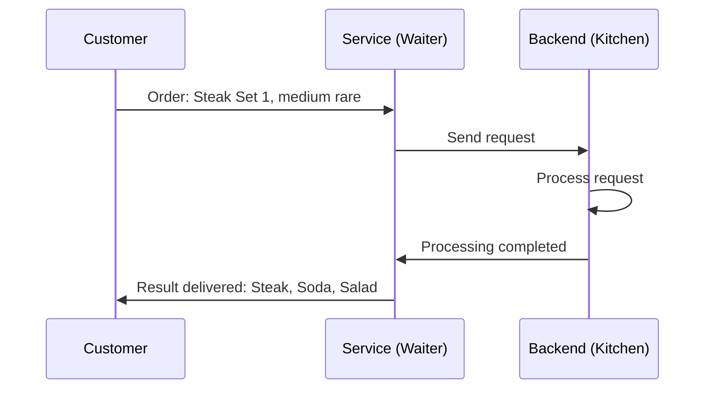

## Usage Scenarios

### Simple Service Request Example

In practical applications, such as a user wants to enter their name in the front-end and query their age, finally showing the age result in the front-end. In this scenario, you can create receiving parameters (such as “receive name”) and return parameters (such as “return age”), write the database query logic into the service, get the “name” from the input box when the service is called, and set the “age” as a return parameter after the query is successful.

## Core Functions

### Service Multiple Returns and Interruptions

The service can set multiple return results within it, if no special measures are taken, the result set last will be effective. If you wish to abort the service upon executing a certain condition, you can use the method “set return result and abort service”, so the service will immediately abort and no further return result settings will be made.

### Service Sharing and Publishing

By publishing the service as an API, an effective data sharing method, the service can be used inside and outside of VisualLogic applications. Public services are called through specific URLs, especially when called across accounts or in non-VisualLogic applications, increasing the flexibility of data interaction between applications. At the same time, the microservice function for internal enterprise use supports sharing services among different applications without the need to set background logic repeatedly.

### Service Logging

The VisualLogic service component supports logging functions, to record the detailed process of service calls, including parameter and response information. This function can help developers better monitor the service running state and troubleshoot potential issues.

## Basic Usage

The service is mainly used in the backend and is usually added in the backend directory. When calling a service, the most common operation is to set receiving parameters and return parameters. By adding receiving parameters, the service can obtain data transmitted from the front end; by setting return parameters, the backend processing results can be returned to the front end for callback use.

- **Step 1**: Add input boxes and buttons in the front end, and add a database and service in the backend.
- **Step 2**: Edit the data table to support the required fields.
- **Step 3**: Set the required receiving and return parameters in the service component and define the processing logic.
- **Step 4**: Define the event that triggers the service, such as button click.

## Advanced Usage

Asynchronous service calls are one of the methods to improve service processing capabilities, especially suitable for scenarios where a large amount of data or long-time computation needs to be processed. Through message queues, service calls can quickly return responses without affecting front-end smoothness.

## Attributes

| Attribute Name      | Description                                                  |
| ------------------- | ------------------------------------------------------------ |
| Receiving Parameter | Specifies input parameters that the service can receive, usually passed from the front end. |
| Return Parameter    | Specifies the output data returned by the service to the front end, used to present processing results. |

## Actions

| Action Name                         | Description                                                  |
| ----------------------------------- | ------------------------------------------------------------ |
| Start Service                       | Used when a service request needs to be initiated from the front end. |
| Call Service                        | Used in the backend request service context.                 |
| Set Custom Return Result            | Defines the return details of the service, including content type and messages. |
| Set Return Result                   | Used to set return parameters after the callback.            |
| Set Return Result and Abort Service | Pre-terminates the service operation and returns the result, suitable for scenarios where the service needs to be interrupted. |
| Asynchronous Call Service           | Uses the MQ function to asynchronously handle service calls, suitable for high-concurrency scenarios. |

## Events

| Event Name    | Description                                                  |
| ------------- | ------------------------------------------------------------ |
| Service Start | An event triggered when the service starts, actions can be bound to its execution. |

## Extraction Precautions

- After setting as a public service, the service parameters are no longer encrypted, so please pay attention to data security.
- When converting a service to an API, please debug and test the correctness of the interface URL for different occasions.
- Service state changes need to be published or previewed again to ensure the public service is effective.

## Extended Reading

When connecting to enterprise applications, using enterprise private services or microservices can effectively improve data security and independence. Enterprise users should consider the reasonable division of API interfaces when designing services, which can not only improve the flexibility of applications but also better control the security risks of service calls."
# Timer Service

## Overview

The Timer Service component is similar to service components as they can both operate databases and modify related backend data. However, the start of the Timer Service is triggered based on a preset time, rather than being triggered by a frontend component. This makes it especially suitable for scenarios where backend operations need to be automatically executed within a specific time period.

## Use Cases

1. Automatically execute operations in the backend at a specific time period.
2. Determine whether certain activities occur within the scheduled start and end times. This type of determination is usually controlled by the backend rather than a simple local time judgment, because users can change the local time to bypass the time limit.

## Core Functions

The Timer Service mainly provides the following functions:

- **Start Time**: Set the time to execute the service (should be set after the application is published).
- **Repeat Interval**: Set the time interval for repeated execution (in seconds), with a minimum of 60 seconds.
- **Repeat Count**: Define the number of times the service is triggered repeatedly. In the preview environment, it can be executed up to 100 times. In the published environment, the number of executions is not limited.
- **Initial Disable**: Decide when the service properties take effect. If enabled, it needs to be activated by event actions; if disabled, the save or publish operation will automatically take effect.
- **Parallel Threads**: The number of concurrent threads, used to batch process large tasks, can be set to a maximum of 100.

## Basic Usage

### 1. Setting the Property Panel

- **Start Time**: Define when to start the service.
- **Repeat Interval**: Set the time interval for the service to be repeatedly executed.
- **Repeat Count**: Determine the number of executions of the service.
- **Initial Disable**: Control when the service properties take effect.
- **Parallel Threads**: Configure the number of service instances running simultaneously to reduce execution time when processing large amounts of data.

### 2. Event Actions

You can dynamically control the Timer Service through the following event actions:

- **Record Return Results**: Process and record the return results of the service.
- **Get Current Configuration**: Get the currently effective service configuration parameters, such as start time, end time, etc.
- **Reset Timer Service**: Reconfigure service parameters to restart and update the service.
- **Delete Timer Service**: Stop and delete the service instance, terminating its execution.

These functions support the creation of a control case that allows viewing, modifying, starting, or stopping the Timer Service without opening the editor.

## Properties

| Property Name    | Description                                                  |
| ---------------- | ------------------------------------------------------------ |
| Start Time       | The time to execute the service (please set it after the application is published). |
| Repeat Interval  | The time interval for the service to be triggered repeatedly (units: seconds), minimum 60 seconds. |
| Repeat Count     | The number of times the service is triggered repeatedly, unlimited in the published environment. |
| Initial Disable  | Control when the service properties take effect.             |
| Parallel Threads | The number of threads running simultaneously to batch process tasks. |

## Actions

| Action Name               | Description                                                |
| ------------------------- | ---------------------------------------------------------- |
| Record Return Results     | Save the return content of the current Timer Service.      |
| Get Current Configuration | Get the currently effective configuration parameters.      |
| Reset Timer Service       | Restart and set the service parameters.                    |
| Delete Timer Service      | Stop and delete the current Timer Service.                 |
| Manual Call Timer Service | Manually execute the Timer Service once from the frontend. |

## Events

| Event Name          | Description                                   |
| ------------------- | --------------------------------------------- |
| Timer Service Start | Triggered when the set start time is reached. |

## Notes

- Once the Timer Service configuration takes effect, it will automatically start running in the backend and execute at the set time, even if the application is not open.
- When setting up, make sure the start time is after the application is published to prevent unexpected triggering.

Through the above configurations and usage methods, you can efficiently automate backend operations within specific time periods, enhancing the level of application automation."
# Transaction

## Overview

### Feature Overview

A transaction is a set of database operations that can combine multiple database operations into one unit. The key to transactions is ensuring data operation consistency. If any step fails, the system will roll back the entire operation sequence. This greatly enhances the reliability of data operations, especially in high concurrency and high data consistency scenarios. For example, in a complex transaction, we can define the following operation flow:

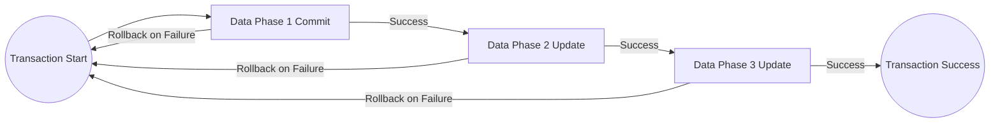

As illustrated above, the transaction is considered successful only if all steps are executed successfully. Once any step fails, the transaction will roll back to the initial state, restoring the protected database data to its pre-change state.

### Transaction Creation and Invocation

The process of creating and invoking a transaction is similar to setting up a backend action group. After creation, we can define its logic in the transaction's event panel:

- The transaction contains 2 input parameters to accept data passed in during invocation.
- It includes 2 output parameters returning the success and failure status of the processing result.

It is worth noting that transactions are purely backend operations and cannot be called directly on the frontend; they must be implemented through services.

### Transaction Rollback

In VisualLogic, there are two types of transaction rollbacks: automatic and manual rollback.

1. **Automatic Rollback**: The system automatically rolls back when it detects a database operation failure (e.g., commit failure, update failure). These errors are usually systemic issues, such as a database connection failure or data exceeding limits. An automatic rollback is triggered whenever any database operation fails.
   
2. **Manual Rollback**: Manual rollback is used to cover scenarios that automatic rollback cannot satisfy. For example, an update must affect more than 0 rows to continue the operation. If the update affects 0 rows, the system might consider the update a success, but it actually needs a rollback. In this case, manual rollback is executed, and error information is set to return.

### Internal Working Principles and Computational Costs

1. **Removing the Read-Write Separation Mechanism**: All operations performed in a transaction are executed on the write instance, so read and write operations are immediately synchronized within a transaction. This mechanism avoids data delays but increases computational costs.

2. **Data Locking**: When a row of data is updated in a transaction, the database locks that row to prevent data inconsistencies. The transaction processing mode is sequential and will unlock only after completion. This ensures data consistency but reduces transaction processing speed.

## Use Cases

- **High Data Consistency Requirements**: In finance, inventory management, and other fields, transactions are key tools for ensuring data consistency.
- **High Concurrency Operations**: Effectively handle inconsistencies resulting from concurrent operations.
- **Complex Database Operations**: Simplify the operation process when multiple steps need to be uniformly successful.

## Core Features

- **Transactions**: As the unit of database operations, it guarantees the atomicity of a series of operations.
- **Rollback Mechanism**: Ensures that any failure can be reversed, protecting data integrity.

## Basic Usage

1. **Transaction Creation**: Define transactions in VisualLogic through the event panel.
2. **Parameter Settings**: Input parameters are used to receive data during invocation, and output parameters return the results.
3. **Transaction Invocation**: Called via services instead of the frontend.
4. **Rollback Configuration**: Two rollback modes, automatic and manual, based on system automatic judgment or manual configuration.

## Properties

| Property Name     | Description                                                  |
| ----------------- | ------------------------------------------------------------ |
| Input Parameters  | Variables received and used for corresponding operations within the transaction. |
| Output Parameters | Variables returned after the execution of internal transaction operations. |

## Actions

| Action Name          | Description                                                  |
| -------------------- | ------------------------------------------------------------ |
| Start Transaction    | Invokes the transaction in the backend service and executes the internal actions of the transaction. |
| Rollback Transaction | Reverts all operations on the database within the current transaction and ends the transaction. |
| Set Return Result    | Sets the return parameters for the current transaction and ends the current transaction. It can be used in conjunction with `Rollback Transaction`. |

## Events

| Event Name        | Description                                                  |
| ----------------- | ------------------------------------------------------------ |
| Transaction Start | Starts the execution of actions within the transaction and can invoke the transaction's input parameters. |

## Notes

- Transaction processing time is limited (5 seconds). Ensure the transaction logic is concise to avoid timeout situations, preventing the triggering of the failure message "Context deadline exceeded.""
# Microservices

## Overview

Microservice is an architectural pattern that supports calling services between different applications. It allows services defined in one application to be reused by other applications, avoiding the need to repeatedly build the same service. Compared to public services, microservices have significant advantages in security and efficiency, ensuring data security through encrypted requests and improving service call efficiency via intranet paths. Additionally, microservices include documentation features, allowing developers to view and debug service parameters at any time, thereby increasing development efficiency.

## Use Cases

Microservices are suitable for scenarios that require cross-application service calls and play an optimization role in complex application architectures. Typical use cases include front-end and back-end separation in distributed systems, multi-developer team collaboration, etc. By splitting an application system into multiple independent service modules, complexity is reduced, and the flexibility of release and maintenance is improved.

## Core Features

- **Service Security**: Encryption of microservice request paths to improve security.
- **Efficient Invocation**: Service call efficiency is improved through intranet paths.
- **Real-time Document Update**: Real-time updates of service parameter documents to increase development efficiency.
- **Cross-application Service Reuse**: Supports the reuse of services between multiple applications.
- **Application Splitting and Optimization**: By splitting applications, the complexity of each module is reduced.

## Basic Usage

### Creating Microservices

1. After defining the service in the application, enable the "Microservice" option.
2. Set the service name and description.
3. Once the service is successfully created, it will be displayed in the backend resource panel for easy viewing and management.

### Using Microservices

1. In the backend resource panel, find the required microservice.
2. Click to view details such as service name, description, and parameter information.
3. Click Add to add the microservice to the application's backend root node.
4. Call the microservice methods from the front end or the backend, similar to calling ordinary services.

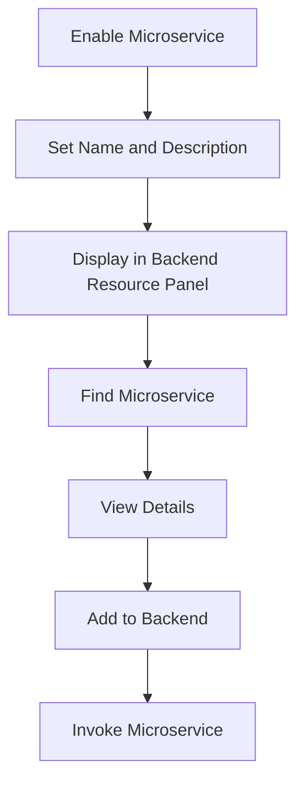

## Advanced Usage

### Publishing Microservices and Multi-developer Development

- When one application calls microservices from another application, ensure that the called application has been published.
- In a multi-developer environment, ensure that the microservice provider application is pushed to the main branch to guarantee that the called service is the latest version.

## Properties

| Property Name      | Description                                                  |
| ------------------ | ------------------------------------------------------------ |
| sid                | Identifier of the microservice, ensuring uniqueness.         |
| nid                | Node identifier, used to identify specific service nodes.    |
| Receive Parameters | Defines the parameters that the microservice receives, allowing multiple parameters and renaming for readability. |
| Return Parameters  | Defines the parameters that the microservice returns; it is recommended to rename them based on data type or content for readability. |

## Actions

| Action Name   | Description                                                  |
| ------------- | ------------------------------------------------------------ |
| Start Service | Requests a microservice from the front end, suitable for service calls in staging environments. |
| Call Service  | Requests a microservice from the backend, suitable for service-to-service calls. |

## Further Reading

For more information on microservices, refer to the following FAQs:

- **What existing backend dependencies does VisualLogic have?**
  VisualLogic automatically binds the required dependency packages based on the features and components used by the user. When using microservices (Dubbo framework), the Nacos microservice registration center plugin is required.

With the above content, you can effectively build and manage a microservice system, enhancing the synergy between applications and the overall robustness of the system."
# Dy Transactions

## Overview

Dy Transaction is a feature used to package writable operations on multiple tables into a single unit, ensuring that multiple steps either succeed or fail simultaneously. Its use cases are similar to ordinary transaction components (like MySQL transactions), but it is not as flexible as MySQL transactions. The purpose of Dy Transaction is to enhance response capability under high concurrency by reducing the consumption of connection numbers through fewer requests. This is the primary reason for using Dy Transaction instead of MySQL transactions in certain operations.

## Use Cases

Dy Transaction is suitable for scenarios where multiple steps need to be performed on tables without requiring complex transaction logic. For example, a large amount of voting or lottery logic. In these cases, Dy Transaction can respond and execute quickly.

However, in situations where complex transaction definitions are required, such as calling external APIs within a transaction (e.g., payment scenarios), traditional MySQL transactions must be used. MySQL transactions allow precise definition of the data operation process.

## Core Features

1. **Operation Packaging**: Up to 25 writable operations on tables can be packaged together.
2. **Transactional Unit**: Ensures that all operations either succeed or fail entirely.
3. **Efficient Concurrent Processing**: Compared to MySQL transactions, Dy Transaction reduces connection consumption and improves response speed for high concurrent requests.

## Basic Usage

### Creating a Dy Transaction
- Similar to an action group, once created, the event panel will display directly.
- In the event panel, you can define the operations to be packaged. The operations can only target tables but can involve multiple table components.

### Operation Types
- Commit, Update, Delete Data: Basic writable operations on the table.
- Validate Data: Used to verify if data under a table meets certain conditions.

#### Points to Note for Data Validation
- The data being validated cannot be the target data for other write operations within the Dy Transaction.
- If you need to validate the value of written data, use the "precondition" of the update or delete operations.

### Invocation
- After defining the Dy Transaction, it can be called directly in the service.
- Note: Dy Transaction can only return a success or failure status, and cannot return other parameters.

## Properties

| Property Name     | Description             |
| ----------------- | ----------------------- |
| Accept Parameters | No detailed description |

## Actions

| Action Name         | Description                             |
| ------------------- | --------------------------------------- |
| Execute Transaction | Whether it succeeds, reason for failure |

## Events

| Event Name        | Description             |
| ----------------- | ----------------------- |
| Transaction Start | No detailed description |

## Implementation Notes

- In Dy transactions, the target object can only be tables, and you cannot insert other non-table operations.
- It is not possible to manually define or set rollback logic; the result is either success or failure.

## Additional Reading

Dy Transaction is a popular choice for users aiming to achieve transaction packaging with low complexity. Additionally, MySQL transactions, prepared for more complex needs, provide more flexible and precise control. Choosing the right transaction management method according to project requirements is crucial."
# API

## Overview

API components serve as the unified entry point for initiating HTTP network requests in VisualLogic. They are divided into front-end and back-end APIs. Although the use scenarios for these two components are slightly different, their basic logic is consistent. In this document, we will introduce both types of APIs together. The front-end API initiates network requests on the browser side. In small programs, native applications, or Windows/Mac applications, the VisualLogic system will automatically connect to the native layer’s interface to implement network request functionality. The back-end API initiates network requests on the server side, which needs to be called and the results processed in the back-end service.

## Use Cases

The front-end API is suitable for scenarios where all request logic is completed on the client side. It is simple to operate and saves server resources. For APIs with high security requirements, using the back-end API can provide better security. Additionally, to handle API requests with cross-domain restrictions, requests need to be made in the back-end.

## Core Functions

### API Usage Process

1. **Initiate Call**: On the front-end, the request can be triggered through UI components, such as pressing a button; on the back-end, it can be triggered through services or timers.
2. **Server Request**: The API component sends a request to the third-party server.
3. **Server Response**: Returns results for the next logic processing step.
4. **Logic Processing**: Completed by the client on the front end and by the service on the back end.

For example, in a simple front-end API usage scenario, when the user clicks a button, an API call is triggered, the API component automatically initiates the request, and processes the returned results.

### Configuration and Debugging

Before using the API, basic configuration and real-time debugging need to be done in the properties panel. Configuration includes request address, request method, and request parameters. You can debug the API using the debug button and use the “Retain Result Structure” feature to parse the return value as a JSON structure.

### API Call

Configure the request parameters in the event panel and reference the return result for logical processing. For example, specifying the request address, timeout duration, Header and Body parameters, obtaining the return result, and displaying or further processing it.

## Basic Usage

- **Request Parameter Specification**: Includes request address, request method, and request parameters (Header and Body parameters). Can be dynamically specified to bind variables.
- **Getting Return Results**: Reference the API return value through callback blocks, including failure reasons, request duration, and other information.
  
## Advanced Usage

### Proxy Requests and Stream Processing

Use the “Prepare Proxy Request” action of the back-end API component to initiate API requests and obtain sessions. You can handle streaming returned data and add it to chat data through action groups after processing the data stream.

## Properties

| Property Name                    | Description                                                  |
| -------------------------------- | ------------------------------------------------------------ |
| Interface URL                    | API address.                                                 |
| Call Method                      | Set the operation and data transfer method of the HTTP protocol. |
| Body Type                        | Define the format type of the request parameters, default is JSON. |
| Timeout Duration                 | Set the connection timeout limit for the request, in seconds. |
| Header Parameters                | Add Header parameters to the API.                            |
| Body Parameters                  | Set Body parameters for the API.                             |
| Debug                            | Click to display the API debug results in the debug result content bar. |
| Disable Certificate Verification | Define whether to allow API requests without verification.   |
| Custom Certificate               | Specify a custom certificate, usually used for advanced payment-related APIs. |
| Certificate Key                  | The key of the custom certificate.                           |
| Return Result Format Conversion  | Automatic conversion of return result format.                |
| Ignore Front-End Header          | Ignore the Header information sent by the user on the front end while calling the service, to avoid cross-domain issues. |
| Return Response Header           | Whether the Header information returned by the API is needed. |

## Actions

| Action Name           | Description                                                  |
| --------------------- | ------------------------------------------------------------ |
| Initiate Request      | Execute API request action.                                  |
| Prepare Proxy Request | The preliminary preparation of the API proxy component before initiating a request. |

## Events

(No relevant event data)

## Notes

When using the front-end API to initiate requests, only request addresses starting with https can be debugged because the VisualLogic editor itself is an https address, causing cross-domain issues with http requests.

## Further Reading

You can refer to related tutorials and examples in the VisualLogic documentation to better understand and apply the API functionality. Additionally, you can download the officially provided Demo to experiment with API configuration and usage."
# Server Socket

## Overview

The Socket component supports information transmission between multiple devices. This component is commonly used in the following scenarios:

1. Real-time data sharing between applications
2. Interaction in multiplayer games

## Core Functions

* **Send Global Message**: Send information to all connected users.
* **Send Room Message**: Send information to users in a specific room.
* **Send Personal Message**: Send information to a specified user.
* **Get User Information**: Retrieve information about rooms and online users.

## Basic Usage

Before sending messages to users, user identity information must be registered. Users can set their ID, nickname, and avatar information in the Socket, making it easier for recipients to obtain sender information.

### Steps to Send Global Messages:

1. When an event is triggered, send a custom global message to the Socket. Each message includes a name and content.
2. Upon receiving the message, the Socket will store multiple messages composed of names and content in the message data object.
3. Users can obtain the message content and display it based on the specified message name.

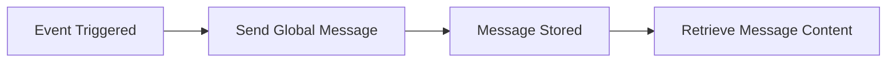

### Steps to Send Room Messages:

1. **Create Room**: Set the room ID and maximum number of users when creating a room.
2. **Join Room**: Join the specified room based on the room ID.
3. **Send Message**: Pass in the message content and room ID, and send it to the specified room.
4. **Receive Message**: Only users in that room can receive this information.

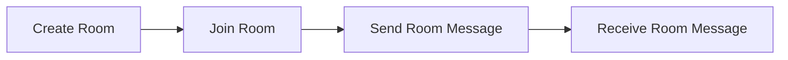

### Steps to Send Personal Messages:

1. **Obtain User CID**: Retrieve it through callback information or a successful Socket connection event.
2. **Send Message**: Send a message to the user specified by the CID.
3. **Receive Message**: The specified CID user receives the message and processes it through the corresponding event.

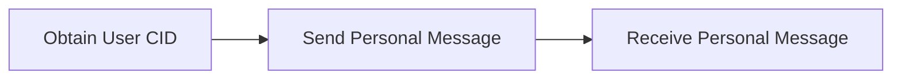

## Properties

| Property Name | Description                        |
| ------------- | ---------------------------------- |
| sid           | Unique identifier ID of the Socket |
| Socket Name   | The name of the Socket             |

## Actions

| Action Name           | Description                                                  |
| --------------------- | ------------------------------------------------------------ |
| Send Global Message   | Send a message within the Socket. All users connected to this Socket can receive the message, which is in object format. |
| Send Room Message     | Send a message to the room with the specified room ID. The message content is in object format. |
| Send Personal Message | Send a message to the user with the specified CID. The message content is in object format. |
| Get Room User List    | Retrieve information about all rooms within the current Socket. |
| Get Online User List  | Retrieve information about users within the current Socket, including the user list or user count. |
| Get Room List         | Retrieve information about all rooms currently available.    |
| Close Room            | Close the room with the room ID provided as an argument.     |

## Further Reading

### Expandable Application Scenarios

The Socket component can be extended to real-time data monitoring, collaborative work platforms, and online customer service systems. By flexibly applying the messaging mechanisms, it helps build more intelligent interactive systems.

This document provides an overview of the core functions and application scenarios of the Socket component and details how to use and operate the related functions to enable developers to utilize this component for innovative designs."
# Email

## Overview

In VisualLogic, the email component is a critical backend component that allows applications to send emails to specified mailbox(es) or multiple recipients. The email component is not only responsible for sending emails but also stores information such as 'Submitting User', 'Recipient', 'Title', 'Content' in a special database. Additionally, the email component supports exporting database tables.

## Use Cases

The email component is suitable for application scenarios that require backend service support, especially when it involves automatically sending notification emails, batch emails, or log emails. It can be used for user registration confirmation, event notifications, and system log emails.

## Core Features

### Send Email

The email component can send emails to individual mailboxes. After the email is successfully sent, the system will return the success or failure status and the specific reason for failure.

### Bulk Email

It can send bulk emails to multiple mailboxes and return the operation result. It also supports setting the email title, content, attachments, and recipient list.

### Data Output

The email component supports outputting sending records and other table data from a database. You can set filtering conditions, sorting methods, the number of output rows, and output columns to organize and retrieve sending records.

## Basic Usage

### Send Email

When using VisualLogic to send emails, you can follow these steps:

1. Add the email component in the backend.
2. Set trigger events on the frontend and choose the send email action.
3. Configure the recipient, title, content, and other information.
4. Set callbacks to handle success and failure cases.

#### Flowchart

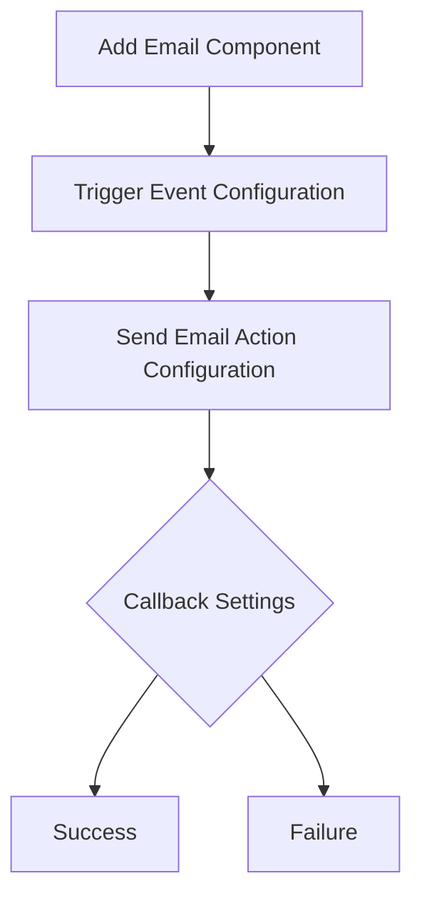

### Bulk Email

1. Add the email component in the backend.
2. Set the receiving parameters for recipients, title, and content.
3. Configure the service trigger, and select send bulk email.
4. Set the success and failure callbacks.

#### Flowchart

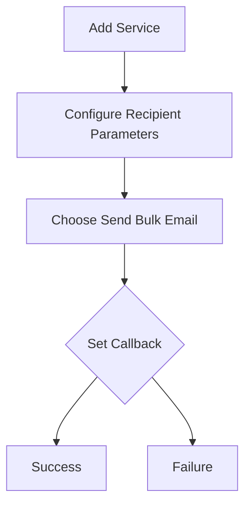

### Data Output

Each time an email is successfully sent, the email component generates a record in the database. These records can be queried and exported via the "output" action.

#### Flowchart

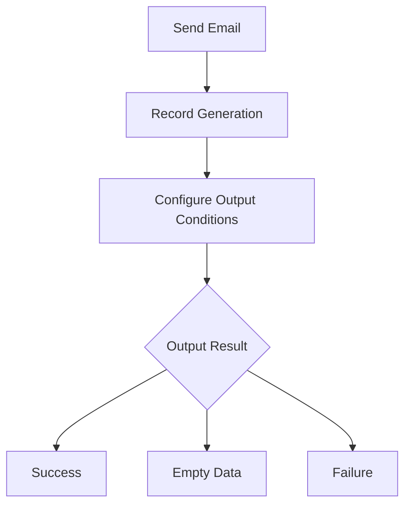

## Properties

| Property Name | Description                                                  |
| ------------- | ------------------------------------------------------------ |
| Name          | The name of the email component, which can be modified as needed. |

## Actions

| Action Name     | Description                                                  |
| --------------- | ------------------------------------------------------------ |
| Send Email      | Send an email to an individual.                              |
| Send Bulk Email | Send bulk emails.                                            |
| Output          | Export data from the database with filtering, sorting, and other functions. |

## Extraction Precautions

- Before sending an email, make sure the title and content are not empty, otherwise the email will fail to send.
- When sending bulk emails, recipients should be provided as an array.
- When exporting data, pay attention to the amount of data to be exported at once to avoid impacting system performance.

## Further Reading

- If the email cannot be found in the recipient's mailbox after being sent, check the junk folder or add the sender to the whitelist.
- In private deployment environments where emails fail to send, custom email configurations might be needed. It is recommended to use a stable email service like QQ Mail."
# SMS

### Overview

The SMS component is a functional module used in the application's backend that helps users send template SMS messages to specified phone numbers. Successfully sent messages will be recorded in the SMS database table and charged at a rate of ￥0.05 per message. Additionally, the SMS component supports a database table output function, facilitating users' query and comparison of existing send records.

### Usage Scenarios

The SMS component is suitable for application scenarios that require automated message sending, such as order notifications and user reminders. It supports all application types and can be integrated with other backend functions, making it adaptable for various environments.

### Core Features

- **Send SMS**: Complete the sending of SMS by setting the recipient's phone number, selecting an appropriate SMS template, and configuring the variables within the template.
- **Callback Mechanism**: Provides two callbacks for sending results, "Send Success" and "Send Failure," allowing retrieval of failure reasons.
- **SMS Output and Record Management**: Automatically records successfully sent messages into the database, with output functions to query records.

### Basic Usage

#### Steps to Send SMS:

1. Add SMS Component:
   - Select and add the component from the components bar on the left side of the editor, supporting use in the backend environment.
2. Set Trigger Event:
   - Besides calling the SMS component through backend services, you can also directly call trigger events in the frontend components. For example, perform the "Send SMS" action after button clicks.
3. Set Sending Logic:
   - Set the recipient's phone number, which can be directly inputted or fetched from an input box.
   - Select the SMS template and set the variables; the variable content must be filled in.
4. Send Callback:
   - Add callback logic to handle scenarios of send success or failure according to the returned results.

#### Operational Flowchart

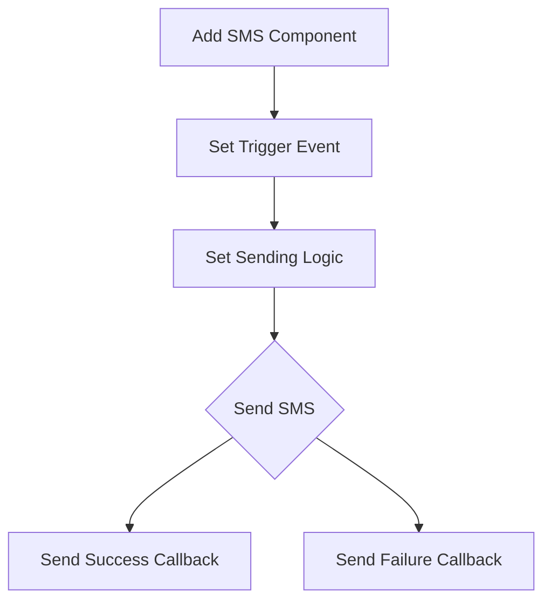

### Advanced Usage

- Custom Templates and Signatures: Need to apply for a new SMS template and signature on the Alibaba Cloud platform through customer service. After approval, they can be used.
- Database Output Options: Can set filter conditions, sorting methods, and the number of output rows, customizing output results flexibly.

### Properties

No relevant property description data.

### Actions

| Action Name          | Description                                                  |
| -------------------- | ------------------------------------------------------------ |
| Classification Stats | Perform classification statistics on data in the database, setting parameters such as output columns and filter conditions. |
| Send Custom SMS      | Send SMS with custom templates and signatures. Need to apply for SMS template ID in advance and provide related variable parameters and phone numbers. |
| Send SMS             | Set recipient number, select SMS template, and configure template variables to send. Supports adding send result callbacks to retrieve failure reasons. |
| Output               | Output data from the database, can set filter conditions, sorting methods, output rows, and columns. Retrieve whether the output operation was successful and the result data in the callback. |

### Events

No relevant event description data.

### Extraction Notes

- Variables in the database are of type "T," meaning JSON objects stored as "Text." To retrieve specific variable values, convert them to object format first.

### Further Reading

- **Q&A**:

  - **Reason for Sending Failure**: Such as missing phone number, incorrect format, empty parameters, insufficient balance, etc.
  - **Cost**: No charge and no SMS record generated for send failures.
- **Demonstration and Application**: The SMS component is suitable for any business scenario requiring automated SMS reminders and can work with other components to achieve more complex business logic, such as user registration SMS verification, order update notifications, and other functions."
# Live Streaming

## Overview

The VisualLogic live streaming component provides an easy way to add and manage live streaming features, allowing users to set up live streams effortlessly. The live streaming process is mainly divided into two steps: pushing the stream and pulling the stream.

- **Pushing stream**: The streamer sends the video stream to the server.
- **Pulling stream**: The audience retrieves the streamer's video stream from the server.

These steps are encapsulated into individual actions in the live streaming component. Users can perform push and pull stream operations simply by calling the corresponding methods.

## Usage Scenarios

- **Application scenarios**: Suitable for platforms that need to quickly set up and manage live streaming services, such as online education, corporate meetings, online press conferences, etc.

## Core Features

- **Component Addition**: Add the live streaming component to the application through the component bar or toolbar.
- **Streamer Push Stream**: Obtain pushing stream address and pushing stream key to configure the push stream software.
- **Audience Pull Stream**: Acquire and configure the pulling stream address for the corresponding terminal.

## Basic Usage

### 1. Component Addition

In the backend interface, add the live streaming component, then add the "Live Window" component in the frontend, and set its live source to the newly added backend live streaming component.

### 2. Streamer Side - Get Pushing Stream Address

1. Configure the pushing stream key.
2. Call the “Get Pushing Stream Address” method, passing in the stream name.
3. Fill in the returned pushing stream address and pushing stream key into the streaming software.

#### Pushing Stream Process Diagram

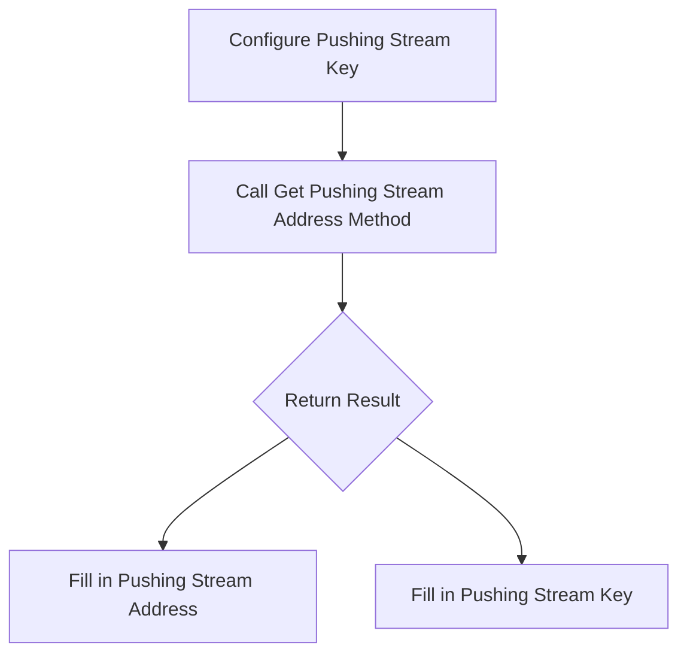

### 3. Audience Side - Get Pulling Stream Address and Play

1. Call the “Get Pulling Stream Address” method, passing in the stream name.
2. Set the pulling stream address in the corresponding terminal, and start playback.

#### Pulling Stream Process Diagram

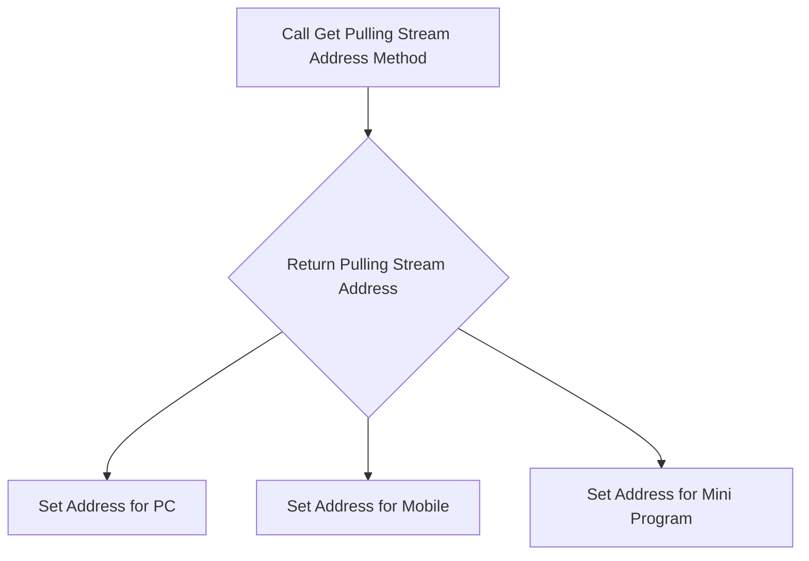

### 4. Other Usage

- **Get Current Online Stream Information**: Retrieve and obtain the list of all live streams currently being pushed.
- **Get Recorded Video Information**: Query and obtain recorded videos for a specified time period.

## Advanced Usage

### Alibaba Cloud Live Streaming Configuration

1. Activate live streaming service on the Alibaba Cloud platform.
2. Add and bind pushing and pulling stream domains.
3. Configure acceleration CNAME and HTTPS.
4. Complete the pushing stream callback address for event triggering.

### Tencent Cloud Live Streaming Configuration

Configuration is similar to that of Alibaba Cloud: Activate the service, add domains, configure CNAME and HTTPS, and complete the callback address.

## Properties

| Property Name       | Description                               |
| ------------------- | ----------------------------------------- |
| lid                 | The name of the component, customizable   |
| Security Protection | Restricts user data operation permissions |

## Actions

| Action Name                           | Description                                              |
| ------------------------------------- | -------------------------------------------------------- |
| Get Pushing Stream Address            | Generate a pushing stream address and key                |
| Get Pulling Stream Address            | Generate an address for audience to watch the stream     |
| Get Current Online Stream Information | Retrieve the list of live streams currently being pushed |
| Get Recorded Video Information        | Retrieve recorded video data for a specified time period |

## Extraction Tips

- When configuring live streaming services, ensure the validity of domain names and SSL certificates, and correctly complete domain name resolution and HTTPS settings.
- When configuring pushing streams, ensure the accuracy of pushing stream keys and domain names to facilitate quick live streaming functionality.

## Extended Reading

In practical applications, you can combine the API interfaces of different cloud platforms to further expand live streaming features, such as adding multi-language support and access analysis. Common expansion measures include optimizing user viewing experience and improving live streaming stability."
# Encryption

## Overview

Encryption involves the process of modifying original information through specific algorithms, ensuring that unauthorized users cannot directly interpret the content even if they obtain the ciphertext. Through the encryption component, plaintext can be encrypted, or ciphertext can be decrypted. This bidirectional conversion ensures the security of data during transmission, particularly in front-end and back-end communication, preventing data from being intercepted and leaked by third parties.

Based on different encryption and decryption mechanisms, encryption mainly falls into three types:

- **Symmetric encryption**: Uses a single-key cryptosystem, where the same key is used for both encryption and decryption.
- **Asymmetric encryption**: Involves a pair of public and private keys, where data encrypted by the public key can only be decrypted by the corresponding private key.
- **Irreversible encryption**: Once encrypted, data cannot be decrypted. The correctness is verified by re-entering the plaintext and processing it with the same algorithm.

## Use Cases

Encryption is widely used in scenarios such as data transmission and user authentication to ensure data security and privacy protection. For example, in online payment systems, users' bank card information is encrypted on the client side and then transmitted to the server over the network, ensuring the information is not stolen.

## Core Functions

1. **Symmetric Encryption and Decryption**: Requires the same key and initialization vector for both encryption and decryption. Common algorithms include AES, DES, and 3DES.
2. **Asymmetric Encryption and Decryption**: Only the RSA algorithm is used, with the public key for encryption and the private key for decryption.
3. **Irreversible Encryption**: There is no decryption process, and correctness can only be verified by re-encrypting and matching the result.
4. **Password Management**: Provides methods for generating and verifying passwords, ensuring user security when entering passwords.

## Basic Usage

### Symmetric Encryption

1. Select a specific encryption algorithm (such as AES, DES).
2. Ensure the key and initialization vector length meet the algorithm requirements.
3. Call the encryption or decryption function, passing in the necessary parameters.

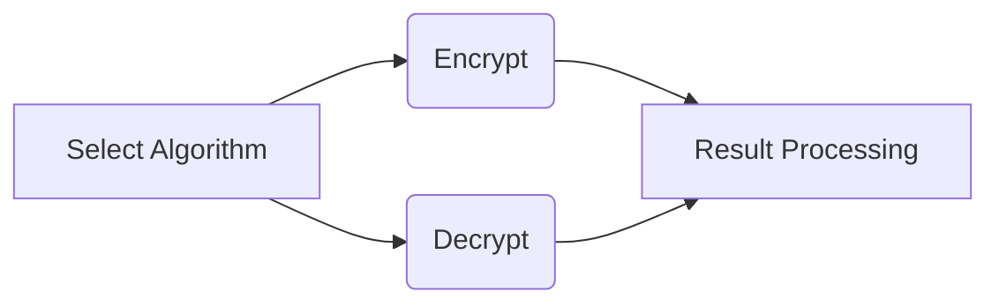

### Asymmetric Encryption

1. Use the RSA algorithm.
2. The public key is used for encryption, and the private key is used for decryption.

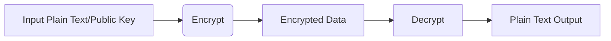

### Irreversible Encryption

1. Directly input plaintext and call the encryption function.
2. If the HMAC algorithm is enabled, a key must be provided.

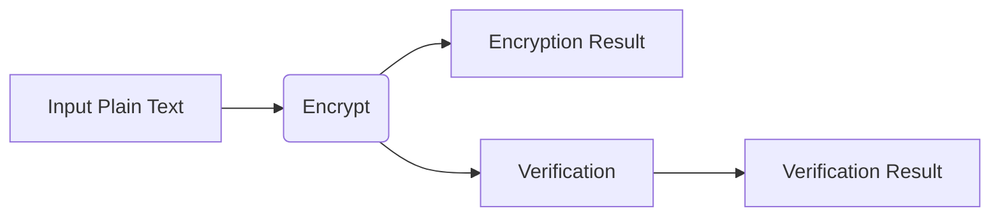

## Advanced Usage

### Generate and Verify Passwords

The password generation function can convert a user-provided plaintext password (such as "abc123") into a complex encrypted string. The generated password is stored in a database to ensure the security of user information. Additionally, the password verification function can check the consistency of the user-entered password and the password stored in the database.

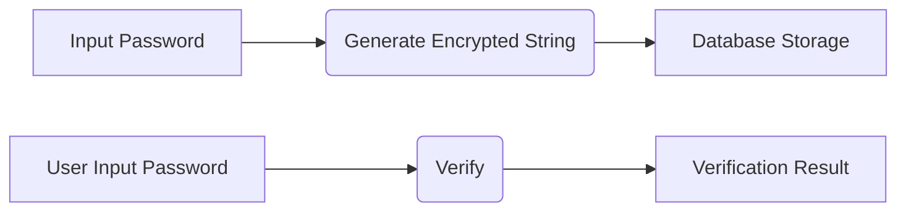

## Properties

| Property Name       | Description                                          |
| ------------------- | ---------------------------------------------------- |
| Encryption Method   | The algorithm used for encryption.                   |
| Mode of Operation   | For symmetric encryption, select CBCCFBCTR/OFB mode. |
| Padding Algorithm   | Choose between ISO10126 or PKCS7 padding.            |
| Use HMAC Algorithm  | Enhance security.                                    |
| Key                 | Parameter used in the algorithm.                     |
| Key Encoding Format | The encoding format of the key.                      |
| Private Key         | Used for decryption.                                 |
| Public Key          | Used for encryption.                                 |

## Actions

| Action Name               | Description                                                  |
| ------------------------- | ------------------------------------------------------------ |
| Irreversible Encryption   | Perform irreversible encryption on data.                     |
| HMAC Algorithm Encryption | Use the HMAC algorithm for irreversible encryption.          |
| Symmetric Encryption      | Encrypt data using a symmetric encryption algorithm.         |
| Symmetric Decryption      | Decrypt data encrypted with a symmetric algorithm.           |
| Asymmetric Encryption     | Encrypt data using an asymmetric encryption algorithm.       |
| Asymmetric Decryption     | Decrypt data encrypted with an asymmetric algorithm.         |
| RSA Signature             | Generate a signature using RSA.                              |
| Verify RSA Signature      | Verify the signature produced by RSA.                        |
| WeChat Payment Signature  | Generate a signature for WeChat payment.                     |
| WeChat Order Check        | Check the status of a WeChat order.                          |
| Generate Password         | Convert plaintext into a password.                           |
| Verify Password           | Verify the user's entered password.                          |
| Generate JWT String       | Use plaintext data and a key to generate a JWT encrypted string. |
| Decrypt JWT String        | Parse the JWT encrypted string.                              |
| Base64 Encoding           | Encode specified data as base64.                             |
| Base64 Decoding           | Decode base64 encoded data back to its original form.        |
| Generate Image Captcha    | Generate an image captcha.                                   |
| Verify Image Captcha      | Verify the user-entered image captcha.                       |

With a detailed understanding and application of the above encryption methods, properties, and actions, you will better protect your application and user information security."
# Database

## Overview

In modern application development, databases are a crucial component for storing and managing data. The VisualLogic platform uses traditional relational database structures, primarily based on MySQL. To accommodate different scenario requirements, it also supports the management of account/enterprise databases, providing convenience for cross-application data referencing and access. In future plans, VisualLogic will support other types of database structures, such as graph databases, to meet the needs for more complex data relationship presentation.

## Use Cases

Databases are the core component for persistent storage of application data, widely used in scenarios requiring data recording and management, data retrieval and analysis. Typical applications include user information management, business process data collection, statistical analysis, etc. Using the database component can provide developers with reliable data persistent storage support.

## Core Functions

### 1. Management of Database Fields

- **Add Field**: You can add custom fields to the database, supporting the selection of data types (such as text, numerical, image, time).
- **Edit Field**: Defined fields can be edited, including the field type and name, etc.
- **Sort and Insert Field**: Adjust the display order of fields as needed, and support the insertion of new fields.

### 2. Data Entry and Updates

- **Manual Entry**: For small amounts of data, enter data directly in the database property panel.
- **Data Import**: Supports importing from external Excel files, suitable for quick entry of large amounts of data.
- **Data Update**: Update data that meets certain conditions via update events provided by the database.

### 3. Data Output and Random Retrieval

- **Output Data**: Filter and sort data based on conditions and output the target data.
- **Random Retrieval**: Randomly output a specific number of records from those that meet the conditions.

### 4. Data Statistics and Deletion

- **Count Statistics**: Calculate the total number of data records that meet certain conditions.
- **Sum and Average Statistics**: Perform sum and average statistics on numerical fields.
- **Data Deletion**: Delete records that meet certain conditions.

### 5. Batch Data Import

The batch import function allows large amounts of data to be imported into the database at once, suitable for new data or batch updates.

## Basic Usage

### Adding and Editing Database Fields

1. Click the "Add" button to enter field property settings.
2. Select the field type and name it, for example, select the text type for the "Name" field.

### Batch Data Import

1. Use the "Import" button to select an Excel file as the data source.
2. The first row in Excel will be imported as field names.

### Example Flowchart for Data Update Operation

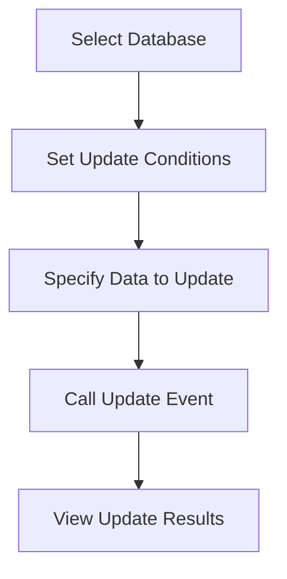

## Advanced Usage

### Update by Data ID

For business scenarios that require updating multiple records, you can use the method of updating by data ID to batch update the corresponding data records in the database. The uploaded object array must include the data ID and the corresponding update field content. Any objects without a corresponding data ID will be ignored.

## Properties

| Property Name  | Description                                              |
| -------------- | -------------------------------------------------------- |
| Component Name | dbId                                                     |
| Security       | Restrict user permissions for updating and deleting data |

## Actions

| Action Name          | Description                                 |
| -------------------- | ------------------------------------------- |
| Output               | Outputs data from the database              |
| Submit               | Submits data to the database                |
| Submit Custom Data   | Submits a single JSON-formatted data record |
| Submit Multiple Data | Submits multiple data records at once       |
| Update               | Updates rows that meet certain conditions   |
| Update by Data ID    | Updates based on data ID relationships      |

## Events

No relevant events described in the data.

## Further Reading (Optional)

In enterprise-level applications, databases often involve connecting to various types of databases and cloud services. VisualLogic implements connections to different databases through Java JDBC, such as MySQL, PostgreSQL, etc. For data security and efficient use, it is recommended to use database indexing for optimized filtering and sorting, and to reasonably configure the number of data submissions and outputs to ensure system performance.

### Q&A

1. **Which databases does VisualLogic backend support?**
   - Currently supports relational databases such as MySQL, PostgreSQL, SQLServer, Oracle, and DM. PostgreSQL, in particular, supports vector search functionality.

**Conclusion:** By fully understanding and applying the functions of the VisualLogic database component, the efficiency and flexibility of data management and business processing can be greatly improved, helping developers achieve complex data operation requirements in application development."
# User

## Overview

User components in application development are used to implement core functionalities such as user login, registration, user management, and permissions settings. It is essentially a table specifically designed to manage user data, while also providing many convenient functional operations. User components are particularly suitable for scenarios requiring user login verification and permissions management and can collaborate with e-commerce components to support operations such as shopping cart and purchases. The default user table fields include user ID, phone number, email, openid, unionid, and user type, helping developers efficiently manage user information.

## Use Cases

User components are suitable for various user management scenarios in applications, including but not limited to user login verification, user information management, permissions control, and managing shopping behaviors in e-commerce systems. Whether you need simple user login functionality or complex user permissions management, user components can be effectively utilized.

## Core Features

- **Login and Registration**: Supports multiple login and registration methods, including phone number, email, WeChat official account, mini-programs, etc.
- **Information Management**: Retrieve detailed current user information, reset passwords, bind phones, and other operations.
- **Permissions Control**: Manage users hierarchically, set differentiated permissions to ensure data security.
- **Security Measures**: Provide strong security guarantees through permissions settings and login verification.

## Basic Usage

### Registration Process

For phone number registration, the user registration process involves requesting a graphical captcha, obtaining an SMS verification code through the captcha, and finally completing the registration.

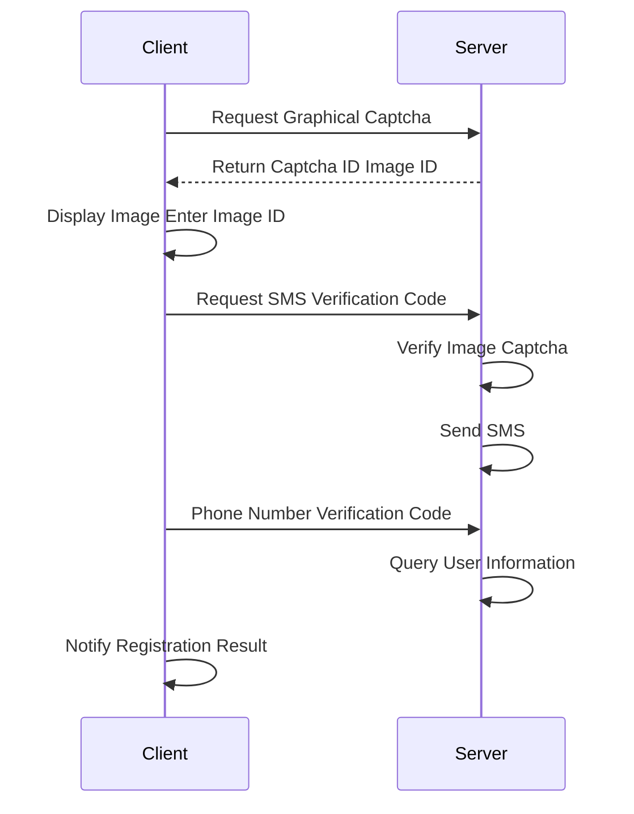

### Login Process

Phone number or email login requires the user to enter a username and password, or verify through an SMS verification code. Upon successful login, user information is stored in client cookies to support automatic login.

## Advanced Usage

### User Permissions Settings

User permissions settings are critical for ensuring the security of application data and services. The permissions settings process includes defining user roles and user types, then binding specific service access permissions.

For example, we can define three role permissions: regular, VIP, and administrator, and assign corresponding permissions based on user types. Additionally, user components allow dynamic updates to user types for flexible permissions management.

## Actions

| Action Name                            | Description                                                  |
| -------------------------------------- | ------------------------------------------------------------ |
| Initiate Mini-Program Login            | Use WeChat account information for login and registration, and obtain related user information |
| Initiate WeChat Official Account Login | Authorize with WeChat information for login and registration |
| Bind Phone (Mini-Program)              | Bind user phone in WeChat mini-program after obtaining verification code |
| Initiate Phone Password Login          | Login to the system using phone number and password          |
| Initiate Phone Verification Code Login | Login using SMS verification code                            |
| Email Registration                     | Complete registration after verifying email information      |
| Get Current User Information           | Check the validity of the current user's access_token        |

## Extended Reading

For more information on user component functionalities and implementation, developers can refer to the VisualLogic platform's user documentation and related training videos for comprehensive information and professional guidance. For a detailed description of permissions management, VisualLogic provides "Application Center" which supports ABAC management for user permissions, enhancing the security of enterprise-level applications."
# Routing Table

### Overview
The main function of the routing table is to support SEO (Search Engine Optimization), enabling search engines to index the web content we create. By utilizing and configuring the routing table within web pages, essential information such as path, title, keywords, and description are automatically loaded during page rendering, thereby enhancing the webpage's visibility in search engines.

### Basic Usage

1. **Adding the Routing Table Component**
   - Select the backend in the object tree, then click to add the routing table to the backend.
   - The routing table has four default fields: path, title, keywords, and description. These fields will become important SEO attributes in the page's section tags.

2. **Setting Fields**
   - Click on the "+" icon on the right to add more custom fields, such as "article content".
   - Fill in the path, title, keywords, description, and other custom fields in the routing table. The path serves as an identifier for the page's load address. For document-like cases, it is recommended to use the article title directly as the path.

3. **Setting the Routing Table Switch**
   - Set the target object to the system, the target action to route jump, and select the path from the routing table.

4. **Initializing and Printing Route Information**
   - Output the routing table content and bind it during the loop creation on the frontend initialization.
   - Print the current routing information of the system to display the route details after the page loads.

5. **Triggering Route Jump Event**
   - Execute the route jump action to reload the page, output all routing information under the current path, and print it on the page.
   - Store the routing information in a general variable, as the routing information will be empty before this event is triggered.

### Q&A
- **Q**: Will the variable values set before a route jump be retained after the jump?
  **A**: The page will reload, so all variable values will revert to their default.

- **Q**: How to pass parameters when needed?
  **A**: URL parameters or hash parameters can be used. Ensure to disable the page rollback feature on the frontend.

### Actions

| Action Name                    | Description                                                  |
| ------------------------------ | ------------------------------------------------------------ |
| Output                         | Outputs data from the database, supporting filter conditions, sorting, and output columns. |
| Submit                         | Submits data to the database and retrieves the submitted data's ID. |
| Submit Custom Data             | Submits JSON formatted data records to the database.         |
| Submit Multiple Data           | Submits multiple data entries to the database at once, returning an array of submitted data IDs. |
| Update                         | Updates data entries that meet filter conditions, with an option to limit the maximum number of updates. |
| Update One and Output          | Updates a single data entry that meets conditions, and outputs the updated data. |
| Randomly Update One and Output | Randomly updates one data entry and outputs the result.      |
| Count                          | Counts records that meet filter conditions.                  |
| Delete Data                    | Deletes data entries that meet filter conditions, with a recommended limit on the maximum number of deletions for safety. |
| Get Randomly                   | Randomly selects data entries that meet conditions, supporting filter conditions and sorting. |
| Count Sum                      | Calculates the sum of numeric fields.                        |
| Count Average                  | Calculates the average of numeric fields.                    |
| Custom Full-Text Search        | Performs a full-text search of records in the database that meet conditions. |

### Attributes

| Attribute Name | Description                                                  |
| -------------- | ------------------------------------------------------------ |
| Name           | The name of the component, suitable for different scenario needs. |
| Security       | Restricts user permissions for data updates and deletions to ensure security. |

By using the routing table, users can effectively embed web pages into the SEO framework, increasing the efficiency of web page indexing by search engines, while also flexibly managing content paths and display outcomes."
# QuickTable

## Overview

QuickTable is a NoSQL database based on column storage, with a data model fundamentally different from traditional relational databases, providing greater flexibility and scalability. QuickTable can be viewed as a tool suitable for large-scale data storage and access, achieving efficient data localization and distribution through its unique combination of Partition Keys and Sort Keys.

## Use Cases

QuickTable is ideal for high-concurrency data storage and processing scenarios, such as user behavior logs, order information, and IoT device data. Its flexible storage structure and efficient query capabilities allow QuickTable to handle the needs of simultaneous massive data writes and reads.

## Core Features

### Data Model

QuickTable's data model can be classified as "column-storage" type, supporting diverse data storage and access. Each record is defined by a unique combination of Partition Key and Sort Key, determining the data's storage location and sorting order. This design not only enhances the speed of single data access but also optimizes data distribution efficiency.

### Creating Tables

When creating a QuickTable, the system automatically generates four default fields: Partition Key, Sort Key, creation time, and expiration time. When adding custom fields to a table, six field types are supported: text, number, array, object, text set, and number set.

### Custom Indexes

In addition to default indexes, users can add text and numeric indexes as needed to help improve the efficiency of specific queries.

## Basic Usage

### Data Submission

QuickTable supports various data submission modes, including "submit a single data" and "submit or overwrite a single data." Each piece of submitted data must specify a clear data ID, with these two submission methods differing in the handling of duplicate data IDs.

### Data Queries

QuickTable provides three query methods:

1. **Get Single Data**: Retrieve a single data entry by specifying the data ID.
2. **Get Multiple Data**: Retrieve multiple data entries by specifying multiple data IDs.
3. **Get Data Within Range**: Retrieve data within a specified range by indicating the Partition Key and index fields.

### Data Updates

QuickTable supports single and batch data updates. Single updates allow conditional and functional operations on a specific field, while batch updates are suitable for overall data replacement.

### Data Deletion

Single and batch data deletions are also supported. Single deletions can incorporate user-defined preconditions.

## Advanced Usage

### Transactions and Unit Operations

Although QuickTable does not feature a full SQL-like transactional control mechanism, it provides a simple transaction function, allowing multiple write operations to be processed together. A transaction can consist of up to 25 operational units, ensuring that all operations either succeed or fail together.

## Properties

| Property Name | Description                                 |
| ------------- | ------------------------------------------- |
| dbId          | Name of the component, modifiable as needed |

## Actions

| Action Name                            | Description                                                  |
| -------------------------------------- | ------------------------------------------------------------ |
| Get Data Within Range                  | Retrieve data matching specified conditions by indicating Partition Key and index fields |
| Submit Single Data                     | Submit a single data entry, specifying a unique data ID to avoid duplicates |
| Submit or Overwrite Data               | Overwrite existing data if the data ID exists or create new data entry otherwise |
| Update Single Data                     | Update a specific field of the data identified by data ID, supporting specific update operations |
| Delete Single Data                     | Delete the record of a specified data ID                     |
| Get Multiple Data                      | Retrieve multiple data entries by specifying multiple data IDs |
| Get Single Data                        | Retrieve a single data record by specifying a data ID        |
| Validate Data                          | Verify if data meets preset conditions, ensuring transaction conditions integrity |
| Batch Submit or Overwrite Data         | Batch create or overwrite data entries from data sources     |
| Batch Delete Data                      | Batch remove data entries by specifying a list of data IDs   |
| Submit or Overwrite Data (Transaction) | Similar to submit or overwrite data, but as a part of a transaction, meeting transaction integrity and consistency requirements |
| Update Single Data (Transaction)       | Update data as part of a transaction unit, ensuring consistency and operational integrity |
| Delete Single Data (Transaction)       | Delete records through transactional means, ensuring consistency in data processing |

## Further Reading

By leveraging QuickTable's unique design and features, well-planned data partitioning and field structure can greatly enhance data processing efficiency. Custom fields and indexes can be used appropriately based on specific application needs, utilizing multiple operations to achieve optimal QuickTable performance. Understanding QuickTable's characteristics relative to NoSQL provides practical guidance for developers working with large-scale data access and storage."
# Turn pages

## Overview

The Flip Page component can simulate the real page-flipping effect within a flip book container, providing users with a realistic page-turning experience. By using the expansion component functionality of the VisualLogic IDE, users can easily add and manage different page contents to achieve applications that balance interactivity and visual effects.

## Basic Usage

1. **Add a Flip Book Container**: In the left expansion component panel of the VisualLogic IDE, select and add a flip book container to your project.
2. **Add Pages**: After focusing on the newly created flip book container, you can proceed to add flip pages. Pages are the carriers of content, and users can insert the relevant content on each page as needed.
3. **Content Customization and Visualization**: Text, images, sound effects, and other multimedia content can be integrated into the pages, customizing the display effect of each page to enhance the interactivity of the application.

## Properties

| Property Name         | Description                                                  |
| --------------------- | ------------------------------------------------------------ |
| Background Color      | The background color of the current component.               |
| Background Image Mode | The coverage mode for the optional background image, with "auto-cover" as the default mode, and optional stretch and scale modes. |

## Actions

Document does not include "func" type data, hence no content required for this section.

## Events

| Event Name           | Description                                                  |
| -------------------- | ------------------------------------------------------------ |
| Turned to First Page | Event triggered when turning from other pages to the first page. |
| Turned to Last Page  | Event triggered when turning from other pages to the last page. |
| Ready to Turn        | Triggered before pressing to turn the page, as the finger moves to the corner of the book. |
| Turning              | Triggered during the page turning process.                   |
| Turned               | Triggered after the page turning is completed.               |

## Notes for Extraction

* Ensure that the page numbers correspond to their positions in the object tree when adding pages. The page number for the bottom-most page is 1.

## Additional Reading

### Usage Scenarios and Learning Path

- **Applicable Scenarios**: The Flip Page component is suitable for creating e-book applications, educational materials, product showcase brochures, and other scenarios that require simulating book page-turning effects.
- **Learning Path**: For beginners, it is recommended to start by creating simple page-turn animations, get acquainted with event triggering and logical arrangement through the VisualLogic graphical interface, and then gradually add complex interactive elements and multimedia content to enhance the application experience.

This document demonstrates the complete performance of the Flip Page component using VisualLogic tools, avoiding the need for code writing and simplifying the development process. It is suitable for users without programming skills to quickly create expressive interactive applications."
# dbo

### Overview

**dbo** is a tool component in VisualLogic used for connecting to custom databases. Through the dbo component, users can connect to any self-deployed MySQL, Oracle, SQL Server, and Postgres databases. Users can write SQL statements in VisualLogic to manipulate databases and integrate the results with other functional logic. The dbo component does not manage the database itself; it only provides a method to connect to external databases, making it significantly different from using a regular database.

### Use Cases

dbo is suitable for scenarios where there is a need to connect and operate custom-deployed databases. Users can leverage the service logic built in VisualLogic to write and execute custom SQL to perform various database operations. This component supports connections to MySQL, Oracle, SQL Server, and Postgres databases.

### Core Features

- **Connect to Custom Databases**: By setting up database connection configurations, including database type, connection address, username, password, etc., users can flexibly connect to external databases in VisualLogic.
- **SQL Operation Security**: To avoid security risks such as SQL injection, all SQL operations must be executed through predefined SQL templates. Dynamic SQL writing in services is prohibited.

### Basic Usage

1. **Set Connection Configuration**: Users need to set the database connection parameters, including `dbType`, `linkUrl`, `username`, `password`, and `dsn`. These properties can be set using the connection configuration methods of dbo.
2. **Write SQL Templates**: Under the settings of dbo, users can define SQL execution logic within SQL templates. Specific SQL statements need to be passed in as strings, and using SQL templates is recommended to enhance security.

   ```mermaid
   graph TD
   A[Set Connection Configuration] --> B[Write SQL Templates]
   B --> C[Execute SQL and Retrieve Results]
   ```

### Actions

| Action Name          | Description                                                  |
| -------------------- | ------------------------------------------------------------ |
| Begin Transaction    | Marks the beginning of a transaction, i.e., begin transaction. |
| Rollback Transaction | Rollback the transaction.                                    |
| Commit Transaction   | Complete the transaction, commit.                            |
| Execute Custom SQL   | Executes any custom SQL statements. Using SQL templates is recommended for increased security. |

### Properties

| Property Name      | Description |
| ------------------ | ----------- |
| Database Type      | dbType      |
| Connection Address | linkUrl     |
| Username           | username    |
| Password           | password    |
| Connection Type    | linkType    |
| DSN String         | dsn         |
| Default DB         | defaultDb   |

### Precautions

- As the dbo component does not manage database resources and only provides connection functionality, users are responsible for database backups and data management.
- Caution is required to avoid SQL injection risks; always use predefined SQL templates.

Through the above features and usage methods, users can proficiently apply the dbo component in VisualLogic to perform database operations, achieving customized database management solutions."
# Video

### Overview

In the field of video processing, two important concepts regarding video files are **coding format** and **container format**. Coding format refers to the compression algorithms for video and audio, while container format is the specific format that packages the compressed data into a video file. Common video codecs include MPEG-1/-2, WMV, RMVB, Xvid, AVC/H.264, etc., and popular audio codecs include Mp3, AC-3, AAC, etc. Supported container formats are diverse, such as AVI, MP4, MKV, etc.

Video files can be divided into local playback videos and streaming media videos suitable for online playback. Although some file formats like MP4 are widely supported across multiple devices and environments, the different codecs used in videos may cause compatibility issues even for files with the same format. Additionally, different browsers have varied support for video file formats, making it essential to select appropriate formats to ensure compatibility.

### Use Cases

Using video as an expressive form enables various implementations such as embedded videos, full-screen videos, and interactive videos, suitable for various applications like video-on-demand and online education. To ensure video compatibility, it may be necessary to transcode to H.264 format MP4, especially for larger or longer video materials where segmentation is recommended.

### Core Functionality

#### Basic Usage

1. **Video Transcoding**: For non-H.264 format videos, it is recommended to pre-transcode to ensure compatibility.
2. **Replace Video Material**: Video material can be changed by modifying the resource URL without affecting its appearance and playback properties.
3. **Video Control**: Playback can be directly controlled via video control buttons or through event-based actions.

#### Video Storage and Sharing

- Videos are accessed via resource URLs. Videos can be replaced by re-uploading or using a different network URL.
- Control bar display is supported, allowing users to directly control playback progress.

### Attributes

| Attribute Name         | Description                                                  |
| ---------------------- | ------------------------------------------------------------ |
| Width                  | The width of the control, accepting pixel values or percentage definitions. |
| Height                 | The height of the control, accepting pixel values or percentage definitions. |
| Resource URL           | The storage address of the video on the server, supporting mp4, mov, and wmv formats. |
| Muted                  | Controls whether the video plays muted by default.           |
| Volume                 | Playback volume, adjustable within the range of 0-100%.      |
| Playback Speed         | Video playback speed, default is 1x.                         |
| Autoplay               | Whether the video autoplay, suggested to trigger through user interaction events. |
| Loop                   | Whether the video replays after ending.                      |
| Show Controls          | Whether to enable the control bar for easier playback control. |
| Scale Mode             | Video scale modes (contain, cover, fill).                    |
| Poster                 | Defines a poster image to be displayed before the video plays. |
| 3D Distance            | Defines the 3D distance property measured in pixels.         |
| Advanced Mode          | Enable advanced mode to customize the control bar style.     |
| Control Bar Background | Sets the background color of the control bar when advanced mode is enabled. |
| Font Color             | Sets the icon and text color in the control bar when advanced mode is enabled. |
| Preload                | Controls whether the video preloads when the page loads (applicable in advanced mode). |
| WeChat Adaptation      | Ensures playback effects match iOS behavior when opened in Android WeChat browser. |
| Original Duration      | Retrieves the total duration of the video, read-only attribute. |

### Actions

| Action Name/Title | Description                                                  |
| ----------------- | ------------------------------------------------------------ |
| Play              | Starts playing the current video.                            |
| Pause             | Pauses video playback.                                       |
| Play/Pause        | Toggles between play and pause states.                       |
| Seek              | Seeks to a specified time point and continues playback, controlling play duration. |
| Replay            | Restarts video playback.                                     |
| Enter Fullscreen  | Switches to full-screen mode for video playback, requiring user gesture. |
| Exit Fullscreen   | Exits full-screen playback mode.                             |
| Current Play Time | Retrieves the current video playback time.                   |
| Total Time        | Retrieves the total duration of the current video.           |

### Events

| Event Name/Title  | Description                                                  |
| ----------------- | ------------------------------------------------------------ |
| Playback Started  | Triggered when video playback starts.                        |
| Playback Ended    | Triggered when video playback ends.                          |
| Play              | Executed when video playback is triggered.                   |
| Pause             | Triggered when video playback is paused.                     |
| Video Initialized | Triggered when video initialization completes, providing video duration info. |
| Video Load Failed | Triggered when video resource loading fails due to URL invalidation or network issues. |
| Enter Fullscreen  | Triggered when entering full-screen mode.                    |
| Exit Fullscreen   | Triggered when exiting full-screen mode.                     |

### Notes

- When using network videos, ensure to obtain the video resource URL rather than a web page link.
- For better compatibility on Android and iOS devices, it is recommended to use MP4 format video files.

### Further Reading

1. How to pause background music when playing a video and resume background music after the video pauses or ends:
   - Listen to the video playback event to pause the background music, and resume background music playback when the video is paused or ends.

This document provides detailed information on video content processing to help users efficiently use video components and manage video files."
# Native APP

## Function Overview

VisualLogic provides the functionality to package web applications as native applications using the React-Native tool internally. The packaged applications can run on iOS and Android systems and possess certain native operation capabilities.

## Property Configuration

### Animation Form

Determines whether the transformation of the status bar properties is displayed in an animated manner, supporting three properties: background color, status bar style (status bar text color), and status bar hiding.

### Permission Configuration

#### Permission Type Description

| Permission Type        | Description                                                  |
| ---------------------- | ------------------------------------------------------------ |
| INTERNET               | Permission to open network sockets                           |
| NETWORK_STATE          | Permission to access network information and modify network connections |
| ACCESS_WIFI_STATE      | Permission to access Wi-Fi information                       |
| WAKE_LOCK              | Permission to wake lock, keeping the CPU running and preventing it from sleeping |
| READ_PHONE_STATE       | Permission to access mobile data, current call status, and contact list |
| WRITE_EXTERNAL_STORAGE | Permission to access external storage                        |
| READ_EXTERNAL_STORAGE  | Permission to write to external storage                      |
| CAMERA                 | Permission to access the camera                              |
| ACCESS_FINE_LOCATION   | Permission to get precise location (approximately within 50 meters) |

### Back Key Action

By setting it to customized, you can listen to the APP back key event and perform corresponding operations within the event, such as page back.

## Basic Usage

### Invoke Other Applications

#### Use Action to Open System Browser

It can open applications that have URL Schemes installed on the phone, such as browsers, phone, SMS, and email clients. It can also call third-party apps such as “weixin://”, “taobao://”, etc. Below are some common built-in schemes:

| Scheme     | Description                                    |
| ---------- | ---------------------------------------------- |
| mailto     | Open an email client, e.g., mailto:123@qq.com  |
| tel        | Open the phone dialer, e.g., tel:+123456789    |
| sms        | Open the SMS application, e.g., sms:+123456789 |
| https/http | Open the browser, e.g., https://expo.io        |

#### Use Action to Wake Up APP

This allows you to open a specific application. To use this action, you need to know the target app's package name, i.e., the value of the package attribute in the manifest node (e.g., com.taobao.taobao), and the pathname of the target page component, i.e., the value of the name attribute in the activity node (e.g., com.taobao.tao.TBMainActivity). Parameters are the additional information passed in, and data settings are the data URI passed in, both of which can be retrieved by the APP opened next.

---

## Common Function Analysis

### Get Device Information

- **Get Unique Device Identifier**: Obtain the device's unique identifier by calling its interface.

### Status Bar Settings

- **Get Status Bar Height**: Get the height of the top status bar on the phone.
- **Set Status Bar Text Color**: Set the text color of the status bar, such as the color of the time and signal icons.
- **Hide Status Bar**: Determine whether to hide the status bar.
- **Set Transparent Status Bar (Android only)**: Set whether the status bar on the phone is transparent.
- **Set Top Area Height (iOS only)**: Set a reserved height for the top area.
- **Set Bottom Area Height (iOS only)**: Set a reserved height for the bottom area.

### Application Operations

- **Exit Application**: Call the interface to exit the application.
- **Set Back Key Behavior**: Configure the behavior triggered by the physical back key of the phone.
- **Switch Landscape/Portrait Mode**: Switch the current APP between landscape and portrait modes.
- **Open Permission Configuration Page**: Directly jump to the permission configuration page for users to set permissions.

### NFC Operations

The basic usage involves calling the action to read NFC tags by setting the protocol, then repeatedly calling the NFC communication action until all desired data is read, and finally closing NFC.

---

## Event Handling

- **APP Back Key Event**: When the APP back behavior property is set to "custom," this event is triggered when the user clicks the Android back key or the iOS swipe-back gesture. It is used for customized page back actions, application exits, and other behaviors.

---

## Code Implementation Considerations

All the functionalities mentioned in this technical document can be implemented using VisualLogic tools. Ensure that the project is correctly configured with VisualLogic before using the related methods to invoke the required native functionalities."
# Windows application

## Overview

The Windows application component is used to configure the settings related to Windows application packaging. VisualLogic provides the functionality to package any web application into a Windows application using the Electron packaging tool. Once packaged, the front-end application can be directly bundled into a Windows exe and run on a Windows system.

Note, the Windows application packaging functionality merely packages the front-end part of the example, much like exporting HTML. Therefore, if you need to use backend-related functionalities, such as connections (WebSocket), databases, etc., a full-stack private deployment export is required.

## Use Cases

- Convert a web application to run as a Windows application.
- Provide the ability to upload local files after the application is packaged.
- Customize the window display state of the application (e.g., fullscreen, maximize, minimize).

## Core Features

1. Package any web application into a Windows application.
2. Provide options for initial fullscreen and hiding the menu bar.
3. Support manually specifying the port number to ensure port number consistency.
4. Support local file upload capabilities, creating a local folder under the application's root directory for file storage.

## Basic Usage

### Menu Bar and Fullscreen Settings

Through the menu bar and initial fullscreen properties of the Windows application, you can set whether to hide the menu bar and whether to start in fullscreen mode when packaging. Initial fullscreen means the exe will automatically start in fullscreen. If initial fullscreen is not selected, the application can later be fullscreened using F11 once running.

### Port Number

When VisualLogic packages a Windows application, it comes with a web server. If no port number is specified, the system will automatically generate one. Typically, this won't cause issues, but in cases of port conflicts or the need for a fixed port number for external services, you can manually specify a port number.

### Upload Files to Local Directory

The feature to upload files to the local directory provides a convenient file server. If this option is enabled, the packaged Windows application will create a new folder in the same directory as the application at runtime. The folder name defaults to "ivxFiles" but can be manually specified.

At this time, all images and files uploaded via the file interface component and images and videos uploaded via the rich text editor will be saved in this local folder. This way, the purely front-end Windows exe can provide some backend functionalities.

Using this feature, we can also save some locally generated data. For instance, through the "upload text to file" functionality of the file interface, part of the data generated by the application (such as content edited in the rich text editor) can be saved as a text file and uploaded to the local folder.

By repeatedly calling this interface, you can update the content in the rich text editor. After the content is saved, the previously saved content can be retrieved via a GET request to the corresponding text content through the API component.

In the following demo, we implemented saving the content of the rich text editor to the local folder and reading the previously saved content. (Note, this can only be experienced after packaging for Windows):

## Advanced Usage

No examples of advanced usage are currently available.

## Properties

| Property Name | Title                           | Detailed Description                                         |
| ------------- | ------------------------------- | ------------------------------------------------------------ |
| hideMenu      | Hide Menu Bar                   | Whether to hide the menu bar in the packaged program.        |
| fullScreen    | Initial Fullscreen              | Whether to automatically start in fullscreen mode. If not selected, fullscreen mode can be entered after the program runs using F11. |
| localFiles    | Upload Files to Local Directory | Once enabled, actions such as uploading images and files via the file system and uploading images and videos via the rich text editor will directly upload to a local file directory. |
| folderName    | Folder Name                     | If uploading files to a local directory is enabled, an additional folder name can be specified. If not specified, it defaults to ivxFiles. |
| port          | Port Number                     | The Windows application exported by VisualLogic comes with a local web server. A port number can be manually specified if needed. Otherwise, the system will automatically create one. |
| productName   | Product Name                    | N/A                                                          |
| company       | Company                         | N/A                                                          |
| versionNumber | Version Number                  | N/A                                                          |

## Actions

| Action Name    | Title                 | Detailed Description                                         |
| -------------- | --------------------- | ------------------------------------------------------------ |
| fullScreen     | Fullscreen            | N/A                                                          |
| exitFullScreen | Exit Fullscreen       | N/A                                                          |
| maximize       | Maximize Window       | N/A                                                          |
| minimize       | Minimize Window       | N/A                                                          |
| windowsPing    | Initiate ping Request | Initiates a ping request to a specified IP address. Note, this method is provided by the Windows operating system and is only available after exporting to Windows. It is not available in web preview. |

## Events

No related events currently available.

## Further Reading

- [VisualLogic Documentation](https://docs.ivx.com/)
- [Electron Official Website](https://www.electronjs.org/)

## Q&A

- **Q:** How do I package a web application into a Windows application?
  **A:** Use the packaging functionality provided by VisualLogic. By setting the relevant properties and configuration files, you can package a web application into a Windows exe file.
- **Q:** Does the packaged Windows application support local file uploads?
  **A:** Yes, by enabling the local file upload option, a folder can be created in the application root directory to upload files into this folder."
  # Form Fields

# Form Fields

## Overview

In VisualLogic, form fields are one of the core components used for building form-based applications, typically used in conjunction with form containers. By configuring various field properties, developers can implement multiple data input and validation features to meet the needs of various application scenarios. For detailed usage, refer to the relevant form container documentation.

## Properties

The form field component comes with a rich set of property configurations. Below is a detailed description of each property:

| Property Name     | Description                                                  |
| ----------------- | ------------------------------------------------------------ |
| Field Name        | The name of the current field, used as the key in the object when getting and setting form data. |
| Field Value Type  | The data type bound to the field, supporting built-in data types such as text, number, phone number, email, etc., or custom types set through regular expressions. |
| Custom Regex      | When the field value type is set to custom, a regular expression can be defined here. |
| Default Value     | If the user does not specify the current field value, the system will use this default value. |
| Bound Attribute   | Usually a user input-related attribute, such as the content of an input box or the selected value of a dropdown menu. |
| Required          | Specifies whether the field is a required item; by default, it is not. If set to true, the field cannot be empty, otherwise, validation will fail. |
| Binding Direction | The direction of the field's binding to the component attribute, supporting two-way binding, one-way get, one-way set, and disable. |

## Events

During the operation of form fields, the following events may be triggered:

| Event Name         | Description                                                  |
| ------------------ | ------------------------------------------------------------ |
| Validation Success | When the form container retrieves data, it automatically validates whether all fields under the form container are legal. If the field value is legal, this event is triggered. |
| Validation Failure | When the form container retrieves data, it automatically validates whether all fields under the form container are legal. If the field value is illegal, this event is triggered. |

## Precautions

When using the form field component, be sure to consider the validity of the field values. If a field is set as required, ensure that the user has entered a valid value. Also, choose the binding direction appropriately to avoid data synchronization issues.

## Further Reading

To gain a deeper understanding of the application of form fields, refer to the form container section in the relevant VisualLogic documentation to learn how to implement data input and validation more efficiently. Additionally, you can try using custom regular expressions to meet specific scenario input specifications."
# Skeletal Component

## Overview

Skeleton components are automatically generated components of a model after importing skeletal animations. These skeletons are encapsulated within an object known as the "Skeleton Container," defined within the initial skeletal animation model and thus cannot be added in the editor. They are akin to model parts under obj/gltf models in a 3D world. Skeleton component provides additional control functionalities to the original skeletal animation model, especially the capability of dynamically controlling specific bones, including:

1. Dynamically changing the texture of skeleton components through the "Custom Texture" attribute;
2. Overlaying transformations such as translation and rotation on the current state of the bone through the "Transform Bone State" action.

## Use Cases

The "Transform Bone State" action is suitable for scenarios requiring dynamic control of individual bone effects. For example, in a game, a character's gun muzzle needs to move along with finger movements. This action allows any property change on specific bones for flexible control, especially in games requiring complex interaction, not limited to playing fixed animations.

## Core Features

### Transform Bone State

This feature allows setting overlay transformations for a skeleton component, including rotation angle, scaling, translation, and skew. Note that these transformations are added on top of the original model, rather than being independent transformations.

## Basic Usage

### Basic Usage of Transform Bone State

Directly assign corresponding values to properties.

- `rotation`: Controls the rotation angle of the bone.
- `scaleX`: Controls scaling in the X-axis direction.
- `scaleY`: Controls scaling in the Y-axis direction.
- `skew`: Controls the skew angle.
- `x`: Controls offset in the x-direction.
- `y`: Controls offset in the y-direction.

Ensure that the skeletal animation includes properties to be overlaid and that related animations are set to auto-loop playback.

## Advanced Usage

### IK Control

IK (Inverse Kinematics) utilizes the end joint to drive movement within the skeleton chain, producing more natural animation effects.

Steps:

1. Select two connected bones in DragonBones, typically starting control from the wrist to the arm.
2. Generate a constraint target for the end bone in the panel.
3. Add a control target corresponding to the empty bone in VisualLogic to implement IK control.

Ensure the bones being controlled have relevant animations and export as a zip file for import into VisualLogic.

## Properties

| Property Name    | Description                                                  |
| ---------------- | ------------------------------------------------------------ |
| Built-in Texture | The texture provided with the model                          |
| Custom Texture   | Upload custom textures to override the model's built-in texture |

## Actions

| Action Name          | Description                                                  |
| -------------------- | ------------------------------------------------------------ |
| Transform Bone State | Sets the rotation, translation, skew, and scaling state of a skeleton component |
| # Page Container     |                                                              |

## Overview

The Page Container is a specialized page component designed to achieve a sliding page-flip effect, commonly used for creating traditional H5 sliding pages or page carousel effects. Unlike ordinary pages, it follows finger sliding instead of simple trigger-based flipping. The Page Container supports preloading pages to enhance the browsing experience, currently limited to web environments and not supported in mini-program environments.

The Page Container can contain multiple sub-pages (page-flips), which operate similarly to ordinary pages and can include any web components. Sub-pages can be set statically or generated dynamically using "for" and "if" components.

## Use Cases

- **Traditional H5 Sliding Pages**: Suitable for scenarios requiring multi-page, multi-content displays.
- **Page Carousel**: Used for projects with diversified, multi-content carousel needs.

## Core Features

### Page Flip Behavior Settings

1. **Flip Direction**: The default is left-right page flip, but can be set to up-down flip.
2. **Flip Effects**: Six transition effects are available, including slide, fade, 3D cube, flip, card flow, and card.
3. **Page Gap**: Can be set in slide and card modes, default is 100.
4. **Slide Sensitivity**: Affects the page movement distance when sliding with a finger, default is 1; the higher the setting, the farther the movement.

### Preloading of Flip Pages

The number of preloaded pages is set as needed. You can set to preload the current page and several pages thereafter to ensure seamless page transitions. Usually, preloading 1-3 pages is recommended. Note that preloading behavior only starts when the Page Container component is rendered.

### Animations and Timelines in Flip Pages

For effects or timeline animations that need to be automatically triggered when the page is displayed, manual invocation is required to play, and special attention is needed to automatically trigger effects during the pre-rendering phase.

## Attributes

| Attribute Name     | Description                                                  |
| ------------------ | ------------------------------------------------------------ |
| Page Gap           | Can set the gap between adjacent pages when the flip effect is set to "slide" or "card flow." |
| Preload Pages      | Set the number of pages to preload; non-preloaded pages are not rendered. Suggested value is 1-3 pages. |
| Background Shadow  | Automatically adds background shadow during 3D cube or card flow flip to enhance 3D effects. |
| Flip Buttons       | Whether to display previous and next page flip buttons, with customizable styles. |
| Flip Markers       | Whether to display page indicator dots; when flip direction is left-right, markers are at the bottom of the container, otherwise on the right side. |
| Flip Effects       | Selectable page flip transition effects including slide, fade, and various modes. |
| Vertical Flip      | Change flip direction to up-down.                            |
| Arrow Width        | Width of the flip arrow icons.                               |
| Arrow Height       | Height of the flip arrow icons.                              |
| Arrow Color        | Color of the flip arrow icons.                               |
| Previous Page Icon | Icon style for the previous page arrow.                      |
| Next Page Icon     | Icon style for the next page arrow.                          |
| Dot Width          | Width of the page indicator dots.                            |
| Current Dot Color  | Color of the indicator dot for the current page.             |
| Default Dot Color  | Color of the indicator dots for non-current pages.           |
| Background Color   | Background color setting.                                    |
| Background Image   | Background image setting.                                    |
| Slide Sensitivity  | Control the sensitivity of slide page flipping, default is 1. |

## Actions

| Action Name        | Description                                                  |
| ------------------ | ------------------------------------------------------------ |
| Print as Image     | Similar to printing a canvas, prints the content of the current component into a base64 image. |
| Jump to Page       | Change/jump to the specified page.                           |
| Current Page Index | Get the index of the current page.                           |

## Events

| Event Name         | Description                          |
| ------------------ | ------------------------------------ |
| Click              | Element click event.                 |
| Long Press (0.35s) | Element long press event.            |
| Finger Down        | Finger press down on element event.  |
| Finger Up          | Finger release from element event.   |
| Finger/Mouse Slide | Finger/mouse slide on element event. |
| Page Switch        | Page switch event.                   |
| Double Click       | Element double click event.          |

## Extended Reading

When using the Page Container, to ensure a smooth sliding experience, it is recommended to reasonably preload multimedia elements for each page and appropriately design manual triggering mechanisms to control the timing of animations and timelines. Additionally, avoid complex styles and interactions to reduce potential performance overhead."
# Cache

## Overview

Cache database is specially designed to improve data query speed and reduce database burden, used to store commonly queried data. This type of database mainly contains popular data that is infrequently updated but frequently read. By integrating storage, it speeds up data access. For results that require complex computations, they can also be pre-stored in the cache database to improve service response efficiency.

## Underlying Implementation

VisualLogic's cache database interface is designed based on the Redis interface. In private deployments, Redis is used, while in public cloud environments, since Redis cannot elastically scale, AWS's DynamoDB is used to simulate the Redis interface. DynamoDB is a serverless fast access database that can match the performance of Redis, has no throughput bottlenecks, and in the public cloud, the cost is combined with that of QuickTable.

## Use Cases

In the data query and update process, the cache plays an important role:

- **Data Query**: First, check if the requested data already exists in the cache. If it does, return it directly; otherwise, query the original database and store the result in the cache.
- **Data Update**: To ensure the accuracy and "freshness" of cache data, synchronize updating or deleting the cache when the original data changes.

## Basic Usage

The cache primarily involves two aspects of usage: data query and data update. During this process, it is crucial to ensure query speed and the accuracy of cached data.

1. **Data Query**: By checking the cache database, if the requested data is in the cache, it is returned directly, saving query time; if not found, it is obtained from the original database and the cache is updated.
2. **Data Update**: When the original data changes, the cache must be updated synchronously to avoid retrieving outdated data. This can be achieved using delete or update operations.

In specific operation examples, the cache uses a unique "key name" combination for data storage to ensure uniqueness, along with "expiration time" settings to maintain data timeliness and accuracy.

## Advanced Usage

In more complex application scenarios, it is recommended to use the "transaction" component to manage database and cache operations. By incorporating transactions, data rollback can be achieved to handle operation failures, thereby ensuring data consistency. After an update operation, the old records in the cache should be deleted to ensure that subsequent queries use the latest data.

```mermaid
graph LR
A[User Request] --> B{Data Exists in Cache?}
B -- Yes --> C[Return Cache Data]
B -- No --> D[Query Original Database]
D --> E[Store Data in Cache]
D --> F[Return Data]
E --> F
```

## Actions

| Action Name                | Description                                               |
| -------------------------- | --------------------------------------------------------- |
| Set Single Value Cache     | Specify a key name to set or update a single value cache. |
| Get Single Value Cache     | Retrieve a single value cache record.                     |
| Insert Single Value Cache  | Add a new single value cache record.                      |
| Update Single Value Cache  | Update a single value cache record.                       |
| Set Expiration Time        | Set the expiration time for single or set cache records.  |
| Get Expiration Time        | Get the expiration time for cache records.                |
| Delete Cache               | Delete a cache record.                                    |
| Increment Cache Value by N | Increase a numerical type cache record.                   |
| Add Set Element            | Add elements to a set type record.                        |
| Remove Set Element         | Remove elements from a set type record.                   |
| Get Set Elements           | Retrieve all elements in a set record.                    |
| Check Element in Set       | Check if an element is in a specific set.                 |
| Get Cache List             | Retrieve all record key names in the cache database.      |

The above content collectively illustrates how to manage caching using VisualLogic's cache database to improve system operational efficiency. By understanding the basic and advanced usages, you can effectively formulate caching strategies to handle different data usage scenarios."
# PayPal

## Overview

PayPal is a commonly used payment interface in VisualLogic applications. By using the foreign PayPal interface, payments can be redirected for completion, and payment results can be obtained within VisualLogic.

### Register a PayPal Account

1. Choose a personal account and complete registration by filling in your email and personal ID information. If you already have an account, you can skip this step.
2. Visit the [PayPal Account Selection Page](https://www.paypal.com/c2/webapps/mpp/account-selection) to register.

### Enter the PayPal Developer Site

1. Visit the [PayPal Developer Site](https://developer.paypal.com/developer/accounts), where the system automatically retrieves personal and merchant accounts from the sandbox for payment testing.
2. Go to "My Apps & Credentials" to get your "client ID" and "secret".

### Download and Configure the Demo

1. Download the sample files.
2. Enter the previously obtained "client ID" and "secret" in the configuration center.
3. Use the merchant account to simulate payment to personal users, or make payments to merchants as an individual.

## Usage Scenarios

In VisualLogic applications, PayPal can be used for cross-border e-commerce, digital product sales, and other scenarios requiring online payment. Sandbox testing can ensure the safety and reliability of the payment process.

## Core Features

1. **Personal Account Registration and Management**: Register and manage personal accounts through PayPal.
2. **Payment Operations**: Complete online payments from merchants to users and users to merchants.

## Basic Usage

Using PayPal in VisualLogic involves the following steps:

```mermaid
graph TD
A[User Registration] --> B[Enter Developer Site]
B --> C[Get Sandbox Account]
C --> D[Get client ID and secret]
D --> E[Configure Demo]
E --> F[Simulate Payment Operations]
```

### Example Explanation

1. Log in to the [PayPal Developer Site](https://developer.paypal.com/developer/accounts).
2. Get sandbox test accounts for simulated payments.
3. Retrieve the "client ID" and "secret" from "My Apps & Credentials".
4. Download the Demo and enter the previously obtained information in the Demo's configuration center.
5. Complete the online payment simulation.

## Properties

No data available for display.

## Actions

| Action Name                    | Description                                  |
| ------------------------------ | -------------------------------------------- |
| Get Authorization accessToken  | Get the PayPal access token.                 |
| Create Payment                 | Create a payment operation in PayPal.        |
| Query Payment Batch Details    | View details of a specific payment batch.    |
| Query Payment Item Details     | View details of a specific payment item.     |
| Cancel Payment Item            | Revoke a specific payment item.              |
| Create Order                   | Create a purchase order in PayPal.           |
| Query Order                    | View details of a specified order.           |
| Capture Order Payment          | Execute payment when order type is CAPTURE.  |
| Authorize Order Payment        | Authorize a specific order payment request.  |
| Query Authorization Details    | View details of a specific authorization.    |
| Capture Authorized Payment     | Process and capture an authorized payment.   |
| Reauthorize Payment            | Reauthorize a previous authorized payment.   |
| Cancel Authorized Payment      | Cancel a specific authorized payment.        |
| Query Captured Payment Details | View details of a processed payment.         |
| Refund                         | Refund the paid amount to the payer.         |
| Query Refund Details           | View details of a specific refund operation. |

## Events

No data available for display.

## Extraction Considerations

Operations completed in sandbox mode are not equivalent to official launch. Be sure to switch to "production" mode when preparing to go live.

## Further Reading

For more information on PayPal payment methods, refer to its official documentation and developer resources. Learn how to integrate PayPal services into your project and handle related payment transactions."
# Amap

### Overview

Amap integrates Amap controls and route planning features by calling the Amap JS API (https://lbs.amap.com/api/javascript-api/summary) in cases: After setting the default latitude, longitude, and zoom level of the map, it can display the map of this area. The surrounding map can be viewed by mouse, keyboard arrow keys, or finger dragging. The distance between two map markers can be calculated. Route planning can be performed for different transportation tools by latitude and longitude or city address.

### Use Cases

Amap is mainly suitable for the following scenarios:

1. Map Display and Navigation: Display a specific area of the map by setting latitude, longitude, and zoom level.
2. Route Planning: Plan routes for different transportation tools by inputting city addresses or latitude and longitude of the starting and ending points.
3. Location Information Retrieval: Provide information on the user's location or points of interest by obtaining the coordinates or address of the center point.

### Core Features

1. **Map Display**: Display a detailed map of a specified area and support viewing more surrounding areas through mouse, keyboard arrow keys, or finger dragging.
2. **Distance Calculation**: Calculate the distance between two points marked on the map.
3. **Route Planning**: Support planning routes for various transportation tools (driving, public transit, walking, cycling) by inputting city addresses or latitude and longitude of the starting and ending points.
4. **Map Controls**: Provide a variety of map controls such as scale bars, overview plugins, type switch bars, etc.

### Basic Usage

The basic usage of Amap is similar to the usage of Tencent map components. Detailed instructions can be found in the VisualLogic documentation's Tencent map instructions.

**Specific Operation Steps**:

1. Add a "Route Planning Output Panel" under the "Amap" component.
2. Custom set the id attribute of the route planning output panel, for example, "panel1".
3. Enter the city address or latitude and longitude of the starting and ending points, and the system will automatically display the detailed planned route in the "Route Planning Output Panel".

### Notes

1. The Amap component cannot call actions like "location" or "latitude and longitude to address" when compiled into a webview mini program (only simple map display is supported). It will prompt "page iframe does not support referencing non-business domain names, please reconfigure." This is because WeChat requires the addition of the Amap domain to the mini program business domain, and this operation requires uploading a verification file in the Amap domain backend (Amap does not allow such operations).

## Property Table

| Attribute Name                    | Description                                                  |
| --------------------------------- | ------------------------------------------------------------ |
| Mouse Wheel Zoom                  | Whether the map can be zoomed in and out using the mouse wheel |
| Zoom Toolbar                      | Whether to display the left toolbar for zooming the map      |
| Scale                             | Whether to display the map scale                             |
| Overview Plugin                   | Whether to display the arrow overview map in the lower right corner of the map |
| Type Switch Bar                   | Whether to display the "Satellite," "Traffic," "Road Network" plugins in the upper right corner of the map |
| 3D Incline                        | Set the map’s incline angle, ranging from 0-83               |
| Map Layers                        | The layers displayed on the map, you can select multiple layers, such as standard layers, satellite layers, road network layers, traffic layers, etc. |
| Width                             | The width of the current component, only specific pixel values are accepted in the absolute position environment; in the relative position environment, specific pixel values or percentages relative to the parent element's width can be used |
| Height                            | The height of the current component, only specific pixel values are accepted in the absolute position environment; in the relative position environment, specific pixel values or percentages relative to the parent element's height can be used |
| Amap Key                          | The current usage is Amap. It is recommended to apply for a free application on Amap and fill in the key for the map component. If not filled, the system will use the platform shared key, but the platform key has a call limit, so continuous service cannot be guaranteed. It is recommended to fill in your own key for officially released applications and Android/iOS apps. |
| Latitude                          | The latitude corresponding to the map center position. The latitude and longitude of the center point together define the map center. The map component will zoom based on this benchmark. It can be redefined by entering a value in the attribute column or dynamically defined through setting attributes and data binding |
| Longitude                         | The longitude corresponding to the map center position. The latitude and longitude of the center point together define the map center. The map component will zoom based on this benchmark. It can be redefined by entering a value in the attribute column or dynamically defined through setting attributes and data binding |
| View Mode                         | Default is '2D', optional '3D', selecting '3D' will display the 3D map effect (cannot be dynamically modified) |
| Map Zoom Level                    | The range of map zoom levels displayed, from 3 to 18 on PC; 3 to 19 on mobile |
| Map Theme                         | The style of the map display can be changed. You can enter the complete style format, such as "amap://styles/dark", or fill in the simplified form "dark". For specific fillable values, please refer to the official Amap documentation |
| Mouse Style                       | The default mouse style on the map. The parameter defaultCursor should conform to the CSS cursor property specification |
| Animation Effects                 | Whether to use animation effects during the map panning process |
| Monitor Map Container Size Change | Whether to monitor changes in the map container size         |
| Mouse Drag Pan                    | Whether the map can be panned by mouse drag                  |
| Map Zoomable                      | Whether the map can be zoomed                                |
| Double-Click Mouse Zoom           | Whether the map can be zoomed in by double-clicking the mouse |
| Keyboard Control                  | Arrow keys control map movement, "+" and "-" can control map zoom; Ctrl + "→" rotates clockwise, Ctrl + "←" rotates counterclockwise |
| Elastic Effect                    | Whether the map uses the elastic effect                      |
| API Version                       | Amap API version                                             |
| Hide Location Button              | Whether to hide the location button                          |

## Action Table

| Action Name                                            | Description                                                  |
| ------------------------------------------------------ | ------------------------------------------------------------ |
| Get Current Coordinates                                | Get the coordinates of the current map center                |
| Get Center Point Coordinates                           | Get the latitude and longitude of the map center point       |
| Get Center Point Address                               | Get the detailed address of the map center point             |
| Get Map Zoom Level                                     | Get the current map zoom level                               |
| Get Current Map Status Info                            | Get the current map status information                       |
| Calculate Distance Between Coordinates                 | Calculate the distance between two coordinate points         |
| Latitude and Longitude to Detailed Address             | Get detailed address information based on latitude and longitude |
| Address to Latitude and Longitude                      | Get latitude and longitude based on the detailed address     |
| Driving Route Planning (Keywords)                      | Use keywords for driving route planning                      |
| Driving Route Planning (Latitude and Longitude)        | Use latitude and longitude for driving route planning        |
| Public Transit Route Planning (Keywords)               | Use keywords for public transit route planning               |
| Public Transit Route Planning (Latitude and Longitude) | Use latitude and longitude for public transit route planning |
| Walking Route Planning (Keywords)                      | Use keywords for walking route planning                      |
| Walking Route Planning (Latitude and Longitude)        | Use latitude and longitude for walking route planning        |
| Cycling Route Planning (Keywords)                      | Use keywords for cycling route planning                      |
| Cycling Route Planning (Latitude and Longitude)        | Use latitude and longitude for cycling route planning        |
| Truck Route Planning (Keywords)                        | Use keywords for truck route planning                        |
| Truck Route Planning (Latitude and Longitude)          | Use latitude and longitude for truck route planning          |
| Clear Route                                            | Clear route planning on the map                              |
| Remove All Overlays                                    | Remove all overlays on the map                               |
| Get Map Object                                         | Get map object                                               |
| Location Search Service                                | Perform a nearby search based on the center point latitude and longitude, radius, and keywords |
| Keyword Search                                         | Perform a nearby search based on keywords                    |

## Event Table

| Event Name                      | Description                                                  |
| ------------------------------- | ------------------------------------------------------------ |
| Map Tile Load Complete          | Triggered when the map tiles load complete                   |
| Click                           | Triggered when clicking on the map                           |
| Double-Click                    | Triggered when double-clicking on the map                    |
| Right Click                     | Triggered when right-clicking on the map                     |
| Mouse Wheel Starts Zooming Map  | Triggered when starting to zoom the map with the mouse wheel |
| Map Pan Event                   | Triggered when the map is panning                            |
| Mouse Click Hotspot Event       | Triggered when the mouse clicks on a hotspot                 |
| Mouse Over Hotspot Event        | Triggered when the mouse hovers over a hotspot               |
| Mouse Out Hotspot Event         | Triggered when the mouse leaves a hotspot                    |
| Map Pan Start Event             | Triggered when the map starts panning                        |
| Map Pan End Event               | Triggered after the map panning ends                         |
| Touch Start Event               | Triggered when touching the map starts                       |
| Touch End Event                 | Triggered when touching the map ends                         |
| Touch Move Event                | Triggered when the map is being touched and moved            |
| Mouse Move on Map Event         | Triggered when the mouse navigates over the map              |
| Mouse Enter Map Container Event | Triggered when the mouse enters the map container            |
| Mouse Leave Map Container Event | Triggered when the mouse leaves the map container            |
| Mouse Click Up Event            | Triggered when the mouse clicks and lifts up                 |
| Mouse Click Down Event          | Triggered when the mouse clicks and presses down             |
| Start Dragging Map Event        | Triggered when starting to drag the map                      |
| Dragging Map Event              | Triggered during map dragging                                |
| Stop Dragging Map Event         | Triggered when stopping map dragging                         |
| Map Zoom Level Change Event     | Triggered after the map zoom level changes                   |

## Extended Reading

### Frequently Asked Questions

**Why can't the Amap component call "location" or "latitude and longitude to address" features when compiled into a webview mini program?**
Due to WeChat's requirement that mini program business domain names add Amap's domain name, adding this domain name requires uploading a verification file in the Amap domain backend, which Amap does not allow.

**Can the Amap component be applied to all platforms?**
This component is applicable to both mobile and PC platforms, but the API support varies slightly between platforms. It is recommended to check the Amap API documentation before using.

**Does the Amap component support 3D perspectives?**
Yes, the Amap component view mode attribute can be set to "3D" to display 3D map effects.

### DEMO Preparation Guidance

1. **Map Display and Navigation**: Insert the Amap component, set the latitude and longitude and zoom level to display the map of a specific area. In actual applications, more surrounding areas can be viewed by dragging the map.
2. **Route Planning Feature**: Add a route planning output panel under the Amap component, input the start and end points, and plan the detailed route via the Amap API, displaying it in the output panel.
3. **Event Handling**: Add various events (e.g., click, double-click, drag) to the map to respond to user operations and enhance the interactive experience."
# Android SDK

## Overview

The VisualLogic system's Android SDK functionality aims to encapsulate the application as local resources in the form of a webview and provide various JS interfaces at the native layer to extend the webview's capabilities. The Android applications currently released by VisualLogic are implemented this way. Beyond the basic functions of VisualLogic, users can extend native Java layer functionalities by uploading custom SDKs, such as integrating new Bluetooth protocols or front-end SDKs of third-party applications. This extension method provides users with great flexibility and opportunities for functionality expansion.

## SDK Usage Process

To use the Android SDK, you first need to upload the SDK to the "SDK Resources" in VisualLogic's editor. Note that the Android SDK must be a zip file containing Java code and written according to specified structures and standards. Therefore, utilizing these features requires a certain level of native Android development skills. Not all third-party SDKs can be directly uploaded and compiled.

After uploading, you can select an uploaded SDK from the "SDK" entry in the front end, allowing you to use it in the application. The usage method is similar to the API component, i.e., configuring the corresponding calls and parameters. Only one Android SDK can be added to an application, and if multiple module functionalities are required, they need to be included in the SDK package simultaneously.

## SDK File Writing Specifications

In the SDK resource details interface, users can add front-end SDK resources. If you need to debug or examine the SDK's functional structure, you can download a template for debugging. This involves decompressing the downloaded zip file and opening it in Android Studio for debugging. The key modification location is in `IvxExtApp/extlib/src/main/java/cn/ivx/extlib`.

1. **Adding SDK Functional Entry**: Add SDK methods in `IvxExtRouter.java`; only the relevant methods need to be modified within this file.
2. **Writing Specific Functions**: Refer to the implementation in `HelloHandler.java`, where the entry point for calling functions is the overridden Handle method.
3. **Writing SDK Callback Methods**: To receive specified messages or perform timed communication callbacks, use `this.callback.HandleEvent(String eventName, String params)` in `IvxExtRouter`.
4. **Invoking SDK Callback Methods**: Use the `routeInner` method of `IvxExtRouter` for in-app callbacks.
5. **Listening to Callback Messages**: Currently, you can listen to SDK callback messages by registering custom functions.

Finally, you can package the SDK library in the root directory of the test shell application. The generated `extlib.zip` file can be used for further debugging and uploading.

## Notes

- Ensure that you possess knowledge and skills in native Android development before use, as SDK writing and packaging have strict structures and standards.
- When uploading the SDK, only the compiled `extlib.zip` file needs to be uploaded, without requiring other files.

## Further Reading

If needed, please refer to example demonstrations and further documentation to get more use cases and operational steps: [DEMO Link](https://www.ivx.cn/ih5/app/template/download?id=4750)."
# java SDK

## Overview

Java SDK is used to extend the backend service of VisualLogic. Users can directly upload their existing Java code packages to the VisualLogic cloud platform for execution. When previewing applications and deploying to a public cloud platform, the code runs on the cloud platform's function computing service; in private deployments, the code runs in the user's own Java runtime environment.

## Usage Scenarios

Java SDK is suitable for scenarios that require extending VisualLogic platform services. Users can upload Java code packages to implement customized functions and call these functions within applications.

## Core Functions

The core functionality of the Java SDK lies in its ease of use and extensibility, allowing users to run custom Java code on the VisualLogic platform to achieve specific functions, and facilitating easy updates and debugging.

## Basic Usage

### SDK Usage Process

1. **Purchase Image**: Purchase an image in the "SDK Resources" section of the editor interface. The image space is storage space provided by the platform, available only on a paid basis, supporting monthly or daily payments.
2. **Upload Image**: After purchasing the image space, upload the corresponding image file. The image is a zip file of the corresponding language, which needs to be written and uploaded according to the specified structure.
3. **Add Image**: After the upload is complete, select the image in the "SDK Resources" section and add it to the backend to use it in the application, similar to an API component.

### SDK File Writing Specifications

1. **Download Template**: Download the template debug shell application in the editor.
2. **Debug**: Open the java folder locally for compiling and debugging, and test by executing `./gradlew run`.
3. **Write Functions**: Add SDK methods in `Route.java` and write specific functions in `HelloHandler.java`.
4. **Package and Upload**: Use the command `./gradlew packageZip` to package, and upload the generated `java.zip` to the VisualLogic cloud platform.

### Private Deployment Java SDK

1. Unzip the downloaded Java SDK package to the server, and run `./gradlew run`.
2. Configure `gradlew run` for persistent service operation, and edit the `gradleapp.service` file.
3. Package `java.zip` and upload it to the "SDK Resources" section of the VisualLogic editor.
4. Fill in the image ID in the `config.json` configuration file to call the service.

## Properties

| Property Name   | Description |
| --------------- | ----------- |
| Image Id        | None        |
| Expiration Time | None        |

## Actions

| Action Name        | Description                                       |
| ------------------ | ------------------------------------------------- |
| Call Custom Method | Describes the method name and required parameters |

## Events

No event-related data at this time.

## Extraction Notes

When uploading SDK files, you only need to upload the final compiled `java.zip` package. Image resources cannot be called across accounts and SDK must be manually replaced with your own resources.

## Extended Reading

You can refer to the online documentation and cases of Java SDK. It is recommended that users check the demo download address provided by the VisualLogic platform: [https://www.ivx.cn/ih5/app/template/download?id=4751](https://www.ivx.cn/ih5/app/template/download?id=4751) for learning and practice."
# js SDK

## Overview

In addition to the functionalities encapsulated by the VisualLogic system, many third-party platform interfaces use SDKs, including node.js versions of the interfaces. The platform provides a mirror space to store user-uploaded SDKs, allowing users to call these SDKs in the editor to extend the functionality of the node.js layer.

## SDK Usage Process

When using node.js SDKs, they are collectively referred to as mirrors. Users must first purchase mirror space in the editor's SDK resources, which is storage space provided by the platform and can only be accessed through payment. Currently, payment is supported on a monthly or daily basis. After the validity period expires, the mirror will be unusable and enter a buffer period. Payment during the buffer period can restore usage; otherwise, it will be completely invalid.

After purchasing mirror space, you can upload mirrors. The mirror is actually a zip file for the corresponding language and needs to be written following a certain structure and specifications. Therefore, users or teams need to have a certain level of native language development capability to upload and use the mirror function.

Once uploaded, you can select a mirror in "SDK Resources" and add it to the backend, then use it in the application similarly to an API component.

## SDK File Writing Specifications

1. **Download Shell Application**:
   - In the SDK mirror purchase interface of the editor, click the template format to download the template debugging shell application.
   - In the mirror details interface of the backend, you can also download the debugging shell application.
   - After unzipping the downloaded archive, the js folder as a whole is the shell application for SDK debugging.

2. **Local Debugging and Packaging**:
   - Install dependencies: `npm i`
   - Generate the src/func.js file: `npm run map`
   - Start the local debugging server: `npm run dev`
   - Use postman to send requests for local validation: POST request to http://localhost:8810, input example `{"fn": "hello"}`, returns `Hello World`.
   - Package and compress the SDK file: `npm run pack`
   - After successful packaging, a pack.zip archive is generated. Only this archive is needed when uploading the SDK.

## Integration Example of Third-Party SDK

Taking Tencent Cloud's Machine Translation SDK as an example:

1. Install the Tencent Cloud SDK: `npm install tencentcloud-sdk-nodejs --save`
2. Create src/tcapi/tmt/textTranslate.func.js file
3. Update the src/func.js file: `npm run map`
4. Start the local debugging server: `npm run dev`
5. Use postman for local interface validation
6. Package and upload the SDK file, select and add the SDK mirror in the editor
7. Debug the service to verify if it is successful

## JSSDK Private Deployment

For private deployment, install npm and node.js on the server first. Here we take the Tencent Machine Translation SDK as an example:

- Follow the steps to download, unzip, install, and debug.
- Install the PM2 process manager to ensure the SDK runs continuously in the backend.
- Configure the config.json file to add the extmap field, which indicates the mirror ID.

This process provides a foundational guarantee for a private deployment case, ensuring that the SDK can be successfully called on a private server.

## Properties

| Property Name   | Content |
| --------------- | ------- |
| Mirror ID       | None    |
| Expiration Time | None    |

## Actions

| Action Name        | Content |
| ------------------ | ------- |
| Call Custom Method | None    |

## Section 5: Extraction Notes

When uploading the SDK file, only the pack.zip archive needs to be uploaded. Make sure to verify the correctness and completeness of the uploaded file.

## Further Reading

- For more details, refer to the official sample DEMO: [SDK Usage DEMO](https://www.ivx.cn/ih5/app/template/download?id=4757).
- Sample keys can be self-created in the Tencent Cloud API Key Management: [Tencent Cloud API Key Management](https://console.cloud.tencent.com/cam/capi)."
# Server File

## Overview

Server File is used to initiate file upload operations in backend services. As the current VisualLogic service does not yet support receiving file object types as parameters, this interface mainly supports three types of uploads: text, base64 encoded resources, and URL files. Each method has its own applications and advantages, aiming to improve storage and usage efficiency while saving database resources and traffic.

## Use Cases

1. **Text Type**: Automatically upload the text as a text file, suitable for storing large segments of text. Compared to storing text directly in the database, uploading it as a file is more efficient and saves database resources. After uploading, the returned file URL address can be stored in the database for future use.

2. **Base64 Type**: Supports uploading Base64 encoded images, videos, and other resources as files. This method allows the encoded data to be directly saved as a file, making it more convenient to use.

3. **URL Type**: Allows multiple external URL addresses to be directly uploaded to VisualLogic's file service, which is particularly suitable for scenarios involving bulk external resource processing.

## Core Functions

- **Text Upload**: Automatically generates a txt file from a segment of text content for storage. This is useful for large data storage without consuming database performance.
  
- **Base64 Resource Upload**: Uploads and generates a file based on the Base64 encoding of the file content combined with a specified file extension.

- **URL File Upload**: Uploads one or more specified URLs to the backend file system for centralized management.

## Basic Usage

### Text Upload Example

When uploading text, specify a text content (e.g., "aaa") and execute the upload operation. From the result, retrieve the detailed information of the uploaded file from the "file information". The file name can be used for file download operations on the front end, with the steps as follows:

#### Text File Upload Procedure
```mermaid
graph LR;
A[Start] --> B[Specify Text]
B --> C[Execute Upload]
C --> D{Success}
D -->|Yes| E[Retrieve File Information]
E --> F[Return File Name]
D -->|No| G[Show Error Message]
```

### Base64 Resource Upload Example

To upload a Base64 resource, specify the Base64 string and file extension. After uploading, the returned file information can be used for display or download on the front end.

#### Base64 Resource Upload Procedure
```mermaid
graph LR;
A[Start] --> B[Specify Base64 String]
B --> C[Specify File Extension]
C --> D[Execute Upload]
D --> E{Success}
E -->|Yes| F[Retrieve File Information]
F --> G[Input to Frontend Component]
E -->|No| H[Show Error Message]
```

## Actions

| Action Name            | Description                                                  |
| ---------------------- | ------------------------------------------------------------ |
| Upload Text to File    | Upload text as a txt file, suitable for storing large amounts of data |
| Upload Base64 Resource | Upload Base64 encoded content to a file, supporting multiple formats like images, PDFs, etc. |
| Upload File URL        | Specify an array of URLs to upload to the backend file system |

## Further Reading

When using the Server File interface, it is necessary to choose the appropriate upload method based on specific business scenarios. This interface improves resource utilization efficiency when handling file storage. It is recommended to integrate with VisualLogic's frontend component interface to achieve a complete process from upload to display. For specific usage cases, refer to VisualLogic platform tutorials and example projects."
# MQTT component

## Overview

The MQTT component establishes a connection based on WebSocket and communicates using the MQTT protocol over this channel. This communication mode is referred to as MQTT over WebSocket. The component supports two types of connections: ws (standard WebSocket connection) and wss (WebSocket connection with TLS encryption).

## Use Cases

The MQTT component is often used in scenarios requiring real-time message publication and subscription, achieving instant communication between devices through efficient message transmission. It's suitable for Internet of Things (IoT) devices, online chat applications, and other scenarios requiring low-latency, reliable communication.

## Core Functions

1. **Connection Address**: Configure the MQTT access address, usually provided by the server.
2. **Client ID**: Each client's ID needs to be unique and can be customized.
3. **Username and Password**: Optional; only required if the server mandates it.
4. **Offline Message Topic and Content**: When the client disconnects, the server will automatically send a message to a specified topic, and other online devices subscribed to that topic will receive it.

## Basic Usage

### Connecting to an MQTT Server

Connecting to an MQTT server requires configuring the connection address and the client ID. This can be set directly in the VisualLogic editor, ensuring the uniqueness of the client ID.

#### Steps

1. Enter the VisualLogic editor and select the MQTT component.
2. Set the "Connection Address" to the WebSocket address of the target MQTT server.
3. Configure the "Client ID" as a unique identifier.
4. If the server requires authentication, set the "Username" and "Password".
5. Configure the "Offline Message Topic" and "Offline Message" to notify other clients upon disconnection.

#### Flowchart

```mermaid
graph LR
A(Select MQTT Component) --> B(Configure Connection Address)
B --> C(Set Client ID)
C --> D{Requires Authentication?}
D -->|Yes| E(Configure Username and Password)
D -->|No| F(Skip Authentication Configuration)
E --> G(Configure Offline Message Topic and Content)
F --> G
G --> H(Connection Successful)
```

## Advanced Usage

### Message Publishing and Subscription

By subscribing to a specific topic, the client can receive messages from other clients or publish messages to that topic.

#### Steps

1. Use the "Subscribe Message" method to subscribe to the message topic you need to receive.
2. Send messages to the subscribed topic using the "Publish Message" method.
3. Handle received messages by defining the logic in the "Message Received" event.

#### Flowchart

```mermaid
graph LR
A(Subscribe to Messages) --> B(Wait for Messages)
B --> C{Message Received?}
C -->|Yes| D(Process Message Content)
C -->|No| B
D --> E(Publish Message Response)
```

## Properties

| Property Name         | Description                                                  |
| --------------------- | ------------------------------------------------------------ |
| Connection Address    | WebSocket connection address after MQTT over WebSocket is enabled by the server |
| Client ID             | Unique identifier for the client; if not provided, generated by the server |
| Username              | Optional unless required by the server                       |
| Password              | Optional unless required by the server                       |
| Offline Message Topic | The topic used by the server to send messages when the client disconnects |
| Offline Message       | The content sent by the server when the client disconnects   |
| Heartbeat Interval    | Interval in seconds, default is 60; sends a heartbeat packet automatically if greater than 0 |

## Actions

| Action Name         | Description                         |
| ------------------- | ----------------------------------- |
| Initiate Connection | Starts the MQTT connection          |
| Publish Message     | Sends a message to a topic          |
| Subscribe Message   | Subscribes to a specified topic     |
| Unsubscribe         | Cancels the subscription to a topic |
| Close Connection    | Ends the MQTT connection            |

## Events

| Event Name         | Description                                         |
| ------------------ | --------------------------------------------------- |
| Connection Success | Successfully establishes a connection to the server |
| Reconnect          | Automatically attempts to reconnect                 |
| Connection Failure | Fails to establish a connection to the server       |
| Message Received   | Successfully receives an MQTT message               |
| Disconnect         | The connection to the server is disconnected        |

## Notes

- Ensure each client ID on the MQTT server is unique to avoid connection conflicts.
- Ensure the heartbeat interval is set reasonably to maintain connection stability and responsiveness.

## Further Reading

For specific examples, it is recommended to download the [MQTT component demo](https://www.ivx.cn/ih5/app/template/download?id=5492). This demo shows how to connect to a third-party MQTT server and perform message sending and receiving. It can be configured and privately deployed on the supported servers on the VisualLogic platform for testing."
# python SDK

## Overview

Python SDK is a tool for interacting with third-party platforms. In addition to the functionalities encapsulated by the VisualLogic system itself, many third-party platform interfaces are provided in the form of SDKs, including the Python version interface. The platform provides a mirror space to store the SDKs uploaded by users, allowing users to call the SDKs in the editor to extend the functionality at the Python layer.

## Usage Scenarios

Python SDK is mainly used in scenarios where numerous third-party platform interfaces need to be called. The platform provides mirror space to store SDKs uploaded by users, who can use these SDKs in the editor to extend the functionality at the Python layer.

## Core Features

Python SDK allows users to call Python interfaces through mirror space in the VisualLogic platform, enabling users to flexibly expand functionalities to meet the needs of different application scenarios.

## Basic Usage

### SDK Usage Process

1. **Purchase Mirror Space**:

   - Open the SDK resource interface in the editor to purchase the mirror.
   - Mirror space is a paid feature, supporting monthly/daily payments. Once the validity period expires, the mirror cannot be used, but it can be restored through payment within the buffer period.
2. **Upload Mirror**:

   - After the purchase is successful, users can upload a mirror. The mirror is a zip file corresponding to the language, which must follow the structure and specifications when written.
   - The upload process takes about 3-5 minutes.
3. **Use Mirror**:

   - After the upload is completed, select the mirror in the "SDK Resource" entry and add it to the backend, making it available in the application. The usage method is similar to the API component.
4. **DEMO Demonstration**:

   - For example, see DEMO for calling with Python SDK: [DEMO Download](https://www.ivx.cn/ih5/app/template/download?id=6600).

### SDK File Writing Specification

- **Download Shell Application**:

  - Download and unzip the shell application for SDK debugging.
  - Debug in the local editor using the command `python3 web.py`.
- **Write Processing Code**:

  - Use Python version 3.8, and after debugging, concentrate the processing code in `index.py`.
- **Packaging Method**:

  - Create a packaging directory such as `package` and install the required pip packages into the directory.
  - Copy `index.py` and all local files used into `package`.
  - Finally, package and upload to the backend SDK.

```mermaid
flowchart LR
    A[Purchase Mirror Space] --> B[Upload Mirror]
    B --> C[Select and Add Mirror to Backend]
    C --> D[Call Mirror in Application]
    D --> E[View DEMO Demonstration]
```

## Advanced Usage

### SDK Packaging and Upload

1. **Install Dependencies**:

   - Use pip to install the required dependencies and place them in the packaging directory.
2. **Packaging Command**:

   - Place `index.py` and other necessary files into the `package` directory.
   - Use the `zip` command to package the directory into `pack.zip`.
3. **Upload to Backend**:

   - Upload the packaged file `pack.zip` to the backend for SDK use.

## Properties

| Property Name   | Chinese Title |
| --------------- | ------------- |
| Uploader        | null          |
| Version         | null          |
| Name            | null          |
| Mirror Id       | null          |
| Expiration Date | null          |

## Actions

| Action Name        | Chinese Title |
| ------------------ | ------------- |
| Call Custom Method | null          |

## Further Reading

For more information and usage guidelines on Python SDK, please refer to [AWS Official Documentation](https://docs.aws.amazon.com/lambda/latest/dg/python-package.html). In real applications, adjust the SDK calling and management methods according to business needs."
# RTSP Streaming Media Playback Control Panel

### Overview

The RTSP Streaming Media Control Component needs to be used in conjunction with an RTSP player for batch management of video streams, including actions like starting and shutting down all video streams. It enables long-term continuous and stable playback of multiple live streams, while also offering solutions for memory leaks in the Chromium kernel.

### Use Cases

The control component is suitable for scenarios requiring batch management of video streams, such as security monitoring and multiple live streams. Particularly in environments where long-term, uninterrupted video streaming is needed, the control component effectively prevents browser memory leak issues.

### Core Features

1. **Batch Management of Video Streams**: Supports starting and shutting down all video streams.
2. **Long-term Playback Optimization**: Provides solutions for memory leaks in the Chromium kernel through periodic cleaning and reloading mechanisms to ensure stable playback.

### Basic Usage

1. **Component Addition**: Add the control component at any location in the front-end of the object tree. Use an RTSP player, loop creation (for), or conditional container (if) under the control component.
2. **Component Configuration**: In the property panel, set "Control Management Mode" to "Video Component" to manage the RTSP player holistically.

### Advanced Usage

#### Multi-stream Playback Optimization

To address memory leak issues in the Chromium kernel, configure via the following steps:

1. **Ngx Configuration**:
   - In the streamDecoder software package, edit the `nginx.conf` file to open an HTTP port locally and reverse proxy it to the VisualLogic playback page.
   - Start streamDecoder.exe or use runProxy.bat to start the proxy. Ensure the browser can display the playback page content correctly via http://localhost:local-port/playback-path, indicating a successful proxy configuration.

2. **Control Management Case Setup**:
   - Create a new case (or integrate control management into the existing system) and configure the control component:
     - Set the control management mode to "Playback Page".
     - Set the URL of the multi-stream playback case to the previously configured local nginx reverse proxy path.
     - Define inspection timings and maximum continuous playback time. For instance, check at 00:00, 08:00, and 16:00 daily if the playback page has been running for more than 8 hours. If exceeded, reload the page.

3. **Playback Window Management**:
   - If not using pop-up playback, disable the "Pop-up Window Playback" switch and use a web component.
   - Configure the "Cleaning Reminder Event" in the control event panel to customize reloading logic. It is recommended to set a delay during reloading to prevent some browsers from failing to load.

4. **Logic Entry Configuration**:
   - Invoke the start call for the control component and close it proactively as needed.

### Properties

| Property Name                            | Description                                                  |
| ---------------------------------------- | ------------------------------------------------------------ |
| Maximum Playback Count                   | Controls the maximum number of streams under this management component. Loading more streams is restricted if this limit is exceeded. |
| 265 Stream Count Limit                   | Controls the maximum number of h265 streams. Loading more h265 streams is restricted if this limit is exceeded. |
| 264 Stream Count Limit                   | Controls the maximum number of h264 streams. Loading more h264 streams is restricted if this limit is exceeded. |
| Maximum Total Bandwidth Limit            | Limits the overall bandwidth consumption of streams under this management component. Exceeding this limit restricts loading more streams. This parameter is calculated based on the stream's maximum real-time bandwidth in kb/s. |
| Control Management Mode                  | Sets the management mode, such as video components or playback pages. |
| Playback Page URL                        | If the "Pop-up Window Playback" switch is enabled, the playback page URL should be filled in here. The playback page URL domain should be localhost, achievable through reverse proxy. |
| Inspection Timing (hours)                | The time at which the video cache residue cleaning mechanism is triggered. Filling in time points like 6, 12, 18, and 24 will trigger the cleaning mechanism. |
| Maximum Continuous Playback Time (hours) | Periodically checks the continuous playback time of the playback page. If it exceeds this threshold, cleaning work is executed. |
| Pop-up Window Playback                   | If enabled, it loads the playback page through a pop-up browser window and automatically recycles the playback window at regular intervals; if disabled, a "Cleaning Reminder" event is thrown when cleaning time is reached. |

### Actions

| Action Name         | Description                        |
| ------------------- | ---------------------------------- |
| Close All Streams   | Close all streaming media playback |
| Load All Streams    | Load all streaming media playback  |
| Start Playback Page | Start the playback page            |
| Close Playback Page | Close the playback page            |

### Events

| Event Name        | Description          |
| ----------------- | -------------------- |
| Initialize        | Initialize component |
| Cleaning Reminder | Cleaning reminder    |

### Further Reading

#### Example

**Configuring a Control Management Case:**
1. Create a VisualLogic case and add the control component.
2. Configure nginx reverse proxy to ensure proper storage path and playback page URL.
3. Set inspection timings and maximum continuous playback time.
4. Start streamDecoder to ensure the proxy works normally.

#### Common Issues and Solutions

- **Issue**: Video fails to load properly after long-term playback.
  - **Solution**: Ensure the inspection timings and maximum continuous playback time are correctly configured, and add appropriate delay when reloading the playback page.

- **Issue**: Reverse proxy does not work properly.
  - **Solution**: Check the address and port configuration in the nginx configuration file, and ensure streamDecoder is running properly and accessible locally.

We hope this document helps you understand and use the RTSP Streaming Media Control Component."
# Word Online Editing

### Overview

Word is a component in VisualLogic used for online processing of ".doc/.docx" documents. Using the Word component, we can preview documents online, edit them, and after completing the editing, download the document locally or save it to the cloud.

### Use Cases

In business scenarios where online collaboration, preview, and management of Word documents are needed, the Word online editing component of VisualLogic can be adopted. For example, online editing and management of team project documents, synchronous grading of online homework, or real-time meeting minutes.

### Core Features

#### Add Word Component

- It should be noted that under the same case, only one Office component (Word/Excel/PPT) can be rendered at a time. Multiple Office components rendering together will cause conflicts. For Office components that are not needed, they should be hidden using the IF container.

#### Basic Interface

- After adding the Word component, set a parent container for it. Once the case is opened, the component will automatically render the editing area.
- After the editing area is rendered, the buttons at the top of the editing area are fixed. Custom buttons can be created using the banner component to fit specific business scenarios.
- Once the editing area is rendered, the Word document can be edited. The basic operations are similar to those of Microsoft Office, and the generated files perfectly support Microsoft Office.

#### Upload Document

- When uploading documents, use the file interface to upload the document. When needed, open the pre-uploaded document using the Office component for editing.
- After uploading, two important values need to be stored for subsequent online editing: the "txt path" and the "resource parsing path".
- Note that when uploading documents via the file interface, the txt path and resource parsing path need to be saved. Before rendering the editing page with the Office component, set the resource parsing path so that resources in the document can display correctly.

#### Save File

- Trigger saving by clicking the "Save button" at the top left of the Word editor, or by calling the Office component's "Save document data" action.
- After successful saving, the Office component will respond with a save data event. The saved data can be retrieved for subsequent storage logic.
- Note that the file data saved by the Office component may be too large. When stored directly in a database text field or JSON field, it might get truncated. Therefore, the data saved by the Office component should be uploaded to the server and stored as a txt file.

#### Open Document

- The document can be opened and edited in real-time using the txt data saved in the previous step.
  * First step, retrieve the document txt address from the database.
  * Second step, get the temporary file address using the txt address.
  * Third step, get the document source data using the temporary file address with an API Get request (note the returned result value.data).
  * Fourth step, use the Word component's "Open document data" action to render the page. If the resource parsing path exists, set the resource parsing path beforehand.

#### Download File

- By calling the Word component's "Download file" action, the current edited content can be downloaded locally.
- Template download address: https://template.ivx.cn/?tid=868. Note, after downloading the Demo, manually modify the editing end and the URL of the new case in the workspace for normal document editing.

### Properties

| Property Name/Title | Description             |
| ------------------- | ----------------------- |
| Width               | Width of the component  |
| Height              | Height of the component |

### Actions

| Action Name/Title         | Description                                                  |
| ------------------------- | ------------------------------------------------------------ |
| Open Document Data        | Document data obtained via the "Save data" event, encrypted data. |
| Set Resource Parsing Path | Set the correct resource parsing path to display resources correctly in the opened document data. |
| Upload File               | Related operations for uploading files. Parameters: document data, failure reason, resource parsing path, status |
| Download File             | Related operations for downloading files. Parameters: document data, failure reason, resource parsing path, status |
| Modify Current User Name  | Mainly used for username marking in review mode.             |
| Save Document Data        | Returns the encrypted document data. To be used with the "Open document data" interface. |

### Events

| Event Name/Title    | Description                                                  |
| ------------------- | ------------------------------------------------------------ |
| Component Available | Triggered when functionality and interface are running normally. |
| Save Data           | Triggered when executing data saving, returns encrypted document data. Parameters: encrypted document data |

### Extended Reading

#### Q&A

Q: What file formats does the Word online editing of VisualLogic support?
A: The Word online editing component of VisualLogic currently supports ".doc" and ".docx" file formats.

#### Demo Production Thought Process

When creating an online editing Demo, guide users step by step from adding components to uploading, editing, saving, and downloading documents. The process can be described as follows:

1. Add the Word component and set the parent container.
2. Upload the document and save the file path.
3. Open the document for editing and set the resource parsing path.
4. Save the file after editing.
5. Download the file and save it locally.

Through these steps, users can learn how to realize online editing and management of Word documents in VisualLogic."
# Online Editing with Excel

## Overview

Excel is a component in VisualLogic used for online processing of ".xls/.xlsx" spreadsheets. With Excel, we can preview spreadsheets online, edit them, and then download to local storage or save to the cloud after editing.

## Use Cases

How to achieve online Excel editing, mainly used for:

1. Online collaborative office, real-time editing, and sharing of Excel spreadsheets.
2. Data analysis and processing, enabling dynamic data management through online editing and saving functions.

## Core Features

1. **Online Editing of Excel Spreadsheets**: Allows directly previewing and editing Excel spreadsheets online, supporting basic Excel operations.
2. **File Upload and Download**: Supports uploading and downloading Excel files, facilitating local file management and server storage.
3. **Data Saving**: Supports online data saving, with saved data in an encrypted format to ensure data security.
4. **User Review Mode**: Allows modifying the current user name for marking in review mode.

## Basic Usage

### 1. Add Excel Component

Add an Excel component in the VisualLogic project. Note that only one office component (Word/Excel/PPT) can be rendered simultaneously in a project to avoid conflicts. Unused office components need to be hidden.

### 2. Basic Interface

After adding the Excel component, set a parent container for it. Once the project is opened, the component will automatically render the editing area. The buttons at the top of the editing area are fixed, and you can use the banner component to customize buttons to implement your business scenarios.

### 3. Upload Document

Upload the document via the file interface. After uploading, save the "txt path" and "resource parsing path" for subsequent online editing. Ensure that the resource parsing path is set before the office component renders the editing page to ensure the normal display of resources in the document.

### 4. Save File

You can trigger saving by clicking the "Save Button" in the top left corner of the office editor or by calling the "Save Document Data" action of the office component. After successfully saving, the component will respond with a save data event. Use the response to obtain the saved data and then perform subsequent save data logic.

### 5. Open Document

Using the previously saved txt data, open the document with the Excel component for real-time editing.

- Retrieve the document txt address from the database
- Get the temporary file address via the txt address
- Use the temporary file address and an API Get request to obtain the document source data (note the return result value.data)
- Render the page using the "Open Document Data" of the Excel component (set the resource parsing path in advance if required)

### 6. Download File

Call the "Download File" action of the Excel component to download the current editing content to local storage.

## Properties

| Property Name | Description      |
| ------------- | ---------------- |
| Width         | Component width  |
| Height        | Component height |

## Actions

| Action Name               | Description                                                  |
| ------------------------- | ------------------------------------------------------------ |
| Open Document Data        | Opens saved data, which is encrypted data                    |
| Save Document Data        | Returns the encrypted data of the document; to be used with the "Open Document Data" interface |
| Set Resource Parsing Path | Correct path must be set to display resources in the document correctly |
| Upload File               | Uploads document data, providing status, failure reasons, etc. |
| Download File             | Downloads document data, providing status, failure reasons, etc. |
| Modify Current User Name  | Used for user name marking in review mode                    |

## Events

| Event Name      | Description                                                |
| --------------- | ---------------------------------------------------------- |
| Component Ready | Triggered when functionality and interface run normally    |
| Save Data       | Triggered when executing data save, returns encrypted data |

## Notes

When uploading and saving files, pay attention to large data storage issues. If the saved data is too large, the storage database text fields or JSON fields may be truncated. It is recommended to upload the data to the server and save it as a txt file for storage.

## Further Reading

1. How to customize editing buttons: You can use the banner component to customize buttons in the business scenarios at the top of the editing area to enhance the user experience.
2. Data saving strategy: To ensure secure data storage, it can be saved in an encrypted manner and backed up periodically.

For more information, please visit the VisualLogic official website for detailed usage documentation and example tutorials."
# Online ppt editing

### Overview

PPT Online Editing is a component within the VisualLogic platform used for online processing of ".ppt" and ".pptx" presentations. Through the PPT component, users can preview and edit PPT files online. After editing, they can either download the file locally or save it to the cloud. The component offers a range of convenient features, making PPT editing efficient and easy to operate.

### Use Cases

1. In the same case, only one office component (Word/Excel/PPT) can be rendered simultaneously. Rendering multiple office components together will cause conflicts, and unnecessary office components need to be hidden using an if-container.
2. This component is very suitable for web applications that require online PPT document editing, such as online education platforms, internal collaboration systems of enterprises and institutions, etc.

### Core Features

- **Online Editing of PPT Files**: Users can modify PPT files online via the browser, supporting basic text and image editing.
- **File Upload and Download Functionality**: Users can upload PPT files for modification, and after editing, download them locally.
- **Saving and Reading Files**: Users can save edited PPT files, and also read previously saved PPT file information.

### Basic Usage

#### Adding the PPT Component

1. After adding the PPT component, set up a parent container for it. Upon opening the case, the component will automatically render the editing area.
2. Once the editing area is rendered, you will see that the buttons at the top of the editing area are fixed. You can use the banner component to customize buttons to achieve your own business scenarios.
3. After the editing area is rendered, you can start editing PPT slides. The basic operations are similar to the commonly used Microsoft Office software, and the generated files are also perfectly supported by Microsoft Office.

#### Upload Document

1. Upload the document through the file interface.
2. After uploading, there are two important values that need to be stored: one is the "txt path", and the other is the "resource resolution path."
3. Before rendering the editing page with the PPT component, set up the resource resolution path so that the resources in the document can be displayed properly.

#### Save File

1. Click the "Save Button" in the top-left corner of the PPT editor to trigger saving, or trigger saving by calling the "Save Document Data" action of the PPT component.
2. After successful saving, the PPT component will respond to an event for saving data. Use the response to get the saved data, and execute the subsequent data storage logic.
3. As the file data is relatively large, it is recommended to upload the data to the server and save it as a txt file for storage.

#### Open Document

Follow these steps to open and edit a saved PPT document:

1. First, get the document txt address from the database.
2. Get the temporary file address via the txt address.
3. Use the temporary file address and an API Get request to get the document source data (make sure to get the `.data` from the returned result).
4. Use the "Open Document Data" interface of the PPT component to render the page (if the resource resolution path exists, remember to set the resource resolution path in advance).

### Advanced Usage

#### Download File

Call the "Download File" action of the PPT component to download the current editing content locally.

### Properties

| Property Name | Description             |
| ------------- | ----------------------- |
| Width         | No specific description |
| Height        | No specific description |

### Actions

| Action Name                  | Description                                                  |
| ---------------------------- | ------------------------------------------------------------ |
| Open Document Data           | Document data is obtained through the "Save Data" event and is encrypted. |
| Set Resource Resolution Path | The correct resource resolution path needs to be set for the resources in the opened document data to be displayed correctly. |
| Upload File                  | No specific description                                      |
| Download File                | No specific description                                      |
| Modify Current Username      | Mainly used for username marking in review mode.             |
| Save Document Data           | Returns the encrypted data of the document, which needs to be used in conjunction with the "Open Document Data" interface. |

### Events

| Event Name      | Description                                                  |
| --------------- | ------------------------------------------------------------ |
| Component Ready | Triggered when the functionality and interface are running normally. |
| Save Data       | Triggered during the execution of saving data, returning encrypted document data. |

### Notes

1. In the same case, only one office component (Word/Excel/PPT) can be rendered simultaneously. Rendering multiple office components together will cause conflicts, and unnecessary office components need to be hidden using an if-container.
2. The saved data is relatively large, so it is recommended to upload it to the server and save it as a txt file for storage.

### Further Reading

1. [Template Download Address](https://template.visuallogic.cn/?tid=868): Note that after downloading the demo, you need to manually modify the URL of the editing end and the new case of the workbench to edit the document normally."
# Map markers

## Overview

### Map Markers

Feature Overview

Map markers are added under the map component, generally used to mark specific points on the map, allowing users to quickly locate points of interest when looking at the map.
Map markers are positioned based on latitude and longitude, and can carry additional information as annotations.

## Use Cases

Map markers are commonly used in mapping applications to mark points of interest, real-time location, dynamic location display, etc. For example, in a city navigation system, map markers can indicate key locations like tourist attractions, dining, and hotels, making it easier for users to find and navigate.

## Core Features

### Adding Map Markers

Map markers can be added using latitude and longitude and can carry relevant location information. They also support direct dragging in the map for repositioning.

## Basic Usage

### Adding Map Markers

1. Select the map component.
2. Find the "Map Marker" component in the component bar on the left side of the screen.
3. Click to add.

### Setting Properties

1. Place the map marker at the desired location using latitude and longitude or by dragging.
2. If specific markers need unique annotations, additional location information can be added.

### Example Explanation

**Steps**:

- Open the map application.
- Select "Add Marker" on the map.
- Enter the latitude and longitude for the marker.
- Add a description for the marker.

## Advanced Usage

### Animation Effects and Interactive Feedback

Map markers support animation effects and interactive feedback. Refer to actions and events for more details.

## Properties

| Property Name                | Description                                                  |
| ---------------------------- | ------------------------------------------------------------ |
| Latitude                     | Latitude of the current marker.                              |
| Longitude                    | Longitude of the current marker.                             |
| Marker Draggable             | Sets whether the map marker can be dragged and in which direction. Default is not allowed. |
| Marker Icon                  | Style of the marker icon. Upload a new icon to replace the default icon. |
| Show Current Location Marker | Whether the current component is visible on the front end, toggled via a switch. Default is visible. |
| Anchor Position              | Adjusts the base point position of the marker by setting the anchor position. |
| Cursor Style                 | Cursor style when hovering over the marker.                  |
| Content                      | The content displayed by the marker, which can be an HTML element string or an HTML DOM object. |
| Z-Index                      | Displays higher-level markers on top.                        |
| Rotation Angle               | Rotation angle of the marker.                                |
| Animation Effect             | Animation effects of the marker, such as bounce or drop.     |
| Tooltip                      | Tooltip when hovering over the marker.                       |
| Clickable                    | Whether the marker is clickable.                             |
| Icon Width                   | Width of the marker icon.                                    |
| Icon Height                  | Height of the marker icon.                                   |
| Offset                       | Adjusts the marker position offset according to the anchor properties. |

## Actions

| Action Name                                      | Description                                                  |
| ------------------------------------------------ | ------------------------------------------------------------ |
| Show                                             | Show the map marker.                                         |
| Hide                                             | Hide the map marker.                                         |
| Move Marker to Specified Position at Given Speed | Move the marker to the specified position at the given speed. Parameters: lnglat for the specified position; speed for the specified speed in km/h, must be non-zero. |
| Stop Marker Animation                            | Stop the marker's animation.                                 |
| Pause Marker Animation                           | Pause the marker's animation.                                |
| Resume Marker Animation                          | Resume the marker's animation.                               |

## Events

| Event Name        | Description                                                  |
| ----------------- | ------------------------------------------------------------ |
| Click             | Triggered when the marker is clicked.                        |
| Double Click Left | Triggered when the marker is double-clicked with the left button. |
| Right Click       | Triggered when the marker is right-clicked.                  |
| Mouse Down        | Triggered when the mouse is pressed down on the marker.      |
| Mouse Up          | Triggered when the mouse is released on the marker.          |
| Mouse Enter       | Triggered when the mouse enters the marker.                  |
| Mouse Leave       | Triggered when the mouse leaves the marker.                  |
| Touch Start       | Triggered when a finger is pressed down on the marker.       |
| Touch Move        | Triggered when a finger moves on the marker.                 |
| Touch End         | Triggered when a finger leaves the marker.                   |
| Drag Start        | Triggered when the marker dragging starts.                   |
| Dragging          | Triggered when the marker is being dragged.                  |
| Drag End          | Triggered when the marker dragging ends.                     |

### Notes

- Marker positioning must be represented using latitude and longitude.
- Animation effects can enhance user interaction but should be configured reasonably according to actual needs.

### Further Reading

Q: How to set a custom icon for the map marker?
A: Upload a new icon in the "Marker Icon" property setting to replace the default icon.

Q: How to link map markers with other components?
A: By using event listeners, you can link map markers with other components, such as displaying a detailed info box when clicking a marker."
# Map Text Marker

## Overview

Map text labels are added under the map component, typically used to mark special points on the map, allowing users to quickly locate points of interest. Map text labels are positioned based on latitude and longitude and can include additional information in the text content for point annotation.

## Basic Usage

### 1. Adding Text Labels

* Select the map component. In the component bar on the left side of the screen, find the text label component in the list and click to add it.

### 2. Modifying the Properties Panel

* You can modify the text content, latitude and longitude, animation effects, and other properties in the properties panel of the “Map Text Labels”.

## Core Features

### 1. Show and Hide

You can control the visibility of text labels to adapt to different usage scenarios.

### 2. Point Label Animation

Text labels can be set with motion animations as needed, such as moving to a specified location, pausing, or resuming the animation.

## Detailed Operation Steps (Example Explanation)

### Adding Text Labels and Setting Properties

1. Open the VisualLogic tool and load your map component.
2. In the component bar, select the “Map Text Labels” component and add it to the map.
3. Select the added text label and configure it in the properties panel:
   - `Text Content`: Set the text displayed on the text label.
   - `Latitude and Longitude`: Set the specific location of the text label.
   - `Animation Effects`: Set the type and effects of the animation as needed.

### Advanced Usage

#### Setting Motion Animation

1. Select the text label and open the properties panel.
2. Set the motion-related parameters:
   - Set the target latitude and longitude.
   - Set the movement speed.
3. Call the move function to move to the specified location at the given speed.

#### Controlling the Animation

1. Implement pausing, resuming, and stopping of the animation through function calls, such as stopping the animation and restarting it.

## Properties

| Property Name          | Description                                            |
| ---------------------- | ------------------------------------------------------ |
| Text Content           | The text displayed on the text label.                  |
| Draggable              | Whether the label can be moved by dragging.            |
| Visible                | Visibility of the text label.                          |
| Latitude               | Latitude of the text label position.                   |
| Longitude              | Longitude of the text label position.                  |
| Anchor Direction       | Anchor direction management for the label.             |
| Mouse Style            | Cursor style when hovering over the label.             |
| Z Index                | Z-order of the text label.                             |
| Rotation Angle         | Rotation angle of the text label.                      |
| Animation Effects      | Animation effects of the text label.                   |
| Hover Text             | Tooltip text when hovering over the label.             |
| Clickable              | Whether the text label can be clicked.                 |
| Opacity                | Transparency of the text label.                        |
| Background Color       | Background color of the text label.                    |
| Padding Top            | Top padding of the text label.                         |
| Padding Bottom         | Bottom padding of the text label.                      |
| Padding Left           | Left padding of the text label.                        |
| Padding Right          | Right padding of the text label.                       |
| Font Color             | Font color of the text label.                          |
| Font Size              | Font size of the text label.                           |
| Font Family            | Font type of the text label.                           |
| Font Style             | Font style of the text label.                          |
| Border Radius          | Border radius of the text label.                       |
| Border Radius Position | Position of the border radius.                         |
| Border Width           | Border width of the text label.                        |
| Border Type            | Border type of the text label, like dashed or solid.   |
| Border Color           | Border color of the text label.                        |
| Border Position        | Position of the border on the text label.              |
| Width                  | Width of the text label.                               |
| Height                 | Height of the text label.                              |
| Horizontal Align       | Horizontal alignment of the text label.                |
| Vertical Align         | Vertical alignment of the text label.                  |
| Position Offset        | Offset of the text label relative to the anchor point. |

## Actions

| Action Name                               | Description                                  |
| ----------------------------------------- | -------------------------------------------- |
| Show                                      | Display the text label.                      |
| Hide                                      | Hide the text label.                         |
| Move label to specified position at speed | Move the text label to a specified location. |
| Stop label animation                      | Stop the text label animation effect.        |
| Pause label animation effect              | Pause the text label animation effect.       |
| Resume label animation effect             | Resume the text label animation effect.      |

## Events

| Event Name        | Description                                         |
| ----------------- | --------------------------------------------------- |
| Click             | Triggered when the user clicks on the label.        |
| Left Double Click | Triggered when the user double-clicks on the label. |
| Right Click       | Triggered when the user right-clicks on the label.  |
| Mouse Down        | Triggered when the user presses down the mouse.     |
| Mouse Up          | Triggered when the user releases the mouse.         |
| Mouse Enter       | Triggered when the mouse enters the label area.     |
| Mouse Leave       | Triggered when the mouse leaves the label area.     |
| Finger Down       | Triggered when a finger presses down on the label.  |
| Finger Move       | Triggered when a finger moves the label.            |
| Finger Leave      | Triggered when a finger leaves the label.           |
| Start Dragging    | Triggered when dragging the label starts.           |
| Drag Move         | Triggered during the dragging process.              |
| Drag End          | Triggered when dragging ends.                       |

## Further Reading

1. You can refer to the following Q&A for more help:
   * **How to set the text content of a map text label?**

     - Find the “Text Content” field in the properties panel and enter the text you want to display.
   * **How can map text labels interact with other components?**

     - You can use events and actions mechanisms to set up interactions between map text labels and other components."
   # Map Circular Marker

## Function Overview

The map circular marker is used to highlight a circular area centered on a specific coordinate in the map component.

## Basic Usage

### 1. Adding a Map Circular Marker

Select the map component. You can see the map circular marker component in the list on the left side of the screen. Click to add.

### 2. Adjusting Properties

By adjusting properties such as latitude, longitude, radius, and color in the map circular marker component, you can visualize the corresponding circular overlay area on the map component.

## Properties

- **Longitude (centerLng)**: The longitude of the center point of the circular marker.
- **Latitude (centerLat)**: The latitude of the center point of the circular marker.
- **Radius (radius)**: The radius of the circular marker, unit: px.
- **Visible (visible)**: Controls the visibility of the circular marker.
- **Cursor Style (defaultCursor)**: The cursor style when hovering over the circular marker, with various options such as crosshair, help, up arrow, etc.
- **Stacking Order (zIndex)**: Controls the stacking order of the circular marker, determining its display layer on the map.
- **Stroke Color (strokeColor)**: The color of the circular marker's outline.
- **Stroke Opacity (strokeOpacity)**: The opacity of the circular marker's outline.
- **Stroke Width (strokeWeight)**: The width of the circular marker's outline.
- **Stroke Style (strokeStyle)**: The style of the circular marker's outline, either dashed or solid.
- **Fill Color (fillColor)**: The fill color of the circular marker.
- **Fill Opacity (fillOpacity)**: The fill opacity of the circular marker.

## Methods

- **Show (show)**: Displays the circular marker.
- **Hide (hide)**: Hides the circular marker.

## Events

- **Click (clickMarker)**: Triggered when the user clicks on the circular marker, returns the latitude and longitude information where the event was triggered.
- **Double Click (dblclick)**: Triggered when the user double-clicks the circular marker with the left button, returns the latitude and longitude information where the event was triggered.
- **Right Click (rightclick)**: Triggered when the user right-clicks the circular marker, returns the latitude and longitude information where the event was triggered.
- **Mouse Down (mousedown)**: Triggered when the user presses the mouse button, returns the latitude and longitude information where the event was triggered.
- **Mouse Up (mouseup)**: Triggered when the user releases the mouse button, returns the latitude and longitude information where the event was triggered.
- **Mouse Over (mouseover)**: Triggered when the user hovers over the circular marker, returns the latitude and longitude information where the event was triggered.
- **Mouse Out (mouseout)**: Triggered when the user moves the mouse away from the circular marker, returns the latitude and longitude information where the event was triggered.
- **Touch Start (touchstart)**: For mobile devices, triggered when the touch starts, returns the latitude and longitude information where the event was triggered.
- **Touch Move (touchmove)**: For mobile devices, triggered when the touch moves, returns the latitude and longitude information where the event was triggered.
- **Touch End (touchend)**: For mobile devices, triggered when the touch ends, returns the latitude and longitude information where the event was triggered.

By flexibly using the above methods and properties, you can easily implement various operations and interactive functions for circular markers on the map using VisualLogic."
# 

## Overview

Polyline overlay functionality overview:

The polyline overlay is added under the map component, which renders the corresponding path based on the provided latitude and longitude coordinates.

## Use Cases

Suitable for scenarios requiring path drawing on maps, such as route planning and trajectory display.

## Core Features

- Add polyline overlays to the map
- Draw paths based on latitude and longitude data
- Customize the polyline's color, style, and other properties
- Retrieve the length of the polyline

## Basic Usage

### 1. Adding a Polyline Overlay

Select the map component, and in the component panel on the left side of the screen, you will see the polyline overlay component appearing in the list. Click to add it.

### 2. Polyline Node Coordinate Array

This property is primarily used for editing the path coordinates. When this property needs to bind to a variable to retrieve the path, the bound variable should be a two-dimensional array where the columns must be ordered as longitude first, followed by latitude. Other forms or arrays will not be recognized.

### 3. Modify Polyline Color, Line Style, Mouse Style, and Other Properties

Make the respective changes in the "Polyline Overlay" properties panel.

## Advanced Usage

### Retrieve Polyline Length

You can call the `getLength` method of Polyline to retrieve the total length of the polyline, in meters.

## Properties

| Property Name                   | Description                                |
| ------------------------------- | ------------------------------------------ |
| Visible                         | Whether the component is visible           |
| Mouse Style                     | Mouse style when hovering over overlay     |
| Stacking Order                  | Stacking order of the overlay on the map   |
| Draw as Geodesic                | Whether to draw the polyline as a geodesic |
| Outline Width                   | Width of the polyline outline              |
| Line Color                      | Color of the polyline                      |
| Line Opacity                    | Opacity of the polyline                    |
| Line Width                      | Width of the polyline                      |
| Line with Outline               | Whether the polyline has an outline        |
| Outline Color                   | Color of the outline                       |
| Line Style                      | Style of the line (solid or dashed)        |
| Join Style at Polyline Node     | Connection style at the polyline joints    |
| Line Cap Style at Polyline Ends | Endpoint style at the ends of the polyline |

## Actions

| Action Name      | Description                                      |
| ---------------- | ------------------------------------------------ |
| Show             | Display the polyline overlay                     |
| Hide             | Hide the polyline overlay                        |
| Get Total Length | Get the total length of the polyline (in meters) |

## Events

| Event Name                     | Description                                                  |
| ------------------------------ | ------------------------------------------------------------ |
| Click                          | Triggered when a marker point on the polyline is clicked     |
| Double Click with Left Button  | Triggered when a marker point on the polyline is double-clicked with the left button |
| Single Click with Right Button | Triggered when a marker point on the polyline is clicked with the right button |
| Mouse Down                     | Triggered when the mouse button is pressed                   |
| Mouse Up                       | Triggered when the mouse button is released                  |
| Mouse Over                     | Triggered when the mouse hovers over                         |
| Mouse Out                      | Triggered when the mouse moves out                           |
| Finger Down                    | Triggered when the finger presses down                       |
| Finger Move                    | Triggered when the finger moves                              |
| Finger Leave                   | Triggered when the finger leaves                             |
| # Map circular overlay         |                                                              |

### Overview

The map circular overlay is used to mark a circular area centered on a specific coordinate within the map component. This feature has broad applications in map applications, such as marking the range of a specific geographic location and conducting area analysis.

### Use Cases

Map circular overlays are typically used in the following scenarios:
- Geographic Range Marking: For instance, marking the impact range of a landmark on the map.
- Area Analysis: For instance, performing distance measurement and coverage display on the map.

### Core Functions

1. **Display**: Display the circular overlay on the map.
2. **Hide**: Hide the circular overlay on the map.
3. **Visibility Toggle**: Alternately show/hide the circular overlay.
4. **Click Event**: Trigger an event and return the latitude and longitude when the user clicks the circular overlay.

### Basic Usage

1. Create a map component.
2. Find the map circular overlay component in the toolbar and click to create it.
3. Adjust the following parameters in the properties of the map circular overlay component:
   - Latitude and longitude of the center point
   - Radius of the coverage area
   - Fill color and border color of the circle
   - Style and width of the border
4. After setting the above properties, a corresponding circular coverage area will appear on the map component.

### Advanced Usage

You can further use the display, hide, and visibility toggle functions of the circular overlay to achieve dynamic interaction.

### Properties

| Property Name    | Description                              |
| ---------------- | ---------------------------------------- |
| Marker Latitude  | Latitude of the circular overlay center  |
| Marker Longitude | Longitude of the circular overlay center |
| Radius           | Radius of the circular overlay           |
| Visible          | Set visibility                           |
| Fill Color       | Fill color of the circular overlay       |
| Border Color     | Border color of the circular overlay     |
| Border Style     | Style of the circular overlay border     |
| Border Width     | Width of the circular overlay border     |

### Actions

| Action Name    | Description                          |
| -------------- | ------------------------------------ |
| Set Visibility | Set the visibility of the overlay    |
| Show           | Show the overlay                     |
| Hide           | Hide the overlay                     |
| Toggle Display | Alternately show or hide the overlay |

### Events

| Event Name | Description                           |
| ---------- | ------------------------------------- |
| Click      | Triggered when the overlay is clicked |

### Further Reading

1. **Q&A**: Answers to frequently asked questions about map circular overlays.
2. **Usage Examples**: Showcasing how to integrate the map circular overlay component in projects through specific examples.

With the map circular overlay, you can easily mark and manage different areas on the map. For more details or examples, you can further refer to related documentation or tutorials."
# Map Ellipse Overlay

## Overview

### Function Overview

Map elliptical overlay is used to mark an elliptical area with two different radii centered on a specific coordinate in the map component.

## Usage Scenarios

Map elliptical overlays are mainly used in scenarios where a specific area needs to be marked on a map. For instance, in disaster emergency command systems, they can be used to indicate hazard zones or shelter coverage areas; or in business geographic analysis, to represent the influence zones of an enterprise or facility.

## Core Functions

- Add Elliptical Overlay to Map: By selecting the elliptical overlay in the map component, you can add it to the map.
- Adjust Elliptical Style: You can change the style and coverage area of the ellipse by adjusting its latitude, longitude, radii, color, and other properties.

## Basic Usage

### Adding Map Elliptical Overlay

1. Select the map component. In the component bar on the left side of the screen, you will see the map elliptical overlay component listed. Click to add.
2. By adjusting the latitude, longitude, the two radii of the ellipse, color, and other properties in the elliptical overlay component's properties, you can see the corresponding elliptical coverage area on the map component.
3. The final displayed result on the map is an elliptical overlay centered on the specified coordinates, with varying radii proportions.

## Advanced Usage

### Show and Hide Elliptical Overlay

- **Show**: Call the show method to display the elliptical overlay on the map.
- **Hide**: Call the hide method to temporarily hide the elliptical overlay on the map.

## Properties

| Property Name    | Description                                                  |
| :--------------- | :----------------------------------------------------------- |
| Latitude         | null                                                         |
| Longitude        | null                                                         |
| Ellipse Radius 1 | null                                                         |
| Ellipse Radius 2 | null                                                         |
| Visible          | null                                                         |
| Mouse Cursor     | Certain mouse cursors like `default cursor`, `move`, `help`, etc. |
| Z-Index          | null                                                         |
| Outline Color    | null                                                         |
| Outline Opacity  | null                                                         |
| Outline Width    | null                                                         |
| Fill Color       | null                                                         |
| Fill Opacity     | null                                                         |
| Outline Style    | `dashed`, `solid`                                            |

## Actions

| Action Name | Description |
| :---------- | :---------- |
| Show        | null        |
| Hide        | null        |

## Events

| Event Name        | Description                                              |
| :---------------- | :------------------------------------------------------- |
| Click             | Contains `Latitude`, `Longitude` and `Result` parameters |
| Left Double Click | Contains `Latitude`, `Longitude` and `Result` parameters |
| Right Click       | Contains `Latitude`, `Longitude` and `Result` parameters |
| Mouse Down        | Contains `Latitude`, `Longitude` and `Result` parameters |
| Mouse Up          | Contains `Latitude`, `Longitude` and `Result` parameters |
| Mouse Over        | Contains `Latitude`, `Longitude` and `Result` parameters |
| Mouse Out         | Contains `Latitude`, `Longitude` and `Result` parameters |
| Touch Start       | Contains `Latitude`, `Longitude` and `Result` parameters |
| Touch Move        | Contains `Latitude`, `Longitude` and `Result` parameters |
| Touch End         | Contains `Latitude`, `Longitude` and `Result` parameters |

## Further Reading

### Q&A

- **How to add an elliptical overlay to the map?**

  - Select the elliptical overlay component in the map component, add it to the map, and adjust the properties to display it.
- **What are the uses of the elliptical overlay?**

  - Adjust latitude and longitude to represent position, control the two radii of the ellipse to indicate different influence ranges, and modify color and opacity to meet different needs."
# Map Rectangle Overlay

## Overview

Map Rectangle Overlays are used to mark a rectangular area with two coordinates as vertices on the map component.

## Use Cases

Map Rectangle Overlays are primarily used to mark specific rectangular areas on the map, applicable in scenarios like conference areas, activity ranges, etc.

## Core Features

- Add and display rectangle overlays.
- Set the latitude and longitude of the southwest and northeast corners of the rectangle overlay.
- Adjust visual properties of the rectangle overlay such as color, transparency, etc.

## Basic Usage

### Adding a Rectangle Overlay

1. In the map component, select the map rectangle overlay component.
2. In the component bar on the left side of the screen, find the map rectangle overlay and click to add it.

### Adjusting Rectangle Overlay Properties

By adjusting the following properties of the map rectangle overlay component, the corresponding rectangular coverage area can be displayed on the map:

- Latitude and Longitude of the southwest and northeast corners (southWestLat, southWestLng, northEastLat, northEastLng).
- Visual properties like color, transparency, etc.

Finally, after setting, the specified rectangular area can be seen on the map.

## Advanced Usage

### Example Explanation: Determine if a Specified Point is within the Rectangle Area

You can use the component’s method to check if a specified point is within the rectangle area and set corresponding event triggers.

## Properties

| Property Name       | Description                                      |
| ------------------- | ------------------------------------------------ |
| Southwest Latitude  | Defines the display range of the overlay.        |
| Southwest Longitude | Defines the display range of the overlay.        |
| Northeast Latitude  | Defines the display range of the overlay.        |
| Northeast Longitude | Defines the display range of the overlay.        |
| Visible             | Whether the overlay is visible on the map.       |
| Cursor Style        | Multiple cursor styles can be selected.          |
| Z-Index             | Defines the stacking order of the overlay.       |
| Border Color        | Sets the border color of the rectangle.          |
| Border Transparency | Sets the border transparency of the rectangle.   |
| Border Width        | Sets the border width of the rectangle.          |
| Fill Color          | Sets the fill color inside the rectangle.        |
| Fill Transparency   | Sets the fill transparency inside the rectangle. |
| Border Style        | Selectable border style (dashed or solid).       |

## Actions

| Action Name                                  | Description                                         |
| -------------------------------------------- | --------------------------------------------------- |
| Show                                         | Displays the rectangle overlay.                     |
| Hide                                         | Hides the rectangle overlay.                        |
| Determine if a point is within the rectangle | Checks if a specific point is within the rectangle. |

## Events

| Event Name        | Description                                                  |
| ----------------- | ------------------------------------------------------------ |
| Click             | Triggered when the rectangle area is clicked.                |
| Left Double Click | Triggered when the rectangle area is double clicked with the left mouse button. |
| Right Click       | Triggered when the right mouse button is clicked.            |
| Mouse Down        | Triggered when the mouse button is pressed.                  |
| Mouse Up          | Triggered when the mouse button is released.                 |
| Mouse Over        | Triggered when the mouse moves over.                         |
| Mouse Out         | Triggered when the mouse moves out.                          |
| Finger Down       | Triggered when a finger is pressed.                          |
| Finger Move       | Triggered when a finger moves.                               |
| Finger Up         | Triggered when a finger is lifted.                           |

## Additional Reading

### Frequently Asked Questions

#### Q: How to display a rectangle overlay on the map?

A: First, select and add the rectangle overlay in the map component, then set its southwest and northeast corner latitude and longitude properties.

### Demo Creation Ideas

- Set up a map component and add a rectangle overlay.
- Adjust various properties of the rectangle to meet specific needs, such as setting latitude and longitude range, fill color, and transparency.
- Utilize the function to check if a point is within the rectangle, set interactive events, and achieve a rich user experience."
# Map polygon overlay

#### Overview

Map polygon overlays are used to mark a polygonal area with multiple coordinates as vertices on the map component.

#### Usage Scenarios

Map polygon overlays are suitable for applications where you need to display a specific area on the map (such as administrative regions, scenic areas, etc.).

#### Core Features

1. Display polygon overlay areas on the map.
2. Configure properties such as the polygon's path, color, transparency, etc.
3. Support dynamic control of polygon display through property settings or variable binding.

#### Basic Usage

1. Adding a Map Polygon Overlay

   - Select the map component. In the component bar on the left side of the screen, you can see the map polygon overlay component listed. Click to add.
2. By setting multiple latitude-longitude coordinates, colors, and other properties in the properties of the **map polygon overlay** component, you can see the corresponding polygon overlay area on the map component.

   - Example workflow:
     1. Select the map component.
     2. Add "map polygon overlay" in the component bar.
     3. Set the polygon path in the properties bar. The path data should be a two-dimensional array in the format `[longitude, latitude]`.

   > Note: If the path in "map polygon overlay" needs to bind variables to obtain latitude and longitude, the bound variables need to be two-dimensional arrays, and the column order must be longitude first and then latitude.
   >

#### Advanced Usage

None.

#### Properties

| Property Name             | Description                                  |
| ------------------------- | -------------------------------------------- |
| Path                      | Array of coordinates for the polygon outline |
| Visible                   | Controls whether the polygon is visible      |
| Mouse Style               | Controls the mouse style for the polygon     |
| Z Index                   | Controls the stacking order of the polygon   |
| Outline Color             | Sets the polygon outline color               |
| Outline Transparency      | Sets the transparency of the polygon outline |
| Outline Width             | Sets the polygon outline width               |
| Polygon Fill Color        | Sets the polygon fill color                  |
| Polygon Fill Transparency | Sets the transparency of the polygon fill    |
| Outline Style             | Sets the style of the polygon outline        |

Detailed Property Descriptions:

- Mouse Style:
  - Help: Indicates that the content pointed to is helpful.
  - Cross Arrow: Indicates that the object under the mouse can be moved.
  - Down Arrow: Indicates that the edge of the object can be moved down (south).
  - Busy: Indicates that the program is busy.
  - Default: Style determined by the browser based on the context.
  - Right Arrow: Indicates that the edge of the object can be moved right (east).
  - Left Up Arrow: Indicates that the edge of the object can be moved up and left (north/west).
  - Right Down Arrow: Indicates that the edge of the object can be moved down and right (south/east).
  - Text: Indicates selectable text.
  - Default Cursor: Fixed to display the default cursor, usually an arrow.
  - Up Arrow: Indicates that the edge of the object can be moved up (north).
  - Left Arrow: Indicates that the edge of the object can be moved left (west).
  - Link Style: Indicates a link.
  - Left Down Arrow: Indicates that the edge of the object can be moved down and left (south/west).
  - Crosshair: Indicates a crosshair.
  - Right Up Arrow: Indicates that the edge of the object can be moved up and right (north/east).
- Outline Style:
  - Dashed
  - Solid

#### Actions

| Action Name | Description              |
| ----------- | ------------------------ |
| Show        | Show the polygon overlay |
| Hide        | Hide the polygon overlay |

#### Events

| Event Name   | Description                                                  |
| ------------ | ------------------------------------------------------------ |
| Click        | Returns the longitude and latitude information on click      |
| Double Click | Returns the longitude and latitude information on double click |
| Right Click  | Returns the longitude and latitude information on right click |
| Mouse Down   | Returns the longitude and latitude information on mouse down |
| Mouse Up     | Returns the longitude and latitude information on mouse up   |
| Mouse Over   | Returns the longitude and latitude information on mouse over |
| Mouse Out    | Returns the longitude and latitude information on mouse out  |
| Finger Down  | Triggered when touch starts, only applicable to mobile devices |
| Finger Move  | Triggered during touch movement, only applicable to mobile devices |
| Finger Leave | Triggered when touch ends, only applicable to mobile devices |

#### Further Reading

None.

---

The above is the detailed technical documentation for the map polygon overlay component, covering its core features, basic usage, advanced usage, and detailed explanations of properties, actions, and events. Users can implement the corresponding functionalities in their applications according to the documentation content."
# Route Planning Output Panel

## Overview

The Route Planning Output Panel is used to display the content details of route planning, keyword search, and other functions under the map component.

## Usage Scenarios

When needing to display detailed path information such as public transit route planning, walking routes, driving routes, etc., the Route Planning Output Panel can be used to help users view and select the optimal route.

## Core Features

1. **Route Planning Display**: Dynamically display detailed route planning information by integrating with AMap (Gaode Map).
2. **Keyword Search**: Allows users to search for related locations or route information based on input keywords.

## Basic Usage

### 1. Adding the Route Planning Output Panel

#### Steps:

1. Select the map component. In the component bar on the left side of the screen, you can see the "Route Planning Output Panel" listed. Click to add.

### 2. Displaying the Planned Route

#### Steps:

1. Fill in the ID in the Route Planning Output Panel.
2. Add an event and fill in the ID entered in the "Route Planning Output Panel" for the "Route Planning Output Panel ID".
   - PS: "Route Planning Output Panel ID" is not mandatory. If not filled, the "Route Planning Output Panel" will not be displayed.
3. Finally, display the planned results.

## Attributes

| Attribute Name | Description     |
| -------------- | --------------- |
| Y              | Y-axis position |
| X              | X-axis position |

## Actions

(No related data)

## Events

(No related data)

## Notes

None

## Further Reading

None

**This concludes the technical documentation for the Route Planning Output Panel. Thank you for reading!**"
# Information Panel

### Overview

The info window is added under the map component, and this component generates the corresponding content based on HTML content.

### Use Cases

The info window is mainly used to display additional information on the map, such as location details, user prompts, etc. When clicking on a marker on the map, an info window can pop up to display detailed information.

### Core Features

1. **Info Window Addition**: Info windows can be added through the attributes panel of the map component.
2. **Auto Adjusting View**: The window can automatically adjust to the view area.
3. **Customizable Window**: The window frame and content can be fully customized as needed.

### Basic Usage

1. **Adding an Info Window**
   1. Select the map component, and on the left side of the screen in the component bar, you will see the info window component appearing in the list; click to add.
   
2. **Add Info Window Content**
   1. **Using the System Default Info Window**:
      - Fill in the corresponding HTML result or bind the corresponding variable in the "HTML Content" box, or add components to the "Info Window" for content filling.
   2. **Custom Info Window**:
      - Bind custom written components through "HTML Content".
      - Switch the "Is Custom Window" attribute to true.
      - Fill in the corresponding HTML result or bind the corresponding variable in the "HTML Content" box, and write the corresponding CSS styles.

### Advanced Usage

1. **Directly Add Components to the "Info Window" for Design**:
   - You can combine design within the "Info Window" to achieve the desired display effect.
   - Custom info windows can include not only text but also icons, images, and other rich content elements.

### Properties

The table below details the properties of the "Info Window" component:

| Property Name            | Description                                                  |
| ------------------------ | ------------------------------------------------------------ |
| Width                    | Width of the info window.                                    |
| Height                   | Height of the info window.                                   |
| Latitude                 | Latitude position of the info window.                        |
| Longitude                | Longitude position of the info window.                       |
| Display                  | Whether to display the info window.                          |
| Auto Adjust to View      | Whether the info window automatically adjusts to the visible area. |
| Padding Top              | Padding at the top of the info window content.               |
| Padding Bottom           | Padding at the bottom of the info window content.            |
| Padding Left             | Padding at the left of the info window content.              |
| Padding Right            | Padding at the right of the info window content.             |
| HTML Content             | If not filled, the default child component content is displayed. |
| Overflow Handling (Clip) | Handling overflow effects when child elements exceed the component range. |
| Background Image         | Background image of the info window.                         |
| Close on Map Click       | Whether to close the info window when clicking on the map.   |
| Anchor Position          | Setting the anchor position, defaulting to top-left.         |
| Background Color         | Background color of the info window.                         |
| Wrap Text                | Whether the content in the info window wraps.                |
| Horizontal Alignment     | Horizontal alignment style, options: center, right, left, space-between. |
| Vertical Alignment       | Vertical alignment style, options: center, bottom, top.      |
| Display Window Shadow    | Whether to display shadow for the info window.               |
| Remove DOM Element       | Whether to remove the DOM element when the info window is closed. |
| Is Custom Window         | Whether to customize the window; if set to true, the info window frame and content are completely added according to the value set in content. |

### Actions

The table below details the methods of the "Info Window" component:

| Action Name              | Description                                                  |
| ------------------------ | ------------------------------------------------------------ |
| On Property Change       | Triggered when properties change.                            |
| After Info Window Opens  | Triggered after the info window opens.                       |
| After Info Window Closes | Triggered after the info window closes.                      |
| On Click                 | Triggered when the user clicks the info window.              |
| On Double Click          | Triggered when the user double-clicks the info window.       |
| On Right Click           | Triggered when the user right-clicks the info window.        |
| On Mouse Wheel Up        | Triggered when the mouse wheel scrolls up.                   |
| On Mouse Wheel Down      | Triggered when the mouse wheel scrolls down.                 |
| On Mouse Hover Move      | Triggered when the mouse hovers and moves.                   |
| On Finger Down           | Triggered when the user’s finger presses down on the info window. |
| On Finger Up             | Triggered when the user’s finger leaves the info window.     |
| On Finger Move           | Triggered when the user’s finger moves on the info window.   |

### Events

The table below details the events of the "Info Window" component:

| Event Name               | Description                                                  |
| ------------------------ | ------------------------------------------------------------ |
| On Property Change       | Triggered when the properties of the info window change, returns values. |
| After Info Window Opens  | Triggered after the info window opens, returns values.       |
| After Info Window Closes | Triggered after the info window closes, returns values.      |
| On Click                 | Triggered when the user clicks the info window, including X and Y coordinates. |
| On Double Click          | Triggered when the user double-clicks the info window, including X and Y coordinates. |
| On Right Click           | Triggered when the user right-clicks the info window, including X and Y coordinates. |
| On Mouse Wheel Up        | Triggered when the mouse wheel scrolls up, returns values.   |
| On Mouse Wheel Down      | Triggered when the mouse wheel scrolls down, returns values. |
| On Mouse Hover Move      | Triggered when the mouse hovers and moves, including X and Y coordinates. |
| On Finger Down           | Triggered when the user’s finger presses down on the info window, including X and Y coordinates. |
| On Finger Up             | Triggered when the user’s finger leaves the info window, including X and Y coordinates. |
| On Finger Move           | Triggered when the user’s finger moves on the info window, including X and Y coordinates. |

### Notes

When using the info window, pay attention to the following points:
1. When setting up a custom info window, ensure HTML and CSS styles are correctly bound to ensure the info window displays correctly.
2. When adding an info window under the map component, try to avoid overly complex information content to prevent performance impacts.

### Extended Reading

**How to Create a Demo for the Info Window:**
1. Add the map component and add the info window in the attributes panel.
2. Design the info window content through HTML content or by adding components.
3. Set various parameters to ensure the display effect of the info window meets expectations.

With these steps, you can quickly build a map application that includes an info window to display detailed geographic information."
# Map text markers

## Overview

The map text label component is primarily used to mark special points on a map, allowing users to quickly locate points of interest. This component positions itself by setting latitude and longitude, and the text content can include additional information for explaining the marked points.

## Usage Scenarios

Map text labels are particularly suitable for the following scenarios:

- Locating and marking important places on the map, such as hospitals, schools, malls, etc.
- Providing descriptions and explanations for specific locations on the map.
- Marking tourist attractions with brief explanations in tour guides.

## Core Functions

1. **Add a Map Text Label**:
   - Select the map component. In the component bar on the left side of the screen, you can see the "Map Text Label" component; click to add it.
2. **Modify Label Properties**:
   - In the properties panel, you can modify the label's text content, latitude and longitude, border style, and other properties.

## Basic Usage

1. **Add a Map Text Label**:

   - Select the map component. In the component bar on the left side of the screen, you can see the "Map Text Label" component appear; click to add it.
2. **Modify Label Properties**:

   - In the properties panel, you can modify the label's text content, latitude and longitude, border style, and other properties.

## Advanced Usage

By combining key properties and methods, more complex operations and effects can be achieved, such as dynamically updating the label content or location.

### Example Explanation

**Steps:**

1. Enter the map component interface.
2. In the component bar on the left side of the screen, find the map text label and click to add it.
3. Select the added map text label and set the following in the properties panel on the right:
   - Modify the text content
   - Set the latitude and longitude of the label
   - Adjust the border style and other visual properties
4. Apply the settings and save to preview the effect of the text labels on the map.

## Map Text Label Attributes

| Attribute Name   | Description                  |
| ---------------- | ---------------------------- |
| Latitude         | Latitude of the label        |
| Longitude        | Longitude of the label       |
| Text Content     | Text of the label            |
| Clickable        | Whether clicking is allowed  |
| Z-Index          | Stack order of the label     |
| X Offset         | X-axis offset of the label   |
| Y Offset         | Y-axis offset of the label   |
| Width            | Width of the label           |
| Height           | Height of the label          |
| Visible          | Whether the label is visible |
| Opacity          | Opacity setting              |
| Background Color | Background color setting     |
| Padding Top      | Top padding setting          |
| Padding Bottom   | Bottom padding setting       |
| Padding Left     | Left padding setting         |
| Padding Right    | Right padding setting        |
| Font Color       | Font color setting           |
| Font Size        | Font size setting            |
| Font Family      | Font family setting          |
| Font Style       | Font style setting           |
| Horizontal Align | Horizontal alignment setting |
| Vertical Align   | Vertical alignment setting   |
| Border Radius    | Border radius setting        |
| Border Position  | Border position setting      |
| Border Width     | Border width setting         |
| Border Type      | Border type setting          |
| Border Color     | Border color setting         |
| Border X         | X position adjustment        |
| Border Y         | Y position adjustment        |

## Map Text Label Actions

| Action Name        | Description                 |
| ------------------ | --------------------------- |
| Show               | Show the map text label     |
| Hide               | Hide the map text label     |
| Toggle             | Toggle show/hide            |
| Get Label Content  | Get the text label content  |
| Set Label Content  | Set the text label content  |
| Get Label Position | Get the text label position |
| Set Label Position | Set the text label position |

## Map Text Label Events

| Event Name    | Description               |
| ------------- | ------------------------- |
| clickLabel    | Text label click event    |
| changeContent | Text content change event |

## Additional Reading

No related Q&A or additional reading content available."
# Info Form

## Overview

The info window is a component added under the map component. It generates corresponding content based on HTML content and can display an information window on the map.

## Core Features

The main functions of the info window include:

1. Generating information display windows through HTML content or child component content.
2. Setting display and layout properties of the info window.

## Basic Usage

### 1. Adding Info Window

In the VisualLogic tool, select the map component. The info window component can be seen in the list on the left side of the screen in the component bar. Click to add it.

### 2. Adding Info Window Content

Fill in the corresponding HTML result in the "html content" box or bind the corresponding variable, or add child components for content filling in the "info window".

## Properties

| Property Name          | Description                                                  |
| ---------------------- | ------------------------------------------------------------ |
| Width                  | Set the width of the window.                                 |
| Height                 | Set the height of the window.                                |
| Latitude               | Set the latitude of the window position.                     |
| Longitude              | Set the longitude of the window position.                    |
| Display                | Control the display or hide the window.                      |
| HTML Content           | Default displays child components if not filled.             |
| Overflow Effect (Clip) | Handle the display mode when the child component exceeds the window range, supporting multiple options: auto (scroll both axes), yes (hide content), scroll (only x-axis), scroll (only y-axis), no (show external child elements). |
| Background Image       | Set the background image of the window.                      |
| Background Color       | Set the background color of the window.                      |
| Word Wrap              | Control whether the content wraps.                           |
| Horizontal Align       | Horizontal alignment method, including center, right, left, and spaced equally. |
| Vertical Align         | Vertical alignment method, including center, bottom, top.    |
| Padding Top            | Set the top padding.                                         |
| Padding Bottom         | Set the bottom padding.                                      |
| Padding Left           | Set the left padding.                                        |
| Padding Right          | Set the right padding.                                       |

## Actions

No related data.

## Events

| Event Name       | Description                         |
| ---------------- | ----------------------------------- |
| Right Click      | Trigger to get X and Y coordinates. |
| Mouse Wheel Up   | Trigger to get value.               |
| Mouse Wheel Down | Trigger to get value.               |
| Mouse Hover Move | Trigger to get X and Y coordinates. |
| Finger Down      | Trigger to get X and Y coordinates. |
| Finger Up        | Trigger to get X and Y coordinates. |
| Finger Move      | Trigger to get X and Y coordinates. |
| Click            | Trigger to get X and Y coordinates. |
| Double Click     | Trigger to get X and Y coordinates. |

## Further Reading

### Frequently Asked Questions

1. **How to display or hide the info window?**
   You can control the display of the info window by modifying the "Display" property.
2. **How to set the content of the info window?**
   You can directly fill in HTML code in the "HTML Content" property or add child components for content filling.
3. **Does it support custom backgrounds?**
   Yes, you can customize the background by setting the "Background Image" and "Background Color" properties.

### Reference Example

Add an info window to the map, set its width to 300px, height to 200px, and the internal content uses the HTML block `<div>Hello, World!</div>`. The operation steps are as follows:

1. In the VisualLogic tool, select the map component.
2. Add an info window from the left side component bar.
3. Set the width and height properties of the info window.
4. Fill in or bind content `<div>Hello, World!</div>` in the "HTML Content" box."
# Hyperlink

# Hyperlink Technical Documentation

## Overview

In VisualLogic, the hyperlink component is used to add hyperlinks (`<a>` tags) to other UI components. This component can specify the hyperlink's URL address and target window, allowing for navigation within web pages or applications. In VisualLogic, external link navigation can be achieved through two methods: one is via the stage's open external link action, and the other is by adding a hyperlink to the component. Both methods can be used to open external links but have their own advantages. The open external link action can be triggered by any event (e.g., page initialization); whereas hyperlinks can only be triggered by clicks, but they are beneficial for web application SEO (Search Engine Optimization). For applications requiring SEO, it is recommended to use hyperlinks for internal navigation so that crawlers can capture more pages through `<a>` tags.

## Use Cases

The hyperlink component is mainly used for navigation and SEO optimization in web applications. By adding hyperlinks to text, images, icons, or button components, navigation to specific pages or resources from the user interface is achieved. It is suitable for web applications that require efficient navigation capabilities while also needing to enhance search engine visibility.

## Core Functions

The hyperlink component can add hyperlink functionality to text, images, icons, and buttons. Additionally, users can define the link address and target window to determine the hyperlink's behavior.

- **Link Address**: It can be an absolute address (e.g., `https://www.google.com`) or a relative address (e.g., `?a=1`).
- **Target Window**: The link can open in the current window, a new tab, the parent window, or the top window.

## Basic Usage

In VisualLogic, hyperlinks can be used in the following components: text, images, icons, and buttons. Within the hyperlink component, users can specify the link address and target window.

For example, here is a typical way to set a hyperlink:

- Absolute address example: `https://www.example.com`
- Relative address example: `?page=home`

For relative addresses, page navigation will not cause a page refresh.

## Properties

| Property Name       | Description                                                  |
| ------------------- | ------------------------------------------------------------ |
| Link Address        | The URL address of the link, which can be a full URL like `https://www.google.com`, or a relative address like `?a=1` |
| Target Window       | The setting for the target window of the link, which can be opened in the current window, a new tab, parent window, or top window |
| Do Not Refresh Page | When navigating to the same address with only different parameters, the option can be chosen to not refresh the page |

## Extraction Notes

- When using an absolute address, ensure the URL's accuracy and accessibility.
- When setting the target window, reasonably select the corresponding window option based on user experience, such as opening internal links in the same page and external links in a new window.

Through the VisualLogic hyperlink component, users can easily achieve efficient page navigation and enhance the SEO effect of their applications. The use of the hyperlink component not only improves the navigation experience for users but also simplifies complex link management."
# Node Template

## Overview

Node templates are components used to define the default UI style of nodes in wireframes. They do not represent specific node instances in actual runtime scenarios but serve as reference templates for node creation.

## Properties

The following are the properties included in the node template component:

| Property Name                     | Description                                  |
| --------------------------------- | -------------------------------------------- |
| Width                             | The width of the node                        |
| Height                            | The height of the node                       |
| Connection Point Border Color     | The border color of the connection point     |
| Connection Point Radius           | The radius of the connection point           |
| Connection Point Border Width     | The border width of the connection point     |
| Connection Point Background Color | The background color of the connection point |
| Show Connection Point             | Whether to show the connection point         |

## Actions

The node template component supports the following action functions:

| Action Name           | Description                                                  |
| --------------------- | ------------------------------------------------------------ |
| Bring to Front        |                                                              |
| Send to Back          |                                                              |
| Set Current Node Data | Sets various properties of the node, including height, width, position, etc. |
| Show Current Node     | Displays the node                                            |
| Hide Current Node     | Hides the node                                               |
| Toggle Current Node   | Toggles the visibility state of the node                     |

## Events

The node template component triggers the following events:

| Event Name        | Description                                            |
| ----------------- | ------------------------------------------------------ |
| Select            | Selects the current node                               |
| Deselect          | Deselects the current node                             |
| Size Change       | The size of the node changes                           |
| Click             | The click event contains coordinate information        |
| Double Click      | The double-click event contains coordinate information |
| Right Click       | The right-click event contains coordinate information  |
| Mouse Down        |                                                        |
| Mouse Move        |                                                        |
| Mouse Up          |                                                        |
| Mouse Wheel       |                                                        |
| Mouse Enter       | Mouse enters the node area                             |
| Mouse Leave       | Mouse leaves the node area                             |
| Creation Complete | Node creation completion event                         |

## Notes

- Node templates are only used for visual definitions and do not affect the functionality or behavior of actual node instances.
- It is important to set properties reasonably to avoid excessive visual discrepancies.

## Further Reading

Node templates are primarily tools used during the design phase. For more information, it is recommended to refer to the wireframe container to gain a more comprehensive understanding of node creation and management using VisualLogic."
# Connect Template

## Overview

The connection template is a component used to define the default UI style of connecting lines in a wireframe diagram. It is not an instance of the connection in actual case operations; rather, it serves as a reference template for connection creation. The detailed design and use of this template need to refer to the specific wireframe diagram container environment.

## Properties

| Property Name          | Description                                                  |
| ---------------------- | ------------------------------------------------------------ |
| Start Arrow Type       | Defines the arrow style at the start of the connection, supporting various types such as none, half-arrow, circle, etc. |
| End Arrow Type         | Defines the arrow style at the end of the connection, supporting various types such as normal, classic, circle, etc. |
| Marker Size            | Sets the size of the start and end arrows.                   |
| Line Width             | Sets the thickness of the connection line.                   |
| Visibility             | Controls the visibility of the connection in the UI.         |
| Line Color             | Defines the color of the connection line.                    |
| Line Shape             | Defines the shape style of the connection between nodes, such as orthogonal, smart orthogonal, subway line, etc. |
| Corner Style           | Defines the corner style of the connection, options include right angle, rounded, jump line, etc. |
| Stack Order            | Sets the stacking order of the connection in the display hierarchy. |
| Label Text Content     | Sets the text content of the connection label.               |
| Label Text Color       | Defines the text color of the connection label.              |
| Label Text Size        | Sets the font size of the connection label text.             |
| Label Background Color | Defines the background color of the connection label.        |
| Label Border Color     | Defines the border color of the connection label.            |
| Label Border Width     | Sets the border width of the connection label.               |
| Selected Color         | The color of the line when selected.                         |
| Reconnect Marker Color | The color of the reconnect marker that appears when the connection is selected, allowing the user to drag the marker to choose a new target node. |
| Add Label Allowed      | Allows adding a label to the connection when double-clicked. |

## Events

| Event Name         | Description                                              |
| ------------------ | -------------------------------------------------------- |
| Click              | Triggers the click event on the connection.              |
| Double Click       | Triggers the double-click event on the connection.       |
| Right Click        | Triggers the right-click event on the connection.        |
| Mouse Down         | Triggers the mouse down event on the connection.         |
| Mouse Move         | Triggers the mouse move event on the connection.         |
| Mouse Up           | Triggers the mouse up event on the connection.           |
| Mouse Wheel Scroll | Triggers the mouse wheel scroll event on the connection. |
| Mouse Enter        | Triggers the mouse enter event on the connection.        |
| Mouse Leave        | Triggers the mouse leave event on the connection.        |
| Select             | Triggers the select event on the connection.             |
| Deselect           | Triggers the deselect event on the connection.           |

## Precautions

When using the connection template, pay attention to whether its defined properties and events match the specific needs of the application scenario. Choosing appropriate arrow types, line shapes, and color settings will help improve the readability and overall design of the user interface.

---

For further customization or complex applications, please refer to the relevant development documentation and user guides of VisualLogic, to achieve more precise functionality adjustments and logic arrangement."
# Message Queue

## Overview

Message queues are primarily used for request peak shaving in high-concurrency scenarios. When a large number of service requests pour in at once, to avoid overwhelming the backend services, the requests can be queued, and processed one by one only after the previous request is handled. This prevents service crashes. In the direct request mode, all requests go directly to the business server. If the request volume is too high, it may cause server crashes. In the message queue mode, all requests first enter the queue, and are then processed by the business server in order. While this increases the request wait time, it ensures the server runs healthily.

## Use Cases

Message queues are suitable for request peak shaving in high-concurrency scenarios. For example, when an application receives a large number of requests simultaneously during peak hours, it can use a message queue to queue these requests for processing. This smooths out the traffic, alleviates server stress, and maintains service stability.

## Core Functions

- **Message Structure Definition**: Before sending a message, users can define the internal JSON structure of the message and fill in specific message content based on this structure.
- **Message Sending**: The message sending service is an external interface responsible for converting business requests into messages and enqueueing them.
- **Message Processing**: After sending a message, the system needs to process the received message. The processing logic primarily occurs in message queue events, such as storing the message content in cache for further processing.

## Basic Usage

### Adding Message Queue

Users can add a message queue component in the Server File and predefine message content structure fields. The definition of the message structure is crucial, failing which the message content cannot be referenced upon receipt.

### Sending Messages to the Queue

The message sending service is the business entry point invoked by the client. This service converts received requests into messages and sends them to the message queue, only responsible for queuing the requests. Specific business processing is completed by the service within the queue.

## Advanced Usage

### Viewing Logs

To view message processing logs, users can click the log button of the message queue. The logging feature helps troubleshoot issues during message transmission and processing.

### Cloud Computing Costs and Private Deployment

In the online environment, message queues are charged per message. For specific costs, refer to the cloud computing cost page. In private deployment, Redis is used by default unless otherwise specified. However, when handling large volumes of messages, it is recommended to configure an independent Rabbit MQ or Rocket MQ and specify the MQ address in the private configuration file.

## Properties

| Property Name     | Description                                                  |
| ----------------- | ------------------------------------------------------------ |
| Message Structure | Defines the preset JSON structure of the message for use during sending. |

## Actions

| Action Name  | Description                                                  |
| ------------ | ------------------------------------------------------------ |
| Send Message | Sends a message to the message queue, which can then be processed through the queue's received message event. |

## Events

| Event Name       | Description                                                  |
| ---------------- | ------------------------------------------------------------ |
| Message Received | Triggered when a message is received; the received message can be obtained from the event parameters. |

## Further Reading

- Usage Demo: Practice with [Usage Demo](https://www.VisualLogic.cn/ih5/app/template/download?id=6670).
- Private Deployment and Cost Estimation: Users can choose suitable message queue configurations like Redis, Rabbit MQ, or Rocket MQ according to their needs and refer to the relevant pages for cost evaluation."
# Backend System

## Overview

The backend system is a powerful tool primarily used for logging and retrieving server time. Use service calls to record logs, which can then be viewed on the "Logs" tab of the service upon successful recording. Additionally, the backend system allows users to get the current server time.

## Core Features

### Logging

The backend system provides logging functionality, similar to the `console.log` in the frontend. Before using this feature, ensure that the logging switch is enabled in the backend and a custom log topic is added. When recording logs, you need to select a preset custom topic for easy topic filtering.

### Retrieving Current Server Time

The backend system also provides the feature to retrieve the current server time, similar to getting the current time in the frontend.

## Basic Usage

### Logging Usage Scenarios

1. **Enable the logging switch**: Enable the logging switch in the backend settings.
2. **Add a custom topic**: Add a custom log topic in the root directory of the backend.
3. **Record log**: When using the logging feature, select a pre-set topic, level (information, warning, error), and message content. Additional JSON format information can also be attached.

### Retrieve Server Time

You can directly obtain the current server time by calling the relevant service.

## Methods

### Current Server Time

Provides a method to get the current server time, similar to obtaining time in the frontend.

### Logging

| Method Name | Description                                                |
| ----------- | ---------------------------------------------------------- |
| Record Log  | Record custom logs and insert them into preset log topics. |

Additional Notes:

- **Extra Information (optional)**: Additional log information can be attached using JSON format.
- **Level (mandatory)**: The importance level of the log, which can be information, warning, or error.
- **Text Message (mandatory)**: The specific content of the log record.
- **Topic (mandatory)**: The topic of the log, which needs to be pre-set in the backend.

### Read All Environment Variables

This method is provided to read all environment variables in the system, facilitating system configuration checks and debugging.

## Further Reading

The backend system is an important tool that plays a crucial role in daily management and maintenance. In addition to logging and time retrieval, the system can further support system operations and status management through reading environment variables.

Using the VisualLogic tool allows functionalities like logging and time retrieval in the backend system. More advanced usage can be customized and extended according to specific project requirements to ensure efficient system operation and maintenance."
# TCP/UDP Client

### Overview

The "TCP/UDP Client" component enables the sending and receiving of information via UDP, and the sending and receiving of information after establishing a TCP connection. The component supports string, base64, and hexadecimal (hex) formats for sending and receiving. It is available for use on Android and Windows platforms only.

### Use Cases

The "TCP/UDP Client" component is typically used in applications that require network communication. For example, data transmission via UDP or TCP protocols can enable remote control, real-time data collection, and other functionalities. The component is suitable for network communication application development on Android or Windows platforms.

### Core Features

1. **UDP Message Sending and Receiving**
   - Send UDP messages to a specified server port and retrieve the server's response via events.

2. **TCP Message Sending and Receiving**
   - Establish TCP connections and communicate data after the connection is successful.

### Basic Usage

#### UDP Message Sending and Receiving

Using the "TCP/UDP Client" component, you can send UDP messages to a specified server and receive messages from the server. The process is as follows:

1. **Configure the Server**
   - Assume the cloud server runs at address 8.142.133.199 on port 9000. The server will receive UDP messages and return information to the original address.

2. **Send Messages**
   - Use the component to send UDP messages to the above server port.

3. **Receive Messages**
   - Use the “udp received message” event to retrieve the server's response.

#### TCP Message Sending and Receiving

The process for TCP message sending and receiving is similar to UDP, but TCP requires a connection to be established first. The process is as follows:

1. **Establish Connection**
   - Use the component method to establish a TCP connection. Data communication can only occur after a successful connection.

2. **Send Messages**
   - Use the component to send messages to the server through the established connection.

3. **Receive Messages**
   - Use the “tcp received message” event to retrieve the server's response.

### Advanced Usage

Currently, there is no need for advanced usage examples. Refer to the basic usage.

### Properties

| Property Name | Description                                                  |
| ------------- | ------------------------------------------------------------ |
| Output Format | The encoding format for the output content. The returned result will be encoded in the specified format. Supports base64, hex, and string formats. |
| Input Format  | The encoding format for the input content. Options include string, hex, or base64 formats. |

### Actions

| Action Name            | Description                                                  |
| ---------------------- | ------------------------------------------------------------ |
| udpSendInformation     | Sends a UDP message. Parameters include the message to be sent (data), address (addr), and port (port). |
| udpCloseConnection     | Closes the UDP connection.                                   |
| tcpEstablishConnection | Establishes a TCP connection. Parameters include address (addr) and port (port). |
| tcpSendInformation     | Sends a TCP message. Parameters include the message to be sent (data). |
| tcpCloseConnection     | Closes the TCP connection.                                   |
| udpListen              | Listens to UDP messages on a specified port. Parameters include the port (port). |

### Events

| Event Name             | Description                                                  |
| ---------------------- | ------------------------------------------------------------ |
| udpReceivedInformation | Triggered when the client receives a UDP message. Includes sender address (addr), port (port), and the received message (data). |
| tcpReceivedInformation | Triggered when the client receives a TCP message. Includes the received message (data). |

### Considerations

The port values for sending UDP messages and establishing TCP connections must be numeric.

### Further Reading

For more detailed usage of the "TCP/UDP Client" component, it is recommended to download and refer to the official demo: [demo download](https://www.ivx.cn/ih5/app/template/download?id=6854)"
# Integer

## Overview

An integer variable is a type of variable used to store integers. Its characteristic is that even if it is assigned a floating-point number, it will automatically be rounded down. For example, assigning a value of 3.8 to an integer variable and then printing its value will yield 3. Therefore, integer variables are very useful in scenarios where precise integer values are required and decimals are not allowed.

## Application Scenarios

Integer variables are often used in various computational scenarios requiring integer data. For example, counters and indexes can use integer variables. Unlike general numerical variables, integer variables inherently have the property of rounding down, making them particularly suitable for applications where the decimal part needs to be discarded and integer processing is required.

## Core Functions

Integer variables are fundamentally similar to numerical variables in data storage but are unique in that they can automatically handle non-integer string inputs and round them down. Moreover, they can be bound with formulas and events, possess basic computational abilities like addition and subtraction, and can generate random integers, providing developers with great flexibility.

## Basic Usage

### Assignment

In the edit mode, developers can directly input the initial value in the "value" field of the integer variable's properties. If no initial value is set, the default value is 0. The value of an integer variable can be assigned through binding formulas or in the event panel. If a decimal is assigned to an integer variable, it will automatically be rounded down.

### Operations

Integer variables support various operations, including but not limited to:

- **Add 1/Subtract 1**: Convenient for simple increment or decrement operations.
- **Generate Random Integer**: It can generate a random integer within a specified range and store it in the variable.

These operational methods allow developers to perform dynamic mathematical computations on data simply to meet different business needs.

## Advanced Usage

The methods of integer variables can be used to achieve complex functions, such as counting the occurrences of specific events. By binding integer variables with events, the value of the integer variable can be automatically adjusted when the event is triggered, thereby tracking and recording specified behaviors.

## Properties

| Property Name | Description                               |
| ------------- | ----------------------------------------- |
| Value         | The current value of the integer variable |

## Actions

| Action Name             | Description                                                  |
| ----------------------- | ------------------------------------------------------------ |
| Print Current Value     | Calls the console to dynamically output the current value of the integer variable |
| Assign                  | Assigns a value to the variable, automatically rounding down |
| Add 1                   | Adds 1 to the current stored value of the integer variable   |
| Subtract 1              | Subtracts 1 from the current stored value of the integer variable |
| Add N                   | Adds N to the current stored value of the integer variable   |
| Subtract N              | Subtracts N from the current stored value of the integer variable |
| Generate Random Integer | Generates a random integer within a specified range and stores it |

## Events

| Event Name  | Description                                                  |
| ----------- | ------------------------------------------------------------ |
| Data Change | Triggered when the variable data changes and only triggers once |

## Extraction Notes

- The assignment operation to integer variables will automatically round down. Please consider whether this is suitable in applications requiring high numerical precision.
- When binding formulas, ensure the formula's output is a numerical value, as non-numerical results may lead to abnormal operations.

## Further Reading

- Application development examples of integer variables in counting, statistics, and indexing scenarios.
- Tips and thoughts on using integer variables to generate random numbers.
- Examples of dynamically updating integer variables using event-trigger mechanisms.

By thoroughly understanding integer variables, developers can satisfy the needs of integer operations while combining events and functions to develop practical dynamic applications."
# html controls

## Overview

The HTML controls in VisualLogic are basic HTML tag elements that provide the flexibility to define and use HTML elements within a VisualLogic project. These controls can be set to various tag types such as `<p>`, `<div>`, ``, etc., and basic styles can be easily configured via the properties panel.

### Use Cases

1. **High-Performance UI Rendering:** When a page needs to render a large number of UI elements (such as thousands of rows of data), HTML controls help reduce computational consumption and enhance page rendering speed.

2. **Quick Customization of HTML Attributes:** Certain third-party libraries require HTML elements with special attributes. Using HTML controls allows for quickly adding the necessary attributes without extra custom function writing.

However, due to its performance optimization, HTML controls do not support some advanced features of VisualLogic components, such as text typing effects, timeline animations, etc.

## Core Features

### Container and Text Switching

HTML controls can be used as containers (like `<div>`, `<span>` tags) or to host text. When used as a container, other components can be added inside it. When setting internal text, if the control contains sub-controls, the internal text will not take effect.

### Data Binding

HTML controls support all internal data binding features of VisualLogic, such as for-loop containers, if-containers, attribute containers, etc., enhancing development flexibility.

### Layout of Internal Elements in Containers

- **Main Axis Direction:** Supports setting the direction of child elements’ arrangement, such as left-to-right, top-to-bottom, etc.
- **Main Axis Alignment:** Aligns child elements along the main axis, supporting left-aligned, center-aligned, right-aligned, etc.
- **Cross Axis Alignment:** Aligns child elements along the cross axis, such as top, center, bottom alignment.
- **Auto Wrapping:** Determines whether child elements automatically wrap when they exceed the container's boundaries.
- **Overflow Effects:** Controls whether to display child elements outside the container or use scrollbars.

## Property Descriptions

| Property Name     | Description                                                  |
| ----------------- | ------------------------------------------------------------ |
| Tag Name          | Defines the type of HTML tag, such as `div`, `span`, `img`, `p`, etc. |
| HTML Attributes   | Allows adding custom attributes such as `id`, `class`, and dynamic attributes set via actions. |
| Inner Text        | Sets text that can be added inside the tag, effective only when the tag has no sub-controls. |
| Visibility        | Controls whether the current component is visible on the frontend. |
| Overflow Effects  | Manages the overflow of internal child elements, choosing whether to display or use scrollbars. |
| Border Properties | Includes customizable settings such as border width, type, color, corner radius, etc. |

## Action Descriptions

| Action Name        | Description                                                  |
| ------------------ | ------------------------------------------------------------ |
| Set HTML Attribute | Used to set HTML element attribute values, with the attribute format to be filled as an object, such as `{"data":2}`. |

## Event Descriptions

| Event Name           | Description                                                  |
| -------------------- | ------------------------------------------------------------ |
| Click                | Triggered when a click operation occurs.                     |
| Finger Down          | Applicable to mobile devices, triggered the moment a finger presses within the component's range. |
| Pointer Move         | Triggered when a finger or mouse moves within the component's range, requiring the mouse to be in a pressed state. |
| Other Pointer Events | Includes various mouse and pointer interaction events such as pointer enter, leave, hover, and exit. |
| Drag Events          | Corresponds to events for drag, drop, drag end, drag leave operations. |

## Notes

1. Only supports click events, and other complex events such as long press, swipe are not supported for now.
2. When using tags like `img` or `video`, their `src` attribute needs to specify an online address.
3. The inner text attribute is effective only when there are no other sub-controls.

In VisualLogic, HTML controls offer a simple and flexible tool for creating complex and efficient UI layouts, suitable for scenarios that require extensive HTML element layouts. By flexibly utilizing its attributes, actions, and events, various complex interface effects can be constructed."
# Markdown editor

## Overview

The Markdown editor is a widely utilized tool in the field of text editing. It uses a lightweight markup language designed to convert text into structured HTML content. Unlike traditional rich text editors, the Markdown editor is favored by users for its simple, readable, and writable text format, enabling users to easily create consistently formatted documents.

## Use Cases

The Markdown editor is suitable for various document editing scenarios, and its multiple editing modes can cater to the needs of different users:

1. **What You See Is What You Get (WYSIWYG)**: More friendly to users unfamiliar with Markdown and provides a seamless usage experience.
2. **Instant Rendering (IR)**: Offers an elegant editing method for advanced Markdown users familiar with applications like Typora.
3. **Split View (SV)**: Suitable for Markdown editing on large screens, providing a split-screen editing experience for traditional Markdown users.

## Core Features

The Markdown editor has various format conversion capabilities, including:

- Converting between HTML and Markdown formats.
- Converting Markdown content to JSON format.

Additionally, the editor supports basic text formatting, such as **bold** text, allowing users to easily adjust text format with simple markup.

## Basic Usage

1. **Text Formatting**: Supports basic formatting, such as using double asterisks `**` for bold text.
2. **Editing Mode Selection**:

   - **WYSIWYG Mode**: Provides real-time preview, suitable for novice users.
   - **Instant Rendering Mode (IR)**: Provides instant Markdown rendering, ideal for proficient users.
   - **Split View Mode (SV)**: Displays Markdown text and preview simultaneously, facilitating format checking.
3. **Format Conversion**: Use the editor for HTML to Markdown format conversion and Markdown to JSON conversion.

## Attributes

| Attribute Name             | Description                                                  |
| -------------------------- | ------------------------------------------------------------ |
| Toolbar Background Color   | Configure the toolbar's background color.                    |
| Toolbar Icon Color         | Configure the color of the toolbar icons.                    |
| Toolbar Icon Hover Color   | Configure the color when hovering over the toolbar icons.    |
| Edit Area Background Color | Configure the background color of the editing area.          |
| Edit Area Text Color       | Configure the text color in the editing area.                |
| Editing Mode               | Provides three editing mode options: WYSIWYG, Instant Rendering, Split View. |
| Content                    | The text content within the editor.                          |
| Theme                      | Editor theme, available in classic or dark theme.            |
| Word Count                 | Count the number of words in the editor.                     |

## Actions

| Action Name             | Description                                                  |
| ----------------------- | ------------------------------------------------------------ |
| Get Markdown Content    | Returns the current Markdown content in the editor.          |
| Insert Markdown Content | Inserts content at the current cursor position with Markdown formatting. |
| Focus                   | Sets the focus to the editor's input area.                   |
| Blur                    | Sets the editor to lose focus.                               |
| Clear Undo History      | Clears the undo and redo operation history of the editor.    |

## Events

| Event Name        | Description                                                  |
| ----------------- | ------------------------------------------------------------ |
| Content Change    | Triggered when the content in the editor changes.            |
| Focus             | Triggered when the editor gains focus.                       |
| Blur              | Triggered when the editor loses focus.                       |
| Key Down          | Triggered when any key is pressed by the user.               |
| Select Text       | Triggered when the user selects a segment of text in the editor. |
| # markdown viewer |                                                              |

## Overview

Markdown is a extensively utilized tool in the field of text editing. It employs a lightweight markup language designed to convert plain text into structured HTML content. Unlike traditional rich text editors, Markdown emphasizes simplicity, readability, and ease of writing, enabling users to effortlessly create consistently formatted documents.

## Core Features

The Markdown component (previewer) allows users to input text in Markdown format and display the text effect through its "content" attribute. Additionally, users can assign the content from the "Markdown editor" to the Markdown component for display, achieving a live preview functionality.

## Basic Usage

- **Text Formatting**: Users can achieve text formatting by inputting markup language for **bold** and _italic_ text. More usage guidelines for various typographic formats can be found in the [Markdown Guide](https://ld246.com/guide/markdown).
- **Header Setting**: Different levels of headers are created using the hash symbol (#). For example, one hash symbol for a first-level header, two for a second-level header, and so on.
- **List Creation**: Unordered lists can be created using hyphens (-) or asterisks (*), while ordered lists are created using numbers followed by a period.
- **Links and Image Insertion**: Users can insert links and images into the document using specific syntax.

## Extraction Considerations

When using the Markdown component, ensure the accuracy of the input syntax to guarantee the rendered result meets expectations.

## Further Reading

One prominent feature of the Markdown previewer is its ability to synchronize with the Markdown editor's content, allowing users to see the formatted effect in real-time while writing. This functionality is particularly useful for composing long documents, helping to improve writing efficiency and document consistency.

Users can also extend the Markdown syntax as needed to meet more complex formatting demands and adjust its usage in the VisualLogic application based on Markdown characteristics."
# Database View 5.0

### Overview

Database views are purely logical components, divided into single-table and multi-table views. VisualLogic editor version 5.0 has upgraded the view components. Essentially, a database view stores the mapping and join relationships of a database. When used as a single table, it can be understood as a virtual database that allows for data addition, deletion, modification, and querying as target operations; when used as multiple tables, it serves as a visual editing interface for join operations, enabling multi-table data joint query and statistical output.

The most important feature of database views is the ability to replace the data source in the attribute panel, enabling the reuse of the same database logic in multiple cases. You can encapsulate the database view in a code snippet or directly copy it to another case. In the new case, you can directly replace the data source, bind new database fields, and avoid the need to rewrite the database view logic.

### Usage Scenarios

Using database views in VisualLogic to address multi-table join query scenarios. Databases designed with mySQL split data into many tables, each table storing different data while being associated with foreign keys, aiming to reduce the repetition of the same field in different tables. This leads to the use of a very important method in querying relational databases: join queries, which associate different tables through a certain field to complete the query.

### Core Functionality

1. **Single-Table View**: Functions as a virtual database for data addition, deletion, modification, and querying. Its flexibility is evident in the ability to add or remove fields in the backend object tree, adjusting the display order and type of the data as needed.
2. **Multi-Table View**: Provides view join functionalities, allowing users to set join relationships between multiple data tables in the backend and execute join queries through component methods.

### Basic Usage

#### Single-Table View Usage

The usage of single-table views is similar to operating a database, using the database view component to simulate a virtual database. Here are the basic usage steps:

- **Add Database View Component**: In the backend component panel, find the database view component, drag it to the object tree, and confirm it in the tree structure.
- **Add Data Source**: Click on the attribute panel of the data view, select the data source option to add a new data source, and configure the data source by adjusting the field names and types in the attribute panel.
- **Set Fields**: Add appropriate fields and data types to the database view, injecting necessary field descriptions for others to understand.

#### Multi-Table View Usage

For multi-table views, users need to understand how to achieve multi-table join queries through database views. Specific methods are as follows:

- **Create Database Structure**: First create multiple relevant database tables, output the required data tables, and associate common foreign keys in the backend.
- **Add Database View Component**: Load the database view component in the object tree and select the data source for configuration.
- **Set Data Source and Join Relationships**: Set the join relationships between fields through the settings in the attribute panel.
- **Output Database Data**: Use the component to directly output the newly generated joined tables for frontend display or further analysis.

### Advanced Usage

#### Reuse of Database Views

Database views can be logically copied across cases, simply by binding a new data source in the new case to achieve logic reuse. Operation steps:

- **Cross-Case Copying**: Select the database view and service in the object tree for cross-case copying operations.
- **Onsite Adjustment**: Adjust the data source in the new case to match the new database requirements, ensuring the logic and attributes remain consistent.

### Three Types of Joins

Join methods typically include inner join, left join, and right join, selectable in the settings panel:

- **Inner Join**: Merges only the shared information between the two tables.
- **Left Join**: Ensures the integrity of the left table data, even if the right table has no corresponding data.
- **Right Join**: Ensures the integrity of the right table data, even if the left table has no corresponding data.

### Properties

| Property Name       | Description                                       |
| ------------------- | ------------------------------------------------- |
| Database View ID    | The unique identifier for each view component     |
| Data Source Address | The specific location for connecting data sources |
| Data Range          | The boundary and scope of data effects            |
| Export Name         | The display name of the data externally           |
| Tag Marker          | Marks the importance and functionality of fields  |

### Notes

1. During operations, ensure to understand the nature of each data source and avoid mishandling.
2. Plan the logical structure of multi-table associations reasonably to ensure the accuracy and completeness of data output.

### Further Reading

- **Examples of Single-Table and Multi-Table Views**: Provides practical demo downloads for users to learn in conjunction with the documentation.
- **Code Snippet Usage Documentation**: Describes in detail how to use code snippets to achieve advanced functions of database views.

By mastering the database view components and their usage methods, users can manage data and reuse logic more efficiently in VisualLogic."
# Event Bus

## Overview

Event channels can be understood as a frontend WebSocket. All applications with an added event channel can communicate with each other through this channel. By adding an event channel component and selecting or creating a configured channel, various applications can send and receive messages to and from each other. Event channels are primarily used to enable inter-application communication within the current client's browser and do not involve backend services.

## Core Features

### 1. Sending and Receiving Messages

- **Sending Messages**: The "Send Message" feature allows you to send a message to a specified event channel. Other sub-applications or code modules connecting to the same event channel can receive this message.
- **Receiving Messages**: In the event bus, you can listen for and receive messages in the current channel. Both the main application and sub-applications can achieve message passing as long as they use the same event bus.

### 2. Message Structure

The message structure of an event channel can be predefined. Once defined, this structure can be directly used during message sending and receiving, enhancing the efficiency and accuracy of message delivery.

## Basic Methods

### 1. Waiting for Messages

- **Wait for Message Action**: This feature will block the event execution flow until the first message is received in the current event channel. This method is often used to replace custom callback functions to achieve asynchronous actions. By waiting for messages in the event channel, and continuing with subsequent action sets upon message arrival, the effect of asynchronous execution can be simulated.

## Considerations

- Communication through event channels is a purely frontend communication method on the client-side. It is crucial to ensure that the communicating applications are loaded simultaneously in a micro frontend system to ensure effective communication.
- Communication is only effective within the local browser client and cannot be used for communication between different clients.

Through proper setting and usage of event channels, we can achieve an efficient and flexible message-passing mechanism within applications, enhancing the interactivity and response efficiency of the applications."
# Promise

# Overview

The Waiter is a component applied to event control that can halt execution at a pause node when an event arrives, waiting for the trigger of other events to resume execution. This mechanism provides flexible control means for complex event flows, allowing events to synchronize according to specific conditions.

# Use Cases

The Waiter is typically used in scenarios that require waiting for a certain condition or signal, such as tasks that continue execution only after user confirmation or external signal input. This is very useful for achieving rich user interactions and complex event control processes.

# Core Functions

## Start Waiting

Starting wait is the core function of the Waiter. When the event flow reaches the Waiter's pause point, the entire event is paused. Subsequent events then require an external signal or condition to continue execution.

## End Waiting

Ending wait is a crucial function that can be triggered by other events, allowing events halted by the Waiter to continue. Additionally, the end wait action can pass parameters, which can be used by the paused events for subsequent logical processing upon resumption.

# Basic Usage

1. **Add Waiter Component**

   Add the Waiter component to the required event. Implement inter-event communication by configuring the component’s name and parameter structure.

   ```mermaid
   flowchart TD
   A[Event Trigger] --> B[Waiter Start Waiting]
   B --> C{External Condition Satisfied}
   C -->|Yes| D[Trigger End Waiting and Continue]
   ```

2. **Configure the Waiter**

   Configure the name and parameter structure of the Waiter. These configurations will affect the pause state and subsequent event linkage upon resumption.

3. **Demo**

   A specific application example is designing an event flow via the Waiter that continues execution after waiting for user confirmation in another event. This ensures user engagement in the process and the safety of operations.

   [Click to download the example demo](https://www.visuallogic.cn/ih5/app/template/download?id=7204)

# Advanced Usage

When designing complex event flows, it is essential to ensure that the parameters of the Waiter match the expectations. In design, consider:
- Whether the interaction logic between events might cause deadlocks or prolonged periods without triggering end wait.
- Whether the passed parameters can be effectively transmitted and utilized.

# Properties

| Property Name       | Description                                                  |
| ------------------- | ------------------------------------------------------------ |
| Parameter Structure | Configuration for the parameter structure to be passed to the Waiter |

# Actions

| Action Name   | Description                                                  |
| ------------- | ------------------------------------------------------------ |
| Start Waiting | When the event executes to this point, the entire event panel enters the pause state |
| End Waiting   | Allows previously paused events to continue execution        |

# Precautions

When using the Waiter, it is necessary to plan the interaction strategy between events in advance to avoid potential deadlocks or prolonged waiting.

# Further Reading

For more details on the usage of the Waiter, you can refer to relevant Q&A or demo creation ideas to further understand its practical applications in event control and process optimization."
# Tab Page

## Overview

The tab page is used to add pages within a tab container, allowing users to conveniently switch between multiple pages. This feature needs to be used in conjunction with the tab container. For detailed usage, please refer to the corresponding container documentation.

## Properties

| Property Name    | Description                                                  |
| ---------------- | ------------------------------------------------------------ |
| Background Color | The background color of the current component.               |
| Tab Title        | The title of the current tab page, automatically named as “Tab Page 1”, “Tab Page 2”, etc., based on creation order. |
| Custom ID        | Once set, you can navigate to the tab page using this custom ID. |
| Text Font        |                                                              |

## Events

| Event Name | Description                                                  |
| ---------- | ------------------------------------------------------------ |
| Select Tab | Triggered when the current tab is selected.                  |
| Leave Tab  | Triggered when the currently selected tab switches to another tab. |

## Further Reading

As an important part of the user interface, tab pages can improve the efficiency of user navigation between multiple interfaces. When using tab pages, it is recommended to reasonably set tab titles and custom IDs according to actual needs to better serve the user experience."
# Media Stream

## Overview

The Video Stream Component is a robust multimedia processing tool that allows users to capture and display local video streams within the component. It supports multiple media sources, including local video files, screen sharing, and camera devices. Users can control video stream acquisition, display, and recording through various actions, and can obtain blob data of the media content.

## Use Cases

- **Displaying Local Video Files:** Suitable for scenarios requiring the display or processing of locally stored video files.
- **Screen Sharing and Remote Collaboration:** With device screen capture features, it's ideal for screen presentations or remote collaboration.
- **Video Conferencing and Live Streaming:** Utilizing media device capture capabilities, it's suitable for scenarios requiring camera use, such as video conferencing and live streaming.

## Core Features

- **Support for Multiple Media Sources:** Includes local video, screen sharing, and camera devices.
- **Real-Time Preview:** Provides real-time preview functionality.
- **Video Frame Capture and Video Clip Recording:** Supports capturing video frames and recording video clips.
- **Rich Control Actions and Trigger Events:** Offers diverse control actions and event response mechanisms.

## Basic Usage

1. **Select Media Source:**

   - Open Local Video: Import and display local video files.
   - Capture Device Screen: Select and share specific screens or windows.
   - Access Media Device: Access and display camera content.
2. **Preview Content:** Use the Video Stream Component to preview the selected media source content.
3. **Capture or Record Video:**

   - Capture Single Frame: Use the Start Frame Capture and End Frame Capture actions to capture specific frames of the video.
   - Record Video Clip: Use the Start Recording, Pause Recording, Resume Recording, and Stop Recording actions to record video clips.
4. **Process Media Content:** After capturing or recording, choose to download or further process the obtained media content.
5. **Close Video Stream:** Use the Close Local Video Stream action to close the current video stream.

## Advanced Usage

- **Get Current Frame:** Use the Get Current Frame action to instantly capture the current frame of the video stream.
- **Clear Memory:** Free up resources with the Clear Memory Address action.

## Properties

| Property Name | Description                                     |
| ------------- | ----------------------------------------------- |
| Width         | Width of the video stream                       |
| Height        | Height of the video stream                      |
| Controller    | Functions for controlling video stream playback |

## Actions

| Action Name              | Description                                     |
| ------------------------ | ----------------------------------------------- |
| Open Local Video         | Play local video files                          |
| Close Local Video Stream | Close the current video stream                  |
| Start Frame Capture      | Prepare to capture single frames of video       |
| End Frame Capture        | Obtain blob file of the current frame           |
| Get Current Frame        | Immediately capture the current video frame     |
| Start Recording          | Begin recording video stream content            |
| Pause Recording          | Pause video recording                           |
| Resume Recording         | Resume video recording                          |
| Stop Recording           | End video recording                             |
| Clear Memory Address     | Clear the memory addresses used                 |
| Capture Device Screen    | Capture and display device screen content       |
| Access Media Device      | Gain access to and display media device content |

## Events

| Event Name      | Description                           |
| --------------- | ------------------------------------- |
| Start Recording | Triggered when video recording starts |
| Stop Recording  | Triggered when video recording stops  |

## Notes

- When using camera or screen sharing features, users need to grant appropriate permissions.
- Video recordings are saved in MP4 format by default.
- Ensure compliance with relevant privacy and copyright regulations when using frame capture or recording functionalities.

## Further Reading: Developer Guidelines

When using the Video Stream Component, developers need to effectively manage device permissions, particularly in scenarios involving privacy and security. Implementing a clear permission request process and user notifications can enhance user trust and experience. Additionally, developers should be familiar with the support and differences in video stream processing across various browsers to optimize cross-platform applications.

In practical projects, developers can design diverse video processing functionalities based on business requirements. For example, by combining video frame capture and recording features, dynamic video editing and clipping can be achieved. This offers a wide range of possibilities for developing innovative and practical video applications."
# Workflow

## Overview

The data flow component is a powerful logical component that allows users to create and manage complex data processing and business logic visually. It expresses the logical flow through node connections, providing an intuitive and flexible way for designing application behavior.

## Use Cases

Data flow components can be applied in various scenarios that require logical flow management, such as enterprise-level data management, automated process handling, and business logic implementation in large applications.

## Core Features

The data flow component includes the following types of nodes:

- **Start Node**: Serves as the entry point of the data flow, allowing parameters to be added for input during invocation.
- **Action Node**: Executes specific actions or operations.
- **Data Processing Node**: Used for handling data, similar to a formula editor.
- **Variable Node**: Used to define and store variables.
- **Condition Node**: Selects different execution paths based on conditions.
- **End Node**: Marks the end of the data flow and defines return values.

## Basic Usage

### Adding a Data Flow Component

1. Locate the logical component category on the right side of the main editor page.
2. Add a data flow component, which will be recorded in the object tree.
3. Click on the data flow component in the object tree to enter the dedicated data flow editing interface.

### Node Operations

- **Add Node**: Click the node type in the upper right corner of the data flow panel, then click the panel to fix the node in place.
- **Move Node**: Select and drag with the left mouse button or use multi-selection (Win key select/Shift box select) for batch movement.
- **Delete Node**: Select the node and press the Delete or Backspace key to remove it.

### Detailed Explanation of Node Types

- **Action Node**: After adding, select the component in the tree and connect the relevant data nodes if parameters need to be passed.
- **Data Processing Node**: Open the configuration panel by setting the icon to implement data processing.

## Advanced Usage

### Node Connection Rules

Input and output nodes can be connected to multiple nodes, ensuring that the same input node is restricted via condition nodes. The connection rules are as follows:
- **Diamond to Diamond**: Represents an action flow.
- **Circle to Circle**: Represents a data flow.

## Notes

1. Data flow execution is unidirectional, currently not supporting loops and jumps.
2. Data flow logic can be reused.

## Further Reading

### Issues Developers Need to Pay Attention To

**How to achieve data flow reutilization?**

Solution: Data flow logic can be extracted into modular components and reused through VisualLogic orchestration to improve efficiency.

**How to debug complex data flow components?**

Check each stage of the data flow process to analyze the overall correctness by reviewing and printing intermediate data through output nodes."