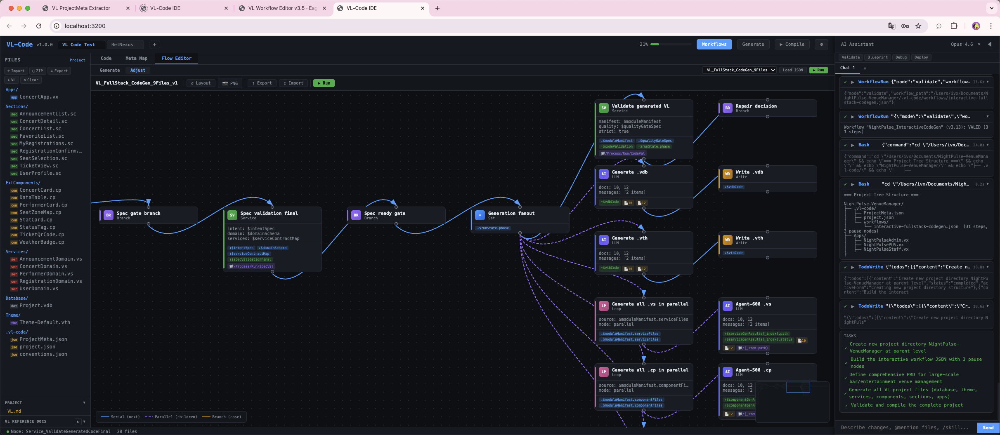

<p align="center">
  
</p>

<h1 align="center">VisualLogic.ai — VL Language, Theme, and Sample Packs</h1>

<p align="center">
  <strong>The public reference repo for Visual Language (VL) assets.</strong><br/>
  Latest snapshot in this repo: VL 4.3.1, Theme 7.0.3, and refreshed importable example packs.
</p>

<p align="center">
  <a href="https://editor.visuallogic.ai/">Website</a> &nbsp;|&nbsp;
  <a href="https://github.com/VisualLogic-AI/VL-Code">VL-Code Runtime</a> &nbsp;|&nbsp;
  <a href="https://www.youtube.com/playlist?list=PLJE6c8wBknRnCZIRv_VFa1dYswTSqoW21">YouTube</a> &nbsp;|&nbsp;
  <a href="https://discord.com/invite/KdaVtR7pzv">Discord</a>
</p>

---

## Latest Open Assets

| Asset | What it gives you |
| --- | --- |
| [VL 4.3.1 Reference](./VL_VERSION_4.3.1.md) | Current VL syntax snapshot used by the latest VLC runtime and sample packs |
| [Theme 7.0.3 Guide](./THEME_7.0.md) | Human-readable overview of the latest enterprise theme contract |
| [Theme-Enterprise_7.0.3.vth](./Theme-Enterprise_7.0.3.vth) | Importable theme source for current VL projects |
| [Example Packs](./Examples/README.md) | Five refreshed importable sample projects with `appCaseJsonMap` included |
| [Legacy Archive](./Legacy/README.md) | Older VL and theme snapshots kept for reference only |

## What This Repo Is For

This repository is the public landing zone for the parts of VisualLogic that are most useful to builders and evaluators:

- the latest open VL syntax reference
- the latest public theme snapshot
- importable project packs people can download and test locally
- supporting docs that explain how these assets fit together

If you want to run the current local IDE runtime, use the public [VL-Code repository](https://github.com/VisualLogic-AI/VL-Code). If you want the language, theme, and sample content itself, this is the repo.

## Why VL

VL is an AI-native programming language: it is designed to be easy for humans to read and easy for agents to generate, inspect, and modify with low ambiguity.

Its main advantage is not just syntax. VL is structured as a layered, decoupled system. Apps, sections, components, services, database models, and themes live in separate files with explicit contracts. Once a service contract is stable, multiple service domains can be generated or changed in parallel. The same is true on the frontend: each section or component can be handled independently as long as its public props, events, and methods are clear. This makes VL a strong fit for high-concurrency software development workflows where many agents or developers work on different parts of the same product at once.

VL is also fully component-oriented. Product surfaces are built by composing reusable modules instead of repeatedly rewriting screens and logic from scratch. Over time, this allows the platform to grow through a large component ecosystem: UI components, business modules, data blocks, service templates, workflow nodes, and theme packs can all become reusable building blocks.

## Agent-Friendly Contracts

Every VL component exposes a small, explicit interface:

- props: what the component receives
- events: what the component emits
- methods: what the component allows other modules or agents to call

That contract-first shape is useful for AI agents because they do not need to infer behavior from a large unstructured codebase. They can inspect the available props, events, and methods, then operate through those boundaries. The language stays simple enough for humans to learn quickly, while remaining structured enough for automated generation, validation, and repair.

## DAG Harness Engineering

VisualLogic uses DAGs, directed acyclic graphs, as a core Harness Engineering mechanism. A DAG turns a complex build process into ordered, inspectable steps: plan, generate contracts, fan out service and frontend work, validate, repair, compile, test, and package.

This is stronger than sending one agent at one isolated task. The DAG represents the whole engineering harness. When the graph finishes, the system has not merely answered a prompt; it has run a complete process with dependencies, checkpoints, validation, retries, and artifacts. That matches how people expect serious software work to happen: define the workflow, run every required stage, and make the result auditable.

<p align="center">
  
</p>

## Current Repo Layout

```text
VisualLogic.ai-VL/
├── VL_VERSION_4.3.1.md
├── VL_VERSION_4.1.md
├── THEME_7.0.md
├── Theme-Enterprise_7.0.3.vth
├── Theme-Enterprise_7.0.vth
├── Examples/
│   ├── README.md
│   ├── VL_CourseScheduler_WithCaseJsonMap.zip
│   ├── VL_HabitCheckin_WithCaseJsonMap.zip
│   ├── VL_MediaShelf_WithCaseJsonMap.zip
│   ├── VL_ShoppingList_WithCaseJsonMap.zip
│   ├── VL_VoteMini_WithCaseJsonMap.zip
│   └── legacy/
└── Legacy/
```

## VL at a Glance

Visual Language (VL) is a deterministic, component-oriented language for full-stack application generation.

The current public snapshot in this repo is **VL 4.3.1** and covers six file types:

| Extension | Purpose |
| --- | --- |
| `.vx` | App entry, routing, orchestration |
| `.sc` | Section-level UI and interaction logic |
| `.cp` | Reusable presentation components |
| `.vs` | Service-domain logic |
| `.vdb` | Database schema and seed data |
| `.vth` | Theme tokens and point-slot values |

## Refreshed Example Packs

The `Examples/` directory now contains five newer sample projects exported with `appCaseJsonMap`, so users can import them into VLC and inspect the runtime structure immediately:

- `VL_CourseScheduler_WithCaseJsonMap.zip`
- `VL_HabitCheckin_WithCaseJsonMap.zip`
- `VL_MediaShelf_WithCaseJsonMap.zip`
- `VL_ShoppingList_WithCaseJsonMap.zip`
- `VL_VoteMini_WithCaseJsonMap.zip`

Each pack includes:

- `VLProject/` source files
- `appCaseJsonMap/` runtime snapshots
- a focused feature scenario for manual testing

Older sample packs were moved to [`Examples/legacy/`](./Examples/legacy/README.md) instead of being deleted outright.

## Build with the Current VLC Runtime

The public runtime guide and panel gallery now live in the [VL-Code repository](https://github.com/VisualLogic-AI/VL-Code):

- [VLCode Quick Start and Panel Guide](https://github.com/VisualLogic-AI/VL-Code/blob/main/docs/VLCode_Quick_Start_and_Panel_Guide.md)

That guide includes:

- current runtime screenshots
- mode-by-mode panel explanations
- startup steps for the latest local build
- compile / preview / chat workflow notes

## Related Links

- [VL-Code Runtime](https://github.com/VisualLogic-AI/VL-Code)
- [VisualLogic Website](https://editor.visuallogic.ai/)
- [YouTube Playlist](https://www.youtube.com/playlist?list=PLJE6c8wBknRnCZIRv_VFa1dYswTSqoW21)
- [Discord Community](https://discord.com/invite/KdaVtR7pzv)
